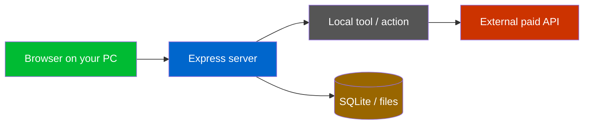
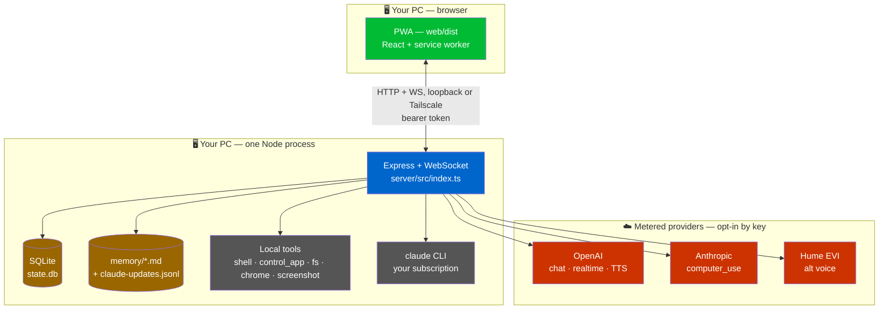
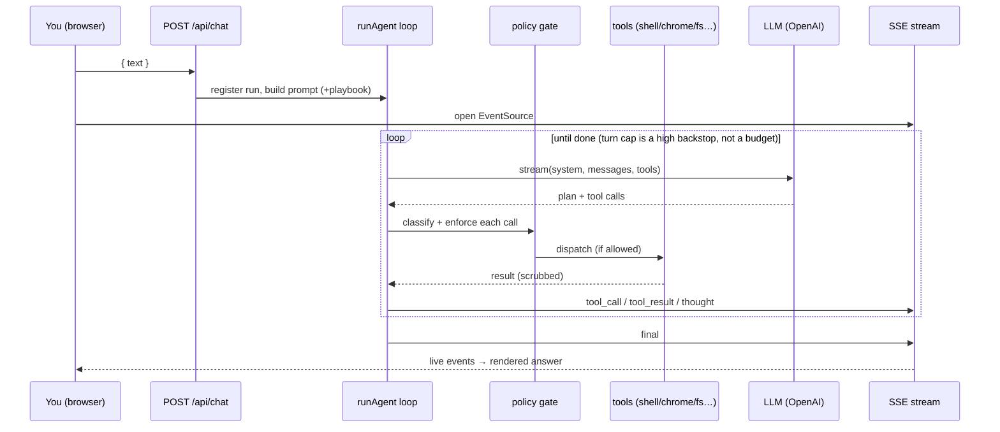
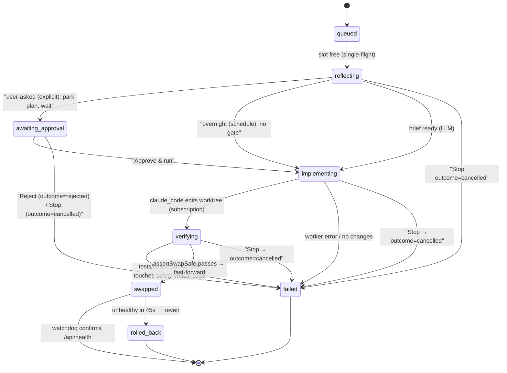
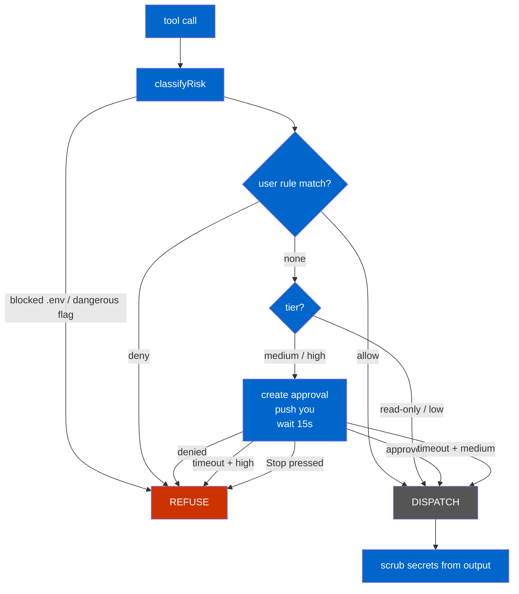
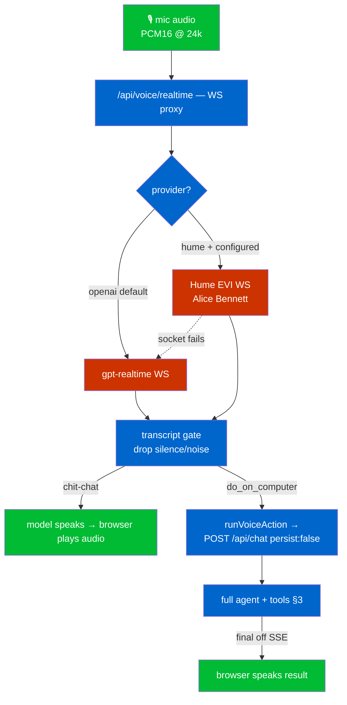
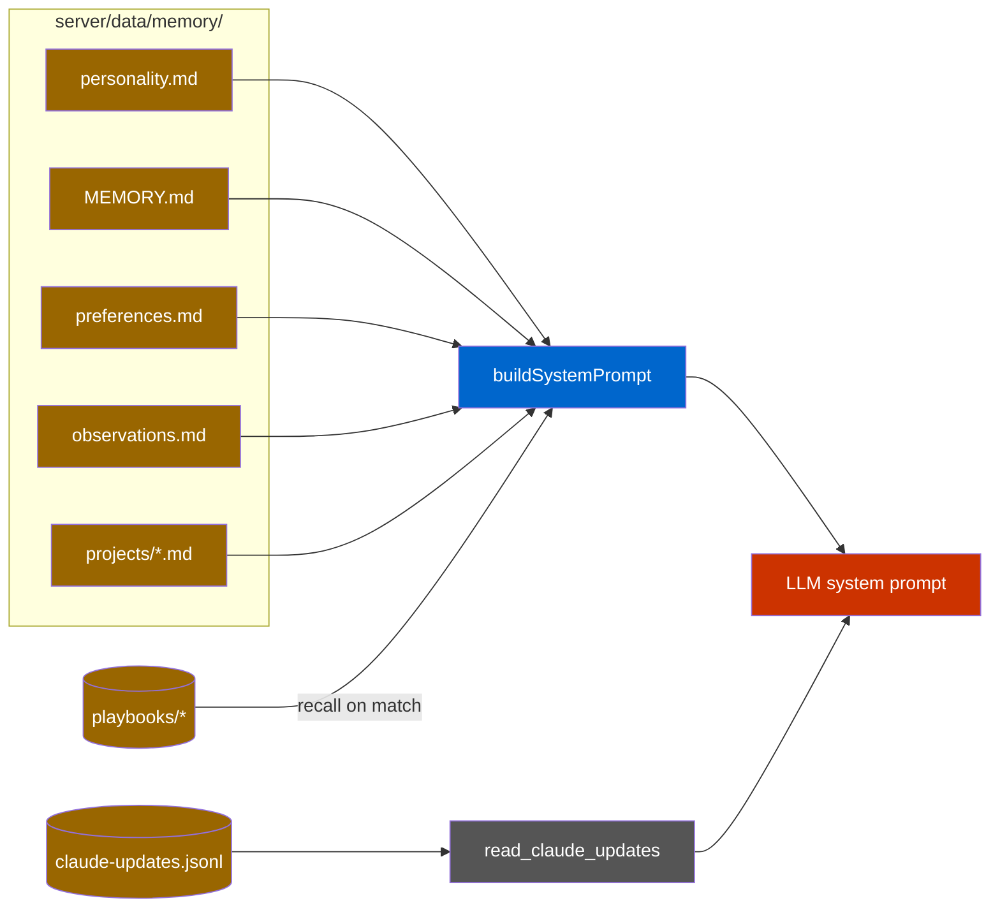

# Ava — System Architecture

The canonical, top-to-bottom map of how Ava works. **Ava is a personal AI agent that runs on your Windows PC and that you drive from a desktop browser on that same PC.** This file is the *overview* — read it top to bottom to understand the whole system. Each subsystem also has a **deep-dive companion** under `docs/architecture/` (mapped below) for the exhaustive detail.

---

## How to read this doc

- **Plain-English first.** Each section opens with what the thing *does* and *why*, then drills into the code.
- **Diagrams are real visuals.** The Mermaid blocks render as pictures in GitHub and in VS Code (install "Markdown Preview Mermaid Support", then `Ctrl+Shift+V`). Each diagram shows exactly one flow.
- **Every claim is grounded** in a real file, cited as `path:line`. If something is flaky, half-built, or costs money, it's flagged explicitly.
- **Two different "agents" — don't confuse them:**

  | Term | What it is |
  |------|-----------|
  | **Ava** | The *runtime* agent — the thing you talk to. It runs tools, browses, talks, remembers. Lives in `server/`. |
  | **Claude** | The *coding* agent (the developer). It writes Ava's code. When Ava "self-improves" or "discusses", it shells out to the `claude` CLI — **your Claude subscription** — as a worker. |

  Ava never does Claude's job and Claude never speaks as Ava. The dev log (`read_claude_updates`) keeps the attribution honest.

- **One owner, one machine.** The system is **single-tenant** by design (one user, the persistent browser is shared across runs). It is not a sandbox: a valid device token effectively has your shell.

### Where you use it (today)

You run everything on **one Windows PC** and interact through the **web app (PWA) in a desktop browser** on that PC. The server *can* be reached remotely over **Tailscale** (a private VPN) and the app is an installable PWA, so a phone could drive it later — but the current, assumed setup is the PC. Wherever older code/comments say "phone", read "the browser on your PC".

---

## Documentation map — the deep dives

This overview links out to nine companion docs. Each is the authoritative, code-verified reference for its subsystem, with its own diagrams and step-by-step workflows.

| # | Deep-dive doc | Covers |
|---|---------------|--------|
| 01 | [`architecture/01-bootstrap-and-ops.md`](architecture/01-bootstrap-and-ops.md) | Boot sequence, config + env vars, networking, logging, systray, recovery, the ops runbook |
| 02 | [`architecture/02-agent-loop-and-orchestration.md`](architecture/02-agent-loop-and-orchestration.md) | The run lifecycle, the reasoning/tool loop, LLM provider abstraction, SSE streaming, abort |
| 03 | [`architecture/03-tools-catalog.md`](architecture/03-tools-catalog.md) | Every tool Ava can call — inputs, execution, API cost, gating, the tool-selection rubric |
| 04 | [`architecture/04-safety-policy-approvals.md`](architecture/04-safety-policy-approvals.md) | Risk classification, user rules, the veto window, approvals + push, the hard blocks |
| 05 | [`architecture/05-auth-sessions-data-model.md`](architecture/05-auth-sessions-data-model.md) | Device pairing, tokens, sessions/messages, and the complete SQLite schema (every table) |
| 06 | [`architecture/06-voice-pipeline.md`](architecture/06-voice-pipeline.md) | The full voice stack — both providers (OpenAI + Hume), the gate, hybrid handoff, audio, the web client |
| 07 | [`architecture/07-self-improvement.md`](architecture/07-self-improvement.md) | Ava editing its own code: reflect → worktree → verify → swap → watchdog, and its gaps |
| 08 | [`architecture/08-memory-learning-identity.md`](architecture/08-memory-learning-identity.md) | Memory files, system-prompt assembly, playbooks (learning), suggestion chips, the dev log |
| 09 | [`architecture/09-web-frontend.md`](architecture/09-web-frontend.md) | The React PWA — view routing, the chat/voice screens, the API client, the service worker |

### Legend (used in every diagram)

- **Green** = the browser client (your PC). **Blue** = the Node server. **Grey** = a local tool (no API cost). **Red** = a metered external provider (costs money). **Brown** = local storage.

---

## 1. System overview

**What it is:** one Node process on your PC, serving a React web app to a browser on the same machine, wired to local tools and a few opt-in cloud AI providers. Everything — the brain's orchestration, your files, the browser automation, the database — lives on your machine; only the LLM "thinking" and a couple of optional capabilities reach the cloud.

**What runs where:**

- **Your browser (PWA):** the app built from `web/` (Vite / React 19). It's served as static files by the same server (`server/src/index.ts:336-337`). Deep dive → [09](architecture/09-web-frontend.md).
- **Your PC (one Node process):** the Express server (`server/src/index.ts`), the SQLite database (`server/data/state.db`), the memory files (`server/data/memory/`), a persistent Playwright-controlled Chromium (Ava's *own* browser, separate from your everyday Chrome), and the `claude` CLI worker. Deep dive → [01](architecture/01-bootstrap-and-ops.md).
- **Cloud (opt-in by key):** OpenAI (the default chat brain + realtime voice + TTS), Anthropic (optional `computer_use` vision), Hume (optional alternate voice). Absent a key, that capability simply isn't offered.

**Networking:** the server binds to the Tailscale IP if set, else loopback (`server/src/config.ts` → `bindAddr = TAILSCALE_IP ?? "127.0.0.1"`). Every API request needs a bearer token minted during device pairing (`auth/middleware.ts`). Deep dive → [05](architecture/05-auth-sessions-data-model.md).

**Dev loop:** the server runs under `tsx watch`, so any change to `server/src/**` (including a self-improvement that rewrites the working tree) auto-reloads the process. This hot-reload is *load-bearing* for self-improvement today (the self-improve "restart" step is intentionally a no-op because `tsx watch` is the restart).

---

## 2. How it all fits together — end-to-end workflows

Before the per-subsystem reference, here are the **cross-cutting flows** that tie everything together. Each names the subsystems it touches (with their deep-dive number) so you can follow the data through the whole stack.

### W1 — A typed task ("find BMWs under €20k and save the links")

1. The browser **POSTs** the text to `/api/chat`; the server creates/loads the session and registers a **run** (one run per session — a second is rejected 409). [02]
2. The browser opens an **SSE stream** (`GET /api/chat/:id/stream`) and starts rendering live progress. [02][09]
3. The server assembles the **system prompt** (persona + capabilities + memory + preferences) and may inject a matching **playbook** if Ava has done something similar before. [08]
4. The **reasoning loop** runs: the LLM streams a plan and **tool calls**; each call is **gated by policy** (classify → rules → maybe approval), then dispatched. [02][04][03]
5. Tools execute on your machine (browse DoneDeal, extract links, write the file). Output is **secret-scrubbed**. Each tool call streams a `tool_call`/`tool_result` event. [03][04]
6. The model produces the **final answer**; the browser renders it. A successful multi-step run may be **distilled into a playbook** for next time. [08]

### W2 — A voice task ("open WhatsApp and send Luka the link")

1. Your mic audio streams to the **WS voice proxy** `/api/voice/realtime`. The chosen provider (OpenAI `gpt-realtime` by default, or Hume) handles speech. [06]
2. Your finished sentence passes the **transcript gate** (silence/noise dropped) and becomes a turn. [06]
3. For chit-chat the realtime model just talks. For an **action**, it calls `do_on_computer`, which runs the **full `/api/chat` agent** (exactly W1's loop, with all tools) over loopback via `runVoiceAction`. [06][02]
4. The agent does the work; the **result is spoken** back. The conversation is stored once, in the same session as your typed chats (so voice ↔ chat share memory). [06]

### W3 — An action that needs approval (e.g. `fs_delete`, a destructive shell command)

1. Policy **classifies** the call as `high` (destructive). [04]
2. The server creates an **approval record**, fires a **web-push notification**, and **waits up to 15 seconds**. [04]
3. You approve or deny in the UI — or the window times out: `medium` → auto-approve (convenience), `high` → **auto-deny** (a destructive op is cancelled, not silently run). [04]
4. Pressing **Stop** during the window resolves it as cancelled, never approved. [04][02]

### W4 — Pressing Stop

1. `POST /api/chat/:id/kill` **aborts** the run's `AbortController` — which reaches both the model loop *and* in-flight tools through their abort listeners. [02]
2. It looks up the run's child PIDs in the **pidfile registry** and **tree-kills** each subtree, so a `shell`/`control_app`/`claude_code` worker *and everything it spawned* die together. [02][03]
3. ✅ **Stop also reaches self-improvement** (resolved, commit 0bd8b93). The `/kill` handler additionally calls `cancelAllImprovements(db)` (`routes/chat.ts:519`), which aborts every running/queued self-improvement — the abort signal threads into the reflect call, the Claude worker, and the verify subprocess. So the red button now halts a runaway self-edit too, closing the old "I pressed Stop and it kept going" gap. See [07] and `features/self-improve-stop-and-gate.md`.

### W5 — A self-improvement ("add a WhatsApp integration")

1. A goal is **queued** (you ask, or an overnight scheduler suggests one). [07]
2. The LLM **reflects** the goal into a change brief. [07]
3. **Approval gate (user-asked improvements only).** The drafted plan is parked at `awaiting_approval` and pushed to you; **no code is written until you Approve & run** (or Reject). The unattended overnight scheduler is **not** gated and runs straight through. [07]
4. **Claude Code** (your subscription) **implements** it in a throwaway **git worktree** — isolated from the live tree. [07][03]
5. The change is **verified** (tests + build + boot-smoke). A `flightcheck` canary runs but is report-only. [07]
6. If verification passes and a **safety guard** confirms the diff doesn't touch security/policy/auth/self code, the live tree is **fast-forwarded** to the new commit; a detached **watchdog** reverts it if the new build never gets healthy. [07]

At any point in reflect → awaiting_approval → implement → verify, pressing **Stop** (the per-intent button, or the red global Stop) cancels the run — it ends `failed` with `outcome="cancelled"`. See W4 and [07].

---

## 3. The chat / agent loop

**What it is:** the heart of Ava. The browser POSTs a message; the server starts a **run** that loops the LLM and its tools until done, streaming progress back over **SSE** (Server-Sent Events — a one-way "server pushes lines to the browser" channel). **→ Full detail: [02](architecture/02-agent-loop-and-orchestration.md).**

**Key terms:**

- **Run** = one in-flight turn for a session, tracked in `ActiveRuns` (`orchestrator/active-runs.ts`), keyed by `sessionId` — only **one run per session** at a time (`routes/chat.ts` returns HTTP 409 if busy).
- **SSE buffer** = an in-memory ring of events for the run so a reconnecting browser can replay what it missed (`sse/buffer.ts`).
- **Persist flag** = `persist:false` runs the tools but stores no messages — used only by the hybrid-voice handoff, which stores the turn itself.

**Lifecycle of one typed turn** (`routes/chat.ts` + `orchestrator/agent.ts`): POST validates + gates concurrency → stores the user message → registers a run (fresh `runId`, `AbortController`, SSE buffer) and returns the `sessionId` immediately → the browser opens the stream and replays the buffer, then tails live events (a 15s heartbeat keeps the connection alive during long single-tool turns) → `runAgent` loops (stream model → collect tool calls → gate each through policy → dispatch → feed results back) → on the final answer, `maybeCapture` may distil a successful ≥2-tool run into a playbook.

The loop is bounded by `MAX_AGENT_TURNS = Number(process.env.AVA_MAX_AGENT_TURNS) || 1000` (`agent.ts:148`) — a **runaway backstop, not a task budget** (the old hard 48-turn cap was lifted in commit `e340c92` because it cut off real multi-step tasks mid-work — it couldn't even finish one Shopify product edit). The actual brakes on a run are the **Stop** button (aborts in ≤1 turn), the **5-minute no-progress stuck-loop detector** (`orchestrator/stuck-loop.ts`), **per-tool timeouts**, and **approval gates**. On the rare exhaustion of the backstop the loop still emits a graceful final rather than ending silently. See [`features/reliable-task-execution.md`](features/reliable-task-execution.md).

**Provider abstraction:** the loop talks to a normalized provider interface (`orchestrator/llm/`). Default is **OpenAI** (`gpt-5.5`/`gpt-5` family) via the Responses API; **Anthropic** is an alternate (Messages API; note it ignores the reasoning-effort knob and caps `max_tokens` at 4096); a mock provider backs tests. [02]

**Honest gotcha:** a fast turn can finish and unregister *before* the browser opens the stream. The stream endpoint handles this by replaying the latest assistant reply as a synthetic `final` + `done` instead of 404-looping.

---

## 4. The tool layer

**What it is:** the set of capabilities the action-mode agent can call. Tools are assembled per-run and registered into a `ToolRegistry` that emits `tool_call`/`tool_result` centrally. The Stop signal is threaded into every tool's context so it can be interrupted mid-flight. **→ Full catalog (one subsection per tool family): [03](architecture/03-tools-catalog.md).**

**Cost note:** the local tools cost **nothing** — they drive your own machine. Only `computer_use` hits a **metered LLM** API per call. The Shopify and Places tools make no LLM call either, but they do spend your own Shopify / Google Cloud billing.

| Tool | File | What it does | API cost |
|------|------|--------------|----------|
| `shell` | `tools/shell-tool.ts` | Runs commands / launches apps via **cmd.exe**. Output secret-scrubbed then truncated. (Note: cmd's quoting is fragile — see `control_app`.) | none |
| `control_app` | `tools/control-app-mcp.ts` | Native-app control (UI Automation + keystrokes) by writing a `.ps1` and spawning **powershell.exe directly** (avoids cmd's quoting bugs). | none |
| `fs_read/write/list/stat/delete` | `tools/filesystem-mcp.ts` | Read/write/list files within the allowlisted roots; `.env` and secret files blocked; contents scrubbed. | none |
| `chrome_*` (navigate/click/type/read_page/screenshot/tabs) | `tools/chrome-mcp.ts` | Drives **Ava's own** persistent Chromium via Playwright (separate from your everyday Chrome); booted lazily. | none |
| `computer_use` | `tools/computer-use-mcp.ts` | Vision-driven clicking on the active tab. Prefers Anthropic, falls back to OpenAI. | **paid** (Anthropic/OpenAI) |
| `claude_code` | `tools/claude-code.ts` | Runs the `claude` CLI as a worker. **Your Claude subscription, not an API key** (`workerEnv` strips the key). | none (subscription) |
| `take_screenshot` | `tools/screenshot/` | Captures the desktop to `Downloads/Ava/screenshots`. | none |
| `discuss_with_claude` / `read_discussion` | `tools/discuss-mcp.ts` | Queues a read-only background Claude consult. | none (subscription) |
| `memory_read/remember/forget` | `tools/memory-mcp.ts` | Reads/writes durable memory files. | none |
| `self_improve` / `self_improve_status` | `tools/self-improve-mcp.ts` | Queues a self-improvement and reports status. | none (subscription worker) |
| `read_claude_updates` | `tools/update-log-mcp.ts` | Reads Claude's dev-log so Ava can honestly say what changed. | none |
| `read_logs` | `tools/activity-log.ts` | Reads the server's own activity logs. | none |
| `shopify_list_products / _get_product / _update_product` | `tools/shopify-mcp.ts` | Edits a product's name + description over the **Shopify Admin API** (one `PUT`, no browser); never sends the `images` array. Registered only when `SHOPIFY_STORE` + `SHOPIFY_ADMIN_TOKEN` are set. | none (LLM); uses your Shopify billing |
| `find_places` | `tools/places-mcp.ts` | Finds real businesses via the **Google Places API** (name/address/phone/website/Maps link) with a "without a website" filter. Registered only when `GOOGLE_PLACES_API_KEY` is set. | none (LLM); uses your Google billing |

> The Shopify/Places tools call **vendor HTTP APIs**, not a metered LLM — they replace fragile browser automation for two task types the agent kept failing (a Shopify product rename, a "find salons without a website" search). They're **credential-gated**, so a fresh checkout ships with them off. Full write-up: [`features/reliable-task-execution.md`](features/reliable-task-execution.md).

**Voice/conversation mode** exposes only a thin subset (`control_app`, discuss, memory, the update log) so a spoken "hi Ava" stays fast.

---

## 5. Safety, policy & approvals

**What it is:** every tool call passes through a gate before it runs. Ava is **allow-by-default** on your own machine (you want frictionless control), but a curated set of genuinely destructive or secret-touching operations is blocked outright or held for a veto. **→ Full detail (threat model, every pattern): [04](architecture/04-safety-policy-approvals.md).**

**The pipeline (in order):** **Classify** (`policy/classify.ts` — `read-only`/`low`/`medium`/`high`/`blocked`) → user **rules** can force allow/deny (`policy/rules.ts`) → **Enforce** (`policy/enforce.ts` — `blocked` refuse, low allow, medium/high ask) → **Runtime veto** (`policy/runtime.ts` — create approval, push you, wait 15s; on timeout `medium` auto-approves, `high` **auto-denies**).

**Hard blocks layered underneath:** the **shell allowlist** (allow-by-default + a curated destructive blocklist + `.env`/secret-read block; the whole command is scanned), the **path allowlist** (`fsRoots` = `C:/ai/**`, `C:/projects/**`, `C:/Users/nikug/**`; `.env` + secret-file patterns blocked *before* the allowlist; paths are **realpath-canonicalized** so a junction can't smuggle a blocked target), and **scrub** (secret redaction on all tool output).

**Honest flags** (from the deep dive): the approval card always shows "auto-approving in Ns," but for **`high` (destructive)** actions the server actually **auto-denies** on timeout — the card copy is misleading for destructive ops (the server is authoritative). GUI tools (`computer_use`, `control_app`) reach the live desktop *outside* the shell/path text gates. Rules are LLM-parsed with no confirm-the-parse step. The `*.key` block is deliberately conservative (also refuses `public.key`).

---

## 6. The voice pipeline

**What it is:** you hold a live voice conversation. The browser streams mic audio to a WebSocket proxy at `/api/voice/realtime` (`routes/voice-realtime.ts`), which talks to a realtime model and routes any *action* back through the normal chat agent. A separate `/api/speak` does plain text-to-speech. **→ Full detail (both providers, audio, the web client): [06](architecture/06-voice-pipeline.md).**

**Two providers, picked by the `voice_engine_pref` toggle:**

- **OpenAI** (`gpt-realtime`, default) — the proven path. Speaks chit-chat directly and, for an action, calls `do_on_computer`.
- **Hume** (Hume EVI, voice "Alice Bennett") — alternate upstream, **only when configured** (`AVA_VOICE_PROVIDER=hume` + `HUME_API_KEY`). If its socket can't open, the proxy falls back to OpenAI.

**Hybrid action handoff** (the clever bit): the realtime model holds the conversation, but `do_on_computer` runs the **real `/api/chat` agent** with the full tool stack via `runVoiceAction` (`index.ts`). It POSTs to loopback, reads the run's `final` off the SSE stream, and feeds it back to be spoken. **Session continuity:** entering voice with no session resumes the most-recent conversation, so voice ↔ chat share one memory; recent turns are seeded into the model on connect.

**Honest flags:** Hume is a **weaker conversational model**, **needs Hume credits** (a zero-credit account returns error `E0300`, which surfaces to you as a generic *"auth failed"* — it's a billing problem, not really auth), and **truncates** long prompts (so recent history is folded into the prompt body). The 48 kHz Hume audio is **resampled to 24 kHz** or it sounds an octave low. The toggle defaults to OpenAI. (Chatterbox, an old local-voice option, is retired but its file still compiles.)

---

## 7. Self-improvement

**What it is:** Ava can change its own code. A goal is queued, an LLM reflects it into a brief, **Claude Code implements it in a throwaway git worktree**, the change is verified + built, then hot-swapped into the live tree — with a watchdog that rolls back if the new build never gets healthy. (See **W5** above for the state diagram.) **→ Full detail + every gap: [07](architecture/07-self-improvement.md).**

**Who does what:** *reflect* uses the configured LLM (OpenAI by default); *implement* uses **Claude Code on your subscription**. This split is intentional — conserve OpenAI, lean on the abundant Claude subscription for the heavy code work. A **single-flight lock** means one improvement mutates the tree at a time; others queue FIFO.

**The guardrails that make it safe to run unattended:** worktree isolation (a self-edit can't touch the live repo directly), the full verify+build+boot gate, a **safety-file refusal** (`assertSwapSafe` blocks any diff touching security/policy/auth or the self-improve machinery), the rollback watchdog, a **plan-approval gate** on user-asked improvements (they park at `awaiting_approval` and write no code until you approve), and a **Stop path** that cancels a running improvement end-to-end. (See `features/self-improve-stop-and-gate.md`.)

**Honest flags (important):**
- ✅ **Stop now cancels an in-flight self-improvement** (resolved, commit 0bd8b93). A per-improvement `AbortController` threads into reflect/implement/verify; `POST /api/self/:id/cancel` cancels one and the red global Stop (`/kill` → `cancelAllImprovements`) cancels all. A cancelled run is recorded `outcome="cancelled"`. *Remaining limit:* the live server can't reach a job running inside the **separate overnight-loop process**.
- ✅ **User-asked improvements gate behind a plan** (commit c539c75): they pause at `awaiting_approval` until you Approve & run / Reject in the Self screen. The overnight scheduler is intentionally **not** gated. *Limit:* a parked plan **holds the single-flight slot**, so a forgotten plan stalls the queue until approved/rejected/stopped/restarted.
- Boot reconciliation bluntly marks **all** non-terminal self-improvements `failed` after a restart (now including `awaiting_approval`).
- The **trigger ledger** (`friction.ts`) and a couple of trigger types are built and tested but **not wired** — only explicit requests and the overnight scheduler actually create improvements.
- The SelfScreen "Pause" button is currently a client-only no-op (distinct from the working **Stop** button).

---

## 8. Memory, identity & learning

**What it is:** Ava's durable sense of self and what it knows about you — plain Markdown files (easy to read and hand-edit) assembled into the system prompt every turn — plus a **playbook** system that lets Ava learn a successful task and reuse it. **→ Full detail (assembly, playbooks, chips): [08](architecture/08-memory-learning-identity.md).**

**The memory dir** (`server/data/memory/`): `personality.md` (the persona), `MEMORY.md` (the index of durable facts), `preferences.md` (learned preferences — e.g. *"open Chrome as a new tab, never overwrite the current tab"*), `observations.md` (low-confidence notes, auto-pruned), and `projects/<slug>.md` (per-project context).

**Assembly** (`orchestrator/system-prompt.ts`): persona → capability map → memory index → preferences → observations → (action mode only) the tool rubric + writable fsRoots. The same bytes are produced each turn for prompt-cache hits.

**Learning (playbooks):** when a multi-step task succeeds (≥2 tools, no failed tool), `maybeCapture` distils it into a reusable playbook; on a similar future request the matching playbook's steps are injected into the prompt. There are ~50 real captured playbooks on disk today (WhatsApp control, Maps scraping, file create-and-verify…).

**Claude → Ava dev log** (`self/dev-log.ts`, `data/claude-updates.jsonl`): Claude appends a `started`/`shipped` line per change; Ava reads it via `read_claude_updates` and the voice path folds recent entries into the prompt, so *"what's your latest update?"* is answered from the real changelog instead of confabulated LLM-training trivia.

---

## 9. Web / PWA frontend

**What it is:** the React app you actually use. No router library — a hand-rolled **view state machine** in `App.tsx` switches between the orbit (home), chat, voice, and settings screens. **→ Full detail (every screen, the SSE client, the PWA): [09](architecture/09-web-frontend.md).**

**Highlights:**
- **Chat** (`chat/ChatScreen.tsx`): the Composer sends a message; `useChatStream` consumes the SSE stream via `EventSource`; the **Activity panel** renders live tool steps; the final answer arrives as one `final` event and is revealed word-by-word (the streaming *look* is a visual effect — Ava's answer is not token-streamed; the *tool steps* are what stream live).
- **Voice** (`voice/VoiceScreen.tsx` + `useRealtimeVoice.ts`): the WS client, mic capture (AudioWorklet), playback, barge-in, the OpenAI/Hume toggle, and the "+new conversation" control.
- **Settings screens:** Rules (permission rules), Memory, Self (self-improvement status), Approvals, Pairing.
- **The PWA** (`sw.ts`): a service worker with `skipWaiting`/`clients.claim` and web-push. **Gotcha:** a rebuilt `web/dist` is **not live until the service worker activates** — if a fix "looks like it didn't deploy," fully close and reopen the app so the new bundle takes over.
- **Visual system** (`components/ava/`): the locked aesthetic — liquid-mercury orb + cyan command-deck, GSAP/Motion animations, desktop-primary.

---

## 10. Data model

**What it is:** a single SQLite database (`server/data/state.db`, schema in `state/schema.sql`, opened in `state/db.ts`) in WAL mode. **→ Full table-by-table reference + complete erDiagram: [05](architecture/05-auth-sessions-data-model.md).**

| Table | One-line purpose |
|-------|------------------|
| `sessions` | One conversation thread (title, status, soft-delete, summary). |
| `messages` | Every user/assistant/tool turn, ordered, FK to its session. |
| `tool_calls` | **Defined but currently unused** — reserved/forward-looking audit schema. |
| `device_tokens` | Bearer credentials issued at pairing (incl. the `voice-internal` loopback token). |
| `pairing_codes` | Short-lived pairing handshake codes (minted only by the systray / a script). |
| `push_subscriptions` | Web-push endpoints for approval/done notifications. |
| `rules` | User-defined allow/deny rules consulted by the policy enforcer. |
| `approvals` | Pending/decided tool-approval requests with their veto status. |
| `self_improvements` | Self-improvement records (the code type is called `Intent`): goal, status, commit, last-known-good, verify log. |
| `discussions` | Background Claude consults: topic, status, result, the originating session. |
| `voice_engine_pref` | The voice provider toggle (`openai` · `hume`). |
| `reasoning_pref` | The Fast↔Thorough level (drives OpenAI reasoning effort + voice VAD snappiness). |
| `device_state` · `chip_overrides` · `chip_label_cache` | Per-device greeting state, custom quick-action chips, and their cached labels. |

---

## Quick file index

| Subsystem | Entry file(s) | Deep dive |
|-----------|--------------|-----------|
| Server bootstrap & ops | `server/src/index.ts`, `config.ts` | [01](architecture/01-bootstrap-and-ops.md) |
| Chat route + SSE | `server/src/routes/chat.ts`, `sse/` | [02](architecture/02-agent-loop-and-orchestration.md) |
| Agent loop + providers | `server/src/orchestrator/agent.ts`, `orchestrator/llm/` | [02](architecture/02-agent-loop-and-orchestration.md) |
| Tools | `server/src/tools/` | [03](architecture/03-tools-catalog.md) |
| Policy / approvals | `server/src/policy/`, `state/approvals.ts`, `push/` | [04](architecture/04-safety-policy-approvals.md) |
| Allowlists / scrub | `server/src/tools/shell-allowlist.ts`, `security/` | [04](architecture/04-safety-policy-approvals.md) |
| Auth / sessions / schema | `server/src/auth/`, `state/` | [05](architecture/05-auth-sessions-data-model.md) |
| Voice | `server/src/routes/voice-realtime.ts`, `voice-provider-config.ts`, `voice/` | [06](architecture/06-voice-pipeline.md) |
| Self-improvement | `server/src/self/` | [07](architecture/07-self-improvement.md) |
| Memory / learning | `server/src/memory/`, `playbooks/`, `self/dev-log.ts` | [08](architecture/08-memory-learning-identity.md) |
| Process / Stop | `server/src/process/` | [02](architecture/02-agent-loop-and-orchestration.md) |
| Web frontend | `web/src/` | [09](architecture/09-web-frontend.md) |

---

*This overview and its nine companion deep-dives are maintained by the `doc-writer` agent (`.claude/agents/doc-writer.md`). When a subsystem changes, its companion and this map should be updated in the same pass.*
