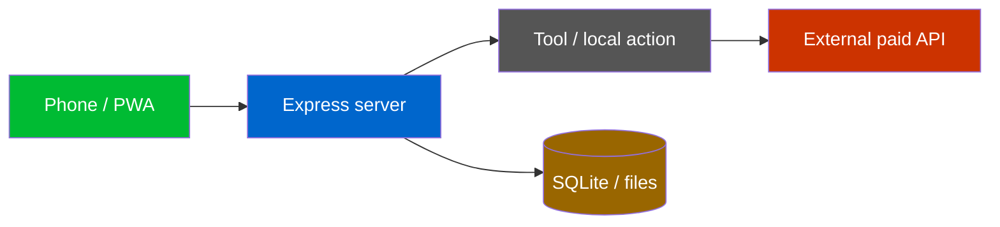
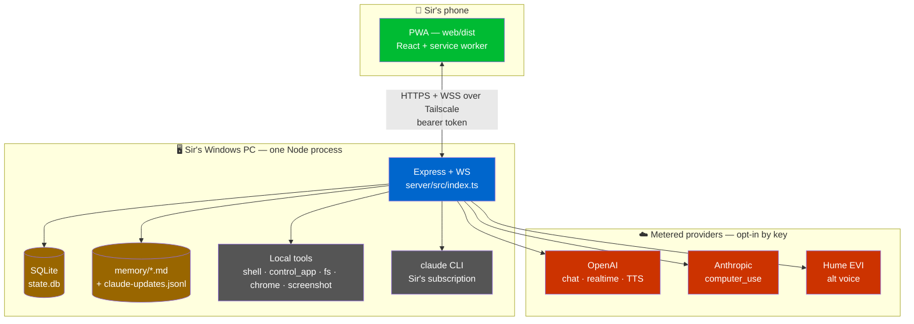
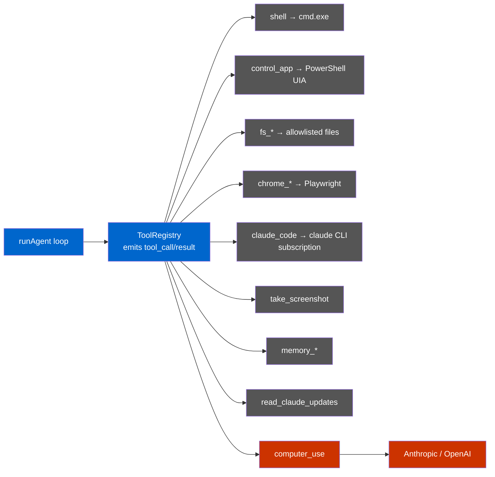
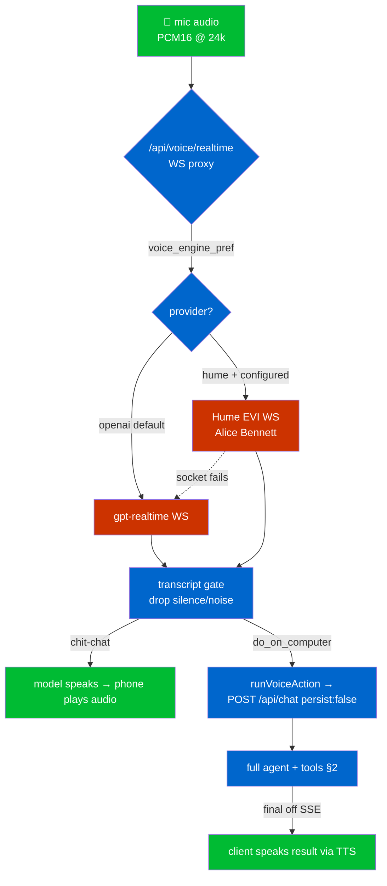
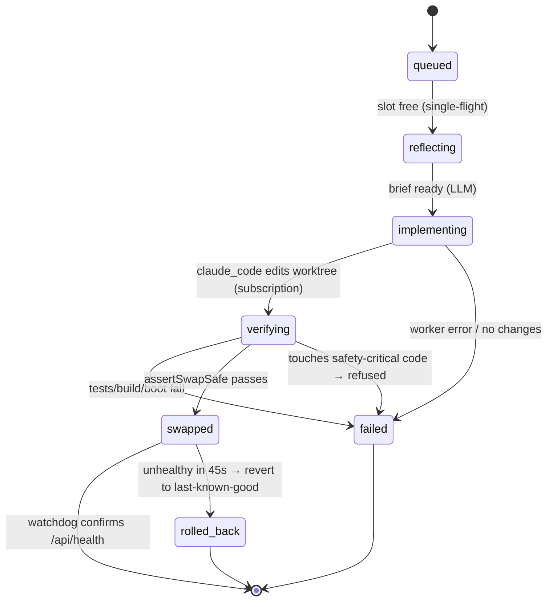
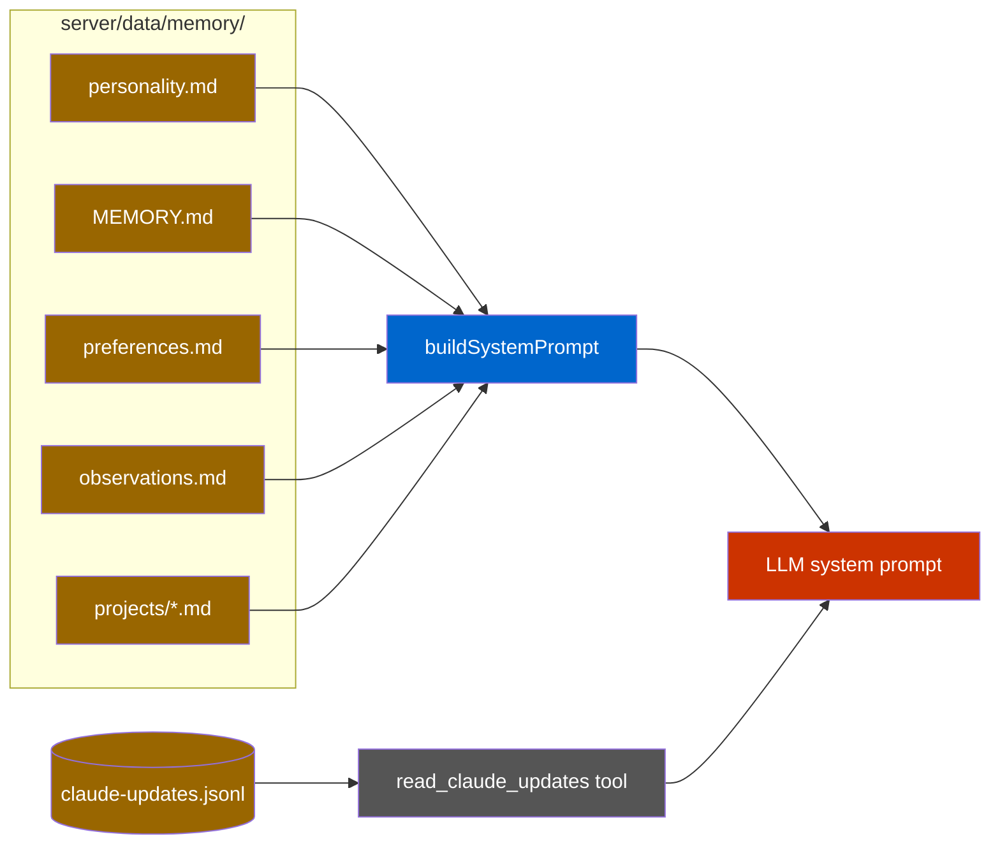
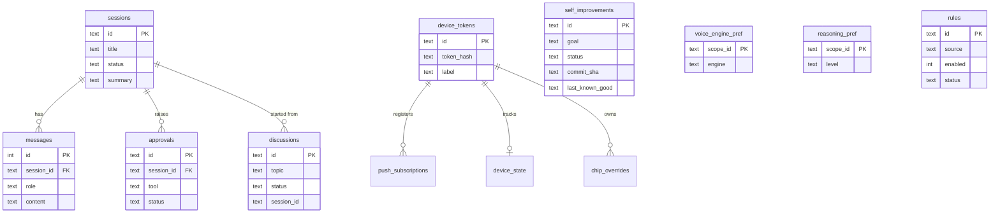
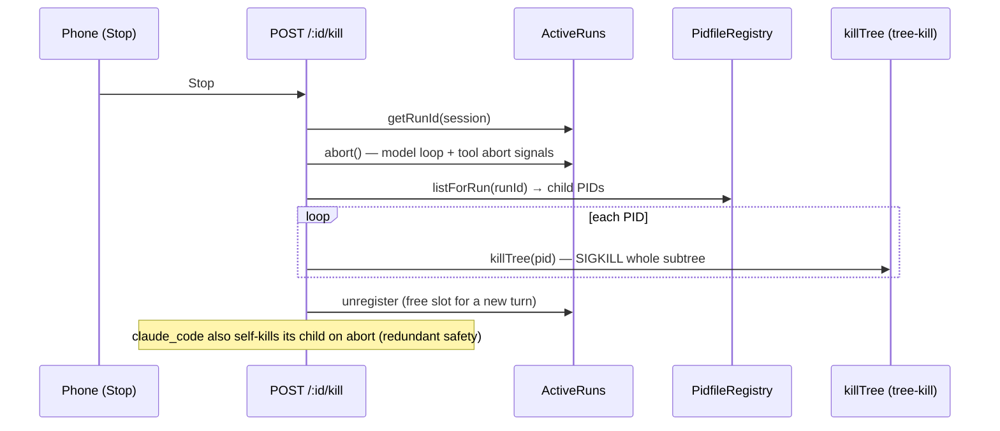

# Ava — System Architecture

The canonical map of how Ava works, end to end. Ava is a personal AI agent that
lives on Sir's Windows PC and is driven from his phone. This document is the
single place to understand every subsystem and to help drive development.

---

## How to read this doc

- **Plain-English first.** Each section opens with what the thing *does* and *why*,
  then drills into the code.
- **Diagrams are real visuals.** The Mermaid blocks render as pictures in GitHub
  and VS Code (install the "Markdown Preview Mermaid Support" extension in VS
  Code). Each diagram shows exactly one flow.
- **Every claim is grounded** in a real file, cited as `path:line`. If something is
  flaky, half-built, or costs money, it is flagged explicitly.
- **Two different "agents" — don't confuse them:**

  | Term | What it is |
  |------|-----------|
  | **Ava** | The *runtime* agent. The thing Sir talks to. It runs tools, browses, talks, remembers. Lives in `server/`. |
  | **Claude** | The *coding* agent (this developer). It writes Ava's code. When Ava "self-improves" or "discusses", it shells out to the `claude` CLI — Sir's Claude subscription — as a worker. |

  Ava never does Claude's job and Claude never speaks as Ava. The dev log
  (`read_claude_updates`) keeps the attribution honest.

### Legend



- **Green** = the phone client. **Blue** = the Node server. **Grey** = a local tool
  (no API cost). **Red** = a metered external provider (costs money). **Brown** =
  local storage.

---

## 1. System overview

**What it is:** one Node process on Sir's PC serving a React web app to his phone
over Tailscale (a private VPN), wired to local tools and a few cloud AI providers.
It is **single-tenant** — one user, one phone — and that assumption is baked in
(`server/src/index.ts:110-113`: the persistent Chrome window is shared across all
runs).

**What runs where:**

- **Phone:** the PWA built from `web/` (Vite/React). It is served as static files
  by the same server (`server/src/index.ts:336-337`).
- **Sir's PC:** the Express server (`server/src/index.ts`), the SQLite database,
  the memory files, a persistent headless-ish Chromium, and the `claude` CLI.
- **Cloud:** OpenAI (chat brain + realtime voice + TTS), Anthropic (optional
  `computer_use`), Hume (optional alternate voice). All are **opt-in by key** —
  absent a key, that capability simply isn't offered.

**Networking:** the server binds to the Tailscale IP if set, else loopback
(`server/src/config.ts:69` → `bindAddr = TAILSCALE_IP ?? "127.0.0.1"`). Every API
request needs a bearer token minted during phone pairing
(`server/src/index.ts:304-318`, `auth/middleware.ts`).

**Dev loop:** the server runs under `tsx watch`, so any change to `server/src/**`
(including a self-improvement that rewrites the working tree) auto-reloads the
process (`server/src/index.ts:201-202`).



---

## 2. Chat / agent loop

**What it is:** the heart of Ava. The phone POSTs a message; the server starts a
**run** that loops the LLM and its tools until done, streaming progress back over
SSE (Server-Sent Events — a one-way "server pushes lines to the browser" channel).

**Key terms:**

- **Run** = one in-flight turn for a session. Tracked in `ActiveRuns`
  (`orchestrator/active-runs.ts`), keyed by `sessionId` — only **one run per
  session** at a time (`routes/chat.ts:159-162` returns HTTP 409 if busy).
- **SSE buffer** = an in-memory ring of events for the run so a reconnecting
  browser can replay what it missed (`sse/buffer.ts`, used at `routes/chat.ts:184`).
- **Persist flag** = `persist:false` runs the tools but stores no messages. Used
  only by the hybrid-voice handoff, which stores the turn itself
  (`routes/chat.ts:171-173`, `:316-328`).

**Lifecycle of one typed turn:**

1. `POST /api/chat` validates, finds/creates the session, and gates on
   concurrency (`routes/chat.ts:104-162`).
2. The user message is stored *after* the gate (so a rejected request can't
   orphan a message — `routes/chat.ts:164-173`).
3. A run is registered with a fresh `runId`, an `AbortController`, and an SSE
   buffer (`routes/chat.ts:184-191`). The POST returns the `sessionId`
   immediately; the agent runs in the background.
4. The browser opens `GET /api/chat/:sessionId/stream`, replays the buffer, then
   tails live events. A heartbeat comment every 15s keeps the connection alive
   during long single-tool turns (`routes/chat.ts:432-492`).
5. **Mode selection:** typed turns always run in **action** mode (full tool
   stack). Voice turns trust a fast classifier so chit-chat stays cheap
   (`routes/chat.ts:224-228`).
6. **Playbook recall** (action + typed only): a side-model tries to match the
   request to a saved playbook and injects its steps; best-effort, bounded to 8s
   (`routes/chat.ts:238-267`).
7. `runAgent` loops: stream model → collect tool calls → gate each through policy
   → dispatch → feed results back, up to 48 turns
   (`orchestrator/agent.ts:147-261`).
8. On the final answer, `maybeCapture` may distil a successful ≥2-tool run into a
   new playbook (`routes/chat.ts:296-311`).

**Abort / Stop:** `POST /api/chat/:sessionId/kill` aborts the model loop, then
tree-kills the run's child PIDs so in-flight `claude_code`/`shell` actually stop —
not just the next model turn (`routes/chat.ts:494-516`; see §9).

**Honest gotcha:** a fast turn can finish and unregister *before* the browser opens
the stream. The stream endpoint handles this by replaying the latest assistant
reply as a synthetic `final` + `done` instead of 404-looping
(`routes/chat.ts:440-459`).

```mermaid
sequenceDiagram
  participant P as Phone (PWA)
  participant C as POST /api/chat
  participant R as ActiveRuns
  participant A as runAgent
  participant T as ToolRegistry + policy
  participant L as LLM (OpenAI/Anthropic)
  participant S as GET /:id/stream (SSE)

  P->>C: { text }
  C->>C: session + concurrency gate (409 if busy)
  C->>R: register run (runId, abort, buffer)
  C-->>P: { sessionId }
  P->>S: open EventSource
  loop up to 48 turns
    A->>L: stream(system, messages, tools)
    L-->>A: deltas + tool calls
    A->>T: policy.gate(call) then dispatch
    T-->>A: tool result
    A->>S: tool_call / tool_result / thought (via buffer)
  end
  A->>S: final
  S-->>P: replay buffer + live events + heartbeat
  Note over A,R: on done → unregister; maybeCapture distils a playbook
```

---

## 3. Tool layer

**What it is:** the set of capabilities the action-mode agent can call. Tools are
assembled per-run in `routes/chat.ts:355-400` and registered into a
`ToolRegistry` that emits `tool_call`/`tool_result` centrally
(`orchestrator/agent.ts:125`). The Stop signal is threaded into every tool's
context so it can be interrupted mid-flight.

**Cost note:** the local tools below cost **nothing** — they drive Sir's own
machine. The two that hit a paid API are flagged.

| Tool | File | What it does | API cost |
|------|------|--------------|----------|
| `shell` | `tools/shell-tool.ts` | Runs commands / launches apps via **cmd.exe** (`runShell`). Output is secret-scrubbed then truncated. | none |
| `control_app` | `tools/control-app-mcp.ts` | Native-app control: UI Automation + keystrokes/hotkeys, by writing a `.ps1` and spawning **powershell.exe directly** (never via cmd — a hard-won fix, `:9-13`). | none |
| `fs_read/write/list/stat/delete` | `tools/filesystem-mcp.ts` | Read/write/list files within the allowlisted roots; `.env` and secret files blocked. Contents scrubbed before the model sees them. | none |
| `chrome_*` (navigate, click, type, press_key, read_page, screenshot, tabs) | `tools/chrome-mcp.ts` | Drives a persistent Chromium via Playwright. The browser is booted lazily — a turn that never browses pays no launch cost (`routes/chat.ts:360-371`). | none |
| `computer_use` | `tools/computer-use-mcp.ts` | Vision-driven clicking on the active Chrome tab. Prefers Anthropic; falls back to OpenAI `computer-use-preview`; reports unavailable if neither key is set. | **paid** (Anthropic or OpenAI) |
| `claude_code` | `tools/claude-code.ts` | Runs the `claude` CLI as a worker against an allowlisted dir. **Uses Sir's Claude subscription, not an API key** — `workerEnv` strips `ANTHROPIC_API_KEY` so billing falls to the logged-in subscription (`:59-64`). | none (subscription) |
| `take_screenshot` | `tools/screenshot/screenshot-mcp.ts` | Captures the desktop to `Downloads/Ava/screenshots`; path forced inside that dir. | none |
| `discuss_with_claude` / `read_discussion` | `tools/discuss-mcp.ts` | Queues a **read-only** background Claude consult, returns immediately, recounts results later (§6). | none (subscription) |
| `memory_read/remember/forget` | `tools/memory-mcp.ts` | Reads/writes durable memory files (§7). | none |
| `self_improve` / `self_improve_status` | `tools/self-improve-mcp.ts` | Queues a self-improvement and reports live status (§6). | none (subscription worker) |
| `read_claude_updates` | `tools/update-log-mcp.ts` | Reads Claude's dev-log notes so Ava can honestly tell Sir what changed (§7). | none |
| `read_logs` | `tools/activity-log-mcp.ts` | Reads the server's own activity logs. | none |

**Conversation/voice mode** exposes only a thin subset — `control_app`, the
discuss tools, memory tools, and the update log — so a spoken "hi Ava" stays fast
(`routes/chat.ts:389-399`).



---

## 4. Voice pipeline

**What it is:** Sir holds a live voice conversation. The phone streams mic audio to
a WebSocket proxy at `/api/voice/realtime` (`routes/voice-realtime.ts`), which
talks to a realtime model and routes any *action* back through the normal chat
agent. A separate `/api/speak` endpoint does plain text-to-speech.

**Two providers, picked by the `voice_engine_pref` toggle** (read at connect,
`routes/voice-realtime.ts:741`):

- **OpenAI** (`gpt-realtime`, default) — the proven path. Speaks chit-chat
  directly (low latency) and, when Sir asks for an action, calls the
  `do_on_computer` tool.
- **Hume** (Hume EVI, voice "Alice Bennett") — alternate upstream, **only when
  fully configured** (`AVA_VOICE_PROVIDER=hume` + `HUME_API_KEY`). If its socket
  can't be established, the proxy **falls back to OpenAI**
  (`routes/voice-realtime.ts:744-749`).

**Transcribe gate:** every finished user transcript is run through `gateTranscript`
(`voice/transcript-gate.ts`) so silence/noise hallucinations ("you", "Thank you.")
are dropped server-side and never become a turn
(`routes/voice-realtime.ts:962-976`).

**Hybrid action handoff** (the clever bit): the realtime model holds the
conversation, but `do_on_computer` runs the **real `/api/chat` agent** with the
full tool stack via `runVoiceAction` (`server/src/index.ts:381-452`). It POSTs to
loopback with a dedicated internal token, reads the run's `final` off the SSE
stream, and feeds it back so the result is spoken. This run uses `persist:false`
so the proxy stays the single source of truth for voice-turn storage.

**Session continuity:** entering voice with no session resumes the most-recent
conversation by default (`chooseResumeOrNew`, `:526`), so voice ↔ chat share one
memory. Recent turns are seeded into the model on connect
(`routes/voice-realtime.ts:817-838`).

**Hume specifics that bit us (documented so they're not "fixed" again):**
- Hume returns 48 kHz WAV clips; the browser plays 24 kHz raw PCM. The proxy
  strips the WAV header and **resamples 48k→24k** or Ava sounds an octave low and
  half-speed (`humeAudioChunkToClientPcm`, `:382-434`).
- Hume **truncates** the long system prompt, so recent history is folded into the
  prompt body instead of `context` (`buildHumeHistoryBlock`, `:325-341`).
- Auth prefers an **OAuth access token** (from api_key + secret) over the raw
  api_key query param, which is rate-limited and caused intermittent "auth failed"
  (`resolveHumeWsUrl` / `fetchHumeAccessToken`, `voice-provider-config.ts:144-183`).

**Honest flags:** Hume is **a weaker conversational model** and **needs Hume
credits**; the toggle defaults to OpenAI. `/api/speak` is OpenAI TTS
(`routes/voice.ts`).



---

## 5. Safety / policy gates

**What it is:** every tool call passes through a gate before it runs. Ava is
**allow-by-default** on Sir's own machine (he wants frictionless control), but a
curated set of genuinely destructive or secret-touching operations is blocked
outright or held for a veto.

**The pipeline (in order):**

1. **Classify** (`policy/classify.ts`): assigns a risk tier — `read-only`, `low`,
   `medium`, `high`, or `blocked`. `.env` paths and `--dangerously-skip-permissions`
   are always `blocked`. `shell`/`control_app` reuse the destructive-pattern set;
   destructive → `high`, launches → `low`, everything else → `low`. `fs_delete`,
   submit/checkout clicks → `high`.
2. **Enforce** (`policy/enforce.ts`): `blocked` → refuse. Then user **rules** can
   force allow/deny. `read-only`/`low` → allow silently. `medium`/`high` → **ask**.
3. **Runtime veto** (`policy/runtime.ts`): an `ask` creates an approval, pushes
   Sir's phone, and waits **15s** (`APPROVAL_AUTO_APPROVE_MS`). The timeout
   behaviour depends on tier: `medium` → **auto-approve** (convenience), `high` →
   **auto-deny** (`:81`) — a genuinely destructive op is cancelled, not silently
   run, if Sir never sees it. A Stop during the window resolves as expired
   (cancelled), never approved.

**Hard blocks layered underneath:**

- **Shell allowlist** (`tools/shell-allowlist.ts`): allow-by-default + a curated
  `DESTRUCTIVE_PATTERNS` blocklist (rm -rf, format, registry wipe, shutdown,
  fork bombs, encoded commands, exfil pipelines, env-secret reads) + a `.env`
  hard-block. The **full** command string is scanned, so a destructive op hidden
  after a pipe is still caught.
- **Path allowlist** (`security/path-allowlist.ts`): file tools must resolve
  inside `fsRoots` (`C:/ai/**`, `C:/projects/**`, `C:/Users/nikug/**` —
  `config.ts:61`). `.env` and a `SECRET_FILE_PATTERNS` set (`.aws/`, `.ssh/`,
  `id_rsa`, `.pem`, `.npmrc`, kube/docker config…) are blocked **before** the
  allowlist, and the path is **realpath-canonicalized** so a junction/symlink
  can't smuggle a blocked target past the regex.
- **Scrub** (`security/scrub.ts`): tool output is run through a secret-redaction
  pass (OpenAI/Anthropic/Stripe/GitHub/AWS keys, JWTs, bearer tokens, DB
  connection strings…) so the model never sees raw credentials.


> **Note on the `intents`/tables wording:** the self-improvement records live in
> the `self_improvements` SQLite table (§8); the codebase calls these rows
> "intents" in `self/intents.ts`. Same thing.

---

## 6. Self-improvement loop

**What it is:** Ava can change its own code. A goal is queued, an LLM reflects it
into a brief, **Claude Code implements it in a throwaway git worktree**, the change
is verified + built, then hot-swapped into the live tree — with a watchdog that
rolls back if the new build never gets healthy.

**Who does what:** the *reflect* step uses the configured LLM (OpenAI by default);
the *implement* step uses **Claude Code on Sir's subscription** (`server/src/index.ts:144-165`).
This split is intentional — conserve OpenAI, lean on the abundant Claude
subscription for the heavy code work.

**The stages** (`self/improver.ts:28-75`):

1. **reflecting** — `self/reflect.ts` turns the goal into a `CHANGE:`/`ACCEPTANCE:`
   brief.
2. **implementing** — a fresh worktree is created under the OS temp dir
   (`self/worktree.ts`); `claude_code` runs there. Its path check permits only
   `tmpdir()` so a self-edit can't touch the live repo directly
   (`index.ts:144-147`).
3. **verifying** — `self/verify.ts` runs `npm test` → build web → build server →
   boot smoke-test. `self/flightcheck.ts` adds deterministic post-build checks
   (bundle present, service worker self-activates) but is **report-only — it never
   gates the swap** (`index.ts:166-177`).
4. **swap** — `self/swap.ts` fast-forwards the live tree to the verified commit,
   but only after `self/safety-guard.ts` `assertSwapSafe` passes: a diff touching
   security/policy/auth, the self-improve machinery, the approval flow, the path
   allowlist, or scrub is **refused** (`index.ts:193-199`). Ava must not hot-swap a
   weakening of its own guardrails.
5. **watchdog** — `self/watchdog-main.ts` is spawned **detached** so it survives the
   `tsx watch` reload; it polls `/api/health` for 45s and reverts to last-known-good
   if the new build never comes up — skipping the rollback if newer work landed on
   top (`index.ts:203-216`).

There is a **single-flight lock**: one improvement mutates the tree at a time;
others queue FIFO (`improver.ts:25-34`, `:71-74`). An overnight batch variant lives
in `scripts/auto-improve-loop.ts`.

**Honest flag:** this is powerful and genuinely risky. The guardrails (worktree
isolation, full verify+build+boot, the safety-file refusal, the rollback watchdog)
are what make it safe to run unattended. Self-dev also collides with concurrent
hand-coding (it can `git reset --hard` and restart) — commit often, pause self-dev
during code work.



---

## 7. Memory & identity

**What it is:** Ava's durable sense of self and what it knows about Sir. Plain
Markdown files (easy to read and hand-edit), assembled into the system prompt every
turn.

**The memory dir** (`server/data/memory/`, paths in `memory/paths.ts`):

| File | Holds |
|------|-------|
| `personality.md` | The persona — voice, attitude, the "Sir" address. |
| `MEMORY.md` | The memory index / durable facts. |
| `preferences.md` | Learned preferences (auto-captured from corrections, `routes/chat.ts:124-145`). |
| `observations.md` | Low-confidence observations, auto-pruned by a soft cap. |
| `projects/<slug>.md` | Per-project context, loaded on demand when a project is detected (`orchestrator/agent.ts:211-221`). |

**Assembly** (`orchestrator/system-prompt.ts:50-85`): persona → canonical
capability map (`capabilities-content.ts`) → memory index → preferences →
observations → (action mode only) tool rubric + the writable fsRoots. The same
bytes are produced in both modes for prompt-cache hits.

**Claude → Ava dev log** (`self/dev-log.ts`, `server/data/claude-updates.jsonl`):
Claude appends a `started`/`shipped`/`note` line per change to Ava's code; Ava
reads it via `read_claude_updates` and relays it to Sir **with honest attribution**
(Claude's work is Claude's). The voice path also folds the recent shipped entries
into the prompt so "what's your latest update?" isn't confabulated as
LLM-training trivia (`voice-realtime.ts:349-359`).



---

## 8. Data model

**What it is:** a single SQLite database (`server/data/state.db`, schema in
`state/schema.sql`, opened in `state/db.ts`) in WAL mode. One row per session,
message, token, etc. Below, the tables actually in the schema plus the
`self_improvements` table (referred to as "intents" in code).

| Table | One-line purpose |
|-------|------------------|
| `sessions` | One conversation thread (title, status, soft-delete, summary). |
| `messages` | Every user/assistant/tool turn, ordered, FK to its session. |
| `device_tokens` | Bearer credentials issued at pairing (incl. the `voice-internal` loopback token). |
| `voice_engine_pref` | The voice provider/engine toggle (openai · chatterbox · hume). |
| `reasoning_pref` | The Fast↔Thorough reasoning level (drives OpenAI `reasoning_effort` + voice VAD snappiness). |
| `rules` | User-defined allow/deny rules consulted by the policy enforcer. |
| `self_improvements` | Self-improvement records ("intents"): goal, status, commit, last-known-good, verify log, outcome. |
| `discussions` | Background Claude consults: topic, status, result, the session it was started from. |
| `approvals` | Pending/decided tool-approval requests with their veto status. |
| `pairing_codes` · `push_subscriptions` · `device_state` · `chip_overrides` · `chip_label_cache` · `tool_calls` | Pairing handshake, web-push endpoints, per-device greeting state, custom quick-action chips + their label cache, and a tool-call audit table. |



---

## 9. Process lifecycle / Stop

**What it is:** the machinery that makes the red **Stop** button actually halt
running work — including grandchild processes that `claude_code` or `shell`
spawned — instead of just stopping the next model turn.

**How it works:**

- Each run gets a unique `runId` (`routes/chat.ts:189`). Every tool that spawns a
  child process registers that PID under the run's id in the **PidfileRegistry**
  (`process/pidfile.ts`) — a directory of empty files named by PID. `shell`
  registers on spawn / removes on exit (`tools/shell-tool.ts:42-43`);
  `claude_code` does the same (`tools/claude-code.ts:97`, `:126`).
- On `POST /:sessionId/kill`, the endpoint (1) aborts the run's `AbortController`
  (reaching the model loop *and* in-flight tools via their abort listeners), then
  (2) looks up the run's PIDs and **`killTree`s each subtree**
  (`routes/chat.ts:501-513`).
- `killTree` (`process/kill-tree.ts`) uses `tree-kill` to SIGKILL the whole process
  tree, so a `claude -p` worker and everything *it* spawned die together.
- **Belt-and-suspenders:** `claude_code` *also* kills its own child on abort
  (SIGTERM → SIGKILL after 1s, `tools/claude-code.ts:134-142`), so Stop reaches the
  worker even if the pidfile lookup misses.
- At boot, `runRecovery` (`state/recovery.ts`, `index.ts:89`) reaps PIDs left by a
  previous crash; stale self-improve intents/worktrees/discussions are reconciled
  too (`index.ts:62-83`).



---

## Quick file index

| Subsystem | Entry file |
|-----------|-----------|
| Server bootstrap | `server/src/index.ts` |
| Chat route + SSE | `server/src/routes/chat.ts` |
| Agent loop | `server/src/orchestrator/agent.ts` |
| Run registry | `server/src/orchestrator/active-runs.ts` |
| System prompt | `server/src/orchestrator/system-prompt.ts` |
| Voice proxy | `server/src/routes/voice-realtime.ts` |
| Voice provider config | `server/src/routes/voice-provider-config.ts` |
| Policy | `server/src/policy/{classify,enforce,runtime}.ts` |
| Shell allowlist | `server/src/tools/shell-allowlist.ts` |
| Path allowlist | `server/src/security/path-allowlist.ts` |
| Secret scrub | `server/src/security/scrub.ts` |
| Self-improvement | `server/src/self/{improver,reflect,verify,flightcheck,swap,safety-guard,watchdog-main}.ts` |
| Memory | `server/src/memory/`, `server/src/self/dev-log.ts` |
| Data model | `server/src/state/schema.sql` |
| Process / Stop | `server/src/process/{pidfile,kill-tree}.ts` |
