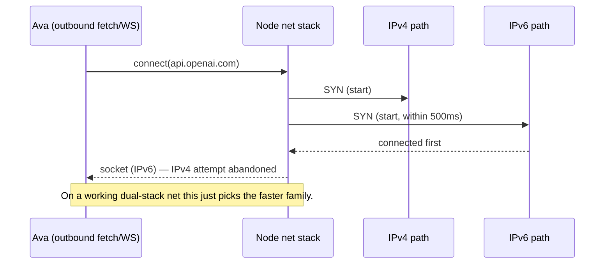
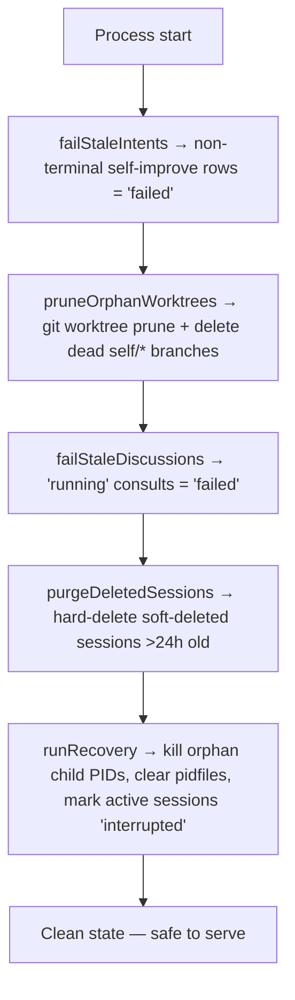

# 01 — Bootstrap, Configuration, Runtime & Operations

The authoritative reference for how the Ava server process starts, what it reads
from the environment, how it reconciles state left behind by the previous run,
and how you operate it day to day.

---

## How to read this doc

- **Plain-English first.** Each section opens with what the thing *does* and *why*,
  then drills into the code, citing real lines as `path:line`.
- **Two agents, never confused.** **Ava** is the *runtime* agent — the process this
  document describes, the thing you talk to. **Claude** is the *coding* agent (the
  developer) that writes Ava's code; when Ava "self-improves" or "discusses", it
  shells out to the `claude` CLI as a worker. This doc is about Ava's process. Where
  the boot wiring sets up the bridge to Claude, that is called out explicitly.
- **Honest about half-built parts.** Anything flaky, dev-only, or not yet wired for
  production is flagged inline.

A note on terminology in the codebase: log lines and a few user-facing strings say
"Sir" and "phone". Those are historical — current usage is **you, on the PC, in a
desktop browser or installed PWA**. Tailscale (a private VPN) is configured so the
server *can* be reached from another device, but nothing in the boot path assumes a
phone is present.

---

## 1. The one-paragraph version

Ava is a **single Node/TypeScript process**. Starting it runs
`server/src/index.ts`, which: tunes the network stack for flaky IPv6 networks,
loads config from environment variables, opens a pino logger that writes rotating
files, opens the SQLite database (creating/migrating the schema), reconciles any
state orphaned by the previous run (dead self-improve intents, leaked git
worktrees, orphaned consult records, soft-deleted sessions, killed worker
processes, stale pidfiles, interrupted chat sessions), constructs the runtime
dependencies (a lazy Chrome getter, the push deliverer, the LLM provider, the
self-improvement and discuss-with-Claude wiring), mounts the Express routes and
static web build, starts listening on a TCP port, attaches the realtime-voice
WebSocket proxy, and finally raises a Windows system-tray icon. After that the
process sits in the Node event loop serving HTTP/WS until it is stopped.

There is **no separate web server, job queue, or database server**. Everything is
in-process. SQLite is a single file; the web UI is pre-built static files served by
the same Express app.

---

## 2. Dev vs prod — the two ways it runs

This matters operationally, so it comes first.

| | Dev | Prod |
|---|---|---|
| Command | `npm -w server run dev` → `tsx watch src/index.ts` | `npm -w server run build` then `npm -w server run start` → `node dist/index.js` |
| TypeScript | Run directly via `tsx` (no build step) | Compiled to `dist/` by `tsc`, then run as plain JS |
| File changes | **Hot-reload**: `tsx watch` restarts the process whenever a source file changes | No reload; restart manually |
| Defined in | `server/package.json:6` | `server/package.json:7-8` |

**Why the hot-reload detail is operationally load-bearing:** Ava's
self-improvement feature edits its own source on disk and then expects the process
to pick up the new code. In dev, `tsx watch` *is* the restart mechanism — when a
swap rewrites the working tree, `tsx` notices and reloads automatically. That is
exactly why the improver's `restart` step is an intentional no-op
(`server/src/index.ts:202`, commented "Dev: tsx watch auto-reloads when swapTo
rewrites the working tree. (pm2/prod restart is a follow-up.)"). In prod (`node
dist/index.js`) there is no watcher, so a swap would not take effect until you
restart manually. **Self-improvement is therefore a dev-mode capability today.**

The `build` script also copies two non-TS assets that `tsc` doesn't:
`src/state/schema.sql` and `src/self/SELF.md` are `copyFileSync`'d into `dist/`
(`server/package.json:7`). If you ever run prod and the DB or self-identity looks
empty, a missing copy step is a prime suspect.

Node **24+** is required (`package.json:8`, root `engines`). The auto-select-family
networking APIs used at boot (Section 4) exist in modern Node and are called
defensively with optional chaining.

---

## 3. Boot sequence — the full order

Everything below happens **top-to-bottom in `server/src/index.ts`** at module
load. There is no `main()` — the file is an ES module with top-level `await`, so
import order and statement order *are* the boot order.

```mermaid
flowchart TD
  A["import './net-tuning.js' (side-effect, FIRST)"] --> B["loadConfig() — read env, mkdir data/logs"]
  B --> C["buildLogger() — pino + daily rotating file"]
  C --> D["openDb() — open SQLite, run schema.sql, migrate columns"]
  D --> E["failStaleIntents(db) — dead self-improve rows → failed"]
  E --> F["pruneOrphanWorktrees(repoRoot) — drop leaked git worktrees/branches"]
  F --> G["failStaleDiscussions(db) — dead consult rows → failed"]
  G --> H["purgeDeletedSessions(db) — hard-delete >24h soft-deleted sessions"]
  H --> I["new ActiveRuns() — in-memory per-session run lock"]
  I --> J["new PidfileRegistry(pidfileDir)"]
  J --> K["await runRecovery() — kill orphan pids, clear pidfiles, interrupt active sessions"]
  K --> L["bootstrapMemoryDir() — create memory dirs + seed personality.md"]
  L --> M["define getChrome() lazy-getter (does NOT launch yet)"]
  M --> N["buildDeliverer() if VAPID keys present → pushDeliver, notifyDone"]
  N --> O["buildProvider() — pick OpenAI/Anthropic LLM provider (or null)"]
  O --> P["wire self-improvement deps (selfClaudeCode, runner, improver factory)"]
  P --> Q["wire discuss-with-Claude (consultClaude, read-only)"]
  Q --> R["assemble agentDeps bundle"]
  R --> S["new express(), JSON body limit 1mb"]
  S --> T["mount /api/* routes + /_status + static web/dist"]
  T --> U["register SIGINT/SIGTERM → shutdown()"]
  U --> V["app.listen(port, bindAddr) — NOW serving HTTP"]
  V --> W["mint voice-internal token; buildRealtimeProxy().attach(httpServer)"]
  W --> X["startSystray() — Windows tray icon (best-effort)"]
```



### 3.1 Step-by-step, with citations

1. **`import "./net-tuning.js"`** — `index.ts:1`. Must be the very first import so the
   happy-eyeballs setting is applied before any outbound socket is created. See
   Section 4.

2. **`const startedAt = Date.now()`** — `index.ts:58`. Captured immediately; the
   `/api/health` and `/_status` endpoints report uptime relative to this.

3. **`const cfg = loadConfig()`** — `index.ts:59`. Reads every environment variable,
   resolves all paths to absolute, and **eagerly creates** `DATA_DIR` and `LOGS_DIR`
   (`config.ts:54,59`). Throws on an invalid `PORT`, `LOG_LEVEL`, or
   `AUTH_PAIRING_TTL_SECONDS` — a bad value here aborts boot. Full table in Section 5.

4. **`const log = await buildLogger(...)`** — `index.ts:60`. Awaited because
   `pino-roll` returns a `Promise` for its file stream. After this line, all
   diagnostics go to the rotating log file. See Section 6.

5. **`const db = openDb(cfg.dbPath)`** — `index.ts:61`. Opens (or creates) the SQLite
   file, executes `schema.sql` (all tables are `CREATE TABLE IF NOT EXISTS`), and runs
   three idempotent `ALTER TABLE` column migrations plus one index
   (`db.ts:14-17`). This is the only schema/migration mechanism — there is no
   migration tool; new columns are added defensively via `tryAddColumn`
   (`db.ts:26-31`).

6. **Reconcile orphaned self-improve intents** — `index.ts:65-68`. `failStaleIntents(db)`
   flips any intent still in `queued|reflecting|implementing|verifying` to `failed`
   (`self/intents.ts:38-46`). Rationale: the improvement loop's lock is in-memory, so
   at boot nothing is genuinely in flight; a non-terminal row is a corpse from a prior
   restart and must not report as forever-"implementing".

7. **Prune leaked git worktrees** — `index.ts:72-77`. `pruneOrphanWorktrees(cfg.repoRoot)`
   runs `git worktree prune` and deletes any `self/*` branch not backing a live
   worktree (`self/worktree.ts:65-96`). Step 6 only fixes DB rows; a crash
   mid-improvement also leaks a temp worktree directory and a `self/<id>` branch on
   disk. Wrapped in `try/catch` — **never crashes boot**.

8. **Reconcile orphaned consults** — `index.ts:80-83`. `failStaleDiscussions(db)` flips
   any `running` discussion (a background "discuss with Claude" consult) to `failed`
   (`state/discussions.ts:46-54`). Same reasoning as intents.

9. **Purge old soft-deleted sessions** — `index.ts:84-85`.
   `purgeDeletedSessions(db, now - 24h)` hard-deletes session rows whose `deleted_at`
   is older than 24 hours (`state/sessions.ts:31-34`). Sessions are soft-deleted
   (a `deleted_at` timestamp) when you remove a chat; this boot step is the garbage
   collector that finally removes them.

10. **`const runs = new ActiveRuns()`** — `index.ts:86`. An in-memory registry that
    enforces "one active run per session". It is intentionally **not** persisted —
    after a restart no run is active, which is correct.

11. **`const pidfiles = new PidfileRegistry(cfg.pidfileDir)`** — `index.ts:87`. Creates
    the pidfile directory if missing (`process/pidfile.ts:6`). A "pidfile" here is just
    an empty file named after a child process's PID, stored under
    `pidfiles/<runId>/<pid>`. This lets the server find and kill the child processes a
    run spawned (e.g. a `claude` CLI or browser helper), even across restarts.

12. **`await runRecovery(...)`** — `index.ts:89`. The big reconciliation step
    (`state/recovery.ts:12-33`):
    - Lists every pidfile, **kills each PID's whole process tree**
      (`killTree`, `process/kill-tree.ts`, uses `tree-kill`), ignoring failures.
    - Clears every pidfile directory for the runIds it saw.
    - Marks every session still in DB status `active` as `interrupted` and appends a
      system message: *"Server restarted; this task may have been interrupted. Send a
      new message to continue."*
    This is **how a restart reconciles orphaned state**: child processes from the dead
    run are reaped, their bookkeeping is cleared, and in-flight chats are told they
    were interrupted rather than silently hanging.

13. **`bootstrapMemoryDir({ dir: cfg.memoryDir })`** — `index.ts:90`. Creates the memory
    directory tree and, if `personality.md` doesn't exist, writes the default
    personality content (`memory/bootstrap.ts:6-12`). Idempotent — an existing
    `personality.md` is left untouched, so your edits survive restarts.

14. **Define `getChrome()` (lazy)** — `index.ts:92-109`. This **does not launch a
    browser at boot.** It is a memoized async getter: the first caller triggers
    `buildChrome(...)` (a real, non-headless Chromium via Playwright,
    `tools/chrome.ts:44-51`); later callers reuse it. If the window was closed or the
    browser disconnected, `isAlive()` is false and the next call rebuilds it
    (`index.ts:95-103`). **Why lazy:** launching Chromium is heavy and most server
    starts never need a browser, so the cost is deferred until a tool actually
    browses. Single-tenant caveat is documented inline (`index.ts:110-113`): the one
    persistent Chrome context is shared across all runs; cross-session concurrency is
    not guarded.

15. **Push deliverer** — `index.ts:115-131`. Only built if **both** `VAPID_PUBLIC_KEY`
    and `VAPID_PRIVATE_KEY` are set; otherwise `deliverer` is `null` and
    `pushDeliver`/`notifyDone` are `undefined`. `buildDeliverer` configures
    `web-push` with the VAPID identity (`push/deliver.ts:31-33`). `pushDeliver` sends
    an "Ava needs approval" notification; `notifyDone` sends a fire-and-forget "task
    done" ping. With no VAPID keys, Ava runs fine but cannot push browser
    notifications.

16. **`const provider = buildProvider(...)`** — `index.ts:133-138`. Selects the LLM
    provider. Order is preference-first: if `LLM_PROVIDER=openai` (the default) it
    tries OpenAI then Anthropic; if `anthropic`, the reverse. It picks the first
    provider whose API key is present (`orchestrator/llm/factory.ts:14-24`). **If
    neither key is set, `provider` is `null`** and a warning is logged; chat then
    returns HTTP 503. The realtime/voice features key separately off the OpenAI key.

17. **Self-improvement wiring** — `index.ts:140-230`. Constructs the machinery Ava uses
    to edit its own code (driven by the `claude` CLI as the edit worker):
    - `selfClaudeCode` (`index.ts:144-147`) — a Claude-CLI runner whose path allowlist
      **only permits the OS temp dir** (`tmpdir()`), because self-edits happen in a
      throwaway git worktree there, never in the live repo.
    - `selfRunner` (`index.ts:148`) — runs `npm test` / build / boot-smoke for verify.
    - `buildImproverDeps()` (`index.ts:150-219`) — the full pipeline: `reflect` (ask the
      LLM what to change), `addWorktree`/`removeWorktree` (isolated checkout),
      `implement` (run the Claude worker in the worktree), `verify` (tests + boot-smoke +
      a **report-only** flightcheck that never gates the swap, `index.ts:166-177`),
      `commitWorktree`, `swapTo` (guarded by `assertSwapSafe`, which **hard-blocks**
      edits to safety-critical code — auth/policy/self-improve/approval/allowlist/scrub
      — `index.ts:193-199`), `revertTo`, a no-op `restart` (see Section 2),
      and a detached `watch` watchdog (`index.ts:205-216`) that survives the reload and
      reverts if the new build never gets healthy.
    - `startImprovement`/`queueSelfImprove` (`index.ts:221-230`) — fire-and-forget entry
      points; thrown errors are caught so they never become unhandled rejections.

18. **Discuss-with-Claude wiring** — `index.ts:232-266`. `consultClaude` is a
    **read-only** Claude-CLI runner: it passes only `-p <prompt>` (no `acceptEdits`),
    and its allowlist permits `cfg.repoRoot` so the consult can read the repo but never
    modify it (`index.ts:238-242`). `queueDiscussion` runs a consult in the background
    and, when done, relays Claude's answer back into the originating chat session —
    explicitly attributed to Claude (`index.ts:252-258`) — and pushes a "done" ping.

19. **`agentDeps`** — `index.ts:268-295`. The dependency bundle handed to the chat route
    and, transitively, to every tool: `pidfiles`, `fsRoots`, `memoryDir`, `dataDir`,
    `getChrome`, `pushDeliver`, `notifyDone`, `provider`, `logsDir`, plus the
    self-improve and discuss entry points and status readers.

20. **Direct SDK clients** — `index.ts:297-298`. A raw `Anthropic` client and a
    lazily-imported `OpenAI` client are created (each only if its key exists) and passed
    to the chat route alongside `agentDeps`. These are separate from the
    `provider` abstraction and used where a route needs the SDK directly.

21. **`const app = express()` + JSON limit** — `index.ts:300-301`. Body parser capped at
    `1mb`.

22. **Route mounting** — `index.ts:303-337`. In order: health (`/api`), auth, chat,
    sessions, push, rules, approvals, chips, reasoning, memory, self, voice
    primitives (`/api` — `/transcribe` + `/speak`), the voice-engine toggle
    (`/api/voice/engine`), the `/_status` HTML page (`/`), and finally the static web
    build from `web/dist/` (`index.ts:336-337`). Mount order matters: specific `/api/*`
    routers are registered before the catch-all static handler. Two routes are
    capability-gated: `/api/reasoning` advertises support only when the provider is
    OpenAI (`index.ts:311-313`), and `/api/push` needs the VAPID public key
    (`index.ts:307`).

23. **Shutdown handlers** — `index.ts:339-355`. `shutdown(reason)` is idempotent
    (guards on `shuttingDown`), closes the Chrome context if one was ever launched,
    then `process.exit(0)`. Wired to `SIGINT` and `SIGTERM`.

24. **`app.listen(cfg.port, cfg.bindAddr, ...)`** — `index.ts:357-359`. **This is the
    moment the server starts accepting HTTP connections.** Logs
    `"ava server listening"` with the port and bind address.

25. **Realtime voice proxy** — `index.ts:372-473`. Mints a fresh internal
    `voice-internal` bearer token after **revoking any stale ones from prior runs**
    (`index.ts:376-380`) so the token table never accumulates standing god-tokens.
    Then `buildRealtimeProxy(...).attach(httpServer)` wires the `/api/voice/realtime`
    WebSocket onto the already-listening HTTP server (`index.ts:463-472`). The upstream
    is chosen by `resolveVoiceProvider()` (OpenAI by default, Hume only when fully
    configured — Section 5.3). The "action handoff" (voice → the full chat agent) is
    wired **unconditionally** and is inert unless the model calls the tool; whether the
    model speaks at all is decided by the persisted voice-engine preference read at
    connect time.

26. **`startSystray(...)`** — `index.ts:475-485`. Raises the Windows tray icon
    (Section 7). Wrapped in `try/catch` — **if the tray fails, the server keeps
    running**; the catch logs how to mint a pairing code from the CLI instead.

After step 26 the module finishes loading. The process now lives in the event loop,
serving HTTP + WebSocket, until a signal or the tray's "Stop server" stops it.

---

## 4. Network tuning — `net-tuning.ts`

**What it does:** at process start, tells Node to race IPv4 and IPv6 when opening
outbound connections and use whichever connects first (RFC 8305 "Happy Eyeballs"),
abandoning a hung address family after a short window.

**Why it exists:** on some networks one address family is effectively dead. The
documented real-world trigger (`net-tuning.ts:1-12`) is an iPhone Personal Hotspot,
which is IPv6-only via NAT64 — native IPv4 connects *hang for ~15–42 seconds*
before timing out. Without this fix, every OpenAI HTTP call and the realtime
WebSocket tries the dead family first and stalls, making the whole agent feel
broken. (This is captured in project memory as the "network hotspot IPv4 slowness"
finding — sudden Ava slowness / voice 1006 / OpenAI 15–42s hangs traced to an
IPv6-only NAT64 hotspot, not Ava.)

**How:** it calls `net.setDefaultAutoSelectFamily(true)` and
`net.setDefaultAutoSelectFamilyAttemptTimeout(500)` — a 500ms attempt window
(`net-tuning.ts:20-21`). Both are invoked through optional chaining
(`net-tuning.ts:15-18`) so the file is harmless on a Node build that lacks them.



**Safe everywhere:** when both families work it simply uses the faster one, so the
fix carries no downside (`net-tuning.ts:9-12`). The real cure for the hotspot case
is to use Wi-Fi; this just keeps Ava usable when you can't.

The import is **first in `index.ts`** so the default is set before any socket is
created (`index.ts:1` comment: "MUST be first").

---

## 5. Configuration — every value, env var, and default

All configuration is environment variables, loaded once by `loadConfig()`
(`config.ts:52-87`). `import "dotenv/config"` at the top (`config.ts:1`) means a
`server/.env` file is loaded automatically — and **`.env` is gitignored**, so secrets
and machine-specific overrides live there, never in the repo. The shape is the
`Config` type (`config.ts:5-24`).

> **Reading divergence correctly:** because the live `.env` overrides committed
> defaults, the running server can behave differently from what the code's defaults
> imply. Before "fixing" an apparent mismatch (e.g. which voice is active), check
> `.env` first. This is a recorded gotcha for voice settings specifically.

### 5.1 Core config table

| Config field | Env var | Default | Notes |
|---|---|---|---|
| `port` | `PORT` | `8787` | Validated 1–65535; invalid value throws at boot (`config.ts:28-34`). |
| `bindAddr` | `TAILSCALE_IP` | `127.0.0.1` | The interface to bind. Default is loopback-only; set `TAILSCALE_IP` to your Tailscale address to expose Ava over the VPN (`config.ts:69`). |
| `dataDir` | `DATA_DIR` | `./data` (resolved absolute) | **Created at boot** (`config.ts:53-54`). Root of all on-disk state. |
| `dbPath` | — (derived) | `<dataDir>/state.db` | The single SQLite file (`config.ts:71`). |
| `logLevel` | `LOG_LEVEL` | `info` | One of `debug\|info\|warn\|error`; invalid throws (`config.ts:36-42`). |
| `pairingTtlMs` | `AUTH_PAIRING_TTL_SECONDS` | `300` (→ 300000 ms) | Pairing-code lifetime; must be > 0 (`config.ts:44-50`). |
| `chromeProfileDir` | `CHROME_PROFILE_DIR` | `<dataDir>/chrome-profile` | Persistent Chromium profile (cookies/logins survive restarts) (`config.ts:55`). |
| `screenshotDir` | `SCREENSHOT_DIR` | `<dataDir>/screenshots` | Where browser screenshots are written (`config.ts:56`). |
| `pidfileDir` | `PIDFILE_DIR` | `<dataDir>/pidfiles` | Child-process PID bookkeeping for kill/recovery (`config.ts:57`). |
| `logsDir` | `LOGS_DIR` | `<dataDir>/logs` | **Created at boot** (`config.ts:58-59`). Rotating log files land here. |
| `memoryDir` | `MEMORY_DIR` | `<dataDir>/memory` | Ava's long-term memory + `personality.md` (`config.ts:60`). |
| `fsRoots` | `FS_ROOTS` | `C:/ai/**,C:/projects/**,C:/Users/nikug/**` | Comma-separated glob allowlist for filesystem tools (`config.ts:61-64`). |
| `repoRoot` | `AVA_REPO_ROOT` | parent of `process.cwd()` | The live git repo used by self-improve/discuss; defaults to one level up from where the server runs (`config.ts:80`). |
| `anthropicApiKey` | `ANTHROPIC_API_KEY` | `null` | Anthropic LLM key (`config.ts:81`). |
| `openaiApiKey` | `OPENAI_API_KEY` | `null` | OpenAI LLM key **and** the key voice/STT/TTS/realtime use (`config.ts:82`). |
| `llmProvider` | `LLM_PROVIDER` | `openai` | `openai` or `anthropic`; anything else coerces to `openai` (`config.ts:65-66`). |
| `vapidPublicKey` | `VAPID_PUBLIC_KEY` | `null` | Web-push identity; both keys required for push (`config.ts:84`). |
| `vapidPrivateKey` | `VAPID_PRIVATE_KEY` | `null` | (`config.ts:85`). |
| `shopifyStore` | `SHOPIFY_STORE` | `null` | Shopify store domain (`my-store.myshopify.com`). With `shopifyAdminToken`, enables the `shopify_*` product tools (`config.ts:91`). |
| `shopifyAdminToken` | `SHOPIFY_ADMIN_TOKEN` | `null` | Shopify Admin API token (`shpat_…`); needs `read_products` + `write_products` scopes. **Both** store + token required, or the Shopify tools aren't offered (`config.ts:92`; `index.ts:287-288`). |
| `googlePlacesApiKey` | `GOOGLE_PLACES_API_KEY` | `null` | Google Places API (New) key — enables `find_places`. The Places API must be enabled **with billing** (`config.ts:93`). |

> These three are the **reliable-task-execution** integrations: when set, Ava edits Shopify products and finds businesses over **vendor APIs** instead of driving a browser. Inert (tools absent) when unset. Full write-up: [`../features/reliable-task-execution.md`](../features/reliable-task-execution.md).

### 5.2 Env vars read outside `config.ts`

Several environment variables are read **directly** in `index.ts` rather than
through `Config` — worth knowing because they won't appear in the `Config` type:

| Env var | Where | Effect |
|---|---|---|
| `VAPID_SUBJECT` | `index.ts:121` | `mailto:`/URL identity for web-push; defaults to `mailto:nobody@example.com`. |
| `REALTIME_HYBRID` | `index.ts:372,473` | Legacy default-seed for the voice-engine preference. **No longer gates** the voice action handoff; the persisted engine value decides speak vs transcribe. |
| `REALTIME_VOICE` | `index.ts:468` | Overrides the realtime model's voice name (e.g. `shimmer`). Passed straight to the proxy. |
| `AVA_MAX_AGENT_TURNS` | `orchestrator/agent.ts:148` | Overrides the agent loop's runaway backstop (default 1000 turns). This is a safety ceiling, **not** a task budget — the real brakes are Stop, the stuck-loop detector, per-tool timeouts, and approvals. |

### 5.3 Voice-provider env vars — `voice-provider-config.ts`

The realtime upstream is chosen by `resolveVoiceProvider()`
(`routes/voice-provider-config.ts:71-97`), reading **only `process.env`** — it never
opens or parses a `.env` file, and never logs a secret value (only presence
booleans and the public voice name, via `describeVoiceProvider`).

| Env var | Default | Effect |
|---|---|---|
| `AVA_VOICE_PROVIDER` | `openai` | `hume` selects Hume EVI; anything else → OpenAI realtime (`voice-provider-config.ts:58-61`). |
| `HUME_API_KEY` | — | **Required** for Hume; if absent while `hume` is requested, transparently **falls back to OpenAI** (`voice-provider-config.ts:77-87`). |
| `HUME_SECRET_KEY` | — | Optional; enables robust OAuth access-token auth (preferred over the rate-limited api-key query param) (`voice-provider-config.ts:149-165`). |
| `HUME_CONFIG_ID` | — | Optional EVI config id. |
| `HUME_VOICE_ID` | — | Optional exact voice id (preferred over the name). |
| `HUME_VOICE_NAME` | `Alice Bennett` | Voice name when no id is pinned (`voice-provider-config.ts:17,94`). |

The fallback is deliberate: a misconfigured Hume never breaks voice — it quietly
reverts to the proven OpenAI realtime path.

### 5.4 Filesystem layout produced at boot

```
<DATA_DIR>/                 # default ./data, resolved absolute
├── state.db                # SQLite — sessions, messages, tokens, approvals, self_improvements, ...
├── chrome-profile/         # persistent Chromium profile (logins survive restarts)
├── screenshots/            # browser screenshots
├── pidfiles/<runId>/<pid>  # empty marker files for child-process tracking
├── logs/server.<date>.<n>.log   # rotating pino logs (daily)
└── memory/
    ├── personality.md      # seeded once if absent
    └── projects/           # per-project long-term memory
```

`DATA_DIR` and `LOGS_DIR` are created eagerly in `loadConfig` (`config.ts:54,59`);
the rest are created on first use by their respective builders
(`PidfileRegistry`, `buildChrome`, `bootstrapMemoryDir`, the logger).

---

## 6. Logging — `logs/logger.ts`

**What it does:** builds a [pino](https://getpino.io) logger that writes
**JSON lines to a daily-rotating file**, with automatic secret scrubbing.

**Where logs go:** files under `cfg.logsDir` (default `<dataDir>/logs/`), named by
`pino-roll`'s convention `server.<date>.<n>.log`, e.g. `server.2026-04-28.1.log`.
A new file is created when the date rolls over (`logger.ts:34-46`,
`frequency: "daily"`). Logs are written to **file, not stdout** — to watch them
live, tail the current day's file rather than the console.

**Level:** comes from `cfg.logLevel` (env `LOG_LEVEL`, default `info`)
(`logger.ts:48-49`).

**Secret scrubbing (defense-in-depth):** every log call is run through
`scrubSecrets` twice over:
- a pino `formatters.log` hook deep-walks the bound object and scrubs every string
  value (`logger.ts:20-29,50-52`), and
- a `hooks.logMethod` scrubs string arguments before they're formatted
  (`logger.ts:53-58`).

So even if code accidentally logs a token or key, the scrubber strips it before it
hits disk. (The same `scrubSecrets` is used elsewhere; project notes flag that it
can occasionally **over-redact** — worth knowing when a log line looks unexpectedly
masked.)

**`flush()`** (`logger.ts:80-95`) drains both pino's buffer *and* the underlying
`pino-roll`/SonicBoom stream (`flushSync`), then waits 50ms — used to guarantee
bytes are on disk before a process exits in contexts that need it.

The logger is built **early** (`index.ts:60`, step 4) so all subsequent boot steps
log through it.

---

## 7. Windows system tray — `systray/index.ts`

**What it does:** puts an **"Ava" icon in the Windows system tray** so you can pair
a device, open the status page, or stop the server without a terminal. Built on the
`systray2` package.

**Menu items** (`systray/index.ts:30-35`) and their handlers
(`systray/index.ts:41-54`):

| Item | `seq_id` | Action |
|---|---|---|
| **Show pairing code** | 0 | Calls `onPair()` → issues a pairing code, then pops a Windows `MessageBox` showing the code (valid 5 min) via a `powershell` one-liner (`systray/index.ts:42-47`). |
| **Open status page** | 1 | `start http://localhost:8787/_status` in the default browser (`systray/index.ts:48-49`). |
| *(separator)* | 2 | — |
| **Stop server** | 3 | Kills the tray and `process.exit(0)` (`systray/index.ts:50-53`). |

```mermaid
flowchart LR
  tray["Tray icon (systray2)"] --> click{seq_id}
  click -->|0| pair["onPair() → issuePairingCode\n→ MessageBox shows code"]
  click -->|1| status["start /_status in browser"]
  click -->|3| stop["tray.kill() → process.exit(0)"]
```

**Operational notes:**
- The tray is **best-effort**. If it throws, boot catches it and the server keeps
  running (`index.ts:475-485`); the catch tells you to mint a pairing code with
  `npm -w server run pair` instead (which runs `scripts/mint-pairing-code.ts`:
  `loadConfig` → `openDb` → `issuePairingCode` → print to stdout).
- The "Open status page" item hardcodes `localhost:8787`. If you change `PORT`, that
  menu link won't follow it (the server still serves `/_status`, just on the new
  port).
- The `systray2` module has an ESM/CJS default-export quirk that the file probes for
  explicitly (`systray/index.ts:6-19`) — tsx and tsc-compiled output expose the
  constructor at different depths.

---

## 8. Boot-time recovery — reconciling a previous run

**What it does:** the previous process may have died mid-task (crash, power loss, a
self-improve restart). Boot must leave the system in a clean, honest state: no
zombie child processes, no DB rows claiming work is still happening, no leaked git
worktrees. Five distinct steps handle this, all early in boot.



| Step | Function | File:line | What it reconciles |
|---|---|---|---|
| 1 | `failStaleIntents` | `self/intents.ts:38-46` | Self-improve intents stuck in `queued/reflecting/implementing/verifying` → `failed` (with reason "interrupted by a server restart"). |
| 2 | `pruneOrphanWorktrees` | `self/worktree.ts:65-96` | Leaked git worktree dirs + `self/*` branches not backing a live worktree. Best-effort, never crashes boot. |
| 3 | `failStaleDiscussions` | `state/discussions.ts:46-54` | Background Claude consults stuck `running` → `failed`. |
| 4 | `purgeDeletedSessions` | `state/sessions.ts:31-34` | Hard-deletes sessions soft-deleted more than 24h ago. |
| 5 | `runRecovery` | `state/recovery.ts:12-33` | Kills orphaned worker process trees, clears their pidfiles, marks `active` sessions `interrupted` + posts a system message. |

**Why this design is correct:** all the "in-flight" markers (the improvement-loop
lock, the discussion runner, the active-run registry) are **in-memory only**. After
a restart, by definition nothing is actually running. So any persisted row that
says otherwise is a corpse, and the honest thing is to mark it failed/interrupted
rather than let it mislead status readouts (Ava reports these states to you
verbatim). The kill step ensures a crashed run's *child* processes (a `claude` CLI,
a browser helper) don't linger and hold resources.

---

## 9. Health & status endpoints

Two lightweight, **unauthenticated** endpoints report liveness.

### `GET /api/health` — `routes/health.ts:3-13`
Returns JSON:
```json
{ "ok": true, "uptime": <ms since startedAt>, "version": "0.0.1" }
```
This is the canonical liveness probe. The self-improvement **watchdog** polls
exactly this URL (`http://127.0.0.1:<port>/api/health`, `index.ts:206`) to decide
whether a hot-swapped build came up healthy; if it never does, the watchdog reverts.

### `GET /_status` — `routes/status.ts:11-23`
Returns a tiny HTML page showing uptime (seconds) and the count of `active`
sessions (a live `SELECT COUNT(*)` against the DB). This is what the tray's "Open
status page" item opens. Mounted at the root (`index.ts:334`), so it's
`http://localhost:8787/_status`.

Neither endpoint requires a token — they expose no sensitive data and need to be
reachable by probes/watchdog. Everything under `/api/*` that touches real data is
behind `requireToken(db)` (`index.ts:304-318`).

---

## 10. Shutdown

`shutdown(reason)` (`index.ts:340-353`) is the single graceful-exit path:

1. Guards against double-invocation (`shuttingDown` flag).
2. Logs `"shutting down"` with the reason.
3. If a Chrome context was ever launched, closes it (best-effort; a failure is
   logged, not fatal).
4. `process.exit(0)`.

Triggered by `SIGINT` (Ctrl-C) and `SIGTERM` (`index.ts:354-355`), or directly by
the tray's "Stop server" item (`systray/index.ts:50-53`, which exits without going
through `shutdown` — so it skips the Chrome-close step; Chromium is then orphaned to
the OS, which reaps it on process exit).

Note there is **no explicit DB close** — `better-sqlite3` flushes synchronously on
each write, so the file is always consistent on disk; an abrupt exit loses nothing
already committed.

---

## 11. Operations runbook

### Start it (dev — the normal mode)
```
npm -w server run dev
```
Runs `tsx watch src/index.ts`. Hot-reloads on any source change. Self-improvement
relies on this reload (Section 2). This is the mode the project actually runs in.

### Start it (prod)
```
npm -w server run build      # tsc + copy schema.sql & SELF.md into dist/
npm -w server run start      # node dist/index.js
```
No hot-reload; self-improve swaps won't take effect until a manual restart.

### Pair a device
Tray → **Show pairing code**, *or*:
```
npm -w server run pair
```
Prints a code valid for `AUTH_PAIRING_TTL_SECONDS` (default 5 min).

### Where to look when something's wrong
| Symptom | First check |
|---|---|
| Won't boot at all | Console error from `loadConfig` — invalid `PORT`/`LOG_LEVEL`/`AUTH_PAIRING_TTL_SECONDS` throws (`config.ts:30,39,47`). |
| Boots but chat returns 503 | No LLM key — `provider` is `null` (`index.ts:133`, `factory.ts:25`). Set `OPENAI_API_KEY` or `ANTHROPIC_API_KEY`. |
| Behaves unlike the committed defaults | Read `server/.env` — it overrides everything (`config.ts:1`). |
| No push notifications | `VAPID_PUBLIC_KEY`/`VAPID_PRIVATE_KEY` not both set (`index.ts:115`). |
| Slow/hanging outbound calls on a phone hotspot | IPv6-only NAT64; happy-eyeballs mitigates but real fix is Wi-Fi (Section 4). |
| Voice silent / "auth failed" churn | Check the voice-engine toggle (persisted) and Hume config; missing `HUME_API_KEY` falls back to OpenAI (Section 5.3). |
| Sessions stuck "active" after a crash | Expected to self-heal at next boot via `runRecovery` (Section 8) — they become `interrupted`. |
| Logs look empty | They're in `<dataDir>/logs/server.<date>.<n>.log`, not stdout (Section 6). |
| Tray icon missing | Non-fatal; server still runs. Mint codes via `npm -w server run pair` (`index.ts:481-484`). |

### Change the port / expose over Tailscale
Set `PORT` (default 8787) and/or `TAILSCALE_IP` (default `127.0.0.1` → loopback
only). Binding to the Tailscale address is what makes Ava reachable from another
device on the tailnet (`config.ts:68-69`). Remember the tray's status link is
hardcoded to `localhost:8787`.

### Stop it
Tray → **Stop server**, or Ctrl-C in the dev terminal (SIGINT), or send SIGTERM.

---

## 12. Boot checklist — process start → ready to serve

A single ordered checklist of what "starting Ava" actually entails, end to end.
Use it to reason about a boot or to verify a healthy start.

1. **Invoke** `npm -w server run dev` (dev) or `node dist/index.js` (prod).
2. **Network tuned** — happy-eyeballs enabled before any socket opens
   (`net-tuning.ts`, `index.ts:1`).
3. **Config loaded** — env read, paths resolved absolute, `DATA_DIR` + `LOGS_DIR`
   created; invalid `PORT`/`LOG_LEVEL`/TTL aborts here (`config.ts`).
4. **Logger up** — pino writing to `<logsDir>/server.<date>.<n>.log` with secret
   scrubbing (`logger.ts`).
5. **DB open** — `state.db` opened, `schema.sql` applied, column migrations run
   (`db.ts`).
6. **State reconciled** — stale intents failed, orphan worktrees pruned, stale
   discussions failed, old soft-deleted sessions purged (`index.ts:65-85`).
7. **Registries built** — `ActiveRuns`, `PidfileRegistry` (`index.ts:86-87`).
8. **Recovery run** — orphan child PIDs killed, pidfiles cleared, `active` sessions
   marked `interrupted` (`runRecovery`, `index.ts:89`).
9. **Memory seeded** — memory dirs created, `personality.md` written if absent
   (`index.ts:90`).
10. **Lazy Chrome getter defined** — *no browser launched yet* (`index.ts:92-109`).
11. **Push deliverer** — built iff both VAPID keys present (`index.ts:115`).
12. **LLM provider chosen** — OpenAI/Anthropic by preference + key, or `null`
    (`index.ts:133`).
13. **Self-improve + discuss wiring assembled** — temp-dir-scoped editor, read-only
    consult, improver deps (`index.ts:140-266`).
14. **`agentDeps` bundled** + direct SDK clients created (`index.ts:268-298`).
15. **Express app created**, routers + static web mounted (`index.ts:300-337`).
16. **Signal handlers registered** (`index.ts:354-355`).
17. **`app.listen(port, bindAddr)`** → **HTTP now served**; `"ava server listening"`
    logged (`index.ts:357-359`). *Health check goes green here.*
18. **Voice proxy attached** — stale internal tokens revoked, fresh one minted,
    `/api/voice/realtime` WebSocket live (`index.ts:372-472`).
19. **System tray raised** — best-effort; failure is non-fatal (`index.ts:475-485`).
20. **Ready.** Process idles in the event loop, serving HTTP + WS until a signal or
    the tray stops it.

A healthy boot is confirmed when `GET /api/health` returns `{ ok: true }` and the
log shows `"ava server listening"` with no preceding `"no LLMProvider available"`
warning (unless you intend to run keyless).
