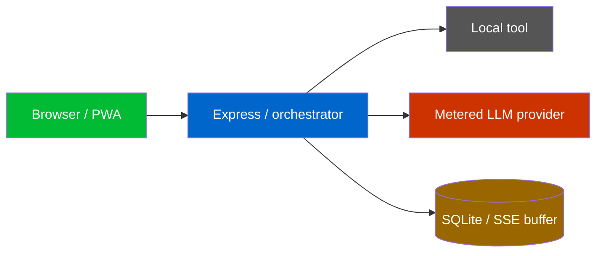
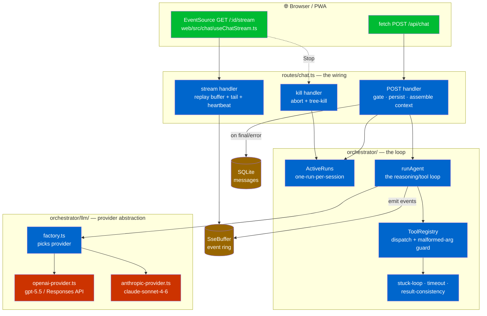
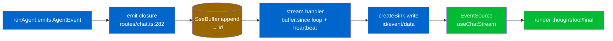

# 02 — The Agent Loop & Orchestration

*The heart of Ava. This is the document for understanding exactly what happens between you typing a message and the answer appearing — every step, every guard, every event on the wire.*

---

## How to read this doc

- **Plain-English first.** Each section opens with what the thing *does* and *why*, then drills into the code with `path:line` citations you can click through.
- **Two "agents" — keep them straight.**
  - **Ava** = the *runtime* agent. The thing you talk to. It runs the loop, calls tools, streams replies. Lives in `server/`. This document is about Ava's loop.
  - **Claude** = the *coding* agent (the developer that wrote this). When Ava "self-improves" or "discusses", it shells out to the `claude` CLI as a worker — but that is a *tool*, not the loop itself.
- **Honesty markers.** Where a behaviour is subtle, race-prone, or a deliberate trade-off, it is flagged with **Gotcha** or **Honest flag**.
- **Diagrams render as pictures** in GitHub and in VS Code (install "Markdown Preview Mermaid Support"). Each shows exactly one flow.

### Legend (used in every diagram)



**Green** = the browser/PWA. **Blue** = the Node server / orchestrator. **Grey** = a local tool (no API cost). **Red** = a metered LLM call (costs money). **Brown** = storage or the in-memory event buffer.

---

## 1. What "the agent loop" is

When you type a message, the server starts a **run**: it loops a large language model and its tools until the model decides it is done, streaming every step back to your browser as it happens.

The whole thing is split across two HTTP requests on purpose:

1. **`POST /api/chat`** — accepts your message, starts the run *in the background*, and immediately returns a `sessionId`. It does **not** wait for the answer.
2. **`GET /api/chat/:sessionId/stream`** — a Server-Sent Events (SSE) stream the browser opens right after. The server pushes events (`thought`, `tool_call`, `tool_result`, `final`, `done`) down this channel as the run produces them.

This two-request design is what makes Ava feel live: the model can spend two minutes browsing the web, and your browser watches each tool fire in real time instead of staring at a spinner waiting for one giant response.

**Key vocabulary:**

| Term | Meaning | Defined in |
|------|---------|------------|
| **Run** | One in-flight turn for one session. Owns a `runId`, an `AbortController`, and an SSE buffer. | `routes/chat.ts:190` |
| **Session** | A conversation thread (its message history). One row in the `sessions` table. | `state/sessions.ts` |
| **One-run-per-session gate** | A session can only have one active run; a second `POST` while busy gets HTTP **409**. | `routes/chat.ts:159-162` |
| **SSE buffer** | An in-memory ring of the run's events so a (re)connecting browser can replay what it missed. | `sse/buffer.ts` |
| **Action vs conversation mode** | Action = full tool stack + big model. Conversation = no tools + cheap "side" model, for fast chit-chat. | `routes/chat.ts:224-228` |
| **Persist flag** | `persist:false` runs the tools but stores **no** messages — used only by the voice handoff. | `routes/chat.ts:171-173` |
| **Agent event** | The internal union type the loop emits; the SSE layer serializes these to the wire. | `orchestrator/agent.ts:21-30` |

---

## 2. The components, and how they fit together



The rest of the doc walks each box. **§5 is the payoff**: the full end-to-end sequence of one text task.

---

## 3. The route layer — `routes/chat.ts`

This file is the front door. It owns three endpoints and all the request-time wiring (session lookup, the concurrency gate, context assembly, tool construction, and the SSE plumbing).

### 3.1 `POST /api/chat` — accept and launch

The handler (`routes/chat.ts:104-430`) runs this sequence:

1. **Validate the body** (`:105-109`). The Zod schema (`:49-60`) accepts `{ text, sessionId?, voice?, persist? }`. `text` is 1–10,000 chars. A bad body → **400**.
2. **Require a provider** (`:110-113`). If no LLM provider was constructed at boot (no API key), every chat → **503 `no_llm_provider`**.
3. **Find or create the session** (`:114-121`). No `sessionId`, or one that doesn't exist → a new session is created and titled from the first 60 chars; otherwise the existing session is "touched" (its `updated_at` bumped).
4. **Auto-learn from a correction** (`:124-146`). If your new message looks like you're pushing back on the previous assistant turn within 5 minutes (`detectCorrection`), it's captured as a low-confidence preference observation — fire-and-forget, never blocks.
5. **Auto-title** the new session in the background (`:147-157`) — fire-and-forget.
6. **The concurrency gate** (`:159-162`). `if (runs.get(sessionId)) → 409 run_in_progress`. **This is the one-run-per-session rule.** See §4.
7. **Persist the user turn — *after* the gate** (`:171-173`). This ordering is load-bearing (see Gotcha below). Skipped entirely when `persist:false`.
8. **Kick off a summary** of older messages in the background (`:180-182`) — fire-and-forget so it never adds latency before the stream opens.
9. **Create the run's machinery** (`:184-191`): a fresh `SseBuffer` (cap 500 events / 5 MB), an `AbortController`, and a `runId` (`nanoid(12)`). All three are bundled into an `ActiveRun` and registered. **The `runId` is generated here, before registration, on purpose** — the same id keys the agent run, every tool's context, and the pidfile registry, so the kill endpoint can later find this run's child PIDs (`:186-191`).
10. **Assemble the prompt context** (`:193-269`) — see §3.4.
11. **Launch the loop in a detached async IIFE** (`:274-427`) and, critically, **respond immediately** with `res.json({ sessionId })` at `:429`. The loop keeps running after the HTTP response is sent.

> **Gotcha — why the user message is stored *after* the 409 gate.** An earlier version appended the user message *before* the gate. When a run was already in progress, the second request was rejected with 409 but had *already* stacked an orphan user message with no reply. Symptom: "the voice session goes silent / a second job won't run" — a stuck run 409s every later turn while history fills with unanswered user lines. Storing after the gate (`:164-173`) means a rejected request changes nothing.

> **Gotcha — fire-and-forget summarization.** `maybeSummarize` is intentionally *not* awaited (`:180-182`). Awaiting it added latency before the client could open the stream, widening the fast-finish/connect race (see §3.3). It self-guards against duplicate work and only affects *future* turns, so a late summary is harmless.

### 3.2 The `emit` closure — the bridge from loop to wire

Inside the IIFE, an `emit` function (`:282-330`) is the single sink the agent loop calls for every event. It does five jobs in order:

1. **Records tool steps and evidence** for playbook capture: each `tool_call` pushes a step; each `tool_result` records executor status plus any validated verification envelope.
2. **Normalizes an empty final.** If the model produces a `final` with blank text (it acted but wrote no closing words), it's rewritten to a graceful message so the chat never renders a silent bubble (`:292-294`, constant at `:70-71`).
3. **Settles playbook learning at the terminal receipt:** `final` stores only the response text. `done`, `error`, or `killed` first completes the task receipt, then maps its verified/partial/unverified/contradicted/failed evidence into procedural learning. Only independently verified task outcomes may distil or merge a ≥2-tool playbook.
4. **Appends the event to the SSE buffer** (`:312`) and gets back a monotonic event id.
5. **Persists the assistant message** (unless `persist:false`): on `final`, stores the assistant text; on `error`, stores a `"That didn't work — …"` line so a run-ending error surfaces in the transcript instead of leaving the chat silent (`:316-328`).

### 3.3 `GET /api/chat/:sessionId/stream` — the SSE tail

The browser opens this right after the `POST` returns (`routes/chat.ts:432-492`).

- It reads `last-event-id` (header or `?lastEventId=`) so a reconnect resumes where it left off (`:438`).
- **If there is no active run** (`:439-459`): it does **not** 404. A fast run can finish and unregister *before* the browser ever connects. 404-ing would make the browser's `EventSource` retry forever and the UI's "busy" state never clear. Instead it synthesizes the end of a turn: replay the session's latest assistant reply (after the last user turn) as a `final`, then `done`, then close — exactly the shape the live loop emits, so the client finishes cleanly. The helper that finds that reply is `latestAssistantAfterLastUser` (`:529-540`); requiring it to come *after* the last user message avoids replaying a stale reply from a previous exchange.
- **If the run is live** (`:460-491`): it replays the buffer since `lastEventId` (emitting a `gap` event first if the buffer already evicted the requested range), then polls the buffer every 100 ms for new events and writes them. A **heartbeat comment** (`: ping`) is sent if ~15 s pass with nothing flushed, so idle intermediaries don't drop a long single-tool turn (`:472-484`). When the run unregisters, the interval stops and the sink closes (`:485-489`).

> **Gotcha — the fast-finish / late-connect race.** `POST` returns first; the browser connects *after*. With a trivial turn ("hi"), the whole run can complete in the gap. The replay-instead-of-404 branch (`:440-459`) is what stops the UI hanging. This is the single most important non-obvious behaviour in the route.

### 3.4 Context assembly — what actually goes to the model

Before launching, the handler builds the message context (`:193-272`):

- **History split for prompt-caching** (`:204-215`): all prior user/assistant rows become a cacheable `priorMessages[]` prefix; only the *latest* user turn carries the (rare) greeting/summary/playbook prefix and is sent as the final user message. Keeping the prefix byte-stable lets the provider cache it across turns.
- **Summary header** (`:198-200`): if older messages were summarized, the summary is prepended (and only messages *after* the summary cutoff are included as recent — `:194-196`).
- **Greeting** (`:202`): `decideGreeting` may add a one-time greeting prefix.
- **Mode selection** (`:216-228`): **typed turns are forced to `action` mode** (full tool stack). Only **voice** turns trust the `classifyIntent` classifier to drop chit-chat into the cheap conversation path. `FORCE_INTENT=conversation` can force the chitchat path for text. *(Rationale in the code comment `:216-223`: the classifier was too conservative for typed input — "look up X" wrongly stayed in conversation mode and Ava said "I can't access Google".)*
- **Deterministic computer route** (`orchestrator/computer-execution-router.ts`): a deliberately narrow grammar recognizes a single direct Google-search instruction from either typed or voice-originated chat. It chooses Ava's persistent Chrome before provider inference, skips unrelated memory retrieval, and still executes through the ordinary policy, timeout, event, receipt, and verification boundaries. Compound research requests stay in the normal agent loop. An explicit request to use the current Notepad-only Microsoft UFO adapter for the web fails honestly rather than opening the wrong application. This is the first route in a provider-neutral executor matrix, not a second agent loop.
- **Playbook recall** (`:238-267`): in action mode, for typed turns only, a side-model call tries to match the request to a saved playbook and inject its steps + a stakes rubric. It's a best-effort optimization, wrapped in try/catch and bounded to **8 s** (`:65`, `:243-252`); a slow/failed match degrades to "no playbook injected" and the turn still runs.
- **Reasoning effort** (`:270-272`): for OpenAI, voice → `"none"`; otherwise mapped from the stored Fast/Thorough preference via `mapReasoning` (`orchestrator/reasoning.ts`). For Anthropic, `undefined` (not exposed).

### 3.5 Tool construction (per run)

Tools are built fresh for each run inside the IIFE (`:340-400`), so each carries this run's abort signal and ids:

- **Action mode** (`:356-388`) wires the full stack: `shell`, `control_app`, the `fs_*` family, `claude_code`, the `chrome_*` family, `computer_use`, `take_screenshot`, optionally the self-improve / read-logs / discuss tools, plus memory and update-log tools. **Chromium is not booted here** — the chrome/computer_use builders close over a lazy `getChrome` accessor and only launch the browser when a browsing tool is actually dispatched, so a turn that never browses pays no launch cost (`:360-371`).
- **Conversation mode** (`:393-399`) exposes only a thin subset: `control_app`, discuss tools, memory tools, and the update log — enough to answer "what's happening?" or drive a native app by voice without the heavy builders.

> **Note — legacy `emit` parameters.** Several builders still take an `emit` param; they're passed a `noop` (`:337`) because the loop now emits `tool_call`/`tool_result` *centrally* via the ToolRegistry. A comment marks these for Phase-2 removal (`:334-337`).

---

## 4. `ActiveRuns` — the one-run-per-session gate

`orchestrator/active-runs.ts` is a thin `Map<sessionId, ActiveRun>` (60 lines) with one job: enforce that a session has at most one live run, and hold the handles the kill endpoint needs.

| Method | Purpose | Line |
|--------|---------|------|
| `register(run)` | Claim the session's slot. | `:15-17` |
| `get(sessionId)` | The current run, or `undefined`. The 409 gate reads this. | `:19-21` |
| `getRunId(sessionId)` | The run's id — kill endpoint uses it to find child PIDs. | `:25-27` |
| `unregister(sessionId, run?)` | Free the slot. **Identity-safe.** | `:29-35` |
| `abort(sessionId)` | Fire the run's `AbortController`. Returns whether a run existed. | `:37-42` |

> **Gotcha — identity-safe unregister.** `unregister` takes an optional `run`: if a *newer* run already owns the slot (e.g. a preempting voice command started after this one was aborted), the stale run's `finally` won't evict it (`:33`). Called with no `run` argument it force-frees the slot (used by kill/preempt at `routes/chat.ts:514`). The `runAgent` IIFE always unregisters in a `finally` (`routes/chat.ts:424-426`) so a crashed run can never wedge the session in a permanent 409.

---

## 5. ⭐ End-to-end: one text task, start to finish

**This is the key deliverable.** Scenario: you type *"search the repo for TODO comments and list them"* into the PWA and hit send. Walk it from keypress to rendered answer.

```mermaid
sequenceDiagram
  autonumber
  participant U as You (PWA)
  participant POST as POST /api/chat
  participant AR as ActiveRuns
  participant DB as SQLite
  participant Loop as runAgent
  participant Prov as OpenAIProvider
  participant LLM as gpt-5.5
  participant Reg as ToolRegistry + policy
  participant Tool as shell tool
  participant Buf as SseBuffer
  participant SSE as GET /:id/stream

  U->>POST: { text: "search the repo for TODO…" }
  POST->>POST: validate · provider present?
  POST->>AR: get(session) — free? (else 409)
  POST->>DB: append user message (after gate)
  POST->>AR: register(runId, abort, buffer)
  POST-->>U: { sessionId }   (returns immediately)
  U->>SSE: open EventSource(?lastEventId=0)
  SSE->>Buf: since(0) → replay (empty so far) + tail

  rect rgb(238,244,255)
  note over Loop,LLM: agent loop — until done (turn cap is a high backstop, default 1000)
  Loop->>Prov: stream(system, messages, tools)
  Prov->>LLM: Responses API (stream:true)
  LLM-->>Prov: deltas + function_call(shell)
  Prov-->>Loop: delta… then tool_call
  Loop->>Buf: thought deltas  --> SSE --> U (live)
  Loop->>Reg: policy.gate(shell) → allow
  Reg->>Tool: dispatch (withTimeout 30s)
  Tool-->>Reg: stdout (TODO matches), is_error:false
  Reg-->>Loop: tool result
  Loop->>Buf: tool_call + tool_result --> SSE --> U
  Loop->>Prov: stream(… + tool result)
  Prov->>LLM: continue
  LLM-->>Prov: final text, stop_reason end_turn
  Prov-->>Loop: delta(final) + done(end_turn)
  end

  Loop->>Buf: final  --> SSE --> U (renders answer)
  Loop->>DB: append assistant message
  Loop->>Buf: done   --> SSE closes
  Loop->>AR: unregister (finally)
```

### Step-by-step (numbered to match the diagram)

1. **You send.** The PWA `fetch`es `POST /api/chat` with `{ text }` and the current `sessionId` (null on a brand-new thread).
2. **Validate + provider check.** Zod parses the body (`routes/chat.ts:105`); a provider must exist (`:110`).
3. **Concurrency gate.** `runs.get(sessionId)` — if a run is already live, the request dies here with **409** and nothing else happens (`:159-162`).
4. **Persist the user turn** *after* the gate (`:171-173`).
5. **Register the run.** Fresh `SseBuffer`, `AbortController`, `runId`; bundled and registered (`:184-191`). Context is assembled (§3.4): typed → **action mode**, full tool stack built (§3.5).
6. **`POST` returns `{ sessionId }` immediately** (`:429`). The loop continues in a detached IIFE.
7. **Browser opens the SSE stream** at `GET /:id/stream?lastEventId=0` (`web/src/chat/useChatStream.ts:32-38`). The server replays the buffer from id 0 and starts tailing (`routes/chat.ts:460-489`).
8. **`runAgent` starts** (`orchestrator/agent.ts:78`). It builds the system prompt (persona + memory + tool rubric, §7), wraps the tools in a `ToolRegistry` carrying `{ runId, signal }` (`:125`), picks the **orchestrator model** (`gpt-5.5` for OpenAI — `:130-132`), and seeds `messages = [...priorMessages, { role:"user", content: prompt }]` (`:135-137`).
9. **Turn loop begins** (`:151`), capped at **`MAX_AGENT_TURNS = Number(process.env.AVA_MAX_AGENT_TURNS) || 1000`** (`:148`). This is a **runaway backstop, not a task budget** — the old hard cap of 48 was lifted in commit `e340c92` because it cut off real multi-step tasks (it couldn't finish one Shopify product edit); the real brakes are Stop, the stuck-loop detector, per-tool timeouts, and approvals. Each turn first checks `abort.signal.aborted` and bails if set (`:152`).
10. **Stream the model** (`:158-176`). The provider yields `delta` (text), `tool_call`, `thought`, and a terminal `done` with a `stop_reason`. Text deltas are emitted as `thought` events → they flow through the buffer → SSE → render live as Ava "thinking/typing" (`:164-166`).
11. **Model asks for a tool.** Here it emits a `function_call` for `shell` with `{ command: "grep -rn TODO ." }` (or similar). The provider parses the streamed JSON args and yields one `tool_call` (`openai-provider.ts:179-195`). The loop collects it into `pendingCalls` (`agent.ts:167-168`).
12. **Stream ends with `stop_reason: "tool_use"`** (the model wants results before continuing). Because there are pending calls and it's not `end_turn`, the loop does **not** finalize — it appends the assistant turn (text + tool_calls) to `messages` (`:201`) and dispatches.
13. **Per-call dispatch** (`:207-251`):
    - Emit `tool_call` (`:209`) → SSE → the UI shows "running shell…".
    - **Project-context auto-load**: if the args mention a known project, that project's notes are injected as a user message (`:211-221`).
    - **Policy gate** (`:223`): `shell` with a non-destructive command classifies low-risk → allowed silently. (A destructive command would create an approval and block for the veto window — see §9 and `docs/ARCHITECTURE.md` §5.) A Stop landing during the gate aborts before dispatch (`:224-226`).
    - **Dispatch with a timeout** (`:236-244`): `withTimeout(registry.dispatch(call), TOOL_BUDGET_MS["shell"] = 30_000, "shell")`. The registry looks the tool up by name, guards against malformed args (§6.1), runs it, and returns `{ output, is_error }`.
    - Emit `tool_result` with `ok: !is_error` and the output (`:242`) → SSE → the UI shows the result. Append the tool result to `messages` (`:243`).
    - Classify the result for consistency tracking (`:244`, §6.3).
14. **Consistency reminder (only if needed).** After all of this turn's tools run, if the worst result class is `error` or `uncertain`, a `[RESULT CHECK]` user message is injected forbidding a false "Done" before the model writes its wording (`:257-260`, §6.3). For a clean `grep` it's skipped.
15. **Next turn streams again** (`:154`), now with the tool result in context. The model reads the TODO list and writes its final answer. The stream ends with `stop_reason: "end_turn"` and no pending calls (`:194`).
16. **Finalize** (`:194-199`): `finalText = assistantText`; emit `final`. The `emit` closure in the route persists the assistant message (`routes/chat.ts:317-318`) and may capture a playbook (this was a ≥2-tool task that succeeded — actually a 1-tool task here, so capture is below the threshold). `concluded = true`, loop breaks.
17. **Wrap up** (`agent.ts:277-280`): if it was an action run that used ≥1 tool and wasn't killed, `notifyDone` fires a best-effort push. Then emit `done`.
18. **The stream closes.** `done` reaches the browser; `useChatStream` marks the run finished and closes the `EventSource` (`useChatStream.ts:56-59`). The loop's `finally` calls `runs.unregister` (`routes/chat.ts:424-426`), freeing the session for the next turn.

**What the browser actually rendered, in order:** a stream of `thought` text (the model's reasoning/preamble), a `tool_call` chip ("shell"), a `tool_result` (the grep output), more `thought`, then the `final` answer bubble, then the stream ended. That sequence of `AgentEvent`s (`agent.ts:21-30`) is the contract between the loop and the UI.

---

## 6. Inside `runAgent` — the loop in detail

`orchestrator/agent.ts` (301 lines) is the loop itself. §5 walked the happy path; here are the parts that matter when things aren't happy.

### 6.0 Turn termination — the four exits

Each turn ends by inspecting `stopReason` (`:178-199`), in this priority:

1. **`abort` / signal aborted** (`:178-183`) → emit `killed` (`{reason:"stuck"}` if the stuck-loop tripped, else `{reason:"manual"}`), set `concluded` + `killed`, break.
2. **`max_tokens`** (`:186-192`) → emit a `[response truncated by token limit]` thought, set `finalText` to what was produced, emit `final`, break. *(Honest flag: this is Phase-1 handling — it surfaces truncation but doesn't yet auto-continue.)*
3. **`end_turn`, or no pending tool calls** (`:194-199`) → the normal finish: emit `final`, break.
4. **Otherwise** (`tool_use` with pending calls) → run the tools and loop again (`:201-260`).

If the loop ever exhausts the full backstop (default 1000 turns) without `concluded` (`:267-278`), it emits a graceful `final` ("I reached my step limit before finishing… tell me to continue and I'll pick up where I left off") so you're never left with nothing, and the work can be resumed. In practice this is almost never reached — Stop, the stuck-loop detector, and timeouts end a run long before — but it's there so the rare exhaustion still ends cleanly rather than silently.

### 6.1 `ToolRegistry` — dispatch + the malformed-args guard

`orchestrator/tool-registry.ts` maps tool names to implementations and exposes `toolDefinitions()` (the JSON-schema list handed to the model) and `dispatch(call)`.

- **Unknown tool** → returns a tool *error* `unknown tool: <name>` (`:46-48`), not a throw — the model can read it and recover.
- **Malformed args** (`:53-61`): both providers emit a `{ _raw: "<unparseable json>" }` sentinel when the model's tool-call JSON won't parse. Dispatching that would run the tool with garbage (e.g. `shell` with an empty command). Instead the registry detects the sentinel (`isRawArgsSentinel`, `:14-18`) and returns `malformed tool arguments: <truncated>` as a tool error — **the tool is never invoked**.
- **Normal dispatch** (`:62-73`): coerces args to an object, runs `td.run(args, ctx)`, and maps the tool's `{ text, ok }` to `{ output, is_error: !ok }`. A thrown tool error is caught and returned as `is_error: true` rather than crashing the loop.

### 6.2 `stuck-loop` — detecting a spinning agent

`orchestrator/stuck-loop.ts` (107 lines) watches tool results to halt a run that's making no progress (and burning your money). With the turn cap now a high backstop rather than a hard 48, this detector — plus Stop and the per-tool timeouts — is the **primary** brake on a confused agent, not a fallback. It's driven from the wrapped `emit` in `runAgent` (`agent.ts:83-99`): every `tool_result` calls `stuckLoop.observe`, every `thought` calls `observeThought`.

Two halt conditions (`:64-98`):

1. **Wall-clock** (`:65-67`): if a tool result arrives ≥ **5 minutes** after the run started (`STUCK_WALLCLOCK_MS`), halt with reason `wallclock`.
2. **No-progress** (`:69-97`): keeps a sliding window of the last **5** observations. If the window is full, **no non-empty thought** has occurred since the window began, and the **visual** tool results in it (`chrome_read_page`, `chrome_screenshot`, `computer_use`) are all near-identical (Levenshtein distance ≤ **50** between consecutive ones), halt with reason `no-progress`. The thought check is the escape hatch: if the model is *reasoning* between identical screenshots, it's working, not stuck.

When `observe` returns `halt`, the wrapped emit injects a thought ("I've been trying for a while without progress. Halting."), sets `stuckReason = "stuck"`, and calls `abort.abort()` (`agent.ts:92-97`). The next turn-top abort check converts that into a `killed` event with `reason: "stuck"`.

> **Honest flag.** No-progress detection only triggers on *visual* tools and needs ≥2 near-identical results in the window with no intervening thought. A model stuck re-running the same `shell` command isn't caught by the similarity path — only the 5-minute wall-clock would stop that.

### 6.3 `tool-result-consistency` — stopping a false "Done"

`orchestrator/tool-result-consistency.ts` (103 lines) exists because the model will sometimes narrate a confident *"Done."* even when a tool reported failure. After each tool runs, `classifyActionResult` (`:29-38`) buckets the result:

- **`error`** — `is_error` set, or the parsed JSON output has `ok:false` / `success:false` / a truthy `error` field / a nonzero exit code / a `failed`-family status (`:50-70`).
- **`uncertain`** — status is `partial` / `uncertain` / `unknown` / `incomplete`.
- **`ok`** — no failure signal.

`worstClass` reduces a turn's results to the single worst (`:44-48`). If it's not `ok`, `runAgent` injects a `[RESULT CHECK]` reminder (`buildConsistencyReminder`, `:98-103`) as a user message *before* the model writes its wording (`agent.ts:257-260`), forbidding any success claim and requiring an honest report of the failure/partial progress. This is the runtime enforcement of the persona's "never fabricate success" rule.

### 6.4 `timeout` — per-tool budgets

`orchestrator/timeout.ts` defines `TOOL_BUDGET_MS` (`:1-9`) and the `withTimeout` wrapper (`:11-34`). Every dispatch is bounded (`agent.ts:236-241`): `shell` 30 s, `fs_*` 5 s, `claude_code` **600 s** (10 min — it spawns a whole coding worker), `computer_use` 60 s, `chrome_navigate` 30 s, etc. Anything not in the table defaults to 30 s (`agent.ts:236`). On timeout the promise rejects with `timeout: <tool> <ms>ms`, which the loop catches and surfaces as a failed `tool_result` (`agent.ts:245-250`) — the model sees the timeout and can react.

### 6.5 `tool-rubric` — teaching the model its tools

`orchestrator/tool-rubric.ts` is a static block (`TOOL_RUBRIC`) injected as layer 5 of the system prompt in **action mode only** (`system-prompt.ts:74-75`). It describes each tool in Ava's first-person voice, the "act immediately, don't idle" stance, when to pause for confirmation (destructive/irreversible only), the playbook discipline, the memory line-format, and the hard rules (never touch `.env`, never pass `--dangerously-skip-permissions`, never claim unearned success). It is deliberately **byte-stable** so the provider's prompt cache hits the prefix every turn.

---

## 7. The system prompt (what frames every turn)

`runAgent` builds the system prompt once per run via `buildSystemPrompt` (`orchestrator/system-prompt.ts:50-85`). Layers, in order: **persona** → **canonical capability map** → **memory index** → **preferences** → **observations** (auto-pruned) → *(action mode only)* **tool rubric** + **writable fs roots** → optional **project context**. The same bytes are produced in both modes (minus the action-only layers) for prompt-cache hits. The project context can also be injected *mid-run* when a tool's args reveal a project (`agent.ts:211-221`). Memory internals are covered in the memory/identity doc; what matters for the loop is that this string is the stable `system` argument passed to `provider.stream` every turn (`agent.ts:115-120`, `:155`).

---

## 8. The provider abstraction — `orchestrator/llm/`

The loop never talks to OpenAI or Anthropic directly. It depends on one interface, `LLMProvider` (`llm/types.ts:61-67`), with two methods: `stream(input)` (the agentic, tool-aware streaming call the loop uses) and `complete(input)` (a one-shot non-streaming call used by side tasks like titling/summaries).

### 8.1 The normalized event contract

Every provider's `stream` yields the same `StreamEvent` union (`types.ts:30-34`):

| Event | Meaning |
|-------|---------|
| `delta` | A chunk of assistant text. |
| `tool_call` | A fully-parsed tool call (`{ id, name, args }`); args are always parsed JSON, never a raw string. |
| `thought` | A reasoning-summary chunk (rendered as a "thinking" caption). |
| `done` | Terminal, with `stop_reason: end_turn | tool_use | max_tokens | abort | error`. |

This normalization is the whole point of the abstraction: the loop in `agent.ts` is provider-agnostic. Swapping providers can't change the event sequence — there's even a parity contract test for it (`docs/superpowers/specs/2026-04-28-ava-m4-design.md` §6.3).

### 8.2 Which provider is the default, and how it's chosen

`buildProvider` (`llm/factory.ts:8-27`) is called once at boot (`index.ts:133-138`) with `preferred: cfg.llmProvider`. **`cfg.llmProvider` defaults to `"openai"`** (`config.ts:65-66` — `LLM_PROVIDER` env, anything other than `anthropic` → `openai`). The factory tries the preferred provider first, then the other, returning the first one whose **API key is present** (`:14-24`). If neither key is set it returns `null`, and every chat → 503 (`routes/chat.ts:110-113`). So: **OpenAI is the default**, Anthropic is the configured alternative, and the actual selection also depends on which key exists.

| Provider | Orchestrator model (action) | Side model (conversation) | Source |
|----------|----------------------------|---------------------------|--------|
| **OpenAI** *(default)* | `gpt-5.5` | `gpt-5` | `openai-provider.ts:82-83` |
| Anthropic | `claude-sonnet-4-6` | `claude-haiku-4-5-20251001` | `anthropic-provider.ts:45-46` |

The loop picks orchestrator-vs-side by mode (`agent.ts:130-132`): action → `defaultOrchestratorModel`, conversation → `defaultSideModel`.

### 8.3 `OpenAIProvider` — the Responses API

`llm/openai-provider.ts` (251 lines) targets OpenAI's **Responses API** (not chat-completions). Key differences it handles:

- **Input shape** (`toResponsesInput`, `:23-54`): messages become "items" — text turns, `function_call` items (prior tool calls), and `function_call_output` items (prior results). Tools are flat `{type:"function", name, …}` (`:56-63`).
- **Reasoning effort** (`:70-78`, `:123-125`): mapped onto the values the API accepts (`minimal|low|medium|high`). Our `"none"` floors to `"minimal"` and `"xhigh"` caps to `"high"`. **Gotcha:** passing `"none"` raw returns a 400 (`Unsupported value: 'none'`) — silent death for any caller that swallows errors (e.g. playbook capture). This mapping is the fix.
- **Streaming** (`:110-231`): it accumulates `function_call` argument chunks by item id (`response.function_call_arguments.delta`), parses them on `output_item.done`, and on a parse failure yields the `{ _raw }` sentinel (`:186-188`) that the registry catches (§6.1). `response.completed` resolves the stop reason — `incomplete` → `max_tokens`, else `tool_use` if any tool was seen else `end_turn` (`:206-214`). Reasoning summaries surface as `thought` (`:197-204`).
- **Abort** (`:111-114`, `:135-138`): a pre-aborted signal yields `done: abort` immediately; an abort mid-stream breaks the loop with `abort`. The signal is also passed to the SDK (`:126`).

### 8.4 `AnthropicProvider` — the Messages API

`llm/anthropic-provider.ts` (127 lines) targets Anthropic's Messages API.

- **Input shape** (`toAnthropicMessages`, `:13-37`): assistant turns become `text` + `tool_use` content blocks; tool results become a `user` message with a `tool_result` block (`is_error` preserved).
- **Prompt caching**: the system prompt is sent as a single block with `cache_control: { type: "ephemeral" }` (`:74`) — this is why the stable system prefix (§7) pays off.
- **Streaming** (`:82-125`): tracks content blocks by index; text deltas → `delta`, tool-input JSON deltas accumulate and parse on `content_block_stop` (same `{ _raw }` sentinel on failure, `:111`); `message_delta.stop_reason` maps to the normalized stop reason.
- **`max_tokens` is hard-set to 4096** for streaming (`:72`). *(Honest flag: unlike OpenAI's reasoning-effort plumbing, Anthropic here ignores `reasoningEffort` entirely — it isn't exposed on this path.)*

### 8.5 `MockLLMProvider` — the test seam

`llm/mock-provider.ts` implements the same interface from canned `scripts` (arrays of `StreamEvent`) and `completions`, recording every call (`:8-9`). It reports `name: "openai"` so code paths keyed on provider name behave. Tests substitute it via the `runAgentImpl`/provider deps so the entire loop can be exercised with zero network calls.

---

## 9. ⭐ Abort / Stop — end to end

**The second key workflow.** You press the red **Stop** button mid-run (say, during a long `claude_code` task that spawned its own child processes).

```mermaid
sequenceDiagram
  autonumber
  participant U as You (Stop button)
  participant K as POST /:id/kill
  participant AR as ActiveRuns
  participant Sig as AbortController
  participant Loop as runAgent
  participant Tool as in-flight tool
  participant Reg as PidfileRegistry
  participant KT as killTree
  participant Buf as SseBuffer
  participant SSE as stream → browser

  U->>K: POST /api/chat/:id/kill
  K->>AR: getRunId(session) — grab id BEFORE unregister
  K->>AR: abort(session)
  AR->>Sig: abort()
  Sig-->>Loop: signal.aborted = true
  Sig-->>Tool: ctx.signal fires (claude_code child, computer_use loop)
  Note over Loop: next abort check → emit killed{reason:"manual"}, break
  K->>Reg: listForRun(runId) → child PIDs
  loop each PID
    K->>KT: killTree(pid) — SIGKILL whole subtree
  end
  K->>AR: unregister(session) — free slot (preempt)
  K-->>U: { aborted: true }
  Loop->>Buf: killed --> SSE --> browser finishes turn
```

### Step-by-step

1. **You press the red global Stop.** The chat UI `POST`s `/api/chat/:sessionId/kill-all`; voice barge-in uses the session-only `/kill` sibling.
2. **Grab the `runId` *before* unregistering** (`:501`). Order matters — once the slot is freed, the registry can't tell you which PIDs belonged to it.
3. **Abort the run** (`:504`): `runs.abort(sessionId)` fires the run's `AbortController`. This reaches **two** places at once:
   - **The model read-loop** — the provider's stream sees `signal.aborted` and ends; the next turn-top check in `runAgent` (`agent.ts:152` / `:182-187`) emits `killed` and breaks.
   - **In-flight tools** — every tool was built with this run's `signal` in its ctx (`agent.ts:125`), so a running `claude_code` child or `computer_use` desktop loop is signalled to stop *now*, not after the current step.
4. **Tree-kill the child processes** (`:509-513`): for each PID `pidfiles.listForRun(runId)` returns, `killTree(pid)` SIGKILLs the whole subtree (via `tree-kill`). This is what makes Stop *actually* halt a `claude -p` worker and everything it spawned — aborting the JS loop alone wouldn't reap OS child processes. Each kill is best-effort (a dead/missing PID never fails the request).
5. **Unregister to free the slot immediately** (`:514`) — note this is the no-`run` "force-free" form (§4), so a new turn can preempt right away even before the aborted loop's own `finally` runs.
6. **Respond** `{ aborted }` (`:515`) — `true` if a run existed to abort.
7. **The browser finishes the turn.** The `killed` event reaches `useChatStream`, which closes the `EventSource` and clears the busy state (`useChatStream.ts:56-59`).

> **Belt-and-suspenders.** `claude_code` *also* kills its own child on abort (SIGTERM → SIGKILL after 1 s) independently of the pidfile lookup (per `docs/ARCHITECTURE.md` §9 and `tools/claude-code.ts`). Two independent paths reach the child so Stop works even if one misses.

> **Pending-approval interaction.** If Stop lands while a tool is waiting in the approval veto window, the run's signal is threaded into `waitForDecision` (`policy/runtime.ts:82`), which resolves the wait as **expired** — the pending tool is **cancelled, never auto-run** (`agent.ts:223-226` re-checks the abort right after the gate). Stop always cancels a pending approval; it never approves it.

---

## 10. The SSE transport — `sse/buffer.ts` + `sse/stream.ts`

The buffer and sink are deliberately tiny and dumb; all the cleverness lives in how `routes/chat.ts` drives them.

### 10.1 `SseBuffer` — the replay ring

`sse/buffer.ts` (66 lines) is an in-memory, append-only ring per run.

- **`append({kind, payload})`** (`:24-45`): assigns a monotonic id (`nextId++`, starts at **1**), records byte size, and **evicts the oldest events** once the ring exceeds `maxEvents` (500) or `maxBytes` (5 MB) — set at `routes/chat.ts:184`.
- **`since(lastId)`** (`:47-60`): the replay primitive. If `lastId + 1` is older than the oldest buffered event, it returns `{ gap: true, oldestBuffered, events: [all buffered] }` — signalling the client missed events that have been evicted. Otherwise `{ gap: false, events: [those with id > lastId] }`.

> **Event ids are per-run and start at 1.** Each run has its own buffer and its own id space. The browser resets its `lastEventId` tracking to 0 when a new run starts but keeps prior runs' events visible (`useChatStream.ts:28-30`, `:54`).

### 10.2 `createSink` — writing the SSE wire format

`sse/stream.ts` (49 lines) wraps the Express `Response` and emits the on-wire SSE format.

- **Headers** (`:15-21`): `text/event-stream`, `no-cache, no-transform`, `keep-alive`, and `X-Accel-Buffering: no` (stop any reverse proxy from buffering the stream). Then a `: connected` comment so the connection opens immediately.
- **`write(ev)`** (`:27-32`): `id: <n>\nevent: <kind>\ndata: <json>\n\n`. The `id:` line is what lets `EventSource` track `lastEventId` for resume.
- **`writeGap(from, oldestBuffered)`** (`:33-38`): an `event: gap` with `{ from, to }` so the client knows a range was lost (no `id:` line, so it doesn't disturb resume tracking).
- **`comment(text)`** (`:39-42`): a `: <text>` line — the heartbeat. Carries no id, ignored by `EventSource`, so replay/dedup is undisturbed.
- **`closed`** is tracked off the response's `close` event so writes after disconnect are silently dropped (`:22-23`, every method guards on it).

The full SSE data flow for one run:



---

## 11. Quick reference

### File map

| Concern | File |
|---------|------|
| HTTP endpoints (`POST` / stream / kill), context assembly, tool wiring, `emit` closure | `server/src/routes/chat.ts` |
| The reasoning/tool loop | `server/src/orchestrator/agent.ts` |
| One-run-per-session registry | `server/src/orchestrator/active-runs.ts` |
| Tool dispatch + malformed-arg guard | `server/src/orchestrator/tool-registry.ts` |
| Provider interface + event/message types | `server/src/orchestrator/llm/types.ts` |
| Provider selection (default = OpenAI) | `server/src/orchestrator/llm/factory.ts` |
| OpenAI (Responses API) streaming | `server/src/orchestrator/llm/openai-provider.ts` |
| Anthropic (Messages API) streaming | `server/src/orchestrator/llm/anthropic-provider.ts` |
| Test double | `server/src/orchestrator/llm/mock-provider.ts` |
| SSE replay ring | `server/src/sse/buffer.ts` |
| SSE wire-format sink | `server/src/sse/stream.ts` |
| Per-tool timeout budgets | `server/src/orchestrator/timeout.ts` |
| Stuck-loop detection | `server/src/orchestrator/stuck-loop.ts` |
| False-success guard | `server/src/orchestrator/tool-result-consistency.ts` |
| Tool-selection rubric (prompt layer) | `server/src/orchestrator/tool-rubric.ts` |
| System-prompt assembly | `server/src/orchestrator/system-prompt.ts` |
| Browser SSE consumer | `web/src/chat/useChatStream.ts` |

### Tunable constants

| Constant | Value | Where |
|----------|-------|-------|
| Max agent turns (runaway backstop, env-overridable via `AVA_MAX_AGENT_TURNS`) | 1000 | `agent.ts:148` |
| SSE buffer cap | 500 events / 5 MB | `routes/chat.ts:184` |
| Heartbeat interval | 15 s | `routes/chat.ts:472` |
| Stream poll tick | 100 ms | `routes/chat.ts:489` |
| Playbook recall timeout | 8 s | `routes/chat.ts:65` |
| Stuck wall-clock | 5 min | `stuck-loop.ts:1` |
| Stuck window / Levenshtein threshold | 5 obs / 50 | `stuck-loop.ts:2-3` |
| `claude_code` tool budget | 600 s | `timeout.ts:5` |
| Default tool budget | 30 s | `agent.ts:236` |
| Approval veto window | 15 s | `policy/runtime.ts:41` |

### The `AgentEvent` contract (loop → UI)

`thought` · `tool_call` · `tool_result` · `final` · `error` · `killed` · `done` · `approval_required` · `approval_resolved` (`agent.ts:21-30`). `gap` is added by the SSE layer, not the loop. The browser handles all of them (`useChatStream.ts:61`).
