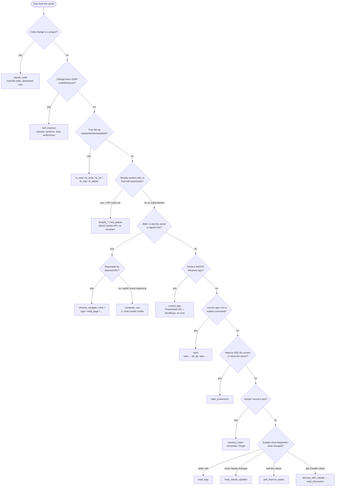

# 03 — The Complete Tools Catalog

This document is the in-depth reference for **every tool Ava can call**. Ava is the runtime assistant; Claude is the developer who builds her. The tools here are the hands Ava acts with on the owner's Windows PC — running commands, driving a browser, reading and writing files, controlling native apps, capturing the screen, spawning a Claude Code worker, conferring with Claude, remembering things, calling a couple of vendor APIs directly, and improving her own code.

Everything below was read directly from source under `server/src/tools/` and verified against the wiring in `server/src/routes/chat.ts`, the gating in `server/src/policy/`, and the process/kill machinery in `server/src/process/`. Where a tool has a known fragility (e.g. cmd.exe quoting) or a real cost (e.g. Anthropic credits), it is flagged honestly.

---

## 1. Master table

Two columns need a word of explanation:

- **API cost** — does calling this tool spend money on a metered LLM API? "none" means it runs entirely locally (a child process, a file operation, a Playwright action) and costs nothing per call. "Anthropic" / "OpenAI" means each invocation makes paid model calls. `claude_code` and the discuss/self-improve tools use the **owner's Claude *subscription*** (the `claude` CLI logged in as the user), not the metered Anthropic API — that distinction is called out in the cost column as "Claude subscription".
- **Gating** — the risk tier assigned in `server/src/policy/classify.ts`. `enforce.ts` then decides: `read-only` and `low` auto-allow; `medium` and `high` go to an approval ("ask") veto window unless a saved rule allows them; `blocked` is refused outright. See [§4](#4-the-gating-pipeline-how-a-tool-call-is-allowed-or-refused).

| Tool | Source file | What it does | API cost | Gating tier |
|---|---|---|---|---|
| `shell` | `tools/shell-tool.ts` + `tools/shell.ts` | Run any command / launch any app via `cmd.exe /c` | none | `low` (destructive → `high`; `.env`/secrets → `blocked`) |
| `control_app` | `tools/control-app-mcp.ts` | Drive native Windows apps: UI Automation + SendKeys via PowerShell | none | `low` (destructive script → `high`) |
| `fs_read` | `tools/filesystem-mcp.ts` + `tools/filesystem.ts` | Read a UTF-8 text file inside an allowlisted root | none | `read-only` |
| `fs_write` | same | Write/overwrite a UTF-8 file (creates parent dirs) | none | `low` |
| `fs_list` | same | List one directory level | none | `read-only` |
| `fs_stat` | same | Stat a path (size, mtime, isDir) | none | `read-only` |
| `fs_delete` | same | Delete one file or empty dir | none | `high` (always) |
| `chrome_navigate` | `tools/chrome-mcp.ts` + `tools/chrome.ts` | Navigate Ava's Chromium tab to a URL | none | `low` |
| `chrome_click` | same | Click an element by selector | none | `low` (submit/checkout-like selector → `high`) |
| `chrome_type` | same | Fill text into an input | none | `low` |
| `chrome_press_key` | same | Send a key to the page | none | `low` |
| `chrome_read_page` | same | Return the page's visible text | none | `read-only` |
| `chrome_screenshot` | same | Save a PNG of the active tab | none | `read-only` |
| `chrome_tabs` | same | List open tabs | none | `read-only` |
| `computer_use` | `tools/computer-use-mcp.ts` + `tools/computer-use.ts` | Vision-driven control of the browser surface (click/type/scroll from screenshots) | **Anthropic** (preferred) or **OpenAI** — *needs credits* | `medium` |
| `take_screenshot` | `tools/screenshot/screenshot-mcp.ts` + `screenshot.ts` | Capture the whole desktop to a PNG | none | `low` |
| `claude_code` | `tools/claude-code-mcp.ts` + `tools/claude-code.ts` | Spawn a Claude Code worker on a project dir for multi-file coding | **Claude subscription** (API key stripped) | `medium` |
| `discuss_with_claude` | `tools/discuss-mcp.ts` | Queue a background, read-only consult with Claude; returns immediately | **Claude subscription** (background worker) | n/a — wrapper only queues |
| `read_discussion` | same | Recount what a queued discussion came back with | none | n/a |
| `memory_read` | `tools/memory-mcp.ts` | Read durable memory files | none | `read-only` |
| `memory_remember` | same | Append/refresh/supersede a memory observation | none | `low` |
| `memory_forget` | same | Drop a memory entry (last / match / project) | none | `low` |
| `read_claude_updates` | `tools/update-log-mcp.ts` | Read Claude's dev-log notes about changes to Ava's own code | none | n/a (read) |
| `self_improve` | `tools/self-improve-mcp.ts` | Queue an autonomous change to Ava's OWN code | (queue only; worker later uses Claude subscription) | n/a (queue) |
| `self_improve_status` | same | Report state of self-improvement tasks | none | n/a (read) |
| `read_logs` | `tools/activity-log-mcp.ts` + `tools/activity-log.ts` | Read Ava's own activity/error logs | none | n/a (read) |
| `shopify_list_products` / `shopify_get_product` / `shopify_update_product` | `tools/shopify-mcp.ts` | List/read/edit Shopify products' name + description over the **Admin API** (no browser) | none (vendor API; no metered LLM call) | n/a — only registered when `SHOPIFY_*` creds set |
| `find_places` | `tools/places-mcp.ts` | Find real businesses via the **Google Places API** (structured data, website-presence filter) | none (vendor API; no metered LLM call) | n/a — only registered when `GOOGLE_PLACES_API_KEY` set |

> The Shopify/Places tools call **vendor HTTP APIs** (Shopify Admin, Google Places), not a metered LLM, so the "API cost" column reads "none" in the LLM-credit sense used here — but they do consume the owner's own Shopify/Google billing. They are **credential-gated**: each is added to the catalog only when its `.env` credentials are present (`chat.ts:392–393`), so they're absent on a fresh checkout. See [§5.13](#513-shopify_-shopify-admin-api-product-tools) and [§5.14](#514-find_places-google-places-api).

> Tools with "n/a" gating are not enumerated in `classifyRisk`, so they hit the `classify.ts` default of `medium` *only if* they were ever routed through `enforce`. In practice the read/queue tools (`read_logs`, `read_claude_updates`, `self_improve*`, `discuss*`) are benign wrappers — `read_*` only read local files/state, and `self_improve`/`discuss_*` only enqueue background work. The heavy, consequential work they trigger (the self-improve worker, the discuss worker) runs out-of-band with its own guards, not through the per-call tool gate.

### Which tools are available in which mode

Tools are assembled per request in `server/src/routes/chat.ts` (`chatRoutes`, ~L355–399). There are **two tool sets**, chosen by `mode`:

- **`action` mode** (text chat / the full agent): the entire catalog above.
- **`conversation` mode** (voice / lightweight side-model turns): a deliberately small set — `control_app`, the discuss tools, the memory tools, and `read_claude_updates`. This skips the Chromium boot wait and the heavy tool builders, but still lets Ava control native apps by voice, record/recall memory, confer with Claude, and answer "what's happening?" — all local, no per-call API cost. (`chat.ts:389–399`.) In conversation mode the orchestrator also passes `tools: []` to the side model so it cannot *call* them (`agent.ts:129`); the small set exists for the action path that voice hands off to.

---

## 2. The shared contract: `ToolDef`, `RunCtx`, and the registry

Every tool implements one tiny interface, defined in `server/src/tools/ava-mcp.ts`:

```ts
export type RunCtx = {
  runId: string;
  signal?: AbortSignal;   // the run's Stop signal, threaded into long tools
};

export type ToolDef = {
  tool: Tool;             // MCP Tool: { name, description, inputSchema }
  run: (args: Record<string, unknown>, ctx: RunCtx)
        => Promise<{ text: string; ok: boolean }>;
};
```

Three things follow from this contract, and they explain a lot of the catalog's behaviour:

1. **Every tool returns `{ text, ok }`, never throws for normal failure.** The convention across the codebase is: a tool that fails returns `{ ok: false, text: "error: …" }`. The model reads the `text` and recovers. Genuine exceptions are caught one layer up.
2. **`runId` ties a tool to its run.** Child processes a tool spawns are registered under this `runId` (see [§3](#3-child-processes-pids-and-the-stop-button)), so the Stop button can find and kill them.
3. **`signal` is the Stop button reaching into a running tool.** Only the long-running tools need it (`claude_code`, `computer_use`, and the process-spawning `shell`/`control_app`); short tools ignore it. It is optional so older call sites and tests still type-check.

### `RunCtx.signal` — what's actually threaded

`buildToolRegistry({ tools, ctx: { runId, signal: abort.signal } })` is built once per run in `agent.ts:125`, with the run's `AbortController.signal`. The MCP `CallToolRequest` handler and the registry's `dispatch` both pass that same `ctx` into every `run`. So when the red Stop button calls `abort()`, the signal fires inside any tool currently executing.

### Two registries, one shape

There are two near-identical assemblers, and it's worth knowing why:

- **`server/src/tools/ava-mcp.ts` → `buildAvaMcp`** wraps the tools as a real MCP `Server` (ListTools + CallTool handlers). This is the MCP-server form.
- **`server/src/orchestrator/tool-registry.ts` → `buildToolRegistry`** is the form the agent loop actually uses. It exposes `toolDefinitions()` (the schemas sent to the LLM), `has(name)`, and `dispatch(call)`.

`buildToolRegistry` does two defensive things worth documenting:

- **Malformed-args sentinel.** Both LLM providers emit `{ _raw: "…" }` when they can't parse a tool call's argument JSON. `dispatch` detects that sentinel (`isRawArgsSentinel`) and returns a tool **error** the model can read and retry from — *without ever invoking the tool* (`tool-registry.ts:14–18, 53–61`). This is what stops a garbled call from, say, running `shell` with an empty command.
- **Exception containment.** If a `run` throws, `dispatch` turns it into `{ output: err.message, is_error: true }` instead of crashing the turn (`tool-registry.ts:67–73`).

### Wiring: where the tool list is built

`server/src/routes/chat.ts` (`chatRoutes`) constructs the per-request `ToolDef[]` and hands it to `runAgent`, which builds the registry. The order in `action` mode (`chat.ts:366–388`):

```
buildShellTool        → shell
buildControlAppTool   → control_app
buildFilesystemTools  → fs_read, fs_write, fs_list, fs_stat, fs_delete
buildClaudeCodeTool   → claude_code
buildChromeTools      → chrome_navigate … chrome_tabs
buildComputerUseTool  → computer_use
buildScreenshotTool   → take_screenshot
buildSelfImproveTool / buildSelfImproveStatusTool (if deps present)
buildReadLogsTool     (if logsDir present)
buildShopifyTools     → shopify_* (if SHOPIFY_* creds present)
buildPlacesTools      → find_places (if GOOGLE_PLACES_API_KEY present)
…discuss tools, …memory tools, …update-log tools
```

The Shopify/Places builders are spread in conditionally — `...(agentDeps.shopify ? buildShopifyTools(agentDeps.shopify) : [])` and `...(agentDeps.googlePlacesApiKey ? buildPlacesTools({ apiKey: agentDeps.googlePlacesApiKey }) : [])` (`chat.ts:392–393`). `agentDeps.shopify` is itself only non-null when **both** `SHOPIFY_STORE` and `SHOPIFY_ADMIN_TOKEN` are set (`index.ts:287–288`), so the three Shopify tools appear as a set or not at all.

The two metered LLM clients are created once at boot in `server/src/index.ts:297–298` from config keys, and passed to `chatRoutes` as `{ anthropic, openai }`; only `computer_use` consumes them.

---

## 3. Child processes, PIDs, and the Stop button

Several tools spawn OS processes (`shell` → `cmd.exe`; `control_app` → `powershell.exe`; `claude_code` → `claude`; `take_screenshot` → a short-lived `powershell.exe`). Two pieces of machinery make those safe to interrupt:

### The PID registry — `server/src/process/pidfile.ts`

`PidfileRegistry` is a filesystem-backed map of `runId → set of PIDs`. When a tool spawns a child it calls `reg.add(runId, pid)`; on exit, `reg.remove(runId, pid)`. The registry literally writes an empty file named after the PID under `…/<runId>/<pid>` so the set survives even if the Node process restarts mid-run. `listForRun(runId)` returns the live PIDs for a run.

### Tree-kill — `server/src/process/kill-tree.ts`

`killTree(pid, signal)` wraps the `tree-kill` npm package, which on Windows shells out to `taskkill /T` to kill a process **and all its descendants**. This matters because `cmd.exe /c some.exe` or `Start-Process` create grandchildren that Node's own `child.kill()` would orphan.

### How Stop reaches running work

When the user presses Stop, `POST /api/chat/:sessionId/kill` (`chat.ts:494–516`) does three things in order:

1. **Abort the model loop** (`runs.abort` → `AbortController.abort()`), which also fires the `signal` inside any in-flight tool.
2. **Tree-kill the run's PID subtree**: `for (pid of pidfiles.listForRun(runId)) killTree(pid)` — so `claude_code`'s `claude -p` child, `shell`'s `cmd.exe` subtree, and `control_app`'s PowerShell subtree all die, not just the next model turn.
3. **Unregister the run** so a new turn can start immediately (preempt).

This is belt-and-suspenders: the spawning tools *also* listen to `signal` and kill their own child (see each tool below). Either path alone halts the work; together they make Stop reliable.

> **Why not just `spawn(..., { signal })`?** Node's built-in spawn-abort kills only the **direct** child and orphans grandchildren. `shell.ts` and `control-app-mcp.ts` both call this out in comments and deliberately use a tree-kill on abort/timeout instead.

---

## 4. The gating pipeline: how a tool call is allowed or refused

Before any action tool runs, the agent loop calls a policy hook (`agent.ts:223`, `const decision = await policy(call.name, call.args)`). That hook is built on `server/src/policy/enforce.ts` → `enforce()`, which:

1. **Classifies risk** via `classifyRisk(tool, args)` (`policy/classify.ts`).
   - Any arg containing a `.env` path or `--dangerously-skip-permissions` → **`blocked`** immediately.
   - Read-only tools (`fs_read`, `fs_list`, `fs_stat`, `chrome_read_page`, `chrome_screenshot`, `chrome_tabs`, `memory_read`) → **`read-only`**.
   - Per-tool rules assign `low` / `medium` / `high` (table column above).
2. **Checks saved rules** (`state/rules.ts` + `policy/rules.ts`): a matching `deny` rule blocks; a matching `allow` rule allows, overriding the tier.
3. **Decides**: `read-only`/`low` → **allow**; otherwise → **ask** (an approval with a veto window) — except `blocked` → **refused**.

Key consequences, verified in `classify.ts`:

- **`shell` is allow-by-default.** The owner authorized full machine access. Only a `matchDestructive` hit makes it `high` (keeping the owner's veto), and `.env` makes it `blocked`. App-launch idioms (`start`, `explorer`, `code`) are explicitly `low` so there is no approval stall.
- **`control_app` mirrors that**: benign script `low`, destructive script `high`.
- **`chrome_click` is content-aware**: a submit/checkout-like selector (`#checkout`, `place-order`, `buy-now`, `add-payment`, `button[type=submit]`) is escalated to `high`; ordinary clicks are `low`.
- **`fs_delete` is always `high`** regardless of target.
- **`claude_code` and `computer_use` are `medium`** — they go to approval unless a rule allows.

There are also two **hard, non-bypassable safety nets** below the tier system, enforced inside the tools themselves so they hold even if the policy layer is changed:

- **`.env` / secret-file hard-block** (`security/path-allowlist.ts` + `tools/shell-allowlist.ts`): any path or command touching `.env`, `.aws/`, `.ssh/`, `id_rsa`, `.pem`, `.npmrc`, `.git-credentials`, kube/docker config, etc. is refused. Both the lexical and the symlink-resolved (canonical) path are checked, so an NTFS junction can't smuggle a blocked target past the regex.
- **Secret scrubbing on output** (`security/scrub.ts`): tool output is run through `scrubSecrets` before the model sees it, redacting API keys (OpenAI/Anthropic/Stripe/Google/Slack/GitHub/AWS/Figma/Supabase), JWTs, Bearer tokens, PEM blocks, and DB connection strings. `shell`, `control_app`, `fs_read`, and `claude_code` all scrub **before** truncation so a token can't be split across the cut.

---

## 5. Per-tool reference

### 5.1 `shell` — run commands / launch apps

**Files:** `server/src/tools/shell-tool.ts` (MCP wrapper), `server/src/tools/shell.ts` (executor), `server/src/tools/shell-allowlist.ts` (gate).

**Purpose.** Ava's primary hand on the machine. Runs any `cmd.exe` command: launch apps (`start whatsapp:`, `start spotify:`, `start "" "C:\path\App.exe"`), open files/folders (`start <file>`, `explorer <dir>`), and run system commands (`dir`, `git`, `npm`, `node`, `python`, `where`, `echo`, `mkdir`, `move`, …). Chaining (`&&`) and piping (`|`) work.

**Input.** `{ command: string }` (required).

**Output.** On success: `EXIT 0\nSTDOUT:\n<stdout>\nSTDERR:\n<stderr>`. On failure: `ERROR: <reason>\nSTDOUT:…\nSTDERR:…`. Both streams are secret-scrubbed then truncated to **4096 chars** each (`MAX_STREAM_CHARS`).

**How it executes.** `runShell` (`shell.ts`) spawns `cmd.exe /c <command>` on Windows (`bash -c` elsewhere). The child PID is registered with the run via `onSpawn`/`onExit` callbacks wired to the `PidfileRegistry`. Timeout is `TOOL_BUDGET_MS.shell` = **30 s**.

**API cost.** None — local process.

**Safety gating.** Two layers: (a) `isAllowed(command)` inside `runShell` refuses `.env`/secret access and the `DESTRUCTIVE_PATTERNS` blocklist *before spawning*; (b) `classifyRisk` marks destructive commands `high` (approval veto) and everything else `low` (auto-allow). The blocklist scans the **full** command string (not just the first token), so a destructive op hidden after a `|` or `&&` is still caught. Examples blocked: `rm -rf`, `Remove-Item -Recurse`, `del C:\…\*.docx`, `format C:`, `diskpart`, `reg delete`, `shutdown`, `Restart-Computer`, `curl … | iex`, encoded PowerShell (`-enc`), `$env:*KEY/TOKEN/SECRET`, `Get-ChildItem Env:`, `gh auth token`, `git config --list`, fork bombs.

**Child-process / PID handling.** On timeout **or** abort, `treeKill()` calls `killTree(pid, "SIGTERM")` — a `taskkill /T` subtree kill — so grandchildren die too. The comment in `shell.ts:29–32` is explicit that Node's `{ signal }` spawn-abort is *not* used because it would orphan the subtree.

**Edge cases / honest notes.**
- **cmd-quoting fragility.** Because commands go through `cmd.exe /c`, anything with characters `cmd` interprets (`$`, complex quoting, embedded PowerShell) is fragile. This is the exact failure that motivated the separate `control_app` tool: routing PowerShell through `cmd /c` stripped `$`-variables and threw "Illegal characters in path". **For native-app PowerShell, use `control_app`, not `shell`.** (Documented in `control-app-mcp.ts:6–13`.)
- Empty command → refused (`{ allowed:false, reason:"empty" }`).
- A non-zero exit yields `ok:false` with `error: "exit <code>"`.

---

### 5.2 `control_app` — drive native Windows apps (UI Automation + SendKeys)

**File:** `server/src/tools/control-app-mcp.ts`.

**Purpose.** Do things *inside* a native app: focus WhatsApp's search box and type a name, click a button, send a hotkey. Uses PowerShell UI Automation (`System.Windows.Automation`) and keystrokes (`System.Windows.Forms.SendKeys`, `WScript.Shell` `AppActivate`). The rubric and description both say: **prefer this over `computer_use` for native apps** (no API cost, no vision needed).

**Input.** `{ script: string }` (required) — a PowerShell script.

**Output.** On success: scrubbed stdout (or `"done"` if empty). On failure: scrubbed stderr → stdout → error. Truncated to **6000 chars** (`MAX_OUT_CHARS`).

**How it executes — and the hard-won lesson.** This tool exists because routing PowerShell through `cmd.exe /c` failed two ways in a real session: inline `$wshell` had its `$` stripped, and a saved `.ps1` failed "Illegal characters in path" from cmd's quoting. The enforced fix (`control-app-mcp.ts:6–13, 59–69`):
1. **Write the script to a `.ps1` file** under `%USERPROFILE%\AppData\Local\Ava\scripts\` (inside the writable fsRoot; `os.tmpdir()` is deliberately avoided because it's outside fsRoots). The file is written **BOM-first** (`EF BB BF`) and prefixed with `[Console]::OutputEncoding=[System.Text.Encoding]::UTF8` so PowerShell 5.1 reads it as UTF-8 and emits UTF-8 — otherwise non-ASCII names/search terms corrupt.
2. **Spawn `powershell.exe` directly as an argv array** (`["-NoProfile","-ExecutionPolicy","Bypass","-File", file]`), never through `cmd`, never inlining a `$`-string. The file is **kept** (not deleted) for debugging a failed sequence.

Timeout is `TOOL_BUDGET_MS.control_app` = **30 s**.

**API cost.** None — local PowerShell.

**Safety gating.** The arbitrary script is run through the **same** `isAllowed()` shell gate first (`control-app-mcp.ts:150–153`), so a destructive / `.env` / exfil script is refused without running — `control_app` is not a bypass around the shell gate. `classifyRisk` then marks a destructive script `high` and anything else `low` (instant, frictionless local control).

**Child-process / PID handling.** Same tree-kill-on-abort/timeout pattern as `shell`: the PowerShell PID is registered with the run, and `killTree` reaches it (and any app/process the script launched, e.g. via `Start-Process`).

**Edge cases.** Empty script → `{ ok:false, text:"missing script" }`. Available in **both** action and conversation mode (so the owner can drive apps by voice).

---

### 5.3 `fs_read` / `fs_write` / `fs_list` / `fs_stat` / `fs_delete` — filesystem

**Files:** `server/src/tools/filesystem-mcp.ts` (MCP wrappers), `server/src/tools/filesystem.ts` (core), `server/src/security/path-allowlist.ts` (gate).

**Purpose.** File operations within allowlisted roots (the owner's project + home areas; the exact roots come from `agentDeps.fsRoots`).

**Inputs / outputs.**

| Tool | Input | Success output |
|---|---|---|
| `fs_read` | `{ path }` | file contents (scrubbed, truncated to **8192** chars) |
| `fs_write` | `{ path, content }` | `"written"` |
| `fs_list` | `{ path }` | newline list; dirs suffixed `/` |
| `fs_stat` | `{ path }` | `size=<n> mtimeMs=<n> isDir=<bool>` |
| `fs_delete` | `{ path }` | `"deleted"` |

All paths must be **absolute and inside an allowlisted root**. Failures return `error: <reason>`.

**How it executes.** `buildFilesystem` (`filesystem.ts`) wraps Node `fs/promises`. Every operation first calls `buildPathAllowlist(...)(path)`:
- `fs_write` **creates missing parent directories** (`mkdir -p` then `writeFile`), so a write to a not-yet-existing folder succeeds in one step (only ancestors *inside* the allowed root are created).
- `fs_delete` uses `fs.rm(path, { recursive:false, force:false })` — **a single file or empty directory only**; it will not recursively wipe a tree.

**API cost.** None.

**Safety gating.**
- **Allowlist** (`buildPathAllowlist`): the path is resolved + normalized; if it isn't inside a configured root, it's refused (`path not in allowlist`).
- **Hard-block, checked BEFORE the allowlist** (so it holds even inside an allowed root): `.env` patterns and the `SECRET_FILE_PATTERNS` set (cloud creds, `.ssh/`, `.aws/`, SSH private keys, `.pem`/`.pfx`/`.key`, `.npmrc`, docker/kube config, `.pgpass`, `.netrc`, keystores, gcloud token DB). Both lexical and symlink-canonical paths are checked.
- **Risk tiers**: reads/list/stat are `read-only`; `fs_write` is `low`; **`fs_delete` is always `high`** (approval veto every time).
- **Output scrub**: `fs_read` runs `scrubSecrets` over file contents before returning — a backstop if a credential file slips past the path block.

**Edge cases.** A missing file surfaces the underlying Node error message in `reason`. `fs_write` overwrites silently if the file exists (the `high`-risk gate is only on *delete*, not overwrite — though `classify`'s top-level `.env` guard still blocks writing an `.env`).

---

### 5.4 `chrome_*` — Ava's own Chromium browser

**Files:** `server/src/tools/chrome-mcp.ts` (MCP wrappers), `server/src/tools/chrome.ts` (Playwright core).

**Purpose.** Drive a **single persistent Chromium profile that is Ava's own browser — separate from the owner's everyday Chrome**. Because it's a persistent profile, cookies and logins survive between runs, so Ava can operate sites the owner has already signed into.

**The seven tools.**

| Tool | Input | Action | Output |
|---|---|---|---|
| `chrome_navigate` | `{ url }` | `page.goto(url, { waitUntil:"domcontentloaded", timeout:30s })` | `loaded: <title>` |
| `chrome_click` | `{ selector }` | `page.click(selector, 10s)` (CSS or `text=` selector) | `clicked` |
| `chrome_type` | `{ selector, text }` | `page.fill(selector, text, 10s)` | `typed` |
| `chrome_press_key` | `{ key }` | `page.keyboard.press(key)` | `pressed` |
| `chrome_read_page` | `{}` | `document.body.innerText` | text, truncated to **8192** chars |
| `chrome_screenshot` | `{}` | `page.screenshot()` to the screenshot dir | `saved: <path>` |
| `chrome_tabs` | `{}` | list pages | `[i] <title> — <url>` per line |

**How it executes — the lazy `getChrome`.** The browser does **not** boot when the tools are defined. `buildChromeTools` closes over a lazy `getChrome()` accessor; Chromium launches only when a `chrome_*` tool is actually dispatched (`chrome-mcp.ts:16–35`). So a chat turn that never browses (a greeting, a memory recall) pays no launch cost. The accessor memoizes and reuses the live context. `buildChrome` (`chrome.ts:44`) calls `chromium.launchPersistentContext(profileDir, { headless:false })` — a real visible window — and tracks liveness (`isAlive()` flips false when the user closes the window or the browser disconnects, so callers can rebuild). `ensureProfileDir` clears a stale `SingletonLock` so a crashed prior run doesn't block launch.

**API cost.** None — Playwright drives a local browser.

**Safety gating.** `chrome_read_page`/`chrome_screenshot`/`chrome_tabs` are `read-only`; navigate/type/press are `low`; **`chrome_click` is escalated to `high` when the selector looks like a submit/checkout/buy/add-payment control** (so Ava can't silently complete a purchase). No scrubbing is applied to page text/tab output (it's web content, not secrets), but the screenshot path is just a filename.

**Edge cases.** Selector timeouts (10 s) and navigation timeouts (30 s) come back as `error: <message>`. `chrome.ts` also exposes lower-level `mouse*`/`keyboard*`/`screenshotBytes`/`viewport` methods — those are **not** exposed as their own tools; they're the surface `computer_use` drives (next section).

---

### 5.5 `computer_use` — vision-driven GUI control ⚠️ needs model credits

**Files:** `server/src/tools/computer-use-mcp.ts` (wrapper, provider selection), `server/src/tools/computer-use.ts` (both provider loops, 416 lines).

**Purpose.** The fallback for anything the other tools can't reach by selector: a visual agent that looks at a screenshot of the browser surface and decides where to click, what to type, how to scroll — pixel-by-pixel reasoning over the page. The rubric frames it as the last resort *"for anything the other tools cannot reach."*

**Input.** `{ task: string }` (required) — a natural-language goal.

**Output.** On success: `<summary>\n\n[<n> screenshot(s) saved]`. On failure: `error: <reason>`.

**How it executes.** `buildComputerUseTool` picks a provider at call time (`computer-use-mcp.ts:48–82`):
- **Anthropic, if configured** (preferred — the more battle-tested loop). `runComputerUse` runs an agentic loop (≤ **100 iterations**, `computer-use.ts:62`; raised from 25 so one invocation can finish a real sub-task) against `claude-sonnet-4-5` with the `computer_20250124` tool / `computer-use-2025-01-24` beta. Each turn: send the current screenshot, receive a `tool_use` action (`left_click`/`type`/`key`/`scroll`/`screenshot`), execute it against the Chrome surface (`mouseClick`/`keyboardType`/`keyboardPress`/`mouseWheel`), take a fresh screenshot, loop. Ends on `end_turn` with a text summary.
- **OpenAI, else.** `runComputerUseOpenAI` uses the Responses API with the `computer_use_preview` tool / `computer-use-preview` model, chaining turns via `previous_response_id`. It auto-acknowledges `pending_safety_checks` (the user is operating their own machine; outer policy gates approvals).
- **Neither configured →** returns `computer_use unavailable: no Anthropic or OpenAI API key configured.`

**API cost — flag it honestly.** **This tool costs money on every call.** It makes repeated vision-model calls (one per loop iteration, up to 100), each sending a full PNG screenshot. With the **preferred Anthropic path it needs Anthropic credits**; if those are exhausted you'll get credit/auth errors from the model, not from Ava. The OpenAI path needs OpenAI credits instead. There is no local/free mode. Tool budget is `TOOL_BUDGET_MS.computer_use` = **60 s**, classified `medium` (approval veto).

**Abort handling.** The run's `signal` is checked **before every model turn** in both loops, so Stop halts the GUI loop promptly instead of grinding through all 100 iterations. The signal is also passed into the SDK call (`{ signal }`) so an in-flight HTTP request is cancelled.

**Edge cases.** It drives the **Chrome surface** (`environment: "browser"`), not the whole OS desktop — the tool description says "the active Chrome browser tab". Missing/invalid action params (e.g. a click with no coordinate) end the loop with a precise `reason`. "max iterations reached" is returned if it can't finish in 100 turns.

---

### 5.6 `take_screenshot` — capture the desktop

**Files:** `server/src/tools/screenshot/screenshot-mcp.ts` (wrapper), `server/src/tools/screenshot/screenshot.ts` (capture).

**Purpose.** Capture the current Windows desktop to a PNG so Ava can see what's on screen, show the owner, or confirm the result of something she just did.

**Input.** `{ path?: string }` — optional; if given, it **must resolve inside** `%USERPROFILE%\Downloads\Ava\screenshots\` and end in `.png`, else it's rejected before any capture runs. Omit it to auto-name `screenshot-<timestamp>.png`.

**Output.** `Saved screenshot to <path> (<bytes> bytes, image/png).` or `error (<code>): <message>` where code ∈ `disallowed_path | capture_failed | write_failed`.

**How it executes.** `captureWindowsDesktop` (the default backend) spawns `powershell.exe` running a `System.Windows.Forms` + `System.Drawing` script that copies the full virtual screen (`CopyFromScreen`) into a bitmap and saves it as PNG — no native dependency. After capture, the file is verified to start with the PNG magic bytes; if not, `capture_failed`.

**API cost.** None — local PowerShell + GDI.

**Safety gating.** `low` (it writes only inside the fixed screenshots dir; the tool rejects any other output path). It is *not* read-only because it captures the screen contents.

**Edge cases.** Always resolves, never throws — backend/write failures become structured `{ ok:false }` so the turn isn't crashed. The capture backend is injectable (`capture`/`baseDir`) for tests.

---

### 5.7 `claude_code` — spawn a Claude Code worker

**Files:** `server/src/tools/claude-code-mcp.ts` (wrapper), `server/src/tools/claude-code.ts` (spawner, 167 lines).

**Purpose.** Run the owner's Claude Code (the `claude` CLI) as a **worker** on a project directory for actual multi-file code edits — *not* free-form chat. This is how Ava delegates real coding.

**Input.** `{ prompt: string, cwd: string, model?: string }` (`prompt`, `cwd` required). `cwd` must be an absolute, allowlisted project path.

**Output.** On success: `EXIT <code>\n<worker stdout+stderr>`. On failure: `error: <reason>`. Combined output is capped at **16384 chars** (`MAX_OUTPUT`) and secret-scrubbed.

**How it executes.** `buildClaudeCode(...).run` spawns the `claude` binary with `defaultClaudeArgs`: `["-p", prompt, "--permission-mode", "acceptEdits"]` (+ `--model` if given, + session flags). `-p` is non-interactive print mode; `--permission-mode acceptEdits` auto-approves **file edits only** (Edit/Write) so the worker can actually change code instead of silently no-opping. `stdin` is `"ignore"` (otherwise `claude -p` waits ~3 s for stdin that never comes).

**The `workerEnv` API-key strip — important.** The worker must authenticate as the owner's **logged-in `claude` subscription**, exactly like an interactive user. Claude Code prefers an API key found in its environment over the subscription login, which would silently bill a separate pay-as-you-go account (and fail "credit balance too low" when empty). So `workerEnv()` **deletes `ANTHROPIC_API_KEY` and `ANTHROPIC_AUTH_TOKEN`** from the child's env, forcing the subscription login (`claude-code.ts:59–64`).

**Session resume.** `sessionArgs` pins a conversation UUID with `--session-id` on first use, then `--resume`s it on later calls, so Ava and the worker keep one ongoing chat across calls (verified: a codeword seeded in one call is recalled in the next).

**API cost.** **Claude *subscription*** (the owner's Max/Pro `claude` login) — not the metered Anthropic API. This is the cheap path per the project's token economics (subscription = abundant; metered OpenAI = scarce).

**Timeout / abort / kill.** Three independent safety mechanisms:
- **Hard timeout.** `claudeCodeTimeoutMs()` arms the worker's own SIGTERM→(1 s)→SIGKILL ladder *slightly under* the orchestrator's `TOOL_BUDGET_MS.claude_code` = **600 s** budget (margin 5 s). This is because the orchestrator's `withTimeout` can only reject the promise — it can't kill the spawned child — so without this the child would zombie (`claude-code-mcp.ts:6–15`).
- **Abort.** When Stop fires, the `signal` listener kills the child (same SIGTERM→SIGKILL ladder) and resolves `aborted`.
- **PID registry + tree-kill.** The child PID is added to the run's `PidfileRegistry`, so the kill endpoint's `killTree` reaps the whole subtree (belt-and-suspenders with the in-tool abort).

**Safety gating.** `classifyRisk` → `medium` (approval veto unless a rule allows). The cwd is checked against the path allowlist *before* spawning (`cfg.check(cwd)`). **Hard rule:** if the prompt contains `--dangerously-skip-permissions`, the run is refused outright (`DANGEROUS_FLAG` test, `claude-code.ts:82–84`) — and the system prompt forbids passing it.

**Production wiring note.** `index.ts` builds *additional* `claude_code` instances for internal use with **different** allowlists: `selfClaudeCode` (self-improvement) restricts cwd to the OS temp dir (a throwaway git worktree, not the normal fsRoots) so self-edits happen in isolation (`index.ts:144–147`); there's also a `consultClaude` for the discuss path. The user-facing `claude_code` tool uses the normal fsRoots allowlist (`chat.ts:362–365`).

---

### 5.8 `discuss_with_claude` / `read_discussion` — confer with Claude in the background

**File:** `server/src/tools/discuss-mcp.ts`.

**Purpose.** Let Ava confer with Claude (her developer) about a topic **without freezing the chat**. `discuss_with_claude` queues a background, **read-only** consult and returns immediately, so Ava keeps talking to the owner and reports back when it's done. It's analysis only — Claude does not change files on this path.

**Inputs / outputs.**
- `discuss_with_claude` `{ topic }` → queues via `deps.queue(topic, sessionId)`, returns a friendly "Started conferring…" string immediately.
- `read_discussion` `{ id? }` → with an id, the full result/status of one discussion; with no id, a list of recent discussions (with status) plus the latest finished result.

**How it executes.** The wrapper only enqueues and reads `Discussion` state (`state/discussions.js`). The actual background worker (a read-only `claude` consult, wired in `index.ts` as `consultClaude`) runs out-of-band and writes its result back into the discussion record; `read_discussion` surfaces it.

**API cost.** The background consult uses the **Claude subscription** (like `claude_code`, run read-only). The wrapper tools themselves cost nothing.

**Gating.** Not in `classifyRisk` — the wrappers just queue/read local state, so there's no per-call veto. Available in **both** modes (the owner can ask by voice).

**Edge cases.** Empty topic → `missing topic`. A discussion that hasn't finished reports "Still in progress". This pair is bound to the current session id so results are attributable to the right conversation.

---

### 5.9 `memory_read` / `memory_remember` / `memory_forget` — durable memory

**File:** `server/src/tools/memory-mcp.ts` (191 lines). Backed by `server/src/memory/` (paths, store, observations, remember, forget).

**Purpose.** Durable, cross-session memory so Ava recalls the owner's preferences, context, and project facts without reciting from the system prompt.

**`memory_read`** `{ file: "all"|"preferences"|"observations"|"project", project? }` → returns the requested memory file(s) verbatim. `file=project` requires a `project` slug. `all` concatenates the index + preferences + observations.

**`memory_remember`** `{ file?, text?, category?, confidence?, refresh?, supersedes?, project?, today? }` — the write path, with three modes:
- **Append** (default, `file=observations`): writes an observation line via `rememberObservation`, with `category` (preferences|context|skills|setup|schedule|people) and `confidence` (low|medium|high; validated — invalid → error).
- **`refresh=<substring>`**: bumps an existing observation's confidence/date instead of duplicating (observations only; mutually exclusive with `supersedes`).
- **`supersedes=<substring>`**: marks a contradicted observation superseded, then appends the new one.
- Also supports `file=preferences` and `file=project` (per-project notes, by slug).

**`memory_forget`** `{ mode: "last"|"match"|"project", target? }`:
- `last` — drop the most recent observation (after "forget that").
- `match` — drop the one matching `target`; returns **ambiguous + candidates** if more than one matches (so it never guesses).
- `project` — drop everything for a project slug (removes the file).

**API cost.** None — all local file I/O under the memory dir.

**Gating.** `memory_read` is `read-only`; `memory_remember`/`memory_forget` are `low` (the mutation stays inside the local memory dir). All three are available in **both** modes.

**Edge cases.** Missing required fields return precise errors (`missing project slug`, `missing text`, `refresh: no matching observation`, etc.). The exact observation line format the model must use is dictated by the system prompt's "Memory" section, not enforced here — this tool trusts the caller's `text`.

---

### 5.10 `read_claude_updates` — read Claude's dev-log notes

**File:** `server/src/tools/update-log-mcp.ts`. Backed by `server/src/self/dev-log.ts`.

**Purpose.** Read the notes **Claude (the developer) leaves about changes to Ava's own code**, so Ava can honestly tell the owner what's happening / what changed / whether an update is running — attributing Claude's work to Claude, never claiming it as her own. (This is the read side of the `claude-note.ts` log the owner's memory references.)

**Input.** `{ limit?: number }` (default 10).

**Output.** If a change is in progress, an `IN PROGRESS — Claude is currently: <title>` banner, then `Recent updates:` with one formatted line per entry (`[phase] title — detail (commits: …)`).

**How it executes.** Reads `currentInProgress(dataDir)` and `readDevLog(dataDir, limit)` from the JSONL dev-log. Pure read.

**API cost.** None. **Gating.** Read-only wrapper (not in `classifyRisk`). Available in **both** modes — the owner asks "what's happening?" by voice.

---

### 5.11 `self_improve` / `self_improve_status` — Ava changing her own code

**File:** `server/src/tools/self-improve-mcp.ts`.

**Purpose.** `self_improve` queues an autonomous change to **Ava's own codebase**; `self_improve_status` reports where each such task is.

**`self_improve`** `{ goal }` → `deps.queue(goal)` returns an intent id; tool replies `queued self-improvement <id>: <goal>`. The heavy lifting happens out-of-band: the queued intent is reflected on, implemented by a **Claude Code worker in a git worktree**, verified (tests + build + boot-smoke), and hot-swapped — auto-reverted if it fails verification or breaks at boot. (Wiring in `index.ts`; `selfClaudeCode` restricts the worker's cwd to the temp-dir worktree.)

**`self_improve_status`** `{ id? }` → list of tasks (id, status, goal) or, with an id, full detail (what it changed, commit sha, failure reason). States: `queued → reflecting → implementing → verifying → swapped (=shipped/live) → failed | rolled_back`. Concurrent requests queue and run one at a time.

**API cost.** The wrappers only queue/read (no cost). The downstream worker uses the **Claude subscription**; the reflect step uses the configured provider (OpenAI in production per the token-economics memory). Honest caveat: triggering `self_improve` *does* eventually spend model calls in the background pipeline, even though the tool call itself returns instantly and free.

**Gating.** Not in `classifyRisk` (queue/read wrappers). The real safety is the verify-and-auto-revert harness around the worker, not a per-call veto.

**Edge cases.** Empty goal → `missing goal`. `self_improve` is only wired when `agentDeps.queueSelfImprove` is present; `self_improve_status` only when `listSelfImprovements` is present (`chat.ts:382–383`).

---

### 5.12 `read_logs` — Ava reads her own activity log

**Files:** `server/src/tools/activity-log-mcp.ts` (wrapper), `server/src/tools/activity-log.ts` (parser/reader).

**Purpose.** Read Ava's own recent activity and error logs to recount what she did, which tools ran, and what failed — for "what did you do / what happened / how did that go / what went wrong", diagnosing failures instead of guessing.

**Input.** `{ level?: "all"|"errors", contains?: string, limit?: number }`. `errors` = warnings+errors only (pino level ≥ 40); `contains` is a case-insensitive keyword filter; `limit` defaults 30, clamped 1–100.

**Output.** Formatted lines `HH:MM:SS <level>: <msg>`, or `No matching activity in the logs.`

**How it executes.** The server logs pino JSON lines to daily-rotated `server.<date>.<n>.log` files (already secret-scrubbed on write). `readRecentLogs` finds the **newest** file, scans only its **last 4000 lines** (bounded work), parses each line, filters by level/keyword, and returns the last `limit`.

**API cost.** None. **Gating.** Read-only wrapper. Only wired when `agentDeps.logsDir` is set (`chat.ts:384`).

**Edge cases.** No log files yet → `No activity logs found yet.` Unparseable lines are skipped. Note this reads the **server's** structured log, which is distinct from the per-tool `tool_call`/`tool_result` events the agent emits over SSE.

---

### 5.13 `shopify_*` — Shopify Admin API product tools

**File:** `server/src/tools/shopify-mcp.ts` (154 lines).

**Purpose.** Edit a Shopify product's **name (`title`) and description (`body_html`) directly over the Admin REST API**, instead of clicking through the admin UI in a browser (which was slow and kept failing mid-task on the turn cap). Replaces fragile UI automation for one of the two task types the agent repeatedly couldn't finish. Full feature write-up: [`features/reliable-task-execution.md`](../features/reliable-task-execution.md).

**The three tools.**

| Tool | Input | Action | Output |
|---|---|---|---|
| `shopify_list_products` | `{ limit?, query? }` | `GET products.json?fields=id,title,handle` (limit default 100, cap 250); optional in-memory case-insensitive title `contains` filter | `id — title` per line |
| `shopify_get_product` | `{ id }` | `GET products/<id>.json?fields=id,title,body_html,images` | id, name, image **count**, and the full `body_html` with a note to keep any `` tags intact |
| `shopify_update_product` | `{ id, title?, body_html? }` | **one** `PUT products/<id>.json` with a body of only the fields you pass | `Updated product <id>: "<title>". Images untouched.` |

**The "don't touch the pictures" rule — two enforced layers.**
1. **Structural:** the PUT body is `{ product: { id, title?, body_html? } }` — built from only the changed fields (`shopify-mcp.ts:132–134`). The product's `images` array is **never** included in any request, so a name/description edit **cannot** alter the image gallery. This is a hard guarantee, independent of model behavior.
2. **Instructional:** for pictures embedded *inside* the description HTML, `shopify_update_product`'s description tells the model in capitals to keep the exact `` tags when rewriting `body_html` (`shopify-mcp.ts:115–117`), and `shopify_get_product` exists so the model first sees precisely what to preserve. This layer depends on the model following the instruction.

**How it executes.** `buildShopifyTools(deps)` closes over `{ store, token }`. Every call goes through `api()` (`shopify-mcp.ts:25`), which targets `https://<store>/admin/api/2024-10/<path>` with the `X-Shopify-Access-Token` header and a **20 s** `AbortSignal.timeout`. `fetchImpl` is injectable for tests.

**API cost.** No metered LLM call. It spends the owner's **Shopify** account (Admin API quota); requires the token's app to hold the `read_products` + `write_products` scopes.

**Gating.** Not in `classifyRisk` — these are credential-gated HTTP wrappers, registered only when `agentDeps.shopify` is set (i.e. both `SHOPIFY_STORE` + `SHOPIFY_ADMIN_TOKEN` present). There is no per-call approval veto on them today.

**Edge cases.** Missing `id` → `missing id`. `shopify_update_product` with neither `title` nor `body_html` → `nothing to update …` (the body would be just `{ id }`). A non-2xx response surfaces the status + first 300 chars of the body (e.g. a `403` from a token missing `write_products`). `shopify_list_products`' `query` filters only the fetched page in memory, so a product past the scanned limit won't be found by it.

---

### 5.14 `find_places` — Google Places API

**File:** `server/src/tools/places-mcp.ts` (101 lines).

**Purpose.** Find real businesses with **structured data** (name, address, phone, website, Maps link, rating) via the **Google Places API (New) Text Search**, instead of scraping Google Maps (blocked and fragile). Its signature feature is filtering by **website presence** — making "businesses *without* a website" a precise query — which is the other task type the agent kept failing. Full feature write-up: [`features/reliable-task-execution.md`](../features/reliable-task-execution.md).

**Input.** `{ query, maxResults?, websiteFilter? }` (`query` required). `maxResults` default 20, cap 60. `websiteFilter` ∈ `any` (default) | `without` | `with`.

**Output.** A numbered list — `name — address · phone`, then a `website:` line (`NO WEBSITE` when absent) and a `maps:` link — or `No places found …`.

**How it executes.** `POST https://places.googleapis.com/v1/places:searchText` with `X-Goog-Api-Key` and an `X-Goog-FieldMask` selecting exactly the fields above (`places-mcp.ts:8–12,61`). It **pages** (passing `nextPageToken`) until it has `≥ want × 2` raw results or Google stops returning a token, **capped at 4 pages** so it never loops (`places-mcp.ts:58`). Then it applies the `websiteFilter` (`without` → keep only places with no `websiteUri`; `with` → only those that have one) and slices to `maxResults` (`places-mcp.ts:82–85`). Each request has a **20 s** timeout; `fetchImpl` is injectable for tests.

**API cost.** No metered LLM call. It spends the owner's **Google Cloud** billing — the Places API (New) is a billed service and must be enabled with billing on the project.

**Gating.** Not in `classifyRisk` — a credential-gated HTTP wrapper, registered only when `GOOGLE_PLACES_API_KEY` is set. No per-call approval veto today.

**Edge cases.** Missing `query` → `missing query`. A non-2xx response returns `Places search failed: <status> <body…>` (e.g. when billing isn't enabled, or the key lacks Places API access). Because the website filter can drop many results, the over-fetch (`want × 2`, up to 4 pages) is what keeps a `without` query from coming back short.

---

## 6. Decision workflow: given a task, which tool does Ava pick?

This is the practical rubric, reconciled from `server/src/orchestrator/tool-rubric.ts` (the layer-5 system-prompt text the model actually reads) and the per-tool gating. Ava is biased toward **acting immediately** and **composing tools** — "if a direct tool is missing I reach the goal another way."



**Key tie-breakers, verified against code and rubric:**

- **Direct API vs. browser (for the two covered jobs):** for a **Shopify product name/description edit** prefer `shopify_*` (one Admin API call), and for **finding real businesses** prefer `find_places` (Google Places API) — both are reliable, fast, and don't burn agent turns, and their descriptions tell the model to use them over browsing/scraping. They only exist when their `.env` credentials are set; absent that, fall back to the browser tools.
- **Native app vs. vision:** prefer **`control_app`** (local PowerShell, free) over **`computer_use`** (vision, costs credits). The rubric and the `control_app` description both say so explicitly. `computer_use` is the *last* resort "for anything the other tools cannot reach."
- **Web by selector vs. by vision:** prefer **`chrome_*`** (free, deterministic) and fall to **`computer_use`** only when the page needs visual reasoning. Note `computer_use` drives the **browser surface**, so it composes with the chrome session.
- **`shell` vs. `control_app` for PowerShell:** if the PowerShell uses `$`-variables or complex quoting, **use `control_app`** — `shell` routes through `cmd.exe /c` and mangles those (the documented "Illegal characters in path" / `$`-strip failure).
- **Edits vs. chat for `claude_code`:** `claude_code` is for *actual edits* (`--permission-mode acceptEdits`), not free-form Q&A. For Claude's *opinion* without touching files, use **`discuss_with_claude`** (read-only, background).
- **API over browser for the two covered jobs:** when their credentials are set, **`shopify_update_product`** (one Admin API `PUT`) beats clicking through the Shopify admin, and **`find_places`** (Google Places API) beats scraping Google Maps — both tool descriptions tell the model so explicitly ("do NOT scrape Google Maps", "directly, no clicking"). When the creds are absent the tools aren't offered and the browser path is used as before.
- **Cost-awareness:** every path except `computer_use` (and the background pipelines behind `self_improve`/`discuss`) is **free of metered-LLM cost per call**. The Shopify/Places tools make no LLM call, but do spend the owner's own Shopify/Google billing. `computer_use` is the one tool to think twice about on **LLM** cost — it needs **Anthropic credits** (preferred) or OpenAI credits, and burns one vision call per loop iteration (up to 100).

---

## 7. Cross-cutting guarantees (one-screen summary)

- **Uniform result shape.** Every tool returns `{ text, ok }`; failures are data, not exceptions (`ava-mcp.ts`).
- **Output truncation caps:** shell 4096/stream, control_app 6000, fs_read & chrome_read_page 8192, claude_code 16384. Scrub always runs *before* truncation.
- **Secret defense in depth:** `.env`/secret-file hard-block on every path and command; `scrubSecrets` over every tool's output before the model sees it.
- **Stop is real:** `signal` reaches into running tools, and `killTree` reaps the spawned subtree via the `PidfileRegistry` — `claude_code`, `shell`, and `control_app` children all die on Stop, not just the next model turn.
- **Approval veto** for `medium`/`high` tiers (`claude_code`, `computer_use`, `fs_delete`, destructive shell/control_app, submit-like chrome clicks) unless a saved rule allows; `low`/`read-only` auto-allow for frictionless ordinary work.

---

### Source index (for the next reader)

| Concern | File(s) |
|---|---|
| Tool contract / MCP server | `server/src/tools/ava-mcp.ts` |
| Agent-side registry + dispatch | `server/src/orchestrator/tool-registry.ts` |
| Per-request tool assembly (the wiring) | `server/src/routes/chat.ts` (`chatRoutes`, ~L341–399) |
| Shopify / Places API tools | `server/src/tools/shopify-mcp.ts`, `server/src/tools/places-mcp.ts` |
| Their credentials / deps wiring | `server/src/config.ts` (`SHOPIFY_STORE`/`SHOPIFY_ADMIN_TOKEN`/`GOOGLE_PLACES_API_KEY`), `server/src/index.ts:287–289` (`agentDeps.shopify` / `agentDeps.googlePlacesApiKey`) |
| Rubric (system-prompt layer 5) | `server/src/orchestrator/tool-rubric.ts` |
| Risk tiers / approval gating | `server/src/policy/classify.ts`, `server/src/policy/enforce.ts` |
| Shell gate (allow-by-default + blocklist) | `server/src/tools/shell-allowlist.ts` |
| Path allowlist + secret-file hard-block | `server/src/security/path-allowlist.ts` |
| Secret scrubbing | `server/src/security/scrub.ts` |
| Timeout budgets | `server/src/orchestrator/timeout.ts` (`TOOL_BUDGET_MS`) |
| PID registry / tree-kill / Stop endpoint | `server/src/process/pidfile.ts`, `server/src/process/kill-tree.ts`, `server/src/routes/chat.ts` (`/:sessionId/kill`) |
| Metered LLM clients (for computer_use) | `server/src/index.ts:297–305` |
