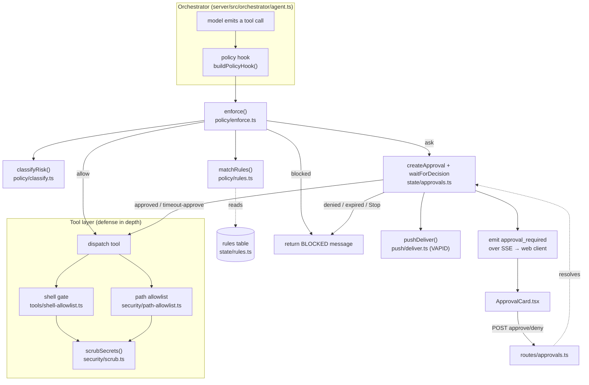
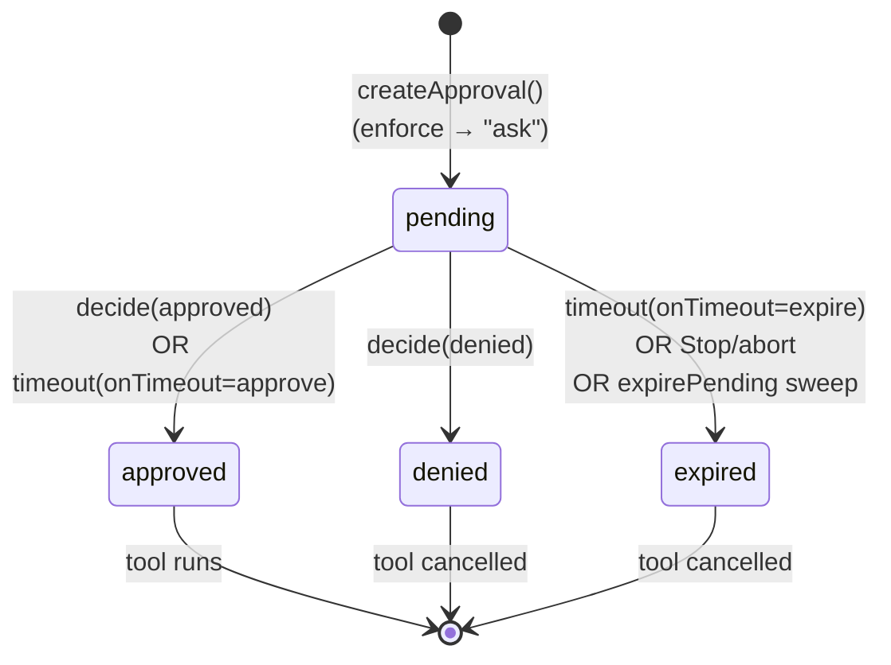
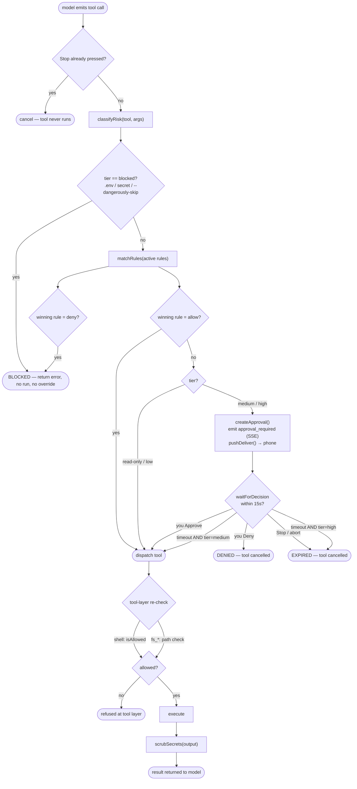

# 04 — Safety, Policy, Approvals & the Security Model

This document explains how Ava decides whether a tool call is allowed to run, when it stops to ask you for approval, and the hard limits that no rule or timeout can override. It is the authoritative reference for the safety layer.

**Audience:** you (the owner) and anyone maintaining Ava. It assumes you know the difference between Ava (the runtime that acts on your PC) and Claude (the assistant that builds Ava), but it does not assume deep security expertise. Terms are defined the first time they appear.

**Scope:** the policy engine (`server/src/policy/`), the security primitives (`server/src/security/`), the shell gate (`server/src/tools/shell-allowlist.ts`), the approval record lifecycle (`server/src/state/approvals.ts`, `server/src/routes/approvals.ts`), the approval UI (`web/src/approvals/ApprovalCard.tsx`), and web-push notifications (`server/src/push/`, `web/src/push/`, `web/src/sw.ts`).

---

## 1. The guiding principle: broad access, narrow refusals

Ava runs on **your own Windows PC**, and you have explicitly authorized it to do anything you could do yourself — launch any app, open any file, run any system command, "in seconds." The safety model is therefore deliberately **allow-by-default**, not deny-by-default. It is not a sandbox that asks permission for everything; it is a thin set of guardrails around an otherwise-trusted operator.

The system refuses or pauses in only three situations:

1. **Hard blocks (non-negotiable).** A small set of operations are refused outright and can never be approved, ruled around, or auto-approved: reading `.env` files, reading credential/secret files (SSH keys, cloud creds, tokens), and a handful of catastrophic shell idioms. These exist so that even with full machine access, Ava cannot exfiltrate your secrets or be tricked into a system-wipe.

2. **Destructive actions (your veto).** Genuinely destructive operations — deleting files, formatting a disk, wiping the registry, shutting down, clicking a checkout/submit button — are allowed, but only after surfacing an **approval** to you with a veto window. If you do not actively decline, the destructive action is **cancelled**, not run (auto-deny on timeout).

3. **Ambiguous/unknown tools (soft ask).** A tool the classifier does not recognize, or a medium-risk action like modifying code, surfaces an approval too — but here, *not declining* means *proceed* (auto-approve on timeout), because the cost of a false pause is friction, not damage.

> **Design tension to keep in mind.** Every "fix" to this layer must preserve broad access. The blocklists are curated to *not* catch innocent look-alikes (`keymap.ts`, `npm run format`, `Format-Table`, `-eq` comparisons). Several patterns carry scars from past false positives — see §6.4. When tightening a rule, the bar is: *does this newly block a thing the owner legitimately does?* If yes, it's wrong.

---

## 2. The components at a glance



| Layer | File | Responsibility |
|---|---|---|
| **Classify** | `server/src/policy/classify.ts` | Assigns a tool call a risk **tier**: `read-only` / `low` / `medium` / `high` / `blocked`. |
| **Rules** | `server/src/policy/rules.ts`, `rule-parser.ts`, `server/src/state/rules.ts` | Your natural-language "always allow X" / "always deny Y" overrides, parsed to JSON and scored/applied. |
| **Enforce** | `server/src/policy/enforce.ts` | Combines tier + rules into a single decision: `allow` / `blocked` / `ask`. |
| **Runtime** | `server/src/policy/runtime.ts` | Wraps `enforce` in the agent loop; creates approvals, runs the **veto window**, fires push. |
| **Approval state** | `server/src/state/approvals.ts` | The approval record (DB row) lifecycle + `waitForDecision`. |
| **Approval API** | `server/src/routes/approvals.ts` | HTTP endpoints to list pending / approve / deny. |
| **Approval UI** | `web/src/approvals/ApprovalCard.tsx` | The card you tap, with the live countdown. |
| **Push** | `server/src/push/deliver.ts`, `server/src/routes/push.ts`, `web/src/push/register.ts`, `web/src/sw.ts` | Web-push (VAPID) so approvals/done reach your phone even with the app closed. |
| **Shell gate** | `server/src/tools/shell-allowlist.ts` | Allow-by-default shell filter + destructive blocklist + secret-file block. |
| **Path allowlist** | `server/src/security/path-allowlist.ts` | Which filesystem paths the `fs_*` tools may touch + secret-file/junction closure. |
| **Scrub** | `server/src/security/scrub.ts` | Redacts secrets out of tool output before the model (or you) ever see it. |

There are **two independent enforcement points**, and this is intentional (defense in depth):

- The **policy layer** (classify → rules → enforce → veto) gates *whether a tool runs at all*.
- The **tool layer** (shell gate, path allowlist, scrub) re-checks at the moment of execution, so even if a tool were dispatched without going through policy, the dangerous bits are still refused and secrets are still redacted.

---

## 3. Step 1 — Classification (`policy/classify.ts`)

`classifyRisk(tool, args)` returns `{ tier, reason }`. It is pure (no DB, no I/O) and is the single place that maps a tool call to a risk tier.

### 3.1 The five tiers

| Tier | Meaning | What `enforce` does with it |
|---|---|---|
| `read-only` | Cannot change anything (reads, screenshots, listing). | Auto-allow. |
| `low` | A write/action that is safe on your own machine. | Auto-allow. |
| `medium` | Ambiguous or code-modifying; worth a glance. | **Ask**, auto-**approve** on timeout. |
| `high` | Genuinely destructive; you must keep a veto. | **Ask**, auto-**deny** on timeout. |
| `blocked` | Never allowed under any circumstances. | Refuse immediately. |

### 3.2 How `classifyRisk` decides (in order)

The function flattens **all** string values out of the args object (recursively, via `stringValues`) so a dangerous string can't hide in a nested field. Then:

1. **Hard-block scan first.** Every extracted string is tested against `ENV_RE` (matches a `.env` / `.env.production` / `.env`-in-path) and against `HARD_BLOCKED_FLAGS` (currently `--dangerously-skip-permissions`). A hit → `blocked` immediately. This runs *before* anything else, for every tool. (`classify.ts:37-42`)
2. **Read-only allowlist.** If the tool is in `READ_ONLY_TOOLS` (`fs_read`, `fs_list`, `fs_stat`, `chrome_read_page`, `chrome_screenshot`, `chrome_tabs`, `memory_read`) → `read-only`. (`classify.ts:44`)
3. **Per-tool rules** for the action tools (`classify.ts:46-102`):
   - `fs_delete` → **always `high`** ("delete is always high-risk").
   - `fs_write` → `low` (write within the allowlist).
   - `chrome_navigate` / `chrome_type` / `chrome_press_key` → `low`.
   - `chrome_click` → `low`, **unless** the selector looks like a submit/checkout/buy/place-order/add-payment control (`SUBMIT_LIKE` regex) → `high`. This is what stops Ava from silently completing a purchase.
   - `claude_code` → `medium` (it modifies code).
   - `shell` → see §3.3.
   - `computer_use` → `medium` (GUI scripting — clicks/keystrokes on the live desktop).
   - `control_app` → `low`, **unless** its PowerShell `script` arg matches a destructive pattern → `high` (reuses the shell destructive matcher).
   - `take_screenshot` → `low` (the tool itself only writes into `Downloads/Ava/screenshots`).
   - `memory_remember` / `memory_forget` → `low` (mutations stay inside the local memory dir).
4. **Unknown tool → `medium`** (`classify.ts:104`). A tool the classifier has never heard of defaults to *ask*, not allow — fail-safe for anything new.

### 3.3 The shell special-case (`classify.ts:62-78`)

Shell is the highest-leverage tool, so its classification mirrors the shell gate exactly so the two can't disagree:

1. It calls `shellAllowed(cmd)` (the same `isAllowed` the gate uses). If that refuses *specifically because of `.env`*, the classifier returns `blocked` — so an *undecided* approval can never be auto-approved into a secret read. This is defense in depth: the top-level `ENV_RE` only catches path-shaped `.env`, but this also catches a bare `cat .env`.
2. If `matchDestructive(cmd)` hits → `high` (keeps your veto for `rm -rf`, `format C:`, `reg delete`, `shutdown`, …). The reason string includes the matched pattern source.
3. If the command is an app-launch / open idiom (`LAUNCH_SHELL` = `start` / `explorer` / `code`) → `low`, no friction.
4. **Everything else → `low`** (shell on the owner's authorized machine). This is the broad-access principle in code: an ordinary `git push`, `npm install`, `dir`, arbitrary pipeline — all auto-allow.

> **Note on the "Sir" strings in code.** The source comments and a few user-facing strings say "Sir." That is the runtime persona's name for the owner; in this documentation we always write "you" / "the owner." The behavior is identical.

---

## 4. Step 2 — User-defined rules (`policy/rules.ts` + `rule-parser.ts` + `state/rules.ts`)

Rules are *your* standing overrides: "always allow shell in `C:/ai/**`," "never delete anything under `Documents`." They let you widen *or* narrow the defaults without code changes.

### 4.1 Authoring & parsing (`rule-parser.ts`, `routes/rules.ts`)

- You submit a rule in **plain English** to `POST /rules` with `{ source }`. The row is created with `status: "pending"` (`routes/rules.ts:27`).
- An LLM (`parseRule`, `rule-parser.ts`) converts the sentence into strict JSON against a fixed schema:
  ```json
  { "match": { "tool"?: string, "args.cwd"?: string[], "args.path"?: string[], "args.command"?: string[] }, "action": "allow" | "ask" | "deny" }
  ```
  `args.*` fields are arrays of **glob patterns** (picomatch syntax; `**` crosses path separators). (`rule-parser.ts:7-12`)
- If parsing succeeds → the row is updated with the JSON and `status: "active"`. If it fails (bad JSON or schema mismatch) → `status: "failed"` and the rule never participates in matching. (`routes/rules.ts:30-38`)
- `PATCH /rules/:id` toggles `enabled`; `DELETE /rules/:id` removes it. (`routes/rules.ts:43-70`)

Only rules that are **both** `enabled === 1` **and** `status === "active"` are consulted (`enforce.ts:23`).

### 4.2 Matching & scoring (`rules.ts`)

When multiple rules could apply, the **most specific** one wins. `matchRules`:

1. For each active rule, `scoreRule` computes a specificity score or returns `null` (does not apply):
   - **Tool match:** an exact tool name = `+10`; a glob match (e.g. `shell*`) counts but adds no bonus; a non-matching concrete tool → `null` (rule is irrelevant). An absent / `*` / empty tool = wildcard, `+0`.
   - **Arg match:** for each of `args.cwd` / `args.path` / `args.command`, if the rule constrains it, the actual arg value must match at least one of its globs; each matching glob adds `1 + countSegments(pattern)` (deeper paths score higher). If a constrained arg does **not** match → `null`. (`rules.ts:32-84`)
2. The highest score wins; ties break toward the **most recently created** rule (`created_at`). (`rules.ts:108-117`)
3. The winning rule's `action` (`allow` / `deny` / `ask`) is returned along with the rule itself.

### 4.3 How a rule changes the outcome (`enforce.ts:23-31`)

- Winning rule = **`deny`** → `enforce` returns `blocked` with reason `rule: <source>`. (Your explicit deny is honored — but note the hard blocks in §3.2 step 1 already ran *before* rules, so a rule cannot *un-block* a `.env` read.)
- Winning rule = **`allow`** → `enforce` returns `allow`, **bypassing the tier's ask**. This is how you grant standing permission for a `medium`/`high` action so it stops prompting.
- Winning rule = **`ask`** (or no rule matches) → fall through to tier-based handling.

> **Important ordering subtlety.** Rules are evaluated *after* the `blocked` tier check but *before* the `read-only`/`low` auto-allow. So: hard-blocks always win; then an explicit `allow`/`deny` rule wins; then tier defaults apply. A rule can promote a `high` action to silent-allow, or demote a `low` action to blocked — but it can **never** override a `blocked` classification (`.env`, secret files, `--dangerously-skip-permissions`).

---

## 5. Step 3 — Enforcement & the veto window (`policy/enforce.ts` + `policy/runtime.ts`)

### 5.1 `enforce()` — the single decision

`enforce({ tool, args, db })` returns exactly one of (`enforce.ts:6-9`):

- `{ decision: "allow" }`
- `{ decision: "blocked", reason }`
- `{ decision: "ask", tier, classification }`

Logic (`enforce.ts:20-37`): classify → if `blocked`, return blocked → load active rules and match → deny-rule blocks / allow-rule allows → if tier is `read-only`/`low`, allow → otherwise **ask** (carrying the tier so the runtime knows the timeout behavior).

### 5.2 `buildPolicyHook()` — the veto window (`runtime.ts`)

The orchestrator builds one policy hook per run (`agent.ts:101-107`) and calls `await policy(toolName, args)` immediately before dispatching each tool (`agent.ts:223`). The hook:

1. Runs `enforce`. `allow` → `{ allow: true }`. `blocked` → `{ allow: false, message: "BLOCKED: <reason>" }`. (`runtime.ts:49-55`)
2. For `ask`: creates an approval record, **emits `approval_required`** (which streams to the web UI over SSE), and **best-effort fires a push** to your phone (`runtime.ts:58-72`). Push failures are swallowed — they must never block the flow.
3. Computes the timeout behavior from the tier (`runtime.ts:81`):
   - **`high` → `"expire"`** — if you never decide, the action is **cancelled** (auto-DENY). Genuinely destructive ops are never silently executed.
   - **`medium` → `"approve"`** — if you never decide, the action **proceeds** (auto-approve). Convenience for low-stakes ambiguity.
4. Calls `waitForDecision(db, id, timeoutMs, onTimeout, signal)` and maps the result: `approved` → allow; anything else (`denied` / `expired`) → `{ allow: false, message: "DENIED (<status>)" }`. (`runtime.ts:82-87`)

The window length is **15 seconds** by default (`DEFAULT_AUTO_APPROVE_MS = 15_000`), overridable via the `APPROVAL_AUTO_APPROVE_MS` env var (`runtime.ts:41-45`).

### 5.3 `waitForDecision` — the state machine (`state/approvals.ts:71-142`)

This is the heart of the veto. It returns a promise that resolves with the final status, resolving on the **first** of:

- **Already decided.** If the row isn't `pending` when called, resolve instantly with its status. (`approvals.ts:91-95`)
- **A human decision.** A `decided` event for this id (emitted by `decide()` when you approve/deny) → resolve with that status. (`approvals.ts:104-108`)
- **The timeout fires.** After `timeoutMs`, set the row to `approved` (if `onTimeout === "approve"`) or `expired` (if `"expire"`), emit `decided`, resolve. (`approvals.ts:128-137`)
- **Stop / abort.** If the run's `AbortSignal` fires (the red Stop button) — *before or during* the wait — the pending row is forced to `expired` and resolves as `expired`, **regardless of `onTimeout`**. (`approvals.ts:110-126`, `onAbort`/`expireNow`)

> **Why the abort signal matters.** Without it, a `medium` action's approve-on-timeout path would block the full 15s and *ignore* a Stop pressed mid-window — the tool would still run after the window. Threading `signal` in means **Stop always cancels a pending tool, in both tiers** — it never auto-approves. The agent loop also re-checks `abort.signal.aborted` immediately after `policy()` returns and again right before dispatch, to cover a Stop that lands in the gap between decision and execution (`agent.ts:224-226`, `agent.ts:240`).

`expirePending(db, olderThanMs)` exists as a separate sweep to expire any stragglers older than a cutoff (e.g. approvals abandoned by a crashed run).

---

## 6. The hard limits (the things nothing can override)

These live in the **tool layer** and the classifier's hard-block scan. They are enforced independently of policy decisions, so they hold even if a rule says "allow" or a timeout would auto-approve.

### 6.1 The shell gate (`tools/shell-allowlist.ts`)

`isAllowed(command)` is called inside `runShell` *before spawning* (`shell.ts:21-24`), so it gates **every** shell execution regardless of how it was classified. Order (`shell-allowlist.ts:90-114`):

1. Empty command → refused.
2. **`.env` block** — any literal `.env` substring (case-insensitive `ENV_PATH = /\.env/i`). Deliberately broad: catches `"C:\app\.env"`, `.env*`, `.env.production` — forms the old anchored rule let slip. (`shell-allowlist.ts:78`, `94-97`)
3. **Secret-file block** — `matchSecretFile(cmd)` (shared with the path allowlist, §6.3). Blocks SSH keys, cloud creds, token stores, etc. — "broad access, never exfil." (`shell-allowlist.ts:101-104`)
4. **Destructive block** — `matchDestructive(cmd)` scans the **full** command string (not just the first token, so a destructive op hidden after a `|` or `&&` is still caught). (`shell-allowlist.ts:107-110`)
5. Otherwise **allowed** — your authorized machine.

`DESTRUCTIVE_PATTERNS` (`shell-allowlist.ts:21-73`) is the exported single source of truth (the classifier reuses it for the `high` tier). The full curated list:

| Category | Pattern(s) (intent) |
|---|---|
| Recursive/force delete (POSIX) | `rm -rf`, `-fr`, `-r … -f`, `-f … -r` (three regexes for flag orderings). |
| PowerShell delete + Force/Recurse | `Remove-Item`/`ri`/`rm`/`del` with **any one** of `-Force`/`-Recurse`/abbreviations. *(A bare single-file `rm foo.txt` with no flag stays allowed.)* |
| cmd delete targeting wildcard/path | `del`/`erase`/`rd`/`rmdir` followed by `*`, a drive letter, or a separator. |
| .NET reflection delete | `[IO.File]::Delete`, `[IO.Directory]::Delete`. |
| In-place truncation | `Clear-Content`; redirection truncation to an absolute path (`> C:\…`). |
| Disk / format | `format C:` (drive-targeted only), `diskpart`, `cipher /w`, `mkfs`, `fdisk`. |
| Registry / system / power | `reg delete`, `shutdown`, `Restart-Computer`, `Stop-Computer`. |
| Remote-code-exec pipelines | `curl`/`wget`/`iwr`/`invoke-webrequest` piped into `sh`/`bash`/`iex`/`invoke-expression`. |
| PowerShell encoded command | `powershell`/`pwsh … -e[ncodedcommand]` (short flag), with a negative lookahead so it does **not** trip on `-ExecutionPolicy`, `-ErrorAction`, `-Encoding`, or the `-eq`/`-ea`/`-ev` operators. |
| Cert-util cache abuse | `certutil … -urlcache`. |
| Outbound exfiltration upload | `curl`/`wget`/`iwr`/`irm` uploading a file (`-d @`, `--data @`, `-T`, `-InFile`, `@C:`). |
| Secret env / credential dumps | `$env:*KEY`/`*TOKEN`/`*SECRET`, `Get-ChildItem Env:`, `gh auth token`, `git config --list`. |
| Fork bomb | `:(){ …` classic. |

### 6.2 The `.env` hard-block, in three places

`.env` is blocked redundantly on purpose: (a) the classifier's top-level `ENV_RE` scan over all args (`classify.ts:13,38`), (b) the shell gate's `ENV_PATH` (`shell-allowlist.ts:78`), and (c) the path allowlist's `ENV_PATTERN` against both the lexical and the canonical path (`path-allowlist.ts:11,89`). Any one of them is sufficient; together they cover path-shaped reads, bare `cat .env`, and junction tricks.

### 6.3 Secret-file patterns (`security/path-allowlist.ts:21-53`)

`SECRET_FILE_PATTERNS` is the shared blocklist for credential files, matched case-insensitively and reused by both the filesystem allowlist and the shell gate (it runs on raw command strings *and* resolved paths, hence the dual `[\\/]`-or-delimiter boundaries). It blocks:

- `*.credentials.json` (cloud SDK creds); `.aws/`, `.ssh/` directories.
- SSH private keys by name: `id_rsa`/`dsa`/`ecdsa`/`ed25519` (+ optional `.pub`).
- `gh/hosts.yml` (GitHub CLI token), `.git-credentials`, `.npmrc` (npm auth token).
- `*.pem`, `*.pfx`, `*.key`, `*.p12`/`.p8`/`.pkcs12`/`.keystore`/`.jks`.
- `.docker/config.json`, `.kube/config`, `.pgpass`, `.netrc`/`_netrc`, gcloud `access_tokens.db`.

The patterns are **tuned not to catch innocent look-alikes**: extension blocks are end-anchored, directory blocks require the literal `.aws/`/`.ssh/` boundary, and filename blocks have leading/trailing boundaries so `keymap.ts`, `monkey.json`, `id_rsa_notes.md`, `my.npmrc.bak`, `license.key`-style names stay readable where intended. (`*.key` is intentionally conservative and *will* also block `public.key`/`license.key` — an accepted trade-off.)

### 6.4 The path allowlist & junction-bypass closure (`security/path-allowlist.ts:76-103`)

`buildPathAllowlist({ roots })` returns a `check(absPath)` used by every `fs_*` tool (`filesystem.ts:24` calls it on read/write/list/stat/delete). For each path:

1. Resolve + normalize to a lexical POSIX path.
2. Compute the **canonical** path via `canonicalizePath` — `realpathSync.native` through the real filesystem, falling back to the nearest existing ancestor (for not-yet-created write targets), then to the lexical form. (`path-allowlist.ts:61-74`)
3. **`.env` hard-block** against *both* lexical and canonical (`path-allowlist.ts:89`).
4. **Secret-file hard-block** against *both* lexical and canonical (`path-allowlist.ts:92`).
5. **Allowlist match** on the **lexical** path only — so a legitimate root that itself sits behind a junction isn't spuriously denied (broad access preserved). (`path-allowlist.ts:98-100`)

> **Why canonicalize?** An NTFS junction or symlink whose *own* name is innocent (e.g. `C:/Users/nikug/ml → C:/Users/nikug/.ssh`) could otherwise smuggle a blocked target past the lexical regexes. Checking the realpath closes that bypass. It is **purely additive** — it only ever *adds* a block on the canonical form; it never newly denies a legitimately-allowed file. Best-effort, never throws.

The allowed `roots` come from config: `FS_ROOTS` env var, defaulting to `C:/ai/**,C:/projects/**,C:/Users/nikug/**` (`config.ts:61`). Paths outside every root are refused with `path not in allowlist`.

### 6.5 The `-eq` false-positive history (broad-access scars)

Several destructive patterns carry explicit negative lookaheads precisely because earlier, blunter versions over-blocked normal usage. The most instructive is the PowerShell encoded-command rule (`shell-allowlist.ts:55-60`): the regex `-e(?!x|rr|ncodi|q|a|v)[a-z]*` deliberately skips `-ExecutionPolicy`, `-ErrorAction`/`-ErrorVariable`, `-Encoding`, and the comparison/alias operators `-eq`, `-ea`, `-ev` — all of which share the `-e` prefix and appear constantly inside ordinary `powershell -Command "… -eq …"` invocations. Before that lookahead, any command containing `-eq` was wrongly flagged destructive. Similarly, the PowerShell-delete rule was fixed to require only **one** of `-Force`/`-Recurse` (the old rule wrongly demanded both, missing single-flag deletes), and `format C:` is drive-anchored so `Format-Table`, `--pretty=format:`, and `npm run format` pass. The lesson encoded here: **tighten with surgical lookaheads, never broaden a pattern in a way that catches the owner's normal commands.**

### 6.6 Output scrubbing (`security/scrub.ts`)

`scrubSecrets(input)` redacts credentials from tool output **before the model or the transcript ever sees them**. The shell tool scrubs *then* truncates, so a token can't survive by being split across the truncation boundary (`shell-tool.ts:46-48`). Patterns (applied in order; more-specific before the generic yaml-ish catch-all) cover: PEM private-key blocks; DB/broker connection strings with inline creds (`postgres://user:pass@` → `postgres://***@`); Anthropic keys (`sk-ant-…`, OAuth `oat`/`ort`); Stripe (`sk_live`/`sk_test`); OpenAI (`sk-…`, incl. `sk-proj-`); GitHub (`ghp_`/`gho_`/… and `github_pat_`); Google `AIza…`; Slack `xox*`; Figma `figu*`; Supabase `sba_`; AWS `AKIA…`; JWTs; `Bearer` headers; and a generic `key|password|secret|token: value` line (skipping already-redacted `***`). (`scrub.ts:5-56`)

---

## 7. The approval record lifecycle (`state/approvals.ts`)

An **approval** is a database row representing one paused tool call awaiting your decision.



Schema (`approvals.ts:7-16`): `id` (nanoid), `session_id`, `tool`, `args` (JSON string), `summary` (human-readable `tool(argSnippet…)`, truncated to 200 chars in `runtime.ts:29-39`), `status` (`pending`/`approved`/`denied`/`expired`), `created_at`, `decided_at`.

Key functions:
- `createApproval` — inserts a `pending` row (`approvals.ts:30`).
- `getApproval` / `listPendingForSession` — reads (`approvals.ts:43-52`).
- `decide(db, id, status)` — atomically flips `pending → approved|denied` (the `WHERE … AND status = 'pending'` guard makes it idempotent: a second decision returns `false`, so you can't approve something already denied). On success it emits the `decided` event that wakes `waitForDecision`. (`approvals.ts:54-61`)
- `expirePending` — bulk-expire stale pending rows past a cutoff (`approvals.ts:63-69`).
- `waitForDecision` — the resolver (see §5.3).

Decisions propagate in-process via a module-level `EventEmitter` (`approvalEvents`, max listeners bumped to 100 for many concurrent waiters). This is why approve/deny is instant: the HTTP route writes the DB row and the waiting agent run resolves on the same emitted event — no polling.

---

## 8. The approval endpoints (`routes/approvals.ts`)

All routes require the `auth` middleware (the same device-token auth the rest of the API uses).

| Method & path | Body / query | Behavior |
|---|---|---|
| `GET /approvals/pending` | `?sessionId=…` | Lists pending approvals for that session (`listPendingForSession`). 400 on missing `sessionId`. |
| `POST /approvals/:id/approve` | — | `decide(approved)`. 404 if the id is unknown; 400 `already_decided` (with current status) if it isn't pending. |
| `POST /approvals/:id/deny` | — | `decide(denied)`. Same 404 / 400 semantics. |

The `already_decided` guard means a late tap (after the 15s window auto-resolved, or after Stop expired it) gets a clean `400` rather than corrupting state.

---

## 9. The approval UI (`web/src/approvals/ApprovalCard.tsx`)

The card is rendered inline in the chat transcript when an `approval_required` SSE event arrives, and replaced with a compact resolved line when `approval_resolved` arrives.

- **Live countdown.** A `remaining` state ticks 15→0 each second, mirrored as a shrinking progress bar. The copy reads *"Auto-approving in Ns — Cancel to stop."* This countdown is purely cosmetic — it mirrors the server's authoritative timer; the server decides the real outcome. (`ApprovalCard.tsx:24-31`, `83-91`, `104-109`)
- **Actions.** *Approve now* → `POST …/approve`; *Cancel* → `POST …/deny`. After a tap the buttons disable (`busy`) and show "Settling…"; the card does **not** clear itself — it waits for the `approval_resolved` SSE event to swap to the resolved state, keeping client and server in lockstep. (`ApprovalCard.tsx:53-65`, `126-144`)
- **Resolved state.** Renders a one-line `✓ Approved` / `✕ Denied` / `○ Expired` with `data-testid="approval-card-resolved"` and `data-status`. (`ApprovalCard.tsx:33-51`)
- **Details disclosure.** A collapsible `▸ details` shows the raw tool name + pretty-printed args. The human-readable verb comes from `humanizeTool(tool, args)`. (`ApprovalCard.tsx:111-121`)

> **A subtle but important point:** the 15s the card shows is *cosmetic mirroring*. If you let it hit zero, the **server's** `waitForDecision` is what fires — and for a `high`-tier action that means **expire/deny**, even though the card's copy says "Auto-approving." The card's wording matches the `medium` case (the common one); for destructive actions the server is stricter than the UI text implies. (Worth keeping in mind if that copy ever confuses you — the server, not the card, is authoritative.)

---

## 10. Web-push notifications (`server/src/push/`, `web/src/push/`, `web/src/sw.ts`)

Push exists so an approval (or a "task done" ping) reaches your phone **even when the PWA is closed**. It uses the Web Push standard with **VAPID** (Voluntary Application Server Identification — a keypair that lets the push service verify the sender without per-user secrets).

### 10.1 Subscription (client → server)

`enablePush(deviceLabel)` (`web/src/push/register.ts`): checks for service-worker + PushManager support → requests `Notification.requestPermission()` → fetches the server's VAPID **public** key (`GET /push/vapid-public`) → `pushManager.subscribe({ userVisibleOnly: true, applicationServerKey })` → POSTs the resulting `{ endpoint, keys: { p256dh, auth }, deviceLabel }` to `POST /push/subscribe`. Each failure path returns a typed reason.

Server side (`routes/push.ts`): `vapid-public` returns the key or `503 vapid_not_configured`; `subscribe` upserts the subscription (`upsertSubscription`, keyed on `endpoint` so re-subscribing updates in place — `state/push.ts:22-29`); `DELETE /subscribe` removes one.

### 10.2 Delivery (server → phone)

`buildDeliverer` (`push/deliver.ts`) calls `webpush.setVapidDetails(subject, public, private)` once, then:
- `deliverApprovalPush(approval)` → fans out `{ title: "Ava needs approval", body: approval.summary, tag: "approval-<id>", data: { approvalId, deepLink: "/?approval=<id>" } }`.
- `deliverDonePush(summary)` → `{ title: "Ava — task done", body: summary, tag: "ava-done", deepLink: "/" }`.

`fanOut` sends to **every** stored subscription concurrently and **self-heals**: a `410 Gone` / `404` response means the subscription is dead, so it's deleted (`deliver.ts:46-54`). Returns `{ sent, removed, failed }`.

Wiring (`index.ts:115-131`): the deliverer is built **only if both** `VAPID_PUBLIC_KEY` and `VAPID_PRIVATE_KEY` are configured; otherwise `pushDeliver`/`notifyDone` are `undefined` and the system runs fine without push (approvals still appear in-app over SSE). The policy hook fires `pushDeliver` for each approval (best-effort, `runtime.ts:68-72`); the agent fires `notifyDone` when an action run that actually used tools finishes (`agent.ts:277-279`).

### 10.3 The service worker (`web/src/sw.ts`)

- **`push` handler.** Parses the payload and shows a notification. For approval pushes (`tag` starts with `approval-`) it sets `requireInteraction: true` and adds **Approve / Deny action buttons** directly on the notification. (`sw.ts:24-46`)
- **`notificationclick` handler.** Closes the notification and focuses an existing app window (navigating it to the `deepLink`, e.g. `/?approval=<id>`) or opens a new one. This is what makes tapping the phone notification jump you straight to the approval card. (`sw.ts:48-67`)
- **`skipWaiting` + `clients.claim`.** A freshly shipped bundle activates immediately instead of waiting for every tab to close. (`sw.ts:12-13`) See the project memory note on PWA stale-bundle delivery — without this, fixes appeared "still broken" because the old SW kept serving the old bundle.

---

## 11. End-to-end: the gating flowchart

This is the canonical "how a tool call is gated" path, from the model emitting a call to the tool running or being refused.



---

## 12. End-to-end: the approval workflow (step by step)

A worked example: Ava wants to delete a file (`fs_delete`, classified `high`).

1. **Model emits** `fs_delete({ path: "C:/ai/scratch/old.log" })`. The agent loop calls `policy("fs_delete", args)` before dispatch (`agent.ts:223`).
2. **Classify → `high`** ("delete is always high-risk", `classify.ts:46`).
3. **Rules checked.** Suppose no `allow`/`deny` rule matches. `enforce` returns `{ decision: "ask", tier: "high" }` (`enforce.ts:37`).
4. **Approval created.** `createApproval` writes a `pending` row with a summary like `fs_delete({"path":"C:/ai/scratch/old.log"})` (`runtime.ts:58-63`).
5. **You are notified two ways simultaneously:**
   - **In-app:** `emit({ kind: "approval_required", … })` streams over SSE; `ApprovalCard` appears in the transcript with a 15s countdown (`runtime.ts:64-67`).
   - **On your phone:** `pushDeliver(approval)` sends a Web Push titled "Ava needs approval" with Approve/Deny buttons (best-effort; skipped if VAPID unconfigured) (`runtime.ts:68-72`).
6. **`waitForDecision` blocks** up to 15s, with `onTimeout = "expire"` because the tier is `high` (`runtime.ts:81-84`).
7. **One of four outcomes:**
   - **You tap Approve** (card or notification button → `POST /approvals/:id/approve` → `decide(approved)` → emits `decided`). `waitForDecision` resolves `approved` → `{ allow: true }` → the tool runs. Its output is path-checked and scrubbed.
   - **You tap Deny** → `decide(denied)` → resolves `denied` → `{ allow: false, message: "DENIED (denied)" }`; the tool is **not** run and the model is told it was denied (and reminded by the consistency guard not to claim success — `agent.ts:227-233`, `257-260`).
   - **You press Stop** (the red button) mid-window → the run's abort signal fires → `expireNow()` forces the row to `expired` → resolves `expired` → tool cancelled. The loop also bails before dispatch on the abort re-check.
   - **You do nothing for 15s** → timeout fires with `onTimeout = "expire"` → row becomes `expired` → tool cancelled (auto-DENY). *Because it's destructive, silence cancels.* (If this had been a `medium` action, silence would instead auto-**approve** and the tool would run.)
8. **`approval_resolved` is emitted** with the final status (`runtime.ts:85`); the `ApprovalCard` swaps to its compact resolved line.
9. **If a task actually did work and finished,** `notifyDone` later sends a "task done" push (`agent.ts:277-279`).

The **only** difference for a `medium` action (e.g. `claude_code`) is step 6/7's timeout branch: `onTimeout = "approve"`, so 15s of silence **proceeds** instead of cancelling. Everything else is identical.

---

## 13. Threat model & honest limitations

**What this layer protects against**
- Secret/credential exfiltration: `.env` and a broad secret-file list are hard-blocked at three independent points, including through junction/symlink tricks, and any that slip into output are scrubbed.
- Catastrophic local damage: destructive shell/PowerShell/cmd idioms and `fs_delete` keep your veto and auto-**deny** on silence.
- Silent purchases/submits: checkout/buy/submit-like web clicks are `high`-tier.
- Runaway/abandoned actions: Stop cancels pending approvals instantly; the stuck-loop detector aborts spinning runs; `expirePending` sweeps stragglers.

**What it deliberately does *not* do**
- It is **not a sandbox.** By design, arbitrary non-destructive shell, full filesystem access within the configured roots, app launching, and GUI scripting all run **without** asking. This is the owner's explicit choice (full machine access "in seconds"). Anyone with API access (a valid device token) effectively has the owner's shell.
- **Blocklists are enumerative, not exhaustive.** `DESTRUCTIVE_PATTERNS` and `SECRET_FILE_PATTERNS` catch known-bad forms; a novel destructive idiom or an unusual credential filename could pass. The mitigation is breadth + the multi-point `.env`/secret checks, not formal completeness.
- **The veto is time-boxed.** For `medium` actions, 15s of inattention = consent. If you're away and miss the window, a medium action proceeds. (High actions fail safe the other way.)
- **`allow` rules are powerful.** A broad `allow` rule (e.g. `tool: "*"`) would silence approvals for everything it matches — *except* the hard blocks, which rules can never override. Write `allow` rules narrowly.
- **Single-tenant.** The model assumes one owner, one trusted device. There is no per-user isolation; cross-session concurrency is not fully guarded (`index.ts:110-113`).

---

## 14. Configuration reference

| Env var | Default | Effect |
|---|---|---|
| `APPROVAL_AUTO_APPROVE_MS` | `15000` | Length of the veto window (`runtime.ts:42-44`). |
| `FS_ROOTS` | `C:/ai/**,C:/projects/**,C:/Users/nikug/**` | Comma-separated globs the `fs_*` tools may touch (`config.ts:61`). |
| `VAPID_PUBLIC_KEY` / `VAPID_PRIVATE_KEY` | unset | Required pair to enable web-push; absent → push silently disabled (`index.ts:115`). |
| `VAPID_SUBJECT` | `mailto:nobody@example.com` | VAPID contact subject (`index.ts:121`). |

---

## 15. Unresolved questions / things worth a second look

- **`ApprovalCard` copy vs. server behavior.** The card always says "Auto-approving in Ns," but for `high`-tier actions the server **auto-denies** on timeout. The UI doesn't distinguish the tier, so the countdown text is misleading for destructive actions. Consider passing the tier to the card and showing "Auto-cancelling…" for `high`.
- **No persisted audit trail of decisions.** Approvals live in the `approvals` table with `decided_at`, but there's no separate immutable log of *who/what* triggered each high-risk attempt over time. For a security-sensitive layer, an append-only decision log would help post-hoc review.
- **`computer_use` and `control_app` reach the live desktop.** `computer_use` is `medium` (auto-approves on silence) yet can click/type anywhere on screen — outside the path allowlist and shell gate entirely. `control_app`'s destructive check only scans its `script` arg for the *shell* destructive patterns, which may not capture every UI-Automation/SendKeys way to do damage. Worth confirming these GUI tools can't be used to drive a destructive action that the text-based blocklists never see.
- **Rule parsing depends on an LLM.** A rule's `allow`/`deny` semantics are only as good as the model's translation of your sentence to JSON. A subtly mis-parsed rule could over-grant. There's no confirmation step showing you the parsed JSON before it goes `active`.
- **`*.key` over-blocks by design.** It refuses `public.key`/`license.key` too. Accepted today, but if a legitimate workflow needs such a file inside the roots, this would surface as a confusing "secret-file hard-block."
- **Cross-session concurrency.** The single-tenant assumption means two simultaneous runs in different sessions aren't fully guarded; an approval's `session_id` scopes the *pending list* but the global `approvalEvents` emitter and shared Chromium context are process-wide.
