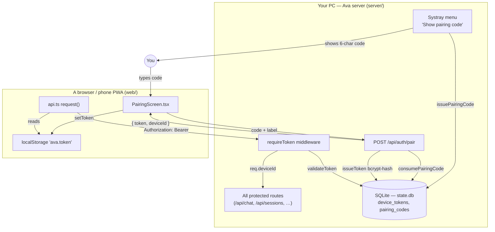
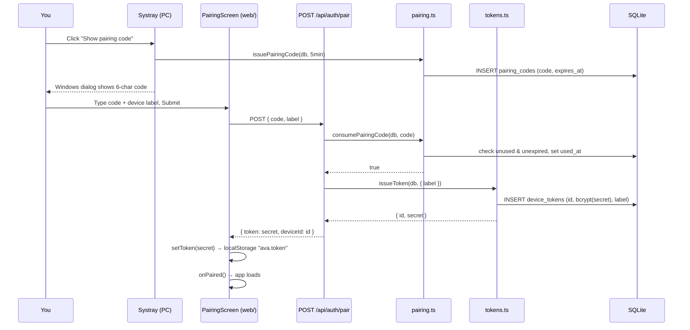

# 05 — Authentication, Device Pairing, Sessions & the Data Model

This document covers how Ava authenticates clients, how a new device pairs, how
chat sessions and messages are stored and managed over their lifetime, and the
complete SQLite data model behind all of it.

Everything here runs on **your Windows PC** (the machine in
`C:/ai/chemiapebi/yovlisshemdzle`). Ava's server is a Node/TypeScript process in
`server/`; the client is a React PWA in `web/` that you open in a browser (on the
PC or on your phone over the network). There is exactly **one user** — you — and
the security model reflects that: there are no user accounts, no passwords, and
no login. Instead, each browser/device holds a long-lived **bearer token**, and
the server trusts any request that presents a valid one.

> **Terminology.** A *bearer token* is a secret string a client sends with every
> request (in the `Authorization: Bearer <secret>` header). Whoever holds the
> token is treated as authenticated — there is nothing else to prove. A *device*
> here just means one paired browser (your phone's PWA, a desktop tab, etc.); it
> is not tied to hardware.
>
> **Ava (the runtime) vs Claude (the builder).** "Ava" is the running server and
> agent that you talk to. "Claude" is the engineer (me) who writes this code.
> When this doc says "Ava issues a token", it means the server code does so at
> runtime.

---

## 1. The authentication model in one picture



Two secrets exist, and it is important not to confuse them:

| Secret | Lifetime | Where it lives | Purpose |
| --- | --- | --- | --- |
| **Pairing code** | 5 minutes, single-use | `pairing_codes` table; shown once in a Windows dialog | A short, human-typeable code that authorizes minting one token |
| **Device token** | Indefinite (until revoked) | Plaintext only in the client's `localStorage`; **bcrypt hash** in `device_tokens` | The actual credential sent on every request |

The pairing code is the bridge: it lets someone holding physical access to your
PC (you, clicking the systray) grant a token to a remote browser without ever
typing the token itself.

---

## 2. Device tokens — `server/src/auth/tokens.ts`

This 72-line module is the entire token lifecycle: mint, validate, list,
revoke.

### Minting — `issueToken(db, { label })`

```ts
const id = nanoid(12);       // public device id
const secret = nanoid(48);   // the bearer token (returned to the client once)
const hash = bcrypt.hashSync(secret, 10);
db.prepare("INSERT INTO device_tokens (id, token_hash, label, created_at) VALUES (?, ?, ?, ?)")
  .run(id, hash, label, Date.now());
return { id, secret };
```

- The **secret is never stored** — only its bcrypt hash (cost factor 10). The
  plaintext is returned to the caller exactly once and then only the client
  keeps it. If the database leaks, the tokens in it cannot be reversed into
  working credentials.
- `id` (a 12-char `nanoid`) is the *public* identity of the device — it is what
  the device list and revoke endpoint use. `secret` (48 chars) is what the
  client presents. The two are deliberately separate so the id can be shown/used
  in the UI without exposing the credential.
- `label` is a free-text name ("iPhone", "Phone", "voice-internal") chosen by
  the caller.

### Validating — `validateToken(db, secret)`

```ts
const rows = db.prepare("SELECT id, token_hash FROM device_tokens WHERE revoked_at IS NULL").all();
for (const row of rows) {
  if (bcrypt.compareSync(secret, row.token_hash)) {
    db.prepare("UPDATE device_tokens SET last_seen_at = ? WHERE id = ?").run(Date.now(), row.id);
    return row.id;          // the deviceId
  }
}
return null;
```

Because the stored value is a one-way hash, the server cannot look a token up by
key. It must **scan every non-revoked token and `bcrypt.compareSync` each one**.
On a match it stamps `last_seen_at` (so the device list can show "last seen") and
returns the `deviceId`.

> **Performance note (why revocation hygiene matters).** Each validate is O(number
> of live tokens) bcrypt comparisons, and bcrypt is intentionally slow. A handful
> of devices is fine; an unbounded pile of stale tokens would make every
> authenticated request progressively slower. This is the reason
> `revokeTokensByLabel` (below) exists.

### Listing — `listTokens(db)` and hidden internal tokens

`listTokens` returns all non-revoked tokens **except** those whose label is in
`INTERNAL_LABELS` (`"voice-internal"`):

```ts
const INTERNAL_LABELS = new Set(["voice-internal"]);
// …
return rows.filter((r) => !INTERNAL_LABELS.has(r.label));
```

The `voice-internal` token is a loopback credential the server mints for itself
(see §4) so the hybrid-voice path can call its own `/api/chat` over `127.0.0.1`.
It is **not a device you manage**, and surfacing it in the device list invited an
accidental "revoke" that would break loopback auth until the next restart — so it
is hidden from the user-facing list.

### Revoking — `revokeToken` and `revokeTokensByLabel`

- `revokeToken(db, id)` sets `revoked_at = Date.now()` for one device id. This is
  what the `DELETE /api/auth/devices/:id` endpoint calls. Revocation is a **soft
  delete**: the row stays (for audit/`last_seen_at` history) but is excluded from
  validate and list because both filter on `revoked_at IS NULL`.
- `revokeTokensByLabel(db, label)` revokes **every** still-live token of a given
  label in one statement and returns the count. It is used at boot to retire the
  previous run's `voice-internal` token(s) before minting a fresh one, so the
  table holds exactly one live internal credential rather than accumulating one
  standing full-privilege token per restart (which would also slow the validate
  scan above).

---

## 3. Pairing codes — `server/src/auth/pairing.ts`

A pairing code is a short, **single-use, time-limited** code that authorizes
minting one token. The module is two functions plus a generator.

```ts
const ALPHABET = "ABCDEFGHJKMNPQRSTUVWXYZ23456789"; // no I, L, O, 0, 1
const LEN = 6;
```

The alphabet deliberately **omits ambiguous glyphs** (`I`, `L`, `O`, `0`, `1`) so
a code read off a screen and typed on a phone is not misread.

> **One detail worth flagging:** the generator produces a **6-character** code
> (`LEN = 6`), and the client's `PairingScreen` also has six input boxes
> (`LEN = 6`). However, the systray dialog title says **"Ava pairing code (5
> min)"** and the systray code path labels it "5 min" — the *length* the dialog
> shows is whatever the 6-char generator returns. (The earlier name "5 min"
> refers to the 5-minute TTL, not the length.)

### `issuePairingCode(db, ttlMs)`

Generates a random code, **loops until it finds one not already in the table**
(collision-free), then inserts it with `created_at` and `expires_at = now +
ttlMs`. Returns the plaintext code (it is meant to be displayed). `ttlMs` comes
from config: `AUTH_PAIRING_TTL_SECONDS` env var, **default 300 seconds (5
minutes)** — see `server/src/config.ts:44`.

### `consumePairingCode(db, code)` — returns `boolean`

Atomically validates and burns a code. It returns `false` (rejects) if:

1. the code does not exist,
2. it was already used (`used_at` is not null), or
3. it has expired (`expires_at < now`).

On success it stamps `used_at = now` and returns `true`. There is no separate
"check" path — consuming is the validation, which is what makes a code
**single-use**.

---

## 4. Where pairing codes come from (two sources)

A code can be minted two ways, both calling `issuePairingCode`:

1. **The systray menu (normal path).** `server/src/systray/index.ts` registers a
   "Show pairing code" item. Clicking it calls `onPair()`, which the server wires
   to `issuePairingCode(db, cfg.pairingTtlMs)` (`server/src/index.ts:477`), then
   pops a native Windows message box showing the code:
   ```
   "Ava pairing code (5 min)"
   ```
   This is the intended flow: you click the tray icon on the PC, read the code,
   and type it into the phone.

2. **The CLI script.** `server/scripts/mint-pairing-code.ts` opens the same DB,
   calls `issuePairingCode`, and prints the code to stdout — useful for scripted
   or headless pairing.

There is **no HTTP route that mints a pairing code** — by design. Minting
requires either physical access to the tray or shell access to run the script,
which is what keeps an unauthenticated remote client from minting its own code.
(The `/api/auth/pair` route *consumes* a code; it does not create one.)

---

## 5. The pairing workflow, step by step

This is the complete sequence from "fresh browser" to "authenticated and
talking to Ava".



1. **You mint a code.** Click "Show pairing code" in the systray (or run the
   script). A 6-character code appears, valid for 5 minutes, single-use.

2. **You enter it on the client.** `web/src/auth/PairingScreen.tsx` renders six
   single-character boxes plus a **device label** field. The label defaults to
   `"iPhone"` if the browser's user-agent contains "iPhone", otherwise `"Phone"`
   (`PairingScreen.tsx:11`). The screen handles per-box auto-advance, backspace
   focus movement, and pasting a full code across all six boxes at once.

3. **The client calls `/api/auth/pair`.** `api.pair(code, label)`
   (`web/src/api.ts:28`) POSTs `{ code, label }`. The route
   (`server/src/routes/auth.ts:15`) validates the body with a Zod schema (`code`
   non-empty; `label` 1–50 chars).

4. **The server consumes the code, then mints a token.**
   - `consumePairingCode(db, code)` — if it returns `false`, the route responds
     `400 { error: "invalid_or_expired_code" }`.
   - On success, `issueToken(db, { label })` mints the token and the route
     responds `{ token: secret, deviceId: id }`.

5. **The client stores the token.** `setToken(r.token)`
   (`web/src/auth/tokens.ts:7`) writes the secret to `localStorage` under the key
   `"ava.token"`, then calls `onPaired()` to enter the app. From now on the token
   persists in that browser until cleared.

6. **Every later request carries the token.** `web/src/api.ts:15` reads the token
   on each request and sets `Authorization: Bearer <token>`. The same token is
   also accepted as a `?t=<token>` query parameter for endpoints that can't set
   headers (e.g. an `EventSource`/SSE or a media `<audio>` URL) — see the
   middleware below.

### Error/edge behavior

- **Wrong or expired code** → the screen shows "invalid or expired code" and
  shakes the input row. The same generic message is shown for a malformed code
  (length ≠ 6) and for a server rejection — the client does not distinguish
  "expired" from "already used" from "never existed", which is fine because all
  three mean "get a new code".
- **Re-using a code** → the second `/api/auth/pair` fails because `used_at` is
  already set. Codes are one device each.
- **Losing/clearing `localStorage`** → the token is gone and the browser must
  pair again. `clearToken()` exists for an explicit "forget this device" on the
  client; revoking server-side is the `DELETE /api/auth/devices/:id` path.

---

## 6. The auth middleware — `server/src/auth/middleware.ts`

`requireToken(db)` returns an Express middleware that guards protected routes:

```ts
const header = req.headers.authorization ?? "";
const m = /^Bearer\s+(.+)$/.exec(header);
const queryToken = typeof req.query.t === "string" ? req.query.t : null;
const presented = m?.[1] ?? queryToken;
if (!presented) { res.status(401).json({ error: "missing_token" }); return; }
const id = validateToken(db, presented);
if (!id) { res.status(401).json({ error: "invalid_token" }); return; }
req.deviceId = id;        // downstream handlers read this
next();
```

Key points:

- It accepts the token from **either** the `Authorization: Bearer …` header
  **or** a `?t=` query parameter. The query fallback exists for clients that
  cannot set headers — server-sent-event streams and audio element URLs.
- On success it attaches `req.deviceId` (the device id, not the secret) to the
  request. This is how downstream handlers know *which* paired device is acting
  — used by per-device tables like `device_state` and `chip_overrides`.
- It distinguishes **`401 missing_token`** (no credential presented) from
  **`401 invalid_token`** (presented but no live token matched). A
  `declare global` block augments Express's `Request` type with the optional
  `deviceId` field so TypeScript callers can read it.

The same middleware instance is passed into the route factories (`authRoutes`,
`sessionsRoutes`, etc.) and applied per-route, so each module decides which of
its endpoints require a token. (`/api/auth/pair` is intentionally unauthenticated
— you can't have a token yet when you're pairing.)

---

## 7. The internal loopback (voice) token — `server/src/index.ts`

Ava's hybrid-voice path needs the realtime voice model to be able to run the
*real* agent (full tools) by calling Ava's own `/api/chat` over loopback. That
HTTP call must authenticate like any other, so the server mints a token **for
itself** at boot:

```ts
// server/src/index.ts (~374)
const retired = revokeTokensByLabel(db, "voice-internal");   // kill last run's token(s)
if (retired > 0) log.info({ retired }, "auth: revoked stale voice-internal tokens at boot");
const voiceInternalToken = issueToken(db, { label: "voice-internal" }).secret;
```

- The secret is kept **only in memory** (`voiceInternalToken`); it is never sent
  to a browser and the row is hidden from `listTokens` (§2).
- Retiring the prior run's tokens first guarantees the `device_tokens` table
  holds exactly **one** live internal credential at a time — bounding both the
  credential blast-radius and the bcrypt-scan cost.
- This token is a full-privilege credential, identical in power to a paired
  device's token. That is intentional: the loopback `/api/chat` call needs the
  same capabilities as a normal turn.

---

## 8. Sessions — `server/src/state/sessions.ts` & `server/src/routes/sessions.ts`

A **session** is one conversation thread. The `sessions` table holds its
identity, title, timestamps, status, an optional rolling summary, and a
soft-delete marker.

### The session row (effective shape after migrations)

| Column | Type | Notes |
| --- | --- | --- |
| `id` | TEXT PK | 12-char `nanoid` |
| `title` | TEXT | first ~60 chars of the opening message, later refined |
| `created_at` | INTEGER | epoch ms |
| `updated_at` | INTEGER | epoch ms; bumped on every write |
| `status` | TEXT | default `'active'` (see note) |
| `summary` | TEXT | added by migration (`db.ts`) — rolling summary text |
| `summary_through_message_id` | INTEGER | added by migration — high-water mark of summarized messages |
| `deleted_at` | INTEGER | added by migration — soft-delete timestamp, `NULL` = live |

The last three columns are **not** in `schema.sql`; they are added at runtime by
`openDb`'s `tryAddColumn` migrations (see §13). The base `Session` type
(`status: "active" | "idle" | "archived"`) is the declared vocabulary, though in
practice rows are created `'active'` and the status column is only lightly used.

### Lifecycle functions

- **Create** — `createSession(db, { title })`: inserts a new row with a 12-char
  id, `created_at = updated_at = now`, `status = 'active'`. Called by the chat
  route when a message arrives with no `sessionId` (`routes/chat.ts:117`), seeding
  the title from the first 60 characters of the user's text.
- **Read (live)** — `getSession(db, id)`: returns the row **only if
  `deleted_at IS NULL`**. Soft-deleted sessions are invisible here.
- **Read (incl. deleted, with summary)** — `getSessionFull(db, id)`: returns the
  full row regardless of `deleted_at`, including `summary` and
  `summary_through_message_id`. Used by the summarizer and recovery paths.
- **List** — `listSessions(db)`: all non-deleted sessions, newest-updated first.
  This backs `GET /api/sessions`.
- **Touch** — `touchSession(db, id)`: bumps `updated_at` so an active
  conversation floats to the top of the list (`routes/chat.ts:120`).
- **Title** — `updateTitle(db, id, title)`: replaces the title (the chat path
  refines it from the placeholder once it has more context —
  `routes/chat.ts:154`).
- **Summary** — `updateSummary(db, id, summary, throughMessageId)`: stores a
  rolling summary plus the id of the last message it covers. Written by
  `server/src/orchestrator/auto-summary.ts`, which periodically condenses older
  turns so long conversations stay within the model's context window.
- **Status** — `setStatus` / `listByStatus`: set or query the `status` column.
- **Soft delete** — `softDeleteSession(db, id)`: stamps `deleted_at` (and
  `updated_at`). The row and its messages remain on disk but disappear from
  `getSession`/`listSessions`.
- **Purge** — `purgeDeletedSessions(db, olderThanMs)`: **hard-deletes** sessions
  whose `deleted_at` is older than a cutoff. Because `messages` (and other child
  tables) reference `sessions(id)` with `ON DELETE CASCADE`, purging a session
  also removes all of its messages, tool_calls, and approvals.

### Routes — `server/src/routes/sessions.ts`

All three require a token:

| Method & path | Behavior |
| --- | --- |
| `GET /api/sessions` | `{ sessions: listSessions(db) }` — the conversation list |
| `GET /api/sessions/:id` | `{ session, messages }` for a live session, else `404 not_found` |
| `DELETE /api/sessions/:id` | `softDeleteSession` then `204`; `404` if it didn't exist/was already gone |

`DELETE` is a **soft** delete — the conversation is hidden immediately but the
data lingers until a later purge. There is no per-device ownership check: any
paired device can list/open/delete any session, which matches the single-user
model.

---

## 9. Messages — `server/src/state/messages.ts`

A **message** is one turn in a session. Rows are append-only in normal operation.

| Column | Type | Notes |
| --- | --- | --- |
| `id` | INTEGER PK AUTOINCREMENT | monotonic; also the natural ordering key |
| `session_id` | TEXT → `sessions(id)` ON DELETE CASCADE | owning session |
| `role` | TEXT | `'user' \| 'assistant' \| 'system'` |
| `content` | TEXT | the message text |
| `created_at` | INTEGER | epoch ms |

Functions:

- `appendMessage(db, { sessionId, role, content })` — inserts a row and returns
  it with its new auto-increment `id`.
- `listMessages(db, sessionId)` — all messages for a session, **ordered by `id`
  ascending** (chronological). Backs `GET /api/sessions/:id`.
- `listMessagesAfterId(db, sessionId, afterId)` — messages with `id > afterId`;
  used to fetch only the turns a rolling summary hasn't yet absorbed.
- `countMessages(db, sessionId)` — a `COUNT(*)` for the session.

The index `idx_messages_session ON messages(session_id, id)` makes both the
ordered list and the "after id" range query fast.

> **Who writes messages.** The chat route and the realtime-voice proxy append
> user/assistant turns. Note the hybrid-voice loopback call to `/api/chat` is sent
> with `persist:false` precisely so it does **not** double-store the turn — the
> realtime proxy is the single source of truth for spoken turns.

---

## 10. Per-device state — `device-state.ts` & `chip-overrides.ts`

These tables are keyed by **device id** (`req.deviceId` from the middleware), so
they hold per-paired-device data.

### `device_state` — `server/src/state/device-state.ts`

One row per device (PK = `device_id`, FK → `device_tokens(id)` ON DELETE
CASCADE). Currently it tracks a single thing: the last date Ava sent that device
a proactive greeting.

- `getDeviceState(db, deviceId)` — read the row (or `null`).
- `markGreetingSent(db, deviceId, date)` — upsert `last_greeting_date` to a
  date string (so Ava greets you at most once per day per device).
- `getLastUserMessageBefore(db, beforeSessionId)` — a helper (not strictly
  device-state) that finds your most recent user message in **any other** session,
  with that session's title, so a greeting can reference what you were last doing.

Because of the cascading FK, revoking/purging a device's token also clears its
`device_state`.

### `chip_overrides` — `server/src/state/chip-overrides.ts`

"Chips" are the suggested-prompt buttons on the home screen. This table holds the
**pinned** chips a device has customized.

| Column | Notes |
| --- | --- |
| `id` | 12-char `nanoid` PK |
| `device_id` | FK → `device_tokens(id)` ON DELETE CASCADE |
| `label` | button text |
| `prompt` | the prompt the chip sends |
| `pinned` | `0/1`, default `1` |
| `position` | sort order; default is "now" so a newly pinned chip floats up |
| `created_at` / `updated_at` | epoch ms |

CRUD: `listChips` (ordered by `position` then `created_at`), `getChip`,
`createChip`, `updateChip` (partial patch), `deleteChip`. Indexed by
`(device_id, position)` for the ordered per-device list.

### `chip_label_cache` — `server/src/state/chip-label-cache.ts`

A throwaway cache that maps a device + a **hash of a prompt** to an
auto-generated short label, with an `expires_at`. Composite PK
`(device_id, prompt_hash)`. `hashPrompt` is `sha256(prompt)` truncated to 32 hex
chars. `getCachedLabel` treats an expired row as a miss; `setCachedLabel` upserts.
This avoids re-asking the model to summarize the same prompt into a button label.

> Note: `chip_label_cache` has **no foreign key** to `device_tokens` (unlike
> `chip_overrides`/`device_state`). It is pure cache, so stale rows for a removed
> device are harmless and simply age out.

---

## 11. Global preference tables — `reasoning_pref` & `voice_engine_pref`

Both follow the identical "single global row" shape: a `scope_id` PK (always the
literal `"global"`), a value column, and `updated_at`. Both use an
`INSERT … ON CONFLICT(scope_id) DO UPDATE` upsert and fall back to a default when
no row (or an unrecognized value) is present.

- **`reasoning_pref`** (`server/src/state/reasoning-pref.ts`) — stores the
  user-chosen reasoning depth: `"fast"` or `"thorough"`. `getReasoningLevel`
  defaults to `"fast"`. This is the speed-vs-depth dial exposed in the dashboard
  (it maps to the model's reasoning effort).
- **`voice_engine_pref`** (`server/src/state/voice-engine-pref.ts`) — stores
  which voice provider speaks: `"openai"` or `"hume"`. `getVoiceEngine` defaults
  to `"openai"`, and any stale legacy value (the retired `"chatterbox"`/`"hybrid"`
  options) also falls back to `"openai"`.

These are **global**, not per-device — there is one reasoning level and one voice
engine for all of Ava.

---

## 12. The remaining tables (agent/automation state)

These aren't auth/session tables but are part of the same `state.db` and round
out the data model.

- **`rules`** (`server/src/state/rules.ts`) — standing instructions ("rules") you
  give Ava. `source` is your raw text; `parsed` is an optional structured form;
  `enabled` (0/1) and `status` (`pending`/`active`/`failed`) track lifecycle.
  CRUD + list (newest first). Backs `/api/rules`.
- **`approvals`** (`server/src/state/approvals.ts`) — the human-in-the-loop gate
  for sensitive tool calls. A row captures the `tool`, its `args` (JSON), a
  human-readable `summary`, and a `status`
  (`pending`/`approved`/`denied`/`expired`). `waitForDecision` blocks a running
  tool until you approve/deny, a timeout elapses, **or** the Stop signal fires
  (Stop resolves as `expired` so it cancels rather than auto-runs). `decide`
  flips a pending row and emits an event so the waiter wakes. `expirePending`
  ages out old pending rows. FK → `sessions(id)` ON DELETE CASCADE; indexed by
  `(session_id, status)`.
- **`self_improvements`** (`server/src/self/intents.ts`) — Ava's self-improvement
  queue. **The table is `self_improvements`, even though the code's type is named
  `Intent`** (historical naming). Each row is one improvement attempt: `trigger`
  (`explicit`/`failure`/`friction`/`schedule`), `goal`, a `status` that walks
  `queued → reflecting → implementing → verifying → swapped` (or
  `failed`/`rolled_back`), plus the `branch`, `commit_sha`, `last_known_good`,
  `diff_summary`, `verify_log`, `outcome`, and `error` of the run.
  `failStaleIntents` runs at boot to mark any non-terminal row `failed` (the loop
  is in-memory, so a restart orphans it).
- **`discussions`** (`server/src/state/discussions.ts`) — records of Ava
  "consulting" (a discussion/brainstorm run). `topic`, a `status`
  (`running`/`done`/`failed`), the `result` or `error`, and an optional
  `session_id` it's tied to. `failStaleDiscussions` mirrors the boot-reconcile
  pattern: anything left `running` after a restart becomes `failed`.
- **`push_subscriptions`** (`server/src/state/push.ts`) — Web Push endpoints for
  notifications. Holds the push `endpoint` (unique), the `p256dh`/`auth`
  encryption keys, a `device_label`, and an optional `device_token_id` (FK →
  `device_tokens(id)` ON DELETE CASCADE). `upsertSubscription` keys on
  `endpoint`; `listSubscriptions`/`deleteSubscription` round it out.
- **`tool_calls`** — defined in `schema.sql` (a per-session audit of tool
  invocations: `tool`, `args`, `result`, `status`, `duration_ms`). **As of this
  writing the table is created but never written** — the only `tool_calls`
  references in the server code are the in-memory LLM message shape, not this
  table. It is reserved/forward-looking schema. (See "Unresolved" below.)

---

## 13. The database — `server/src/state/db.ts`

Ava uses **`better-sqlite3`**, a synchronous, in-process SQLite binding. The
whole data layer is therefore plain synchronous function calls — there is no
connection pool, no async/await around queries, and no separate database server.
The file lives at `<dataDir>/state.db` (`config.ts:71`).

```ts
export function openDb(path: string): Db {
  const db = new Database(path);
  const schema = readFileSync(join(__dirname, "schema.sql"), "utf8");
  db.exec(schema);                                    // idempotent: all CREATE … IF NOT EXISTS
  tryAddColumn(db, "sessions", "summary", "TEXT");
  tryAddColumn(db, "sessions", "summary_through_message_id", "INTEGER");
  tryAddColumn(db, "sessions", "deleted_at", "INTEGER");
  db.exec("CREATE INDEX IF NOT EXISTS idx_sessions_deleted ON sessions(deleted_at)");
  return db;
}
```

**Schema application & migrations.**

- `schema.sql` is executed verbatim on every open. Every statement is
  `CREATE TABLE/INDEX IF NOT EXISTS`, so re-running it on an existing database is a
  no-op — this is the baseline schema bootstrap.
- The only true "migration" mechanism is `tryAddColumn`, which reads
  `PRAGMA table_info(<table>)` and issues an `ALTER TABLE … ADD COLUMN` only if the
  column is absent. This is how `sessions.summary`,
  `sessions.summary_through_message_id`, and `sessions.deleted_at` get added to
  databases created before those columns existed — and why those three columns are
  **not** in `schema.sql`. There is no version table or down-migration; the schema
  evolves forward only.

**PRAGMAs (set at the top of `schema.sql`):**

- `PRAGMA journal_mode = WAL` — Write-Ahead Logging. Readers don't block the
  writer and vice-versa, which suits a server that both serves reads and writes
  concurrently. (WAL creates the usual `state.db-wal` / `state.db-shm` sidecar
  files next to the database.)
- `PRAGMA foreign_keys = ON` — enforces the `REFERENCES … ON DELETE CASCADE`
  relationships. This is what makes deleting a session cascade to its messages,
  tool_calls, and approvals, and deleting a device token cascade to its
  device_state, chip_overrides, and push_subscriptions.

`openInMemoryDb()` is `openDb(":memory:")` — a throwaway database used by the test
suite so each test starts from a clean schema.

---

## 14. The complete data model (ERD)

Every table in `server/src/state/schema.sql` plus the three migration-added
`sessions` columns. Foreign keys are drawn as relationships; `||--o{` means "one
parent, zero-or-more children", and the child side names the constraint.

```mermaid
erDiagram
  sessions ||--o{ messages : "has"
  sessions ||--o{ tool_calls : "has"
  sessions ||--o{ approvals : "has"
  messages ||--o{ tool_calls : "may reference"
  device_tokens ||--o{ push_subscriptions : "owns"
  device_tokens ||--|| device_state : "has"
  device_tokens ||--o{ chip_overrides : "owns"

  sessions {
    TEXT    id PK
    TEXT    title
    INTEGER created_at
    INTEGER updated_at
    TEXT    status "default 'active'"
    TEXT    summary "added by migration"
    INTEGER summary_through_message_id "added by migration"
    INTEGER deleted_at "added by migration; NULL = live"
  }

  messages {
    INTEGER id PK "AUTOINCREMENT"
    TEXT    session_id FK "ON DELETE CASCADE"
    TEXT    role "user | assistant | system"
    TEXT    content
    INTEGER created_at
  }

  tool_calls {
    INTEGER id PK "AUTOINCREMENT"
    TEXT    session_id FK "ON DELETE CASCADE"
    INTEGER message_id FK "→ messages(id)"
    TEXT    tool
    TEXT    args
    TEXT    result "nullable"
    TEXT    status
    INTEGER duration_ms "nullable"
    INTEGER created_at
  }

  device_tokens {
    TEXT    id PK "12-char nanoid"
    TEXT    token_hash UK "bcrypt of secret"
    TEXT    label
    INTEGER created_at
    INTEGER last_seen_at "nullable"
    INTEGER revoked_at "nullable; NULL = live"
  }

  pairing_codes {
    TEXT    code PK "6-char, ambiguous glyphs removed"
    INTEGER created_at
    INTEGER expires_at
    INTEGER used_at "nullable; non-null = consumed"
  }

  push_subscriptions {
    INTEGER id PK "AUTOINCREMENT"
    TEXT    device_token_id FK "→ device_tokens(id) ON DELETE CASCADE; nullable"
    TEXT    endpoint UK
    TEXT    p256dh
    TEXT    auth
    TEXT    device_label "nullable"
    INTEGER created_at
    INTEGER updated_at
  }

  rules {
    TEXT    id PK
    TEXT    source "your raw instruction"
    TEXT    parsed "nullable; structured form"
    INTEGER enabled "0/1, default 1"
    TEXT    status "pending | active | failed"
    INTEGER created_at
    INTEGER updated_at
  }

  approvals {
    TEXT    id PK
    TEXT    session_id FK "ON DELETE CASCADE"
    TEXT    tool
    TEXT    args "JSON"
    TEXT    summary
    TEXT    status "pending | approved | denied | expired"
    INTEGER created_at
    INTEGER decided_at "nullable"
  }

  device_state {
    TEXT    device_id PK "FK → device_tokens(id) ON DELETE CASCADE"
    TEXT    last_greeting_date "nullable; date string"
    INTEGER updated_at
  }

  chip_overrides {
    TEXT    id PK
    TEXT    device_id FK "→ device_tokens(id) ON DELETE CASCADE"
    TEXT    label
    TEXT    prompt
    INTEGER pinned "0/1, default 1"
    INTEGER position "default 0"
    INTEGER created_at
    INTEGER updated_at
  }

  reasoning_pref {
    TEXT    scope_id PK "always 'global'"
    TEXT    level "fast | thorough"
    INTEGER updated_at
  }

  voice_engine_pref {
    TEXT    scope_id PK "always 'global'"
    TEXT    engine "openai | hume"
    INTEGER updated_at
  }

  chip_label_cache {
    TEXT    device_id PK "composite"
    TEXT    prompt_hash PK "composite; sha256[:32]"
    TEXT    label
    INTEGER expires_at
  }

  self_improvements {
    TEXT    id PK
    INTEGER created_at
    TEXT    trigger "explicit | failure | friction | schedule"
    TEXT    goal
    TEXT    status "queued→reflecting→implementing→verifying→swapped | failed | rolled_back"
    TEXT    branch "nullable"
    TEXT    commit_sha "nullable"
    TEXT    last_known_good "nullable"
    TEXT    diff_summary "nullable"
    TEXT    verify_log "nullable"
    TEXT    outcome "nullable"
    TEXT    error "nullable"
  }

  discussions {
    TEXT    id PK
    INTEGER created_at
    TEXT    topic
    TEXT    status "running | done | failed"
    TEXT    result "nullable"
    TEXT    error "nullable"
    TEXT    session_id "nullable; not an enforced FK"
  }
```



> **FK caveats worth knowing.** `chip_label_cache`, `reasoning_pref`,
> `voice_engine_pref`, `rules`, `self_improvements`, and `discussions` have **no
> foreign keys** — they stand alone. `discussions.session_id` is stored but is
> *not* a declared FK constraint, so it won't cascade. `tool_calls.message_id`
> references `messages(id)` **without** `ON DELETE CASCADE` (only its `session_id`
> cascades).

---

## 15. Table-by-table reference (what it holds, who writes it)

| Table | What it holds | Primary writer(s) |
| --- | --- | --- |
| `sessions` | One conversation thread: title, timestamps, status, rolling summary, soft-delete marker | `state/sessions.ts`, called by `routes/chat.ts` (create/touch/title), `orchestrator/auto-summary.ts` (summary), `routes/sessions.ts` (soft delete) |
| `messages` | One turn (user/assistant/system) in a session, append-only | `state/messages.ts`, called by `routes/chat.ts` and the realtime-voice proxy |
| `tool_calls` | **Reserved** per-session tool-invocation audit | *Defined in schema; not written by current code* |
| `device_tokens` | Bearer credentials (bcrypt-hashed) for each paired device + the hidden `voice-internal` loopback token | `auth/tokens.ts`, called by `routes/auth.ts` (pairing) and `index.ts` (boot internal token) |
| `pairing_codes` | Short single-use, 5-min codes that authorize minting one token | `auth/pairing.ts`, called by the systray (`index.ts`) and `scripts/mint-pairing-code.ts` to create; `routes/auth.ts` to consume |
| `push_subscriptions` | Web Push endpoints + keys for notifications | `state/push.ts`, called by the push subscribe route |
| `rules` | Standing user instructions, raw + parsed, with enable/status | `state/rules.ts`, called by `/api/rules` routes |
| `approvals` | Human-in-the-loop gate for sensitive tool calls | `state/approvals.ts`, called by the agent (create + waitForDecision) and `/api/approvals` routes (decide) |
| `device_state` | Per-device runtime state — currently the last greeting date | `state/device-state.ts`, called by the greeting orchestrator |
| `chip_overrides` | Per-device pinned home-screen prompt buttons | `state/chip-overrides.ts`, called by `/api/chips` routes |
| `reasoning_pref` | Global reasoning depth (`fast`/`thorough`) | `state/reasoning-pref.ts`, called by `/api/reasoning` |
| `voice_engine_pref` | Global voice provider (`openai`/`hume`) | `state/voice-engine-pref.ts`, called by `/api/voice/engine` |
| `chip_label_cache` | Cached auto-labels for chip prompts (hash-keyed, expiring) | `state/chip-label-cache.ts`, called by the chip-label generator |
| `self_improvements` | Ava's self-improvement attempts (the "intents" queue) | `self/intents.ts`, called by the self-improvement loop |
| `discussions` | Records of Ava's consult/brainstorm runs | `state/discussions.ts`, called by the consult runner |

---

## 16. Security posture summary

- **No accounts, no passwords.** Identity = possession of a valid device token.
  This matches the single-owner deployment on your PC.
- **Tokens are stored hashed.** Only bcrypt hashes are in the DB; the plaintext
  exists only in each client's `localStorage`. A DB leak does not yield usable
  credentials.
- **Minting a token requires local access.** You must be at the PC's systray (or
  have shell access to run the script) to produce a pairing code; there is no
  network route to mint one. The pairing code itself is single-use and expires in
  5 minutes.
- **Revocation is soft and immediate in effect.** Setting `revoked_at` removes a
  token from both validate and list on the next request, while keeping the row for
  history. Cascading FKs clean up a revoked/purged device's per-device state.
- **The loopback token is the one standing full-privilege credential** the server
  holds for itself; it is memory-only, hidden from the device list, and re-minted
  (with the old one retired) on every boot.
- **No per-resource authorization.** Any valid token can read/delete any session,
  rule, or device — there is exactly one user, so there is nothing to partition.
