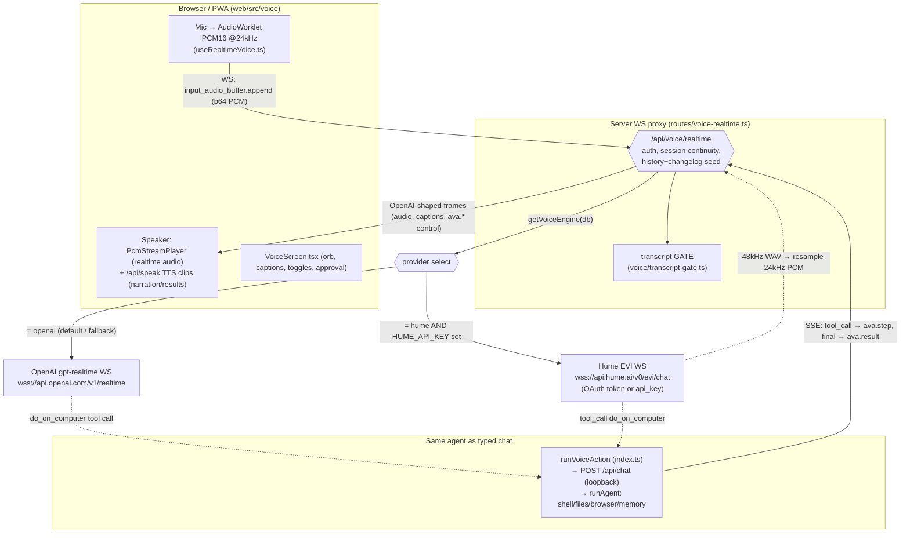
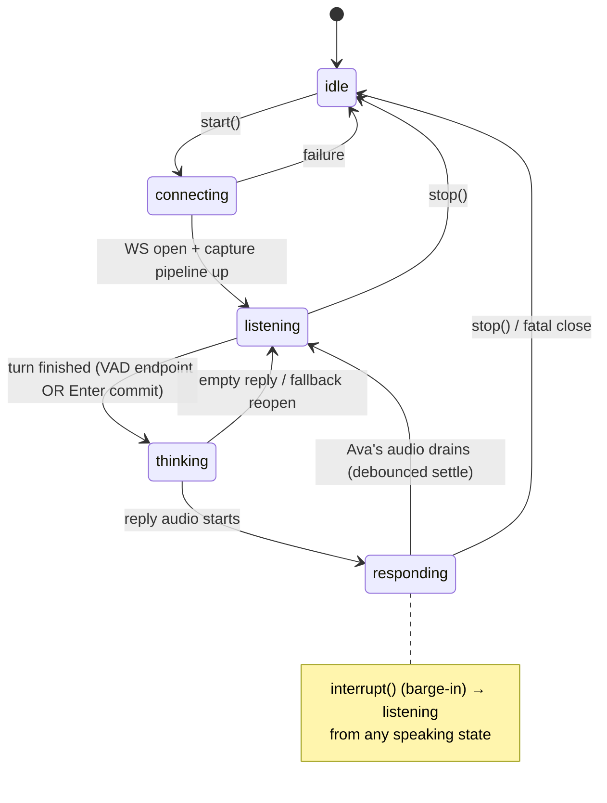
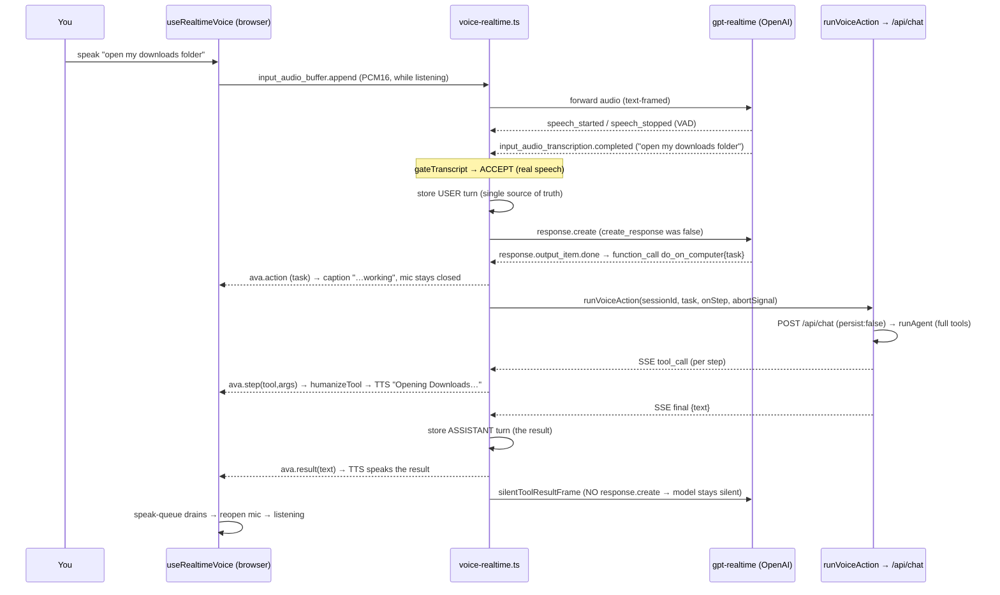
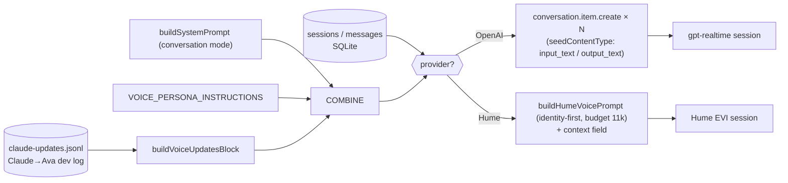
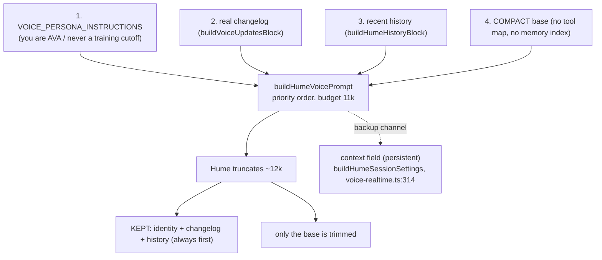
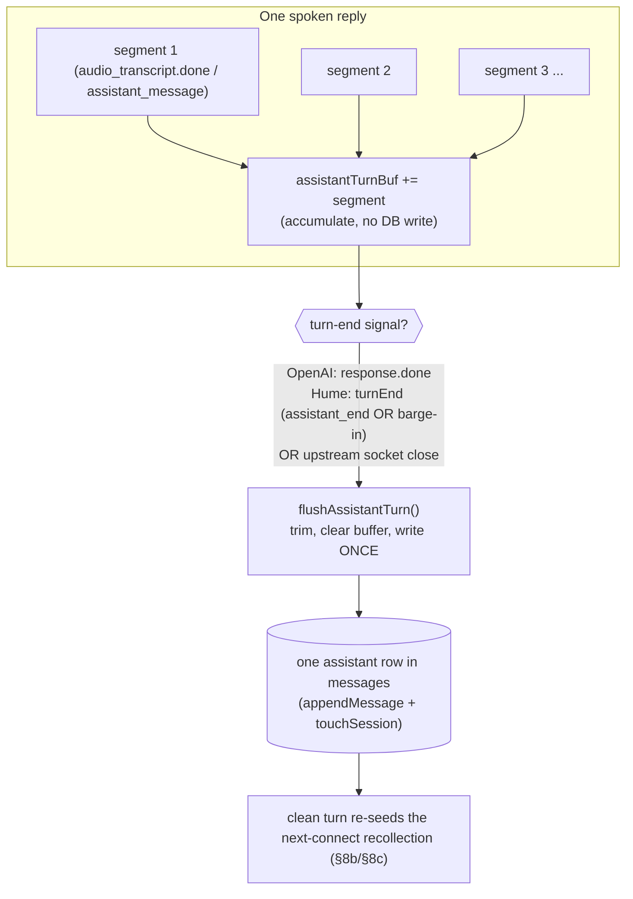
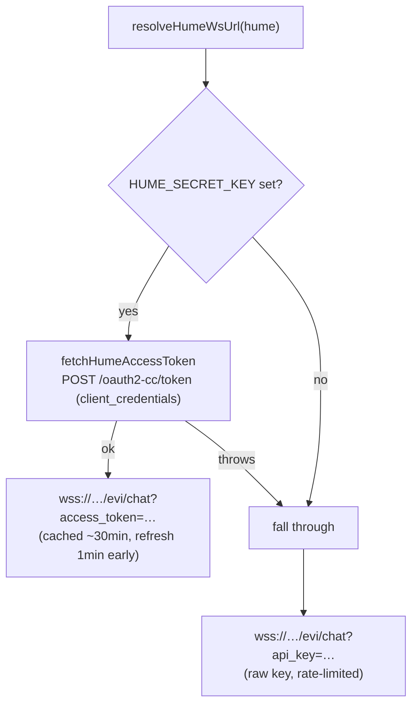

# 06 — The Voice Pipeline (server + web client)

This is the most intricate subsystem in Ava: a full-duplex, low-latency voice
loop that spans the React PWA (microphone capture, audio playback, turn-taking)
and the Node/TS server (a WebSocket proxy that brokers between the browser and an
upstream realtime voice provider, gates transcripts, and hands real work off to
the same tool-using agent that typed chat uses).

You talk to Ava in the browser/PWA on your Windows PC. The realtime model can
**speak back directly** for chit-chat, and when you ask it to *do* something it
calls one tool — `do_on_computer` — which runs the full `/api/chat` agent (shell,
files, browser, memory, approvals) and speaks the result back.

Two upstream providers are supported and chosen by a dashboard toggle:

- **OpenAI** (`gpt-realtime`, GA) — the proven default. Fast, capable, recites
  its system prompt faithfully.
- **Hume** (EVI, the "Alice Bennett" voice) — selected with `voice_engine_pref =
  hume`. **Honest caveat: Hume needs paid credits, uses a weaker conversational
  model, and is loose at obeying the prompt** (it truncates long prompts and only
  partially honors recollection). It exists for voice *character*, not for
  best-in-class reasoning. Details and the zero-credits failure mode are in
  [§9](#9-the-hume-provider-honest-assessment).

> Term note. **Realtime model** = the speech-in/speech-out model on the WS
> upstream (OpenAI `gpt-realtime` or Hume EVI). **Agent** = the normal text agent
> behind `POST /api/chat` (`runAgent`), with the full tool stack. **VAD** = Voice
> Activity Detection, the server-side endpointer that decides when a spoken turn
> starts and stops. **PCM16** = signed 16-bit little-endian mono audio samples.
> **Hybrid** = the mode where the realtime model both speaks chit-chat *and* can
> call `do_on_computer`.

---

## 1. The two provider paths (architecture diagram)

Both providers converge on **one client protocol**: the browser only ever speaks
the OpenAI-shaped frame vocabulary (`response.output_audio.delta`,
`conversation.item.input_audio_transcription.completed`, plus Ava-specific
`ava.session` / `ava.action` / `ava.step` / `ava.result`). The Hume branch
*translates* Hume's native wire protocol into those same frames
(`translateHumeEvent`, `voice-realtime.ts:442`), so the front end is fully
provider-agnostic — it never knows which upstream is live.

---

## 2. Component map (where each responsibility lives)

| Concern | File | Notes |
|---|---|---|
| WS proxy, provider branch, gate wiring, action handoff, continuity, seeding | `server/src/routes/voice-realtime.ts` (1222) | The hub. `buildRealtimeProxy` → `startSession` (OpenAI) / `tryStartHumeSession` (Hume). |
| Hume config resolve, OAuth token fetch/cache, secret redaction, WS URL | `server/src/routes/voice-provider-config.ts` (183) | `resolveVoiceProvider`, `resolveHumeWsUrl`, `fetchHumeAccessToken`. |
| Transcript accept/reject policy (pure) | `server/src/voice/transcript-gate.ts` (185) | `gateTranscript` + env-tunable config. |
| STT (`/api/transcribe`) + TTS (`/api/speak`) HTTP primitives | `server/src/routes/voice.ts` (107) | `/speak` is always OpenAI TTS now. |
| Voice-engine (provider) preference get/set route | `server/src/routes/voice-engine.ts` | Persists `openai` \| `hume`. |
| Provider pref storage (SQLite) | `server/src/state/voice-engine-pref.ts` | Global scope; default `openai`. |
| Shared default speaker id | `server/src/routes/voice-defaults.ts` | `DEFAULT_VOICE = "shimmer"`. |
| "Sir" comma-smoothing for speech only | `server/src/voice/speechText.ts` | `formatSpeechText`. |
| TTS speech-rate default + clamp | `server/src/voice/voiceConfig.ts` | `DEFAULT_SPEECH_RATE = 1.15`. |
| Chatterbox local-clone TTS client | `server/src/voice/chatterbox.ts` | **Retired** from the UI but still present (see [§11](#11-chatterbox-retired-but-present)). |
| The action handoff (`do_on_computer` → agent) | `server/src/index.ts:381` | `runVoiceAction` (loopback to `/api/chat`). |
| Proxy wiring at boot | `server/src/index.ts:463` | `buildRealtimeProxy({...}).attach(httpServer)`. |
| **Web hook** — WS, mic, playback, turn-taking, barge-in, reconnect, +new | `web/src/voice/useRealtimeVoice.ts` (1025) | The brain of the client. |
| Voice UI | `web/src/voice/VoiceScreen.tsx` (236) | Orb, captions, provider/input toggles, approval card. |
| Pure endpointing/turn helpers | `web/src/voice/voiceInputMode.ts` (179) | `shouldForwardMic`, `reopenAfterSpeak`, etc. |
| Gapless PCM player | `web/src/voice/realtime-audio.ts` (120) | `PcmStreamPlayer`. |
| Realtime event → action union | `web/src/voice/realtime-events.ts` (82) | `classifyRealtimeEvent` (handles GA + beta names). |
| Push-to-talk key binding (pure) | `web/src/voice/pushToTalk.ts` | `shouldToggleOnEnter`. |
| Mic amplitude for the orb | `web/src/voice/useMicAmplitude.ts` | RMS → 0..1 for animation. |

---

## 3. The client state machine

All UI derives from one union (`useRealtimeVoice.ts:125`):

`capturing` is a sub-flag for an in-flight push-to-talk turn; `errorMsg` is the
error surface. The single most important property the machine enforces: **the mic
only forwards audio upstream while `state === "listening"`** (VAD) or **while a
PTT turn is captured** — so Ava's own spoken reply, played on the speakers, can
never be re-heard and transcribed into a phantom turn. That rule is one pure
function, `shouldForwardMic` (`voiceInputMode.ts:59`), called per audio chunk in
the worklet's `onmessage` (`useRealtimeVoice.ts:741`).

---

## 4. Audio capture and playback (the bytes)

**Capture.** On `start()` (`useRealtimeVoice.ts:685`):

1. `getUserMedia({ echoCancellation, noiseSuppression, autoGainControl })`.
2. Open the WS to `/api/voice/realtime` with query params: `t` (token),
   optional `sessionId`, optional `new=1`, and `inputMode`.
3. On WS open, build an `AudioContext({ sampleRate: 24000 })` and register an
   **AudioWorklet** whose source is embedded as a Blob URL at module scope
   (`WORKLET_SRC`, `useRealtimeVoice.ts:142`). The worklet converts each render
   quantum of float32 `[-1,1]` mic samples to PCM16 and posts the bytes to the
   main thread.
4. Each posted buffer, *if* `shouldForwardMic` allows it, is base64-encoded and
   sent as `{ type: "input_audio_buffer.append", audio }`.

> iOS Safari boots the `AudioContext` suspended; an explicit `resume()` keeps the
> first ~200 ms of speech from being dropped (`useRealtimeVoice.ts:727`). This
> matters even though the target is the PC PWA — the same hook serves any mic
> client.

**Playback (realtime audio).** In hybrid mode the realtime model streams its
spoken reply as `response.output_audio.delta` frames (base64 PCM16 @24kHz). The
`PcmStreamPlayer` (`realtime-audio.ts:36`) decodes each chunk to Float32 and
schedules it on a running "playhead" cursor so chunk *N+1* starts exactly where
chunk *N* ends — **gapless** even under bursty network delivery. A single
undecodable chunk is *skipped* (not fatal) so one bad delta can't cut Ava off
mid-sentence; `onError` surfaces it as a soft console warning.

**Playback (TTS clips).** Step narration and task results are *not* spoken by the
realtime model — they are synthesized via `POST /api/speak` (OpenAI
`gpt-4o-mini-tts`) and played as sequential `Audio` elements through a small
queue (`speakWorker`, `useRealtimeVoice.ts:331`). This is the "one voice per
task" design: chit-chat = realtime model's voice; task steps + result = TTS. See
[§7](#7-end-to-end-voice-task-workflow).

---

## 5. Server-VAD tuning, the reasoning toggle, and push-to-talk

The realtime session's `turn_detection` is built by `turnDetectionFor`
(`voice-realtime.ts:114`):

- **VAD mode (default).** `server_vad` with a tuned energy `threshold` (0.6),
  `prefix_padding_ms` (300), and `silence_duration_ms`. Crucially
  `create_response: false` and `interrupt_response: false` — **the realtime model
  never auto-replies to detected speech.** The proxy decides when a reply is
  warranted (after the transcript passes the gate) and *then* sends
  `response.create` itself (`voice-realtime.ts:1001`). This is what stops the
  model hallucinating replies to silence.
- **Push-to-talk mode.** `turn_detection: null` — automatic VAD/turn-detection is
  fully **off**. The client owns turn boundaries: it forwards mic audio only
  while a turn is held (Enter to start, Enter to finish) and sends an explicit
  `input_audio_buffer.commit`. This is the rock-solid guarantee that
  background/external audio (TV, a room conversation) between turns can never
  become a turn.

**The Fast↔Thorough reasoning toggle also tunes voice snappiness.**
`vadForReasoning` (`voice-realtime.ts:101`) maps the user's reasoning level onto
VAD trailing silence: `fast` → `silence_duration_ms = 300` (jump in quickly),
anything else → `700` (patient, so Ava never talks over you). It's read at
upstream-open via `getReasoningLevel(db)` (`voice-realtime.ts:786`), so changing
the toggle takes effect on the next connect. Other VAD fields are unchanged.

**Push-to-talk commit guard.** OpenAI rejects a committed buffer under ~100 ms
("buffer too small … 0.00ms"). The client tracks bytes forwarded this turn
(`pttBytesRef`) and refuses to commit below `MIN_COMMIT_BYTES = 4800`
(= 100 ms × 24 kHz × 2 bytes), keeping the turn open so you can keep talking
(`hasEnoughAudio`, `voiceInputMode.ts:177`; `finishPtt`, `useRealtimeVoice.ts:947`).

**Mode change mid-session reconnects.** The server fixes `turn_detection` at
*connect* time, so flipping VAD↔PTT on a live session requires a reconnect to
take effect (`shouldReconnectForModeChange`, `voiceInputMode.ts:130`; effect at
`useRealtimeVoice.ts:826`). Likewise an *engine/provider* change reconnects
because the two providers are entirely different sockets
(`shouldReconnectForEngineChange`, `voiceInputMode.ts:147`).

---

## 6. The transcript gate (the single chokepoint)

Every finished user transcript — from **either** provider — passes through
`gateTranscript` (`transcript-gate.ts:117`) before it can become a real turn.
This exists because realtime VAD + whisper will, on silence or background noise,
emit a confident-looking hallucination ("you", "Thank you.", "Thanks for
watching."). Acting on those produces phantom user turns and unsolicited replies.

The gate is a **pure function** (no I/O, trivially unit-tested), applied at one
place: `decideTranscriptForward` (`voice-realtime.ts:615`). A rejected transcript
is simply **not forwarded** to the browser, so the client never emits a user turn
and never calls `/api/chat`.

Rejection order (cheap structural checks first):

1. `empty` — nothing after normalization.
2. `too_short` — fewer than `minChars` (2) characters.
3. `hallucination_phrase` — the entire transcript (lowercased,
   punctuation-stripped) equals a known whisper "silence word"
   (`you`, `thank you`, `thanks for watching`, `okay`, `um`, `.`, `...`, …).
   Punctuation-only transcripts also land here.
4. `too_brief` — measured speech segment (VAD `speech_started`→`speech_stopped`)
   shorter than `minSpeechMs` (200 ms). Only enforced when a duration is known.
5. `low_confidence` — transcriber no-speech probability above `maxNoSpeechProb`
   (0.6) **or** average token logprob below `minAvgLogprob` (-1.2). Only enforced
   when the transcriber reports them (`gpt-4o-transcribe` sometimes attaches
   per-segment logprobs; whisper-1 usually omits them — best-effort).

All thresholds are env-tunable without a redeploy (`loadTranscriptGateConfig`,
`transcript-gate.ts:165`): `VOICE_MIN_CHARS`, `VOICE_MIN_SPEECH_MS`,
`VOICE_MAX_NO_SPEECH_PROB`, `VOICE_MIN_AVG_LOGPROB`,
`VOICE_HALLUCINATION_PHRASES` (comma-separated).

**Second gate: don't interrupt Ava.** In hybrid, if a transcript lands *while
Ava is mid-response* (`responseActive`, between `response.created` and
`response.done`), it is dropped too (`voice-realtime.ts:977`) — it's almost
always an echo, and starting a new response would cut her off. The Hume branch
runs the *same* `decideTranscriptForward` chokepoint (`voice-realtime.ts:1122`).

---

## 7. End-to-end voice-task workflow

This is the headline path: **you speak a command → it runs on your PC → the
result is spoken back.** Walking it for the OpenAI hybrid provider (the default).

Step by step, with code anchors:

1. **You speak.** The worklet forwards PCM16 while `listening`
   (`useRealtimeVoice.ts:741`).
2. **VAD endpoints the turn.** `speech_started` records onset
   (`voice-realtime.ts:882`); `speech_stopped` lets the proxy compute
   `speechMs`.
3. **Transcription completes.** `gpt-4o-transcribe` returns the text (and maybe
   logprobs). `readTranscriptionCompleted` (`voice-realtime.ts:571`) extracts it.
4. **Gate.** `decideTranscriptForward` → `gateTranscript`. Reject ⇒ dropped, no
   turn (`voice-realtime.ts:971`). Accept ⇒ continue.
5. **Store the user turn once.** Hybrid persists the accepted transcript as the
   `user` message *here* and nowhere else (`voice-realtime.ts:993`) — the
   internal `/api/chat` run uses `persist:false`, so there's no double-store.
6. **Ask the model to respond.** Because `create_response` is false, the proxy
   sends `response.create` (`voice-realtime.ts:1001`).
7. **Model decides: chit-chat or action.** For a *do* request the persona
   (`VOICE_PERSONA_INSTRUCTIONS`, `voice-realtime.ts:178`) instructs it to call
   `do_on_computer` and **not** narrate steps/results itself.
8. **Tool call detected.** `readToolCall` (`voice-realtime.ts:255`) parses the
   GA `response.output_item.done` function-call shape. The proxy sends
   `ava.action` so the UI shows progress instead of dead air
   (`actionStartedFrame`).
9. **The agent runs.** `runVoiceAction` (`index.ts:381`) POSTs to `/api/chat`
   over loopback with a dedicated internal token, `persist:false`, and the
   abort signal. It reads the SSE stream: each `tool_call` becomes an `ava.step`
   the client speaks via TTS (`humanizeTool` → `/api/speak`); `final` becomes the
   result.
   - **`voice:true`** is set on the chat request, which makes the OpenAI agent use
     `reasoningEffort: "none"` for a fast spoken reply (`chat.ts:271`) — the full
     tool stack is unchanged, only the deliberation depth.
   - **409 retry.** If a previous run still holds the session, `runVoiceAction`
     kills it and retries once so a new spoken command always wins
     (`index.ts:407`) — the "first job done, second won't run" fix.
10. **Store the result, speak it, keep the model silent.** The proxy stores the
    result as the `assistant` turn (`voice-realtime.ts:937`), sends `ava.result`
    (client speaks it via TTS), and returns the tool output with
    `silentToolResultFrame` — which **omits** `response.create`, so the realtime
    model stays silent. One voice per task.
11. **Mic reopens.** When the TTS speak-queue drains AND no realtime audio is
    playing AND (hybrid) `response.done` was seen, the hook returns to
    `listening` (`reopenAfterSpeak` + the settle/fallback timers,
    `useRealtimeVoice.ts:372`).

**Abort safety.** `actionAbort` ties the agent run to the WS connection. If the
client drops mid-task (a 1006), `runVoiceAction` aborts its fetches and **kills
the loopback run** (`index.ts:418`), so a disconnect can't leave a zombie agent
burning tokens or holding the shared browser. A reconnect then starts clean
instead of double-executing.

---

## 8. Continuity / recollection workflow

The design goal: **voice and chat share one continuous memory.** Ask something in
voice, finish in chat, come back to voice — it remembers. Two mechanisms make
this work.

### 8a. Session continuity (resume vs new)

When voice connects **without** a session id (e.g. you entered voice from the
home orb), the proxy decides whether to resume or start fresh via
`chooseResumeOrNew` (`voice-realtime.ts:526`):

- Default: **resume the most-recent session** (`listSessions(db)[0]`). So
  re-entering voice and asking "what did you just do?" recalls it, instead of
  landing in a brand-new empty "Voice chat" (the old bug where every entry minted
  a fresh session).
- The client's **"+new conversation"** control sends `?new=1`, which forces a
  fresh session (`newConversation`, `useRealtimeVoice.ts:872`; `wantNew` →
  `resumeId: null`).

The chosen id is echoed to the client in the **session hello** frame
(`sessionHelloFrame`, `voice-realtime.ts:515`), which also carries `mode`
(`hybrid` | `transcribe`). The client latches both: it adopts the session id and
sets `hybridRef` so it knows whether to play realtime audio or own the reply
(`handleServerEvent`, `useRealtimeVoice.ts:649`).

### 8b. History + self-knowledge seeding

On connect the proxy seeds the realtime session with:

1. **The base system prompt** in *conversation* mode (`buildSystemPrompt`,
   tools rubric omitted since tools aren't exposed to the realtime model
   directly), plus the spoken-conversation persona (`VOICE_PERSONA_INSTRUCTIONS`).
   For **Hume** this base is built **compact** (`buildSystemPrompt({ compact: true })`,
   `voice-realtime.ts:1120`): the ~4.4k capability/tool map and the memory index
   are dropped, because Hume EVI is given no tools and can't act on a tool map
   anyway — see §8c.
2. **Ava's real changelog** — `buildVoiceUpdatesBlock` (`voice-realtime.ts:350`)
   reads the Claude→Ava dev log and folds in the last 6 shipped/note entries.
   This is why, when you ask "what's your latest update?", the persona forces a
   `do_on_computer` call to *read the authoritative changelog* rather than
   confabulating LLM-training facts. The block in the prompt is just a summary;
   the tool has the current list. **Caveat for Hume:** Hume has no tools, so it
   *can't* make that `do_on_computer` call — it answers from this in-prompt
   snapshot only (§8c, §9).
3. **Recent conversation turns**, so voice no longer forgets what was typed (and
   vice-versa). The two providers seed differently:
   - **OpenAI**: the last *N* turns (`REALTIME_SEED_TURNS`, default 12) are
     pushed as `conversation.item.create` items — **context only, no
     `response.create`** so seeding doesn't trigger a reply
     (`voice-realtime.ts:821`). Each item costs OpenAI tokens per connect, so the
     default stays small.
     - **The `output_text` fix.** The GA realtime content-part schema is
       asymmetric: user/system turns use `input_text`, **assistant turns use
       `output_text`** (`seedContentType`, `voice-realtime.ts:534`). Sending
       `text` for an assistant turn is rejected ("Value must be 'output_text'").
       This bug only surfaced once voice started *resuming* sessions with
       assistant turns to seed — a fresh session had nothing to seed, so it
       stayed hidden.
   - **Hume**: recent turns are rendered as a text block by
     `buildHumeHistoryBlock` (`voice-realtime.ts:326`) and seeded **two ways** —
     folded into the system prompt (via the priority-ordered build in §8c) **and**
     into Hume's separate persistent `context` field. Hume can't consume the
     `conversation.item.create` items OpenAI uses; the next section covers why the
     prompt must be assembled identity-first to survive Hume's truncation.

### 8c. Hume prompt assembly — identity-first under a budget (survives truncation)

Hume EVI **silently truncates `system_prompt` at ~12k chars**. The old Hume seed
concatenated the *full* base prompt **first** (≈13k, including the ~4.4k tool map)
and only then appended the persona, changelog, and history — so those three blocks
fell **past the cut and were dropped**. The symptom: Hume "drew a blank" on the
recent conversation and **confabulated its identity** (a generic LLM "training
cutoff late 2024" and an invented self-improvement story) because it never saw the
"you are AVA / no training cutoff" persona or the real changelog.

The fix (`buildHumeVoicePrompt`, `voice-realtime.ts:369`) assembles the Hume prompt
in **priority order under an 11k budget** so the bug-fixing front always survives,
and only the lowest-priority block (the base) absorbs the trim:

The recollection (changelog + history) is **also** written to Hume's separate
persistent `context` field (`contextText` arg to `buildHumeSessionSettings`,
`voice-realtime.ts:1125`). Whether Hume reliably honors `context` is **unverified**,
so this is belt-and-suspenders: the now-surviving **prompt** is the guaranteed
channel, `context` is a cheap second one. Full write-up in
`docs/features/hume-voice-memory-fix.md`.

**Single source of truth for turns.** Across both providers, the spoken **user**
turn is stored exactly once (at gate-accept) and the spoken **assistant** turn
(chit-chat transcript *or* `do_on_computer` result) is stored as **one** message
row; the internal `/api/chat` run stores nothing (`persist:false`). This keeps the
same session history coherent whether you typed or spoke. For chit-chat the
"one row per spoken turn" guarantee is non-trivial, because the realtime model
delivers a single reply as **several** transcript segments — that's §8d.

### 8d. One spoken reply = one message (segment buffering)

A single spoken reply does **not** arrive as one transcript. Both upstreams emit
the reply as **several segments — roughly one per sentence/clause**: OpenAI sends
multiple `response.output_audio_transcript.done` (or the beta
`response.audio_transcript.done`) events, and Hume sends multiple
`assistant_message` events. The earlier code called `appendMessage` on **each**
segment, so one spoken answer was stored as **4–5 separate `messages` rows**. That
did two kinds of damage: chat history showed a reply shredded into clause-fragments,
and — worse for voice — the recollection seed (§8b/§8c) re-fed those fragments back
into the model on the next connect, so the "recent conversation" it remembered was
itself a pile of half-sentences. This **undermined the Hume memory fix in §8c**: the
prompt assembly was correct, but the *content* it carried was fragmented.

The fix is **buffer-per-turn, flush-once**. Each provider branch keeps a
per-connection string buffer (`assistantTurnBuf`) and a `flushAssistantTurn()`
helper that trims the accumulated text, **clears the buffer**, and (only when
`hybrid && sessionId && text`) writes **one** `appendMessage` + `touchSession`.
Segments are appended to the buffer as they arrive; the buffer is flushed when the
turn ends.

**Per provider:**

- **OpenAI** (`startSession`). Buffer + `flushAssistantTurn` declared at
  `voice-realtime.ts:821`. Each transcript segment is appended at
  `voice-realtime.ts:946`–`:959` (note: it deliberately does **not** `return`, so
  captions keep forwarding to the client). The flush fires on `response.done`
  (`voice-realtime.ts:938`).
- **Hume** (`tryStartHumeSession`). Buffer + flush declared at
  `voice-realtime.ts:1122`. `translateHumeEvent` reports each spoken segment via
  `assistantText` and signals the turn boundary via the new `turnEnd?: boolean`
  field on `HumeTranslation` (`voice-realtime.ts:403`). The event loop appends the
  segment and flushes when `turnEnd` is set (`voice-realtime.ts:1249`–`:1252`).
  `turnEnd` is set on **`assistant_end`** (`voice-realtime.ts:505`) **and on
  `user_interruption`** (`voice-realtime.ts:506`–`:509`) — see barge-in below.

**Turn-end / flush triggers and why each exists:**

| Trigger | OpenAI | Hume | Why |
|---|---|---|---|
| Normal turn finished | `response.done` (`:938`) | `assistant_end` → `turnEnd` (`:505`) | The reply is complete — persist it as one row. |
| **Barge-in** (you interrupt) | — | `user_interruption` → `turnEnd` (`:506`) | Ava *did* speak the buffered part; flush it so it isn't lost or silently merged into the **next** turn's buffer. |
| **Upstream socket close** | close handler (`:1067`) | close handler (`:1276`) | Tail-safety: don't lose a turn the model spoke just before the socket dropped (e.g. a 1006). |

**Why `do_on_computer` is unaffected.** During a task the realtime model is kept
**silent** (`silentToolResultFrame` omits `response.create`, so no output
transcript is produced — §7). The buffer therefore stays **empty**, the result is
stored by the dedicated task path (`appendMessage` at `voice-realtime.ts:989`
success / `:1004` failure for OpenAI; `:1229`/`:1238` for Hume), and a later flush
of the empty buffer is a **no-op** (the `text` guard is falsy). So the
coalescing buffer and the task-result store never double-write the same turn.

**Why the flush clears the buffer.** `flushAssistantTurn()` resets
`assistantTurnBuf = ""` *before* the write guard, so a **double-flush** (e.g.
`response.done` immediately followed by an upstream close, or `assistant_end`
followed by `user_interruption`) writes at most one row — the second call sees an
empty buffer and does nothing.

> **Recollection tie-in.** This is the fix that makes §8b/§8c's seed *coherent*. The
> last-*N*-turns seed (`conversation.item.create` for OpenAI; `buildHumeHistoryBlock`
> for Hume) now reads **whole assistant turns**, not clause-fragments, so what Ava
> "remembers" on reconnect reads like the conversation actually happened.

---

## 9. The Hume provider (honest assessment)

Hume EVI is the alternate upstream, selected when **both** the dashboard toggle is
`hume` *and* `HUME_API_KEY` is present in the environment. Honest limitations,
verified against the code and its comments:

- **It needs paid credits.** Hume EVI is metered. With **zero credits** Hume
  rejects the chat (its API returns an `E0300` / quota error). In this pipeline
  that surfaces as the EVI socket failing or erroring; if it errors *before* it
  opens, the proxy logs a redacted warning and **falls back to OpenAI**
  (`startSession`, `voice-realtime.ts:746`). If it errors *after* opening, the
  proxy forwards a redacted `error` frame and the client shows "auth failed" /
  the upstream-closed reason. **Flag:** this is the classic "Hume mysteriously
  says auth failed" symptom — it is frequently a *billing/credits* problem, not a
  key problem. The code does not special-case `E0300`; it treats any pre-open
  failure as "fall back to OpenAI," and any post-open failure as an error to the
  client.
- **No tools — answers update questions from a prompt snapshot, not live.** This
  is the key asymmetry with OpenAI. The Hume EVI session is given **no tools** (no
  `do_on_computer`). So for *real work* Hume **cannot** route to the agent the way
  the OpenAI path does, and it **cannot** call `read_claude_updates` to fetch the
  authoritative changelog when asked "what's your latest update?" — it answers from
  the changelog **snapshot folded into its prompt at connect time**
  (`buildVoiceUpdatesBlock`). That snapshot is real and now survives truncation
  (next bullet), but it is only as fresh as the connect and won't reflect a change
  shipped mid-session. The persona still *tells* Hume to call `do_on_computer`, but
  with no tool bound the call can't happen. Wiring the tool into the Hume branch is
  a separate, unshipped fix. (Hume EVI's LLM is also tuned for affective speech, so
  its own chit-chat is less sharp than `gpt-realtime`.)
- **Truncates the prompt — fixed by an identity-first, budgeted assembly.** Hume
  silently truncates `system_prompt` at **~12k chars**. The old seed put the full
  base prompt first, so the persona ("you are AVA / no training cutoff"), the real
  changelog, and recent history were appended last and **cut away** — which is why
  Hume used to confabulate a "training cutoff" identity and forget the
  conversation. The fix (`buildHumeVoicePrompt`, `voice-realtime.ts:369`; §8c)
  assembles the prompt **identity → changelog → history → compact base** under an
  **11k budget**, so the bug-fixing front always survives and only the base is
  trimmed. Recollection is **also** written to Hume's separate persistent `context`
  field (`buildHumeSessionSettings`, `voice-realtime.ts:314`) as a backup, because
  **whether Hume honors `context` is unverified** — the surviving prompt is the
  guaranteed channel. Full write-up:
  `docs/features/hume-voice-memory-fix.md`. **Note:** one inline comment in
  `buildHumeSessionSettings` (`voice-realtime.ts:310`–`:313`) still asserts `context`
  was *verified* honored; the function/caller comments treat it as **unverified**
  — trust the latter. **Expect Hume to be less reliable than OpenAI at obeying the
  persona and recalling history regardless.**

**Wire translation.** Hume speaks a different protocol; the proxy bridges it so
the browser stays provider-agnostic:

- **Inbound** (`translateHumeEvent`, `voice-realtime.ts:475`): `audio_output` →
  `response.output_audio.delta`; `user_message` → gated user transcript;
  `assistant_message` → `response.output_audio_transcript.done` + **one buffered
  segment** (`assistantText`, *not* persisted yet — see §8d);
  `assistant_end` → `response.done` **and `turnEnd: true`** (flush the buffer to one
  message); `user_interruption` (barge-in) → no client frame but **`turnEnd: true`**
  (flush what was already spoken); `tool_call` → the `do_on_computer` handoff;
  `error` → an `error` frame. Everything else (prosody, metadata) → no frames.
- **Outbound** (`translateClientFrameToHume`, `voice-realtime.ts:498`): the
  browser's `input_audio_buffer.append` (mic PCM) → Hume's `audio_input`. Control
  frames Hume doesn't need are dropped.

**The 48 kHz WAV → 24 kHz resample.** Hume returns each `audio_output` as a
self-contained **WAV clip at 48 kHz**, but the browser's `PcmStreamPlayer` plays
*raw PCM16 at 24 kHz*. Playing Hume's bytes verbatim makes Ava sound an octave low
and half-speed (and clicks on the WAV header). `humeAudioChunkToClientPcm`
(`voice-realtime.ts:409`) strips the WAV container, reads its real sample rate
from the `fmt ` chunk, and calls `resamplePcm16` (`voice-realtime.ts:382`) — a
box-filter downsample that *averages* the source samples each output sample
spans, so the 2:1 downsample also low-passes (less aliasing than bare
decimation). Non-WAV input passes through unchanged. Both functions are pure and
unit-tested.

### Hume authentication (OAuth token vs api_key)

`resolveHumeWsUrl` (`voice-provider-config.ts:171`) prefers **OAuth
client-credentials** auth when `HUME_SECRET_KEY` is set, because the raw
`api_key` query param is **rate-limited** and was the source of intermittent
"auth failed" under reconnect churn (that was the fix in the most recent voice
commit, `10514b1`). The access token is cached (`humeTokenCache`) and reused
across connections until ~1 min before expiry (`fetchHumeAccessToken`,
`voice-provider-config.ts:149`). If the token fetch fails, it falls back to
`api_key` auth — "better a rate-limited connect than none."

### Secret safety (defense in depth)

Nothing in the provider config or the Hume branch ever logs a secret. Only the
**non-secret shape** is logged (`describeVoiceProvider` — presence booleans + the
public voice name, `voice-provider-config.ts:104`). The Hume WS URL embeds the
key/token and is **never** logged. Any upstream error message is passed through
`redactSecrets` (`voice-provider-config.ts:121`) before it reaches a log or the
client, so a library error that echoes the URL/header can't leak `HUME_API_KEY`.

**Voice selection.** Hume's voice is pinned by exact id when `HUME_VOICE_ID` is
set (most reliable), otherwise by name — defaulting to **"Alice Bennett"**
(`DEFAULT_HUME_VOICE_NAME`, `voice-provider-config.ts:17`;
`buildHumeSessionSettings`). To get an exact voice you set `HUME_VOICE_ID`; the
name path is a best-effort fallback.

---

## 10. Barge-in, reconnect, and approvals (client correctness)

**Barge-in / interrupt** (`interrupt`, `useRealtimeVoice.ts:888`). Cutting Ava
off is harder than it looks because *three* things can be speaking:

1. the **realtime model** streaming audio deltas (hybrid chit-chat),
2. **TTS clips** for task steps/results (`/api/speak`),
3. an **in-flight agent run** still executing tools.

`interrupt()` handles all three: it `api.kill(sessionId)`s the server run; bumps
an **interrupt epoch** *first*, then sends `response.cancel` +
`input_audio_buffer.clear` upstream so the model stops generating; stops the
`PcmStreamPlayer`; bumps the speak-queue epoch and halts the current TTS clip.
The epoch is the subtle part: deltas already in flight arrive *after*
`response.cancel`, so each speaking turn snapshots the epoch at start
(`playTurnEpochRef`) and the audio branch **drops** any delta whose snapshot is
stale (`shouldDropAudioDelta`, `voiceInputMode.ts:167`; applied at
`useRealtimeVoice.ts:618`). Without this, the cancelled tail resumes and Ava talks
over you. This is covered by `useRealtimeVoice.barge-in.test.ts`.

**In push-to-talk**, only an *explicit* new turn (pressing Enter while Ava
speaks) interrupts her (`shouldInterruptForNewTurn`, `voiceInputMode.ts:77`) —
background audio never does, because it's never forwarded.

**Auto-reconnect** (`useRealtimeVoice.ts:789`). A transient abnormal close (1006,
upstream 1011, or any unclean close) auto-reconnects up to **2 times** with an
800 ms delay, so a brief upstream blip self-heals instead of dead-ending.
Auth failures (1008 / 4401) do **not** retry — they surface "auth failed". The
budget resets on a healthy connect and never fires after an intentional `stop()`
or unmount.

**Approvals over voice.** The agent's `approval_required` SSE event surfaces as a
card in `VoiceScreen` (`useRealtimeVoice.ts:445`); you approve/deny by tapping or
(per the card copy) by saying yes/no. Note `runVoiceAction` does **not** stall on
approvals — the policy auto-approves after the ~15 s veto window, so the run
keeps streaming and the result still gets spoken (`index.ts:439`).

---

## 11. Chatterbox (retired but present)

`server/src/voice/chatterbox.ts` is a client for a **local** TTS server running a
cloned voice (`CHATTERBOX_TTS_URL`, default `http://127.0.0.1:8123/speak`). It was
part of an older 3-way engine toggle (OpenAI / Chatterbox / Hybrid). That toggle
was **retired**: the provider type is now just `"openai" | "hume"`
(`voice-engine-pref.ts:13`), the `/api/speak` route always uses OpenAI TTS
(`voice.ts:78`), and `VoiceScreen`'s toggle only shows OpenAI / Hume. The
`chatterbox.ts` module still compiles and is referenced by tests/comments but is
**not wired into any live path**. Treat it as dead code pending removal — do not
assume `/api/speak` can produce the cloned voice.

> Historical note. `REALTIME_HYBRID` env was once the opt-in that enabled the
> speak+tool handoff. It no longer gates anything (`index.ts:372`): the action
> handoff is wired **unconditionally** (inert unless the model calls
> `do_on_computer`), and the persisted engine value — read per connect via
> `getVoiceEngine` — decides whether the realtime model speaks. `REALTIME_HYBRID`
> survives only as a legacy default-seed.

---

## 12. Configuration reference (env + persisted)

| Setting | Where | Effect |
|---|---|---|
| `voice_engine_pref` (SQLite, global) | dashboard toggle / `/api/voice/engine` | `openai` (default) \| `hume`. Read per connect. |
| `AVA_VOICE_PROVIDER` | env | Provider *resolution* default at boot (`openai` \| `hume`); Hume needs `HUME_API_KEY` too, else falls back. |
| `HUME_API_KEY` | env | Required for Hume to be selectable. |
| `HUME_SECRET_KEY` | env | Enables robust OAuth token auth (preferred over rate-limited api_key). |
| `HUME_CONFIG_ID` | env | Optional EVI config id. |
| `HUME_VOICE_ID` | env | Exact Hume voice id (most reliable). |
| `HUME_VOICE_NAME` | env | Voice by name; defaults to **Alice Bennett**. |
| `REALTIME_MODEL` | env | Override the OpenAI realtime model (default `gpt-realtime`). |
| `REALTIME_TRANSCRIBE_MODEL` | env | STT model for the realtime path (default `gpt-4o-transcribe`). |
| `REALTIME_VAD_THRESHOLD` / `_PREFIX_PADDING_MS` / `_SILENCE_MS` | env | Tune server-VAD energy/padding/trailing silence. |
| `REALTIME_SEED_TURNS` | env | How many recent turns to seed on connect (default 12). |
| `REALTIME_VOICE` | env | Realtime model's spoken voice (overrides `DEFAULT_VOICE = "shimmer"`). |
| `VOICE_MIN_CHARS` / `_MIN_SPEECH_MS` / `_MAX_NO_SPEECH_PROB` / `_MIN_AVG_LOGPROB` / `VOICE_HALLUCINATION_PHRASES` | env | Tune the transcript gate. |
| `CHATTERBOX_TTS_URL` | env | Retired path only (see §11). |
| Voice input mode (localStorage `ava.voiceInputMode`) | client | `vad` (default) \| `enter_push_to_talk`. |
| `DEFAULT_SPEECH_RATE = 1.15` | `voiceConfig.ts` | Faster-than-neutral TTS delivery; clamped to [0.25, 4.0]. |

---

## 13. Test coverage (where the invariants are pinned)

- `server/src/routes/voice-realtime.test.ts` — gate-forward decisions, tool-call
  parsing, Hume translation, resample/WAV handling, seed content-type, continuity
  choice, frame builders, and the **assistant-turn `turnEnd`** signal (§8d): an
  `assistant_message` segment must **not** set `turnEnd`, while `assistant_end` and
  `user_interruption` both must — so segments buffer and only a turn boundary flushes
  (`voice-realtime.test.ts:518`, `:526`, `:534`).
- `server/src/routes/voice-provider-config.test.ts` — provider resolution +
  fallback, redaction, URL building, token cache.
- `server/src/voice/voiceConfig.test.ts` — speech-rate clamp/default.
- `server/src/routes/voice.test.ts` — `/transcribe` + `/speak` (and that there is
  **no** toolless conversation endpoint).
- `server/src/state/voice-engine-pref.test.ts` — provider pref storage.
- `web/src/voice/voiceInputMode.test.ts`, `pushToTalk.test.ts`,
  `realtime-audio.test.ts`, `realtime-events.test.ts`,
  `useRealtimeVoice.intent.test.ts`, `useRealtimeVoice.barge-in.test.ts` — the
  pure client helpers, event classification, intent mapping, and barge-in epoch.

---

## 14. Unresolved questions / things to watch

- **`E0300` is not handled explicitly.** The zero-credits Hume case is documented
  here from Hume's API behavior and the code's fallback/redaction paths, but the
  code does not parse the specific error code. If you want a clearer user-facing
  "Hume is out of credits" message (vs the generic "auth failed"), that would be
  a small enhancement in the Hume error branches (`voice-realtime.ts:1193`+).
- **Hume has no `do_on_computer` tool (known gap).** Unlike OpenAI, the Hume EVI
  session is given no tools, so Hume answers "what's your latest update?" from the
  in-prompt changelog **snapshot** (fresh only as of connect), and can't run the
  real `read_claude_updates`. Binding the tool into the Hume branch is the
  follow-up fix (§9, §8c; `docs/features/hume-voice-memory-fix.md`).
- **Hume recollection now survives truncation, but `context` is unverified.** The
  Hume prompt is assembled identity-first under an 11k budget so persona +
  changelog + history survive Hume's ~12k cut (`buildHumeVoicePrompt`), and the
  same recollection is mirrored into the persistent `context` field. Whether Hume
  honors `context` is unverified, and the whole fix was **not exercised against a
  live Hume session** (the account hit a zero-credits `E0300`) — only by logic +
  unit tests. A stale inline comment at `voice-realtime.ts:310`–`:313` still claims
  `context` was verified; the surrounding function comments correctly call it
  unverified.
- **`docs/voice-mode.md` is partially stale.** That older doc describes the
  pipeline as *transcribe-only* (realtime model never speaks). That was true at
  one point, but the current default is the **hybrid speak** path driven by the
  engine pref. This file (`06-voice-pipeline.md`) reflects the current code;
  `voice-mode.md` should be reconciled or marked superseded.
- **Chatterbox is dead but compiled.** `chatterbox.ts` is unreferenced by any live
  path; a future cleanup could delete it and its tests/comments.
- **OpenAI seed cost.** Every seeded turn is OpenAI cost per connect. The default
  (`REALTIME_SEED_TURNS = 12`) is a deliberate small cap; raising it for better
  recall trades tokens on each voice connect.
