# 07 — The Self-Improvement System

> Ava editing its own code. This is the subsystem that lets the agent take a
> goal ("make voice less laggy", "fix the thing I got wrong"), have a coding
> worker write the change in an isolated copy of the repo, prove it with
> tests/build/boot, and only then move the live code onto it — with several
> guardrails and a watchdog that can roll the change back if the new build never
> comes up healthy.

All code lives in `server/src/self/` (plus one detached entry script
`server/src/self/watchdog-main.ts`, the overnight driver
`server/scripts/auto-improve-loop.ts`, the worker wrapper
`server/src/tools/claude-code.ts`, the HTTP route `server/src/routes/self.ts`,
and the PWA screen `web/src/self/`).

---

## 0. Two actors, and why the distinction matters

This document is precise about **who is doing what**, because the system is
literally one program editing the code of another:

- **Ava** — the running server (the orchestrator + tool host). Ava is the
  *runtime*. It decides to start an improvement, holds the state machine, runs
  the verify gate, performs the git swap, and spawns the watchdog.
- **Claude (the worker)** — a separate, headless `claude` process Ava spawns to
  actually write the code. This is **Claude Code running on the owner's `claude`
  subscription login**, not the Anthropic API (`server/src/tools/claude-code.ts`
  deliberately strips `ANTHROPIC_API_KEY`/`ANTHROPIC_AUTH_TOKEN` from the worker
  env at `claude-code.ts:59-64` so it authenticates as the subscription, exactly
  like an interactive user — otherwise it would silently bill a pay-as-you-go
  account and fail "credit balance too low").
- **The LLM provider** — a *third* thing. The `reflect` step (turning a goal into
  a change brief) does NOT use the Claude worker; it uses Ava's configured
  `LLMProvider` (OpenAI or Anthropic-via-API, whatever `cfg.llmProvider` is)
  through `provider.stream(...)` (`reflect.ts:16`). So a single improvement can
  touch two different model backends: the **provider** writes the brief, the
  **subscription Claude worker** writes the code.

Keeping these straight is the difference between an honest status report and a
misleading one.

---

## 1. The pipeline at a glance

```mermaid
stateDiagram-v2
    [*] --> queued : createIntent (explicit | schedule)

    queued --> reflecting : runImprovement acquires the in-flight slot
    queued --> queued : another improvement in flight → wait (FIFO)

    reflecting --> implementing : provider.stream() returns a CHANGE/ACCEPTANCE brief
    note right of reflecting
      LLM PROVIDER (OpenAI/Anthropic API),
      NOT the Claude worker
    end note

    implementing --> verifying : Claude worker edited files in the worktree
    note right of implementing
      git worktree under OS tmpdir,
      node_modules junctioned in,
      Claude Code on the SUBSCRIPTION
    end note

    verifying --> swap_guard : npm test + web build + server build + boot-smoke all pass
    note right of verifying
      flightcheck also runs here but is
      REPORT-ONLY — never gates the swap
    end note

    state swap_guard <<choice>>
    verifying --> swap_guard : commit candidate, capture lastKnownGood
    swap_guard --> swapped : assertSwapSafe OK + fast-forward OK → git reset --hard
    swap_guard --> failed : touches safety-critical code, OR non-fast-forward

    swapped --> watchdog : detached watchdog spawned; server restarts onto new code

    state watchdog <<choice>>
    watchdog --> committed : /api/health responds in time → change stays live
    watchdog --> rolled_back_auto : never healthy → revertTo(lastKnownGood)

    reflecting --> failed : any throw
    implementing --> failed : worker no-op / error / non-zero
    verifying --> failed : any check fails

    swapped --> rolled_back_manual : owner taps "Revert last" / POST /:id/revert

    committed --> [*]
    failed --> [*]
    rolled_back_auto --> [*]
    rolled_back_manual --> [*]
```



> **Note on status vocabulary.** The DB/state machine only persists seven
> statuses (`intents.ts:5-7`): `queued`, `reflecting`, `implementing`,
> `verifying`, `swapped`, `failed`, `rolled_back`. The boxes above named
> `swap_guard`, `watchdog`, `committed`, and `rolled_back_auto` are *moments in
> the runtime*, not stored statuses — a successful run simply stays at `swapped`,
> and an automatic watchdog rollback rewrites git but does **not** currently write
> a `rolled_back` row (see §9, "Honest caveats"). Only the manual revert route
> sets `status = "rolled_back"`.

---

## 2. The orchestrator: `runImprovement` (`improver.ts`)

`runImprovement(db, id, deps)` is the heart. It is intentionally a thin
*coordinator*: it owns the state transitions and the single-flight lock, and
delegates every real action to an injected `ImproverDeps` object. That injection
is what lets the same orchestration run two ways — the **live interactive path**
(wired in `server/src/index.ts:150` `buildImproverDeps`) and the **overnight
loop** (wired in `server/scripts/auto-improve-loop.ts:67`) — with different
implementations of `implement`, `restart`, `watch`, etc.

### `ImproverDeps` (the seams), `improver.ts:4-23`

| Dep | What it does | Live impl | Overnight impl |
| --- | --- | --- | --- |
| `reflect(goal, failureLog)` | goal → change brief via the **LLM provider** | `reflect({provider,…})` | same |
| `addWorktree(id)` / `removeWorktree(wt)` | git worktree create/destroy | `worktree.ts` | same |
| `implement(brief, cwd)` | **Claude worker** edits files in the worktree | `selfClaudeCode.run` | `selfClaudeCode.run` |
| `verify(cwd)` | tests + build + boot-smoke (+ report-only flightcheck) | `verify` (+ `flightcheck`) | `verify` (no flightcheck) |
| `headSha()` | current live HEAD | `swap.headSha` | same |
| `commitWorktree(cwd,msg)` | `git add -A` + commit; throws if no changes | inline | inline |
| `swapTo(sha, lastKnownGood)` | **safety-guard** then fast-forward `git reset --hard` | `assertSwapSafe`+`swapTo` | same |
| `revertTo(sha)` | hard reset back | `swap.revertTo` | `swap.revertTo` |
| `restart()` | restart the live server | no-op (tsx watch reloads) | no-op |
| `watch(knownGood, swapped)` | spawn detached watchdog | spawns `watchdog-main.ts` | same |
| `emit(e)` | progress event for logs/journal | `log.*` | append to overnight log |

### The single-flight lock + FIFO queue, `improver.ts:25-34, 68-74`

```ts
let inFlight = false;            // one improvement mutates the tree at a time
const pending: string[] = [];   // intents waiting their turn (FIFO)
```

Only one improvement may be in flight, because they all mutate the **same live
git working tree**. A second concurrent request is **not failed** — it is pushed
onto `pending`, keeps its `queued` status (so it stays visible to
`self_improve_status`), and is drained in the `finally` block when the slot frees
(`improver.ts:71-73`). This was a deliberate fix: an older version marked the
second intent "failed: another improvement is in progress"; the queue test
(`improver.queue.test.ts`) locks in the new wait-your-turn behaviour.

> **Caveat:** `inFlight` and `pending` are **module-level in-memory state**. They
> do not survive a restart, and they are *not* shared between the live server and
> the overnight loop — those are two separate processes. If both ran at once they
> would each think they hold the only slot (the overnight loop is meant to be run
> while the interactive path is idle).

### The happy path, step by step (`improver.ts:35-63`)

1. `inFlight = true`; load the intent.
2. `status = reflecting`; `brief = await deps.reflect(goal, null)`. (Note the
   `failureLog` argument is always `null` here — there is no automatic
   reflect-on-failure retry loop in the current code, despite the parameter
   existing.)
3. `status = implementing`; `wt = deps.addWorktree(id)`; `impl =
   deps.implement(brief, wt.path)`. The brief **and** the worker's output are
   recorded into `diff_summary` (capped 4 KB) *before* the ok-check, so even a
   no-op or a bad edit is diagnosable from the intent. If `!impl.ok` → throw.
4. `status = verifying`; `v = deps.verify(wt.path)`; store `verify_log`. If
   `!v.ok` → throw.
5. `knownGood = deps.headSha()` (captured **now**, just before swapping, so it is
   the true pre-swap HEAD), then `sha = deps.commitWorktree(wt.path, "self: <goal>")`.
   Persist `last_known_good`, `commit_sha`, `branch`.
6. `deps.swapTo(sha, knownGood)` — the guarded swap (see §6).
7. `status = swapped`, `outcome = "shipped"`; **fire-and-forget**
   `deps.watch(knownGood, sha)` (the watchdog); `await deps.restart()`.
8. `finally`: `deps.removeWorktree(wt)`; `inFlight = false`; drain the next
   `pending` id.

Any throw anywhere in 1–6 lands in the single `catch` (`improver.ts:64-67`):
`status = failed`, `error = <message>`, emit `failed`. The worktree is still
cleaned up in `finally`.

---

## 3. What triggers an improvement (and what does NOT)

There are four *declared* trigger types (`intents.ts:4`): `explicit`, `failure`,
`friction`, `schedule`. **Only two of them are actually wired to create
intents** in the current code:

| Trigger | Wired? | Entry point |
| --- | --- | --- |
| `explicit` | **Yes** | The `self_improve` tool (`tools/self-improve-mcp.ts`) → `queueSelfImprove` (`index.ts:226`), and the HTTP route `POST /api/self/improve` (`routes/self.ts:12`). Both used when the owner says "improve yourself" / asks Ava to change its own behaviour. |
| `schedule` | **Yes** | The overnight loop `auto-improve-loop.ts:129`. Ava picks its *own* goal each iteration via `suggestImprovement` (see §8). |
| `failure` | **No (unwired)** | The type exists; nothing constructs an intent with it. |
| `friction` | **No (unwired)** | See below. |

### `friction.ts` — built, tested, but not connected

`friction.ts` is the **mistakes ledger**: Ava's record of real friction the owner
hit (Ava was corrected, a tool failed, the owner flagged something). It is a
full, tested module — `recordMistake` (dedups recurrences and *reopens* a
resolved mistake that recurs, `friction.ts:41-64`), `listOpenMistakes`
(worst-first by severity/count/recency), `mistakeToGoal` (formats a mistake into
a goal+evidence string for the worker, flagging recurrences), and
`resolveMistake`. The design intent is clear from the header comment: *"This is
what Ava brings to Claude on self-improve: grounded evidence, not invented
ideas."*

**However**, a repo-wide search shows `recordMistake` / `listOpenMistakes` /
`mistakeToGoal` are referenced **only by `friction.test.ts`** — no production
caller records a mistake, and nothing turns the ledger into an intent. So today
the friction-driven trigger is **half-built**: the storage and formatting exist,
but the wiring from "owner corrected Ava" → `recordMistake` → `mistakeToGoal` →
`queueSelfImprove` is not present. This is worth knowing before claiming Ava
"learns from its mistakes automatically" — it currently does not, on its own.

---

## 4. The reflect step — goal → change brief (`reflect.ts`)

`reflect({ provider, goal, knowledge, failureLog })` asks the **LLM provider**
(via `provider.stream`, `reflect.ts:16-22`, `reasoningEffort: "medium"`) to turn
a one-line goal into a concise, minimal *change brief* — lines starting
`CHANGE:` (what to edit, which files) and `ACCEPTANCE:` (how a test/build proves
it). The system prompt is explicit: *"Do not write the code; describe the change
for a coding worker."* The repo root, test command, and the full body of
`SELF.md` are injected as context (`reflect.ts:11`), so the brief is grounded in
Ava's self-knowledge.

The `failureLog` parameter would let a retry feed the previous failure back in,
but as noted in §2 the orchestrator always passes `null` — there is no automatic
retry built on top of it yet.

The `abort` signal handed to `provider.stream` is a freshly-constructed,
never-aborted `new AbortController().signal` (`reflect.ts:19`). This is the first
concrete sign of the Stop-button gap discussed in §9: nothing external can cancel
the reflect call.

---

## 5. Isolation: the git worktree (`worktree.ts`)

The worker must never edit the live tree directly. `addWorktree(repoRoot, id)`
(`worktree.ts:28-42`):

1. `mkdtempSync` a fresh dir under the OS temp dir (`ava-imp-XXXX`).
2. `git worktree add -B self/<id> <path>` — a real, isolated checkout on its own
   branch.
3. **Junctions `node_modules` in.** A fresh worktree checks out source but not
   `node_modules` (gitignored), so `npm test` couldn't resolve vitest. Rather
   than reinstall, it `symlinkSync(..., "junction")`s the repo's existing root +
   each workspace `node_modules` into the worktree (`worktree.ts:32-40`) — instant
   and reuses already-built native modules.

`removeWorktree` (`worktree.ts:98-114`) is written carefully to avoid catastrophe:
it removes the `node_modules` **junctions first, non-recursively** —
`rmSync(recursive:false)` on a junction is a plain `rmdir` of the reparse point,
so it can *never* delete the real `node_modules` it points at — then
`git worktree remove --force` and deletes the `self/<id>` branch.

`pruneOrphanWorktrees(repoRoot)` (`worktree.ts:65-96`) is **boot cleanup** for
worktree state leaked by a crash mid-improvement: it `git worktree prune`s dead
admin entries and deletes any `self/*` branch **not** currently backing a live
worktree. Every step is best-effort/try-wrapped so a boot can never crash on it,
and it refuses to delete branches if it can't first enumerate the live worktrees
(so it never nukes a branch that is genuinely in use). It is called once at boot
from `index.ts:73`.

---

## 6. The verify gate (`verify.ts` + `verify-runner.ts` + `boot-smoke.ts` + `flightcheck.ts`)

This is the proof that the candidate is safe to ship. `verify({ cwd, run,
bootSmoke })` (`verify.ts`) runs, **in order** (cheapest signal first):

1. `npm test`
2. `npm -w web run build`
3. `npm -w server run build`
4. `bootSmoke(cwd)` — boot the freshly-built candidate and hit `/api/health`.

The first failing check short-circuits and returns `{ ok:false, log:"FAILED:
<cmd>\n<output>" }`.

### `verify-runner.ts` — the 10-minute wall + tree-kill

`buildRunner(timeoutMs = 10*60_000)` returns the production `RunFn`. Each check
is `spawn(cmd, { shell:true })`; output is tail-capped at 16 KB. A
`RUN_TIMEOUT_MS` of **10 minutes** caps each check so a slipped `--watch` flag or
a test awaiting input can't hang the whole pipeline and pin its worktree forever.
On timeout it **tree-kills** (`killTree(child.pid, "SIGTERM")`,
`verify-runner.ts:25-29`) so the `npm.cmd → node` subtree dies instead of
orphaning node, then resolves a **failed** RunResult (it never rejects — a
timeout is just a failed check).

### `boot-smoke.ts` — does the built server actually start?

`bootSmoke(cwd)` boots `node dist/index.js` from the candidate's `server/` on a
**random scratch port** and a **temp `DATA_DIR`**, with `OPENAI_API_KEY: ""`, and
polls `/api/health` for up to 15 s (`boot-smoke.ts:10-27`). It proves the build
boots; the candidate's own `npm test` already covers auth + secret-scrubbing. It
always `child.kill()`s in `finally`.

### `flightcheck.ts` — a deterministic canary, REPORT-ONLY

`flightcheck({ cwd })` is a **deterministic, report-only** post-verify guard
(`flightcheck.ts:10-57`). It makes **no model or network calls** — just
file-existence/content checks against the built worktree:

- `web/dist/index.html` exists,
- `web/dist/sw.js` contains `skipWaiting` **and** `clients` (guards the
  stale-service-worker regression that made fixes look "still broken" on the
  phone),
- at least one hashed `index-*.js` in `web/dist/assets/`,
- `server/dist/index.js` exists.

**Crucially, flightcheck never gates the swap.** It is wired only into the live
`buildImproverDeps.verify` (`index.ts:167-176`), where its result is appended to
the log as `[flightcheck PASSED/FAILED report-only]` but `v.ok` is returned
**unchanged**. The overnight loop doesn't call it at all. Its origin and the
deliberate "Increment 1 = report-only" scoping are documented in
`docs/superpowers/plans/2026-06-06-ava-flightcheck.md`. The intent is to grow it
into a real gate later; today it only informs.

---

## 7. The swap and its guardrails (`swap.ts` + `safety-guard.ts`)

Shipping = moving the **live** working tree onto the verified commit. Two
independent guards stand in front of the `git reset --hard`.

### Guard 1 — the safety-guard (`safety-guard.ts`)

`assertSwapSafe(repoRoot, lkg, sha)` (`safety-guard.ts:23-31`) diffs the candidate
against last-known-good and **throws** if any changed file matches `SAFETY_RE`
(`safety-guard.ts:9-10`). `SAFETY_RE` is the **single source of truth** (imported
by both the live path and the overnight loop) and refuses changes that touch:

- `…/security/…`, `…/policy/…`, `…/auth/…`
- the self-improvement machinery itself: `self/verify`, `self/swap`,
  `self/watchdog`, `self/boot-smoke`, `self/improver`, `self/suggest`,
  `self/claude-session`, `self/auto-improve`, `self/model-policy`, `self/intents`,
  `self/safety-guard`
- `approval`, `settings.local`, `.claude/`, `path-allowlist`, `workerEnv`, `scrub`

The principle (header comment, `safety-guard.ts:4-8`): **Ava must not hot-swap a
change that weakens its own guardrails.** A blocked change throws → the intent is
marked `failed` rather than the weakened guardrail going live.

> A second, *advisory* application of `SAFETY_RE` exists in the overnight loop: it
> also pattern-checks the *goal text itself* before even starting
> (`auto-improve-loop.ts:127`), skipping goals that name a safety-critical area.
> That's a cheap early filter; `assertSwapSafe` on the actual diff is the real
> enforcement.

### Guard 2 — fast-forward only (`swap.ts:15-30`)

`swapTo(repoRoot, sha)` refuses any swap that is **not a pure fast-forward**. If
HEAD is not an ancestor of the candidate (`merge-base --is-ancestor`,
`swap.ts:9-13`), it means commits landed on the live branch *after* the worktree
was created — the owner editing, a concurrent session, another improvement.
Resetting onto the candidate would silently **drop** those in-between commits, so
it throws instead (recoverable only via reflog otherwise). Only on a clean
fast-forward does it run `git reset --hard <sha>` to move the live branch.

### Reverting (`swap.ts:32-53`)

`revertTo(repoRoot, sha, expectedHead?)` is the **backward** reset (it undoes a
bad swap), so it deliberately does **not** enforce fast-forward. It *is* guarded
against clobbering newer work: if you pass `expectedHead` and HEAD has moved past
it (someone committed after the swap), the revert is **skipped** (returns
`false`, logs a warning) rather than resetting over the new commits. The watchdog
passes `expectedHead`; the manual revert route does **not** (see §9).

---

## 8. The two driving paths

### 8a. Live / interactive (`server/src/index.ts`)

- Boot reconciliation (`index.ts:62-83`): `failStaleIntents(db)` marks any intent
  left non-terminal by a previous restart as `failed` (the in-flight lock is
  in-memory, so at boot nothing is genuinely running); `pruneOrphanWorktrees`
  cleans the leaked git state; `failStaleDiscussions` does the same for background
  consults.
- `buildImproverDeps()` (`index.ts:150-219`) wires the live deps. Notable:
  `implement` runs the worker in the throwaway worktree and **does not** use the
  persistent Claude session (sessions are directory-scoped; resuming from a fresh
  worktree fails — `index.ts:158-165`); `verify` appends the report-only
  flightcheck; `restart` is a no-op because `tsx watch` reloads when `swapTo`
  rewrites the working tree (pm2/prod restart is noted as a follow-up).
- Entry points: `queueSelfImprove(goal)` (`index.ts:226`) used by the
  `self_improve` tool, and `startImprovement(id)` (`index.ts:221`) used by the
  HTTP route. Both call `runImprovement` fire-and-forget, wrapped so a thrown
  watchdog/await never becomes an unhandled rejection.

### 8b. Overnight autonomous loop (`server/scripts/auto-improve-loop.ts`)

A detached driver that lets Ava improve itself unattended. Each iteration
(`auto-improve-loop.ts:116-148`):

1. `suggestImprovement(advisor, …)` — Ava asks its **persistent Claude session**
   (run in the *stable repo dir*, not a worktree, so the session resumes and
   Claude remembers prior suggestions to avoid repeats) for ONE concrete,
   low-risk improvement, returning a single `GOAL:` line or `none`
   (`suggest.ts`). The prompt hard-bans proposing changes to
   safety/verification/approval/sandbox/scrub/self-loop code.
2. If the goal matches `SAFETY_RE`, skip it.
3. `createIntent(trigger:"schedule")` → `runImprovement(db, id, deps)`.
4. Stop conditions: Claude credits exhausted (`/credit balance.*too low/`),
   `MAX_CONSEC_FAILS` (default 6) consecutive non-ships, `MAX_ITERS` (default 60),
   or Ava proposing `none`.

Note the loop uses **two** Claude workers with different allowlists
(`auto-improve-loop.ts:55-64`): the *edit* worker (`selfClaudeCode`) is restricted
to cwds under the OS temp dir (i.e. worktrees only); the *advisor* worker is
restricted to the repo root (so the session resumes correctly). The advisor
chooses ideas (in the repo), the editor implements them (in a worktree).

---

## 9. The watchdog — auto-rollback of a bad swap (`watchdog-main.ts` + `watchdog.ts`)

After a successful swap, `deps.watch(knownGood, swapped)` spawns
`watchdog-main.ts` **detached** (`spawn(... { detached:true, stdio:"ignore" })`,
`index.ts:205-217` / `auto-improve-loop.ts:95-104`):

```
tsx watchdog-main.ts <repoRoot> <knownGood> <healthUrl> <timeoutMs=45000> <swappedSha>
```

It must be detached precisely because the **server it is watching is about to
reload onto the new code** — the watchdog has to outlive that reload.
`decideRollback` (`watchdog.ts`) polls `checkHealth` (`GET /api/health`) every
second until `timeoutMs` (45 s). If health ever returns OK → it returns and does
nothing (the change stays live). If the deadline passes without health → it calls
`rollback`, which is `revertTo(repoRoot, knownGood, swappedSha)`
(`watchdog-main.ts:17`). In dev, that `git reset --hard` back to last-known-good
re-triggers the tsx watcher, which reloads the server back to safety.

The `swappedSha` is passed as `expectedHead` so that if **newer work was
committed on top** in the 45 s window, the rollback is **skipped** rather than
destroying it (§7, Guard 2).

---

## 10. State + records (`intents.ts`, schema, `dev-log.ts`)

### `self_improvements` table (`state/schema.sql:124-137`, typed in `intents.ts:9-14`)

`id, created_at, trigger, goal, status, branch, commit_sha, last_known_good,
diff_summary, verify_log, outcome, error`. Helpers: `createIntent` (inserts
`status='queued'`), `getIntent`, `listIntents` (newest first), `updateIntent`
(dynamic patch), and `failStaleIntents` (boot reconciliation, `intents.ts:38-46`).

### `dev-log.ts` — the Claude→Ava changelog (a *separate* thing)

Do not confuse this with the self-improvement intents. `dev-log.ts` is the
append-only **JSON-lines log Claude (the human's coding agent, i.e. the assistant
writing this doc) writes by hand** to narrate changes it makes to Ava, via
`scripts/claude-note.ts`. Ava reads it back with a `read_claude_updates` tool and
relays it honestly ("Claude shipped X"). `appendDevLog` stamps a `ts` and appends;
`readDevLog` tolerates malformed lines; `currentInProgress` finds the latest
`started` with no later `shipped`. It is plumbing for honest attribution between
the two actors, not part of the autonomous pipeline.

### `identity.ts` + `SELF.md`

`loadSelfKnowledge({ repoRoot })` (`identity.ts:8-17`) returns the repo root, the
test/build/dev commands, and the full body of `SELF.md` (Ava's hand-written
self-description: module map, conventions, commands). This is the context block
injected into every `reflect` brief, so the change brief is grounded in how the
repo is actually laid out.

---

## 11. The UI (`web/src/self/` + `routes/self.ts`)

- **`routes/self.ts`** exposes three endpoints (all token-auth'd):
  `POST /api/self/improve` (create + start, `trigger:"explicit"`),
  `GET /api/self` (list all intents),
  `POST /api/self/:id/revert` (revert one intent to its `last_known_good`, set
  `status="rolled_back"`).
- **`useSelfJournal.ts`** polls `GET /api/self` every 4 s and exposes
  `revertLast()` (reverts the most recent `swapped` intent).
- **`SelfScreen.tsx`** (reachable from the app at `App.tsx:171`) shows the journal
  — each intent's goal + status + outcome — plus a "Pause/Resume" toggle and a
  "Revert last" button.

> **UI honesty caveats:**
> - **"Pause" is a no-op on the backend.** `paused` is purely local React state
>   (`useSelfJournal.ts:27`); there is no `/pause` route and nothing on the server
>   reads it. Tapping Pause changes the label and the helper text, but does **not**
>   stop Ava from running a queued/triggered improvement. (Verified: no `pause`
>   handling in `routes/self.ts` or the server.)
> - **"Revert last" is real but unguarded.** The route-level revert
>   (`index.ts:317`) and the `selfRoutes` revert both call `revertTo(repoRoot,
>   last_known_good)` **without** `expectedHead`, so it is an unconditional
>   `git reset --hard` back to last-known-good — it will happily reset over any
>   newer commit. (Contrast the watchdog's guarded revert.) It also doesn't
>   restart explicitly; it relies on the dev watcher to reload.

---

## 12. Step-by-step: a self-improvement, end to end

The concrete sequence for an **explicit** improvement ("Ava, improve yourself by
doing X"):

1. **Trigger.** The agent calls the `self_improve` tool with `{ goal: "X" }`
   (`tools/self-improve-mcp.ts`). → `queueSelfImprove("X")` →
   `createIntent(trigger:"explicit")` inserts a `queued` row →
   `startImprovement(id)` → `runImprovement(db, id, liveDeps)` fire-and-forget.
2. **Slot.** If another improvement holds `inFlight`, this id parks on `pending`
   and stays `queued`; otherwise it takes the slot.
3. **Reflect.** `status=reflecting`. The **LLM provider** turns "X" + `SELF.md`
   context into a `CHANGE:/ACCEPTANCE:` brief.
4. **Worktree.** `status=implementing`. A temp worktree on branch `self/<id>` is
   created and `node_modules` junctioned in.
5. **Implement.** The **subscription Claude worker** runs `claude -p "<brief>"
   --permission-mode acceptEdits` in that worktree, editing files. Brief + worker
   output are saved to `diff_summary`. A no-op/error fails the intent here.
6. **Verify.** `status=verifying`. `npm test` → `web build` → `server build` →
   boot-smoke, each capped at 10 min and tree-killed on timeout. Output saved to
   `verify_log`. (flightcheck also runs, report-only, appended to the log.) Any
   failure fails the intent.
7. **Capture + commit.** `knownGood = HEAD` (now); commit the worktree as
   `self: X` → `sha`. Persist `last_known_good`, `commit_sha`, `branch`.
8. **Safety guard.** `assertSwapSafe(repoRoot, knownGood, sha)` — if the diff
   touches any safety-critical file, throw → intent `failed`.
9. **Fast-forward swap.** `swapTo(repoRoot, sha)` — if not a clean fast-forward,
   throw → intent `failed`; else `git reset --hard sha` moves the live tree.
10. **Ship + watch.** `status=swapped`, `outcome="shipped"`. Spawn the detached
    watchdog `(knownGood, sha, 45s)`. `restart()` (no-op; tsx watch reloads onto
    the new code).
11. **Watchdog verdict.** For 45 s the watchdog polls `/api/health`. Healthy →
    the change stays live (final state `swapped`). Never healthy → `revertTo
    knownGood` (skipped if newer work landed) — git is rolled back, but the DB row
    stays `swapped` (see caveat below).
12. **Cleanup.** `finally` removes the worktree and frees the slot to the next
    `pending` id.

---

## 13. HONEST CAVEATS (verified against code)

These are real, current limitations — documented because precise > flattering.

1. **The Stop / red button does NOT stop a self-improvement.** Chat runs register
   an `AbortController` in `ActiveRuns` and the `POST /:sessionId/kill` endpoint
   both aborts it and `killTree`s the child PIDs (`routes/chat.ts:494-515`), and
   chat tools (`shell`, `claude_code`) are spawned **with** `abort.signal`
   (`chat.ts:367`). The self-improvement pipeline does **none** of this:
   - `runImprovement` takes no abort/signal parameter and is **not** registered in
     `ActiveRuns`.
   - Its `implement` step calls `selfClaudeCode.run({ prompt, cwd, runId })`
     **without** a `signal` (`index.ts:158-165`, `auto-improve-loop.ts:74-77`),
     even though `claude-code.ts` fully supports `signal`-based abort. So the long
     pole — the Claude worker editing code — cannot be interrupted from the UI.
   - `reflect` passes a throwaway `new AbortController().signal` (`reflect.ts:19`).
   - There is no UI control that targets a running improvement at all (the
     SelfScreen "Pause" is a backend no-op; "Revert" only acts *after* a swap).

   **Net:** once an improvement starts, it runs to completion (or its own internal
   timeouts) — there is currently no way for the owner to cancel an in-flight
   self-improvement. This is a known gap.

2. **Boot reconciliation fails *stale* intents — including ones that may have
   actually shipped.** `failStaleIntents` (`intents.ts:38-46`) marks **every**
   intent left in `queued/reflecting/implementing/verifying` as `failed` on boot,
   on the assumption that the in-memory lock means nothing was truly running. That
   is correct for genuinely-orphaned intents, but it is a blunt instrument: an
   intent that was mid-`verifying` when the process died is marked `failed` even
   if a partial effect occurred, and the error is a generic "interrupted by a
   server restart". It only reconciles the four non-terminal states — an intent
   already at `swapped` is left as-is. (Also note: if a restart happens *during*
   the watchdog window, reconciliation does not re-arm a watchdog — the detached
   watchdog process is the only thing tracking that swap.)

3. **An automatic watchdog rollback does not update the intent status.** When the
   watchdog reverts an unhealthy build, it rewrites git (`revertTo`) but nothing
   writes `status="rolled_back"` to the DB. The intent stays `swapped`
   (`outcome="shipped"`) even though the code was rolled back underneath it. Only
   the **manual** revert route sets `rolled_back`. So the journal can show
   "shipped (live)" for a change the watchdog has actually undone.

4. **The `failure` and `friction` triggers are unwired, and the mistakes ledger
   is not connected.** Despite `friction.ts` being a complete, tested module
   (`recordMistake`/`mistakeToGoal`/…), no production code records mistakes or
   converts them into intents (§3). Ava does not currently self-trigger
   improvements from its own errors; improvements come only from explicit asks or
   the overnight self-suggest loop.

5. **No reflect-on-failure retry.** `reflect`'s `failureLog` parameter and the
   reflect prompt both anticipate feeding a prior failure back for another
   attempt, but `runImprovement` always passes `null` — a failed verify ends the
   intent; it is not automatically retried with the failure as context.

6. **"Pause" gives a false sense of control.** As in §11, the SelfScreen Pause
   toggle does nothing server-side.

---

## 14. Unresolved questions / things to confirm with the owner

- **Should the Stop button reach self-improvements?** Wiring `runImprovement` into
  `ActiveRuns` and threading `abort.signal` into `selfClaudeCode.run` would make
  it cancellable. Is that desired, or is "let a verified improvement finish"
  intentional?
- **Should the watchdog rollback write `rolled_back`?** Today the journal can lie
  ("shipped") after an auto-revert. Likely a small, high-value fix.
- **Is the friction ledger meant to be live?** It's built and tested but
  dead-ended. Was the wiring deferred, or is auto-triggering from mistakes
  deliberately off for now?
- **Live vs overnight flightcheck divergence:** flightcheck runs (report-only) on
  the live path but not in the overnight loop. Intentional, or an oversight?
- **`restart()` is a no-op everywhere**, relying on `tsx watch` (dev). The code
  comments call a real pm2/prod restart a "follow-up" — is production self-improve
  in scope, and if so how does the swap reload a non-watch process?
