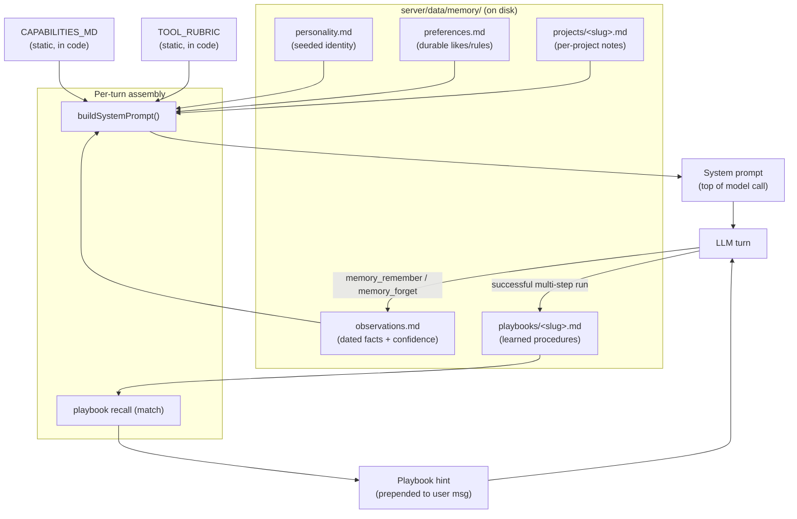
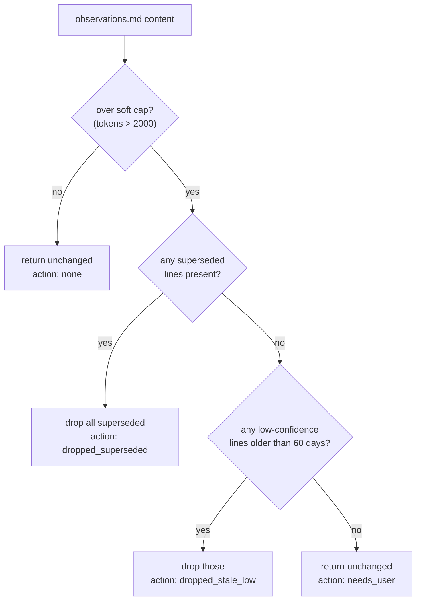
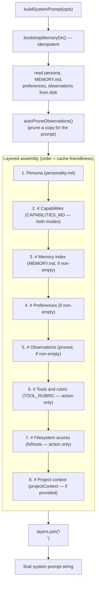
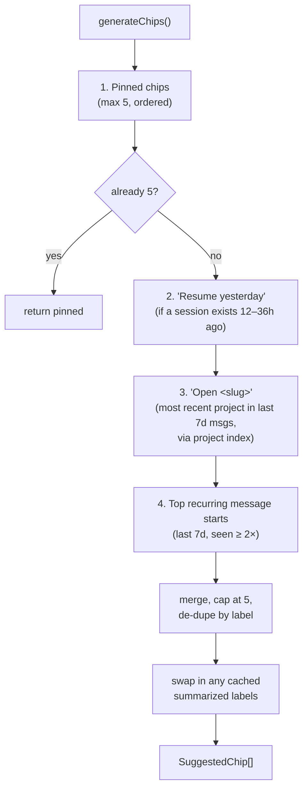
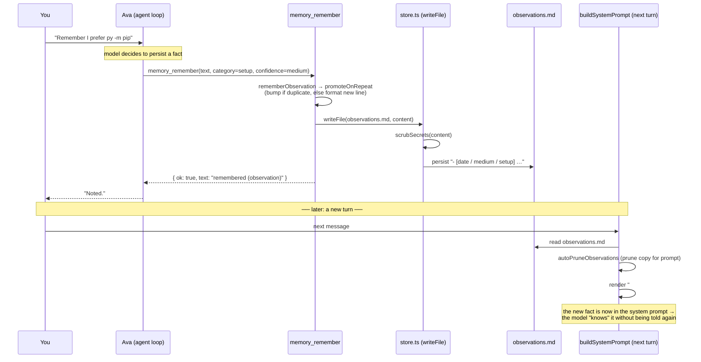

# 08 — Memory, Identity, the System Prompt, Learning & Suggestion Chips

This document covers how Ava knows who she is, what she remembers, how that memory
becomes the words at the top of every model call, how she learns reusable procedures
from successful work, and how she proposes next actions to you through suggestion
chips. These five systems together are Ava's "self": a durable identity plus an
evolving body of knowledge that survives across sessions and gets better with use.

Throughout, two roles are kept strictly separate:

- **Ava** is the runtime — the agent that runs on your Windows PC, talks to you,
  and calls tools. When Ava "remembers" something, it is Ava (or code on Ava's
  behalf) calling a memory tool during a live turn.
- **Claude** is the builder — the coding agent (this author) that changes Ava's
  source code. Claude leaves notes in a dev log that Ava reads back to you, always
  attributing Claude's work to Claude. (See [The Claude→Ava dev log](#the-claudeava-dev-log).)

All paths are absolute. Code citations use `path:line`.

---

## Table of contents

1. [The big picture](#1-the-big-picture)
2. [The memory system](#2-the-memory-system)
   - [Where memory lives on disk](#21-where-memory-lives-on-disk)
   - [The four memory files + projects + playbooks](#22-the-four-memory-files--projects--playbooks)
   - [The observation line format](#23-the-observation-line-format)
   - [Reading and writing (the store layer)](#24-reading-and-writing-the-store-layer)
   - [Bootstrap: seeding the directory](#25-bootstrap-seeding-the-directory)
   - [Budgets: soft caps and auto-pruning](#26-budgets-soft-caps-and-auto-pruning)
   - [Promotion, refresh, supersede, forget](#27-promotion-refresh-supersede-forget)
   - [Projects and the project index](#28-projects-and-the-project-index)
   - [The runtime memory tools (how Ava writes)](#29-the-runtime-memory-tools-how-ava-writes)
   - [Source-linked semantic index](#210-source-linked-semantic-index)
   - [Auto-learning from corrections](#211-auto-learning-from-corrections)
3. [Identity and the system prompt](#3-identity-and-the-system-prompt)
   - [The persona (seeded identity)](#31-the-persona-seeded-identity)
   - [The capability map](#32-the-capability-map)
   - [System-prompt assembly (the layering)](#33-system-prompt-assembly-the-layering)
   - [Conversation mode vs action mode](#34-conversation-mode-vs-action-mode)
   - [The secret-scrub firewall](#35-the-secret-scrub-firewall)
4. [The learning system (playbooks)](#4-the-learning-system-playbooks)
   - [What a playbook is](#41-what-a-playbook-is)
   - [Capture: learning from a successful run](#42-capture-learning-from-a-successful-run)
   - [Recall: matching and injecting a playbook](#43-recall-matching-and-injecting-a-playbook)
   - [Pruning playbooks](#44-pruning-playbooks)
5. [Suggestion chips and proactivity](#5-suggestion-chips-and-proactivity)
   - [What chips are](#51-what-chips-are)
   - [Chip generation](#52-chip-generation)
   - [Chip label summarization](#53-chip-label-summarization)
   - [The greeting](#54-the-greeting)
   - [Auto-title and auto-summary](#55-auto-title-and-auto-summary)
6. [The Claude→Ava dev log](#6-the-claudeava-dev-log)
7. [End-to-end workflows](#7-end-to-end-workflows)
   - [Workflow A: memory write → next prompt](#workflow-a-memory-write--next-prompt)
   - [Workflow B: playbook learn → reuse](#workflow-b-playbook-learn--reuse)
8. [Key files](#8-key-files)
9. [Unresolved questions / findings](#9-unresolved-questions--findings)

---

## 1. The big picture

Every time you send a message, Ava builds a fresh **system prompt** — the block of
instructions that sits above the conversation and tells the model who it is and what
it knows. That prompt is assembled, layer by layer, from files on disk: a seeded
**persona**, a static **capability map**, and whatever Ava has chosen to **remember**
(preferences, observations, project notes). On action turns it also gets a **tool
rubric**, the list of allowed **filesystem roots**, and — when relevant — a matched
**playbook** (a learned procedure) and **project context**.

The always-loaded preference/observation memory is not a database of conversation
history. It remains a small, curated set of Markdown files that Ava deliberately
writes using memory tools, and which a human can read and edit from the phone.
Alongside it, AVA now has a bounded SQLite **discovery index** for explicitly
selected research and developed ideas. That index stores compact summaries and
source references, not transcript copies; embeddings locate candidates but never
replace verification of the authoritative conversation messages.



The loop closes on itself: a turn can **write** to memory or **capture** a playbook,
and those writes change the *next* turn's prompt. That is how Ava "learns."

---

## 2. The memory system

### 2.1 Where memory lives on disk

The memory directory is resolved from config at
`C:/ai/chemiapebi/yovlisshemdzle/server/src/config.ts:60`:

```
const memoryDir = resolve(process.env.MEMORY_DIR ?? join(dataDir, "memory"));
```

In production that resolves to
`C:/ai/chemiapebi/yovlisshemdzle/server/data/memory/`. The path layout is defined
in one place — `C:/ai/chemiapebi/yovlisshemdzle/server/src/memory/paths.ts` — which
maps a directory to the set of files Ava uses:

| Logical name | File | Purpose |
|---|---|---|
| `personality` | `personality.md` | Seeded identity (the persona). |
| `memoryIndex` | `MEMORY.md` | Top-level index; primarily links project files. |
| `preferences` | `preferences.md` | Durable likes, rules, standing instructions. |
| `observations` | `observations.md` | Dated, confidence-tagged factual notes. |
| `projectsDir` | `projects/` | Directory of per-project note files. |
| `projectFile(slug)` | `projects/<slug>.md` | One project's notes. |

`paths.ts:13` enforces a **slug grammar** (`/^[a-z0-9][a-z0-9_-]*$/i`) and throws on
anything outside it, so a malformed or path-traversing project name (`../secrets`)
can never resolve to a file. This is the first line of defense for project paths.

Playbooks live in a sibling directory, `playbooks/`, under the same memory dir
(`C:/ai/chemiapebi/yovlisshemdzle/server/src/playbooks/store.ts:44`). They are
procedural memory and are covered in [section 4](#4-the-learning-system-playbooks).

> `MEMORY.md` and `projects/` are created lazily. A `memory_remember` call with
> `file=project` now creates the project file and automatically adds its link to
> `MEMORY.md`, activating project routing as soon as the saved project note contains
> an absolute path.

### 2.2 The four memory files + projects + playbooks

Ava distinguishes **kinds** of memory by *which file* a fact goes in:

- **personality.md** — who Ava is. Seeded once; never auto-written. A human edits it
  directly (or edits the source `personality-content.ts` and re-bootstraps).
- **preferences.md** — your standing preferences and rules ("always use `py -m pip`").
  Free-form lines, one per line. Written by `memory_remember` with `file=preferences`,
  or by you from the phone UI.
- **observations.md** — dated facts with a confidence tier and a category. This is the
  workhorse: most of what Ava "learns about you" lands here. Strictly formatted (see
  [§2.3](#23-the-observation-line-format)).
- **projects/<slug>.md** — notes scoped to a specific codebase/project, loaded only
  when that project is in play.
- **playbooks/<slug>.md** — *how* to do a recurring task, learned from a successful run.

The split matters because the system prompt renders them as separate labelled blocks
("Preferences", "Observations", "Project context"), and because pruning rules differ
per file ([§2.6](#26-budgets-soft-caps-and-auto-pruning)).

### 2.3 The observation line format

Observations are the only memory with rigid structure, because Ava needs to reason
about their age and reliability. The canonical format, parsed and produced by
`C:/ai/chemiapebi/yovlisshemdzle/server/src/memory/observations.ts`:

```
- [<date> / <confidence> / <category>] free-form text
```

For example, an observation line looks like (format: `[date / confidence / tag] text`):

```
- [2026-04-29 / medium / context] The owner lives in Ireland.
- [2026-05-05 / medium / setup] On this machine, pip should be called using `py -m pip` instead of `pip` directly.
```

- **date** — ISO `yyyy-mm-dd`, the day it was last affirmed.
- **confidence** — `low` | `medium` | `high`. Single explicit statement from you →
  `medium`; inferred from one session → `low`; re-seen across sessions → bumped up.
  The bump ladder is `low → medium → high` (capped) in `bumpConfidence`
  (`observations.ts:41`).
- **category** — one of `preferences | context | skills | setup | schedule | people`
  (the set the tool rubric tells Ava to use; the phone UI filters on exactly these,
  `C:/ai/chemiapebi/yovlisshemdzle/web/src/memory/MemoryScreen.tsx:6`).

A **superseded** line carries an extra marker so a contradicted fact is retired
without being deleted (kept for context, hidden from active use):

```
- [<date> / <confidence> / <category> / superseded <date>] free-form text
```

Two regexes (`observations.ts:11` for active, `:13` for superseded) parse these;
`parseObservation()` returns a typed `Observation` or `null`. Anything that does not
match — blank lines, prose, headings — is simply ignored by every consumer, which is
why the file tolerates hand-editing.

### 2.4 Reading and writing (the store layer)

All memory file I/O funnels through one tiny module,
`C:/ai/chemiapebi/yovlisshemdzle/server/src/memory/store.ts`, so behavior is uniform:

- `readFile(path)` — returns `""` for a missing file (never throws on absence).
- `writeFile(path, content)` — **scrubs secrets** before writing (`store.ts:10`).
- `appendLine(path, line)` — scrubs, then appends with newline hygiene (adds a
  leading `\n` if the existing file didn't end in one).

The critical detail is the scrub. Every write passes through
`scrubSecrets()` from `C:/ai/chemiapebi/yovlisshemdzle/server/src/security/scrub.ts`,
so an API key or token that slips into a remembered string is redacted *at the storage
boundary* — not at the call site, where it would be easy to forget. This is verified
end-to-end (see [§3.5](#35-the-secret-scrub-firewall)).

### 2.5 Bootstrap: seeding the directory

`C:/ai/chemiapebi/yovlisshemdzle/server/src/memory/bootstrap.ts` is responsible for
making the directory usable on a fresh machine:

```
export function bootstrapMemoryDir(opts: { dir: string }): void {
  const p = memoryPaths(opts.dir);
  mkdirSync(p.projectsDir, { recursive: true });        // creates dir + projects/
  if (!existsSync(p.personality)) {
    writeFileSync(p.personality, PERSONALITY_MD, "utf8"); // seed identity once
  }
}
```

Two properties matter:

1. **Idempotent.** It is guarded by `existsSync`, so calling it repeatedly is cheap
   and safe. `buildSystemPrompt()` calls it on every prompt build as defense-in-depth
   (`system-prompt.ts:53`) — tests and scripts that bypass server startup still get a
   valid dir.
2. **Your edits win.** It seeds `personality.md` *only if absent*. Once the file
   exists (seeded or hand-edited), bootstrap never overwrites it. The test at
   `C:/ai/chemiapebi/yovlisshemdzle/server/src/memory/bootstrap.test.ts:29` pins this
   ("does not overwrite an existing personality.md").

Note what bootstrap does **not** create: `MEMORY.md`, `preferences.md`, and
`observations.md` are not seeded. They come into existence the first time something
writes to them. This is why a brand-new install has only `personality.md` plus an
empty `projects/`.

### 2.6 Budgets: soft caps and auto-pruning

Memory must stay small — it is prepended to every model call, so unbounded growth
means unbounded cost and latency. `C:/ai/chemiapebi/yovlisshemdzle/server/src/memory/budgets.ts`
defines token budgets and an automatic pruning policy for observations.

**Caps** (`budgets.ts:3` and `:11`), in estimated tokens (`length / 4`):

| File | Soft cap | Hard cap |
|---|---|---|
| personality | 500 | 1000 |
| memoryIndex | 500 | 1000 |
| preferences | 1000 | 2000 |
| observations | 2000 | 4000 |
| project | 2000 | 4000 |

The **soft cap** is the trigger point for auto-pruning; the **hard cap** is the
ceiling the design treats as "must not exceed" (enforced by pruning + human review).

**`autoPruneObservations(content, { today, softCap })`** (`budgets.ts:40`) runs every
time the system prompt is built (`system-prompt.ts:62`). It is a graduated, *minimal*
prune — it removes the least valuable lines first and stops as soon as it's done one
pass that changed something:



- **Pass 1** drops superseded lines (already retired — safe to remove first).
- **Pass 2** drops `low`-confidence observations older than `STALE_DAYS = 60`
  (`budgets.ts:24`). Inferred, stale, never-reaffirmed guesses are the next to go.
- If still over cap, it returns `action: "needs_user"` and leaves content intact — the
  system never deletes medium/high-confidence facts on its own. That signals a human
  (or future logic) should curate.

Important nuance: at prompt-build time the pruned content is what gets **rendered into
the prompt**, but `system-prompt.ts` does *not* write the pruned result back to disk —
it prunes a copy for the prompt only (`system-prompt.ts:61`). So pruning here is
"what the model sees this turn," not a destructive file rewrite. (The `*-mcp` write
tools and the phone UI are the paths that actually mutate the file.)

### 2.7 Promotion, refresh, supersede, forget

Ava avoids duplicating memory and keeps confidence honest through four operations.

**Promote-on-repeat** (`C:/ai/chemiapebi/yovlisshemdzle/server/src/memory/promote.ts`).
When `memory_remember` writes an observation, `promoteOnRepeat()` first checks whether
an active line with the **same category** and a **normalized-equal text** already
exists (`normalizeForCompare` lowercases and strips punctuation, `promote.ts:7`). If
so, it bumps that line's confidence and updates its date (`kind: "promoted"`) instead
of appending a near-duplicate. Otherwise it appends (`kind: "appended"`). This is the
"seen again ⇒ I trust it more, I don't repeat myself" behavior.

**Refresh** (`applyRefresh`, `observations.ts:49`). Explicitly bump the first active
observation whose text contains a given substring — confidence up one tier, date set
to today. Invoked via `memory_remember` with `refresh=<substring>`. Used when Ava
re-encounters a known fact in a new session and wants to raise its tier without
restating it.

**Supersede** (`applySupersede`, `observations.ts:68`). Mark the first active
observation matching a substring as `superseded <today>`, then append the new
(contradicting) line. Invoked via `memory_remember` with `supersedes=<substring>`.
The old fact stays in the file (auditable) but is excluded from active reasoning and
is first in line for pruning.

**Forget** (`C:/ai/chemiapebi/yovlisshemdzle/server/src/memory/forget.ts`). Three
modes, surfaced through the `memory_forget` tool:
- `forgetLast()` — remove the most recent active observation. Backs "forget that"
  said right after a remember.
- `forgetMatch(target)` — remove the single active observation containing a substring;
  returns `ambiguous` with candidates if more than one matches (so Ava asks which),
  or `not_found`.
- `forgetProject(slug)` — delete the project file *and* scrub any preference/observation
  line that references the slug. It uses a carefully bounded token regex
  (`slugTokenRe`, `forget.ts:52`) with look-around so slug `yov` doesn't accidentally
  match inside `yovlisshemdzle` and `low` doesn't fire on `low-power`.

There is also **edit-lines** (`C:/ai/chemiapebi/yovlisshemdzle/server/src/memory/edit-lines.ts`),
the surgical edit/delete/append primitives the **phone UI** uses (via
`routes/memory.ts`) to let a human directly maintain preferences and observations.
`editLine`/`deleteLine` locate an exact line and return `{ kind: "stale", current }`
if the line is gone (someone else changed the file), which the UI turns into a 409 so
the screen reloads rather than clobbering newer state
(`C:/ai/chemiapebi/yovlisshemdzle/server/src/routes/memory.ts:35`).

### 2.8 Projects and the project index

Project memory lets Ava load notes that are only relevant to a particular codebase,
without bloating the always-on prompt.

`C:/ai/chemiapebi/yovlisshemdzle/server/src/memory/project-index.ts` builds an index
by scanning `MEMORY.md` for links of the form `projects/<slug>.md`
(`PROJECT_LINK_RE`, `project-index.ts:10`), then reading each linked project file and
extracting every absolute path it mentions (`PATH_RE`, `:11`) as that project's
**roots** (normalized to lowercase forward-slashes). The result is a list of
`{ slug, roots[] }`.

- `detectProject(text, index)` returns the project whose **longest** matching root
  appears in the given text (longest-match wins so a nested path beats its parent).
- `readProjectFile(memoryDir, slug)` returns the body for use as `projectContext`.

This index drives two things:
1. **System-prompt project context.** In the agent loop
   (`C:/ai/chemiapebi/yovlisshemdzle/server/src/orchestrator/agent.ts:110`), the
   initial user prompt is run through `detectProject`; if it matches, that project's
   file is passed as `projectContext` into `buildSystemPrompt`.
2. **Mid-run context switching.** As the agent calls tools, each tool's arguments are
   scanned (`detectProjectInArgs`, `agent.ts:289`). If a tool touches a *different*
   project than the one currently loaded, the agent **injects** that project's notes
   as a fresh `[PROJECT CONTEXT — <slug>]` user message mid-conversation
   (`agent.ts:211`). So if you start a task in one repo and Ava ends up operating on
   another, the relevant notes follow the work.
3. **A suggestion chip.** The chip generator uses the same index to offer an
   "Open <slug>" chip for recently-mentioned projects ([§5.2](#52-chip-generation)).

> The index is keyed off `MEMORY.md`. `memory_remember file=project` maintains that
> index automatically, and `memory_forget mode=project` removes the link again.
> Routing activates once the project note contains an absolute path.

### 2.9 The runtime memory tools (how Ava writes)

This is the heart of "how memory is written at runtime." Memory is **not** written by
some background process scraping the conversation. It is written when the model,
mid-turn, decides to call one of three tools defined in
`C:/ai/chemiapebi/yovlisshemdzle/server/src/tools/memory-mcp.ts`. The chat route
constructs memory tools for both of its tool sets, but `runAgent` deliberately
passes no tools to the model in conversation mode. Explicit remember/read/forget
requests route through action mode; in realtime voice, the speaking model hands
them to the action agent through `do_on_computer`.

**`memory_read`** (`memory-mcp.ts:10`) — read durable memory. `file` ∈
`all | preferences | observations | project` (project requires a `slug`). The tool's
description steers Ava to call this for "what do you remember about…?" rather than
reciting from the system prompt — so answers reflect the *current* file, not a possibly
stale prompt snapshot.

**`memory_remember`** (`memory-mcp.ts:58`) — write durable memory. Behavior by argument:
- `file=preferences` → append the trimmed `text` as a line.
- `file=project` + `project=<slug>` → append `text` to that project's file and
  ensure `MEMORY.md` links it.
- `file=observations` (default) → build a formatted observation from `text`,
  `category` (default `context`), and `confidence` (default `low`), then run it
  through `rememberObservation` → `promoteOnRepeat` (so repeats bump instead of
  duplicate, [§2.7](#27-promotion-refresh-supersede-forget)).
- `refresh=<substring>` → bump an existing observation (mutually exclusive with
  `supersedes`; only valid for observations).
- `supersedes=<substring>` → retire the matching observation, then append the new one.

It validates `confidence` against `{low, medium, high}` and returns a structured
`{ ok, text }` so the agent gets honest feedback (e.g. `"refresh: no matching
observation"`).

**`memory_forget`** (`memory-mcp.ts:141`) — drop memory. `mode` ∈
`last | match | project`, wrapping the three `forget.ts` functions. For `match` it
relays the `ambiguous` candidate list back to the model so Ava can ask you which one.

`rememberObservation` (`C:/ai/chemiapebi/yovlisshemdzle/server/src/memory/remember.ts`)
is the thin glue: serialize → `promoteOnRepeat` → `writeFile` (which scrubs). The
**tool rubric** in the system prompt
(`C:/ai/chemiapebi/yovlisshemdzle/server/src/orchestrator/tool-rubric.ts:78`) teaches
Ava the exact line format, the confidence ladder, and *when* to use refresh vs
supersede vs forget — so the model produces well-formed calls without the tool having
to repair bad input.

### 2.10 Source-linked semantic index

`server/src/memory-index/` implements a separate retrieval layer for substantial
research, developed ideas and explicit "remember this discussion" requests. Its
canonical entry is a sanitized compact record in SQLite: title, summary,
conclusions, open questions, next steps, tags, privacy scope and timestamps. A
source row points to an exact persisted message range and stores a SHA-256 content
fingerprint. Transcript bodies are not copied into the index.

After a clean persisted assistant turn, `AutoMemoryCaptureCoordinator` applies a
deterministic category gate. Explicit research requests and ideas developed over
multiple turns may be summarized by a conservative side model; routine chat,
failed or contradicted work, interruptions and delegated `persist:false` action turns do
not enter automatic memory. The same post-turn seam is used by chat, OpenAI
Realtime and Hume, so provenance records whether the source was typed or spoken.
Assistant-message keyed claim rows make replay and concurrent delivery
idempotent without storing another transcript copy.

The runtime tools are:

- `memory_index_capture` selects a bounded range (maximum 80 messages), sanitizes
  the supplied compact record, persists it idempotently and creates an embedding
  when a provider is configured.
- `memory_index_search` combines exact/keyword overlap with cosine similarity. It
  still works in lexical fallback mode if the embedding provider is absent or
  fails, and reports that fallback rather than hiding it.
- `memory_index_open` loads a bounded sanitized source range after retrieval when
  a detailed answer needs more than the compact locator summary.
- `memory_index_forget` soft-deletes one exact version and immediately removes its
  vector. It does not delete the original conversation.

Every list, get and search result recomputes the authoritative range fingerprint.
Only `source.status=verified` produces `usable=true`; changed or unavailable
sources remain visible as diagnostic evidence but must not ground an answer.
Personal entries are visible in the default scope. Project entries require the
same explicit project boundary and are excluded from other projects.

The default adapter is OpenAI `text-embedding-3-small`, following the official
[embeddings API shape](https://developers.openai.com/api/docs/guides/embeddings#how-to-get-embeddings).
Provider, model, vector dimensions and sanitized-input hash travel with every
vector so incompatible spaces are never compared. SQLite summaries and sources
remain authoritative; vectors are replaceable discovery data. See
[`docs/features/semantic-memory-index.md`](../features/semantic-memory-index.md)
for the contract, limitations and test procedure.

Automatic capture now covers completed research and the first mature checkpoint
of a meaningfully developed idea. Linked revisions/topic-change checkpoints and
automatic retrieval injection remain deferred; explicit capture/search/open/
forget continue to use the same canonical records and evidence boundary.

### 2.11 Auto-learning from corrections

Beyond explicit `memory_remember` calls, Ava captures one signal automatically: **you
correcting her**. In `chat.ts:125`, before each turn dispatches, the new user message
is checked by `detectCorrection`
(`C:/ai/chemiapebi/yovlisshemdzle/server/src/orchestrator/correction-detector.ts`):

- The **prior** message must be an `assistant` turn,
- within `STALENESS_MS = 5 minutes`,
- and the new text must start with a negation pattern
  (`/^(no|nope|wrong|actually|stop|don't|do not|instead)\b/i`, `correction-detector.ts:1`).

When all three hold, `formatCorrection` pairs the rejected assistant line with your
objection — `(corrected) Ava said: "…" — Sir: "…"` — and it is written as a
**low-confidence `preferences` observation**, fire-and-forget, never blocking the
reply (`chat.ts:136`). The live `observations.md` is full of these (e.g. the
`하이/"Hi Ava"` mishaps), which is exactly the intent: a passive record of where Ava
got it wrong, available for a human to review and promote, prune, or act on. It is
deliberately low-confidence because a bare "no" carries little signal on its own; the
*paired* assistant line is what makes the entry actionable later.

---

## 3. Identity and the system prompt

### 3.1 The persona (seeded identity)

Ava's identity is a fixed block of prose,
`PERSONALITY_MD`, in
`C:/ai/chemiapebi/yovlisshemdzle/server/src/memory/personality-content.ts`. It is the
**source of truth** for `personality.md` — bootstrap copies it verbatim on first run.

Persona v2 (revised 2026-08-28) keeps this file deliberately small: poised,
perceptive, warm without being sugary, candid, and capable. "JARVIS-like" describes
bearing rather than imitation. It uses "Sir" naturally and sparingly, never invents
shared history, and is warm toward Niko while remaining rigorous toward the problem.

Collaboration policy and contextual delivery no longer live inside the identity
prose. `server/src/persona/runtime.ts` defines the shared collaboration contract and
five closed registers: casual, execution, brainstorming, repair, and high stakes.
The current turn selects one register without copying raw user text into the system
block. Chat and voice share these rules; voice adds only spoken-delivery guidance.
See `docs/features/persona-v2.md` for the complete architecture and the 50-scenario
Persona Consistency Lab.

The persona is **never auto-written** by Ava. It changes only when a human edits
`personality.md`, or when a developer edits `personality-content.ts` and the file is
re-seeded. The byte length is pinned in `bootstrap.test.ts` (currently `1451`) so an
accidental edit to the canonical text surfaces in CI as a drift failure; intentional
changes must update that number.

### 3.2 The capability map

`CAPABILITIES_MD` in
`C:/ai/chemiapebi/yovlisshemdzle/server/src/orchestrator/capabilities-content.ts` is a
static, first-person inventory of *what Ava can actually do* — converse/speak, run
shell, read/write files within allowlisted roots, open apps, drive a persistent
Chromium, computer-use vision control, spawn Claude Code, take screenshots, control
native apps via UI Automation, remember, read Claude's update notes, confer with
Claude, improve its own code, and the PWA/push interface — plus the guardrails it
keeps.

Its job is **recall**: it is loaded in *both* conversation and action modes
(`system-prompt.ts:70`) so Ava reliably knows its own reach and never says "I can't"
about a capability it has before a tool has actually failed. It is the in-prompt
source of truth; a fuller human-readable reference lives at
`C:/ai/chemiapebi/yovlisshemdzle/docs/AVA-CAPABILITIES.md` and the two are meant to be
kept in step. Like the persona and rubric, it is byte-stable so OpenAI's prompt cache
hits the prefix.

### 3.3 System-prompt assembly (the layering)

`buildSystemPrompt(opts)` in
`C:/ai/chemiapebi/yovlisshemdzle/server/src/orchestrator/system-prompt.ts` assembles
the prompt from layers, joined with blank lines. The order is deliberate: the **static
prefix first** (persona + capabilities) so the prompt cache hits, then the dynamic
memory blocks, then (action-only) the rubric and fs roots, then project context last.



Mechanics worth noting:
- Each dynamic block is wrapped by `block(label, body)` (`system-prompt.ts:32`), which
  trims trailing whitespace and **returns `""` for empty bodies** — so an empty
  preferences file contributes nothing rather than a bare `# Preferences` header.
- Layers 1 and 2 (persona, capabilities) are always present and static — this is the
  cacheable prefix. Comments in the file call this out explicitly: "kept in the stable
  cache prefix right after the persona" (`system-prompt.ts:68`).
- The **fs-roots block** (`buildFsRootsBlock`, `system-prompt.ts:38`) lists the exact
  allowlisted directories and instructs Ava to write only within them (and to retry
  under an allowed root if a write is rejected) — so the model targets a path that
  will actually be accepted instead of guessing one outside the allowlist. It is
  config-fixed, so it stays byte-stable across turns.
- `today` is injectable for deterministic tests; otherwise it's `isoToday()`.

### 3.4 Conversation mode vs action mode

The prompt (and the whole turn) runs in one of two modes, decided by intent.

**Who decides.** `classifyIntent(message)` in
`C:/ai/chemiapebi/yovlisshemdzle/server/src/orchestrator/intent-classifier.ts` returns
`action` only on a strong, unambiguous tool-use signal — an explicit tool name, a URL,
an absolute path, a memory op, or an imperative verb paired with an object
(`ACTION_PATTERNS`, `intent-classifier.ts:12`). Everything else defaults to
`conversation`.

**How it's actually applied** (`chat.ts:224`):
- **Typed text** uses the action-biased `classifyTypedIntent`: only unmistakable short
  chitchat stays conversational; task-shaped or longer input gets the full action
  stack. (`FORCE_INTENT=conversation` can override this for testing.)
- **Voice** trusts the classifier: a spoken "hi Ava" stays conversational (fast
  side-model, no big tool prompt, no playbook recall), and only a genuine action
  request spins up the full agent. This keeps spoken replies snappy.

**What changes between modes:**

| Aspect | Conversation | Action |
|---|---|---|
| Persona + Capabilities | ✅ included | ✅ included |
| Memory blocks (prefs/obs/index) | ✅ included | ✅ included |
| `TOOL_RUBRIC` layer | ❌ omitted (dead prefill — tools aren't exposed) | ✅ included |
| `fsRoots` layer | ❌ omitted | ✅ included |
| Tools exposed to model | ❌ none (model can't call tools) | ✅ full registry |
| Model used | `defaultSideModel` (fast/cheap) | `defaultOrchestratorModel` |
| Thin tools constructed by chat route | ✅ constructed but withheld from model | ✅ |
| Playbook recall | ❌ skipped | ✅ (text only) |

The mode is threaded from `chat.ts` into `runAgent`, which selects the model and tool
visibility (`agent.ts:129`). Conversation mode receives memory in its prompt but no
callable tools. Tool work, including memory mutation, must route through action mode;
the realtime voice model does this with `do_on_computer`.

### 3.5 The secret-scrub firewall

Because memory is written from model-driven tool calls, a leaked secret could end up
persisted. The defense is the store-layer scrub ([§2.4](#24-reading-and-writing-the-store-layer)),
and it is verified **end-to-end** in
`C:/ai/chemiapebi/yovlisshemdzle/server/src/orchestrator/system-prompt-firewall.test.ts`:
a mock model emits a `memory_remember` whose text contains
`OPENAI_API_KEY=sk-AAAA…`, the full `runAgent` loop executes it, and the test asserts
the persisted `observations.md` contains `sk-***` and **not** `sk-AAAA`
(`system-prompt-firewall.test.ts:55`). The scrub happening inside `writeFile` (not at
the tool) is what makes this airtight regardless of which write path is used.

---

## 4. The learning system (playbooks)

### 4.1 What a playbook is

A **playbook** is procedural memory: the high-level recipe for a kind of task Ava has
successfully completed before, so the next similar request follows a known path faster.
It is *not* a macro — it stores the **gist of the approach, not exact values** (no
specific URLs or file contents).

The on-disk shape (`C:/ai/chemiapebi/yovlisshemdzle/server/src/playbooks/store.ts:15`)
is a Markdown file with a small front-matter header and a numbered steps list. A real
example from production (`playbooks/user-asks-what-is-happening-in-the-repo-or-statu.md`):

```
---
trigger: User asks what is happening in the repo or status of a model/persona change
keywords: repo status, latest commit, model change, persona, voice, bootstrap, tests, implementing
created: 2026-06-05
last_used: 2026-06-06
uses: 4
stakes: consequential
---
# Steps
1. Confirm task status separately from repo state (e.g., still implementing vs shipped)
2. Fetch and read the latest commit message and diff summary
3. Summarize the commit's intent in plain language
...
```

Fields:
- **trigger** — one line describing the kind of request this handles (also slugified
  for the filename, `slugify`, `store.ts:11`).
- **keywords** — hint terms (stored, not currently used by the matcher — see findings).
- **created / last_used / uses** — lifecycle counters used by pruning and ranking.
- **stakes** — `routine` or `consequential`. Drives the recall rubric (below).
- **steps** — the high-level procedure.

`stakes` is computed at capture from the tools the run used
(`stakesOf`, `C:/ai/chemiapebi/yovlisshemdzle/server/src/playbooks/distill.ts:16`): if
any **mutating** tool ran (`fs_write`, `fs_delete`, `shell`, `claude_code`,
`computer_use`, chrome type/click/press, `memory_remember`, `memory_forget`,
`self_improve` — the `MUTATING_TOOLS` set at `distill.ts:10`) the playbook is
`consequential`; pure reads/navigation are `routine`. The code deliberately does **not**
reuse the policy risk classifier here, because that rates `fs_write` as "low" which
would mislabel writes.

### 4.2 Capture: learning from a verified run

Capture is wired into the chat route. As the agent runs, `chat.ts` collects each tool
step and carries validated post-action evidence through the shared tool-result event.
`final` records response text but does not teach. When `done`, `error`, or `killed`
arrives, AVA builds the terminal task receipt and settles learning exactly once.

`maybeCapture` (`C:/ai/chemiapebi/yovlisshemdzle/server/src/playbooks/capture.ts`)
gates strictly:
- **Only on verified task-outcome evidence.** A final reply, executor `ok`,
  response delivery, operation-only evidence, or an approval/cancellation boundary
  cannot create or replace a procedure.
- **Only multi-step** (`steps.length >= 2`) — a one-tool task isn't worth a playbook.
- **No unresolved failed tail or mostly-failed trace.** Recovered detours may still
  become lessons only when the final task outcome itself has independent proof.

If gated through, it calls `distillPlaybook`
(`C:/ai/chemiapebi/yovlisshemdzle/server/src/playbooks/distill.ts:20`): the **side
model** is asked to compress the goal + the tool-call trace + the outcome into a JSON
`{ trigger, keywords, steps }`. The result becomes a `Playbook` (with `uses: 1`,
`stakes` computed from the actual tools), is written to disk, and then `prunePlaybooks`
runs to keep the library bounded. Capture is best-effort and never surfaces to you;
failures are reported via an `onError` hook (default `console.warn`) rather than
swallowed silently — a comment notes a silent swallow once hid a 400 that made the
whole feature inert (`capture.ts:13`).

> **Live-state finding.** The production `playbooks/` directory holds ~50 playbooks
> (WhatsApp focus/search, Google/Bing Maps lead scraping, file create-and-verify,
> allowlist edits, "what changed in the repo," voice-research tasks, etc.). The
> capture loop is demonstrably **live and working** — this is real learned procedural
> memory accumulated from actual sessions.

### 4.3 Recall: matching and injecting a playbook

Recall happens in `chat.ts:238`, **before** the agent runs, and only when: mode is
`action`, a provider exists, it is **not** a voice turn, and the playbook index is
non-empty. (Voice skips recall to stay fast.)

Steps:
1. `loadPlaybookIndex(memoryDir)` reads every playbook's `{ slug, trigger }`
   (`store.ts:62`).
2. `matchPlaybook` (`C:/ai/chemiapebi/yovlisshemdzle/server/src/playbooks/match.ts`)
   asks the **side model** to pick the single best-matching slug for the request, or
   `none`. It returns a slug only if it's actually in the index (guards hallucinated
   slugs, `match.ts:22`).
3. The match is **bounded by an 8s timeout** (`PLAYBOOK_MATCH_TIMEOUT_MS`,
   `chat.ts:65`) and wrapped in try/catch — recall is an optimization and must never
   stall or break a turn. On timeout/error it degrades to "no playbook injected" and
   the agent runs normally.
4. On a hit: `readPlaybook` loads the full body, `bumpUse` increments `uses` and sets
   `last_used` to today (`mutate.ts:9`), and a `[PLAYBOOK — <slug>]` block is built and
   prepended to the user prompt (`chat.ts:260`). The block carries a **stakes rubric**:
   - `consequential` → "follow these steps efficiently, but **verify the result before
     reporting done**."
   - `routine` → "follow these steps efficiently; no recheck needed."

The matcher is local and lexical. It scores meaningful trigger-token coverage and
uses keyword hits only as corroboration; keywords alone cannot select a playbook.
This is effectively instantaneous and deliberately prefers no match over a loose one.

### 4.4 Pruning playbooks

`prunePlaybooks` (`C:/ai/chemiapebi/yovlisshemdzle/server/src/playbooks/mutate.ts:15`),
run after each capture, keeps the library small and high-value:
1. **Drop stale one-offs** — any playbook with `uses <= 1` *and* `last_used` (or
   `created`) older than `MAX_AGE_DAYS = 60` (`capture.ts:7`). A procedure tried once
   and never reused expires.
2. **Drop contradicted or repeated evidence-backed failures.** Once gate evidence
   exists, it supersedes legacy final-response counters for demotion and pruning.
3. **Enforce a soft cap** — `SOFT_CAP = 50` (`capture.ts:6`). If over, keep the
   most-used (tie-break newest `last_used`) and drop the rest. So the library
   self-selects toward your genuinely recurring tasks.

---

## 5. Suggestion chips and proactivity

### 5.1 What chips are

**Chips** are the tappable suggestion buttons shown below the composer in the PWA —
one-tap shortcuts to a prepared prompt. They come in two sources:
- **pinned** — chips a human created/pinned, stored per-device in SQLite
  (`chip_overrides` table, `C:/ai/chemiapebi/yovlisshemdzle/server/src/state/chip-overrides.ts`).
  CRUD'd via `POST/PATCH/DELETE /api/chips`
  (`C:/ai/chemiapebi/yovlisshemdzle/server/src/routes/chips.ts`).
- **auto** — chips Ava *generates* from your recent behavior (resume yesterday, open a
  recent project, your recurring message starts).

They are proactivity made concrete: Ava proposing the next likely action rather than
waiting to be asked. The merged list is capped at **5**, pinned always winning.

### 5.2 Chip generation

`generateChips(opts)` in
`C:/ai/chemiapebi/yovlisshemdzle/server/src/orchestrator/chip-generator.ts` builds the
list for `GET /api/chips/suggested`:



- **Resume yesterday** (`chip-generator.ts:45`) — emitted if any message exists in the
  12–36h-ago window. Prompt: "What did we leave off on yesterday?"
- **Open <slug>** (`:57`) — scans the last 7 days of *your* messages, runs each through
  `detectProject` against the project index, and offers the first match. (Dormant until
  `MEMORY.md` exists — same caveat as [§2.8](#28-projects-and-the-project-index).)
- **Recurring starts** (`:72`) — counts the first 40 chars of recent user messages and
  surfaces those seen **≥ 2 times** (`topRecurringStarts`, `:118`), turning your
  habitual asks into one-tap chips.

De-duplication is by lowercased label (`push`, `:94`); pinned labels are pre-seeded
into the "seen" set so an auto chip never duplicates a pinned one.

### 5.3 Chip label summarization

Auto chips initially carry a raw label (a truncated prompt). To make them read like
crisp buttons, `summarizeChips`
(`C:/ai/chemiapebi/yovlisshemdzle/server/src/orchestrator/chip-summarizer.ts`) asks the
**side model** to rewrite each into a ≤6-word imperative label
(`chip-summarizer.ts:9`). Results are cached per-device with a 24h TTL in
`chip_label_cache` (`C:/ai/chemiapebi/yovlisshemdzle/server/src/state/chip-label-cache.ts`),
keyed by a hash of the prompt. The route fires summarization **in the background** for
cache-misses and returns immediately (`chips.ts:56`); `generateChips` swaps in any
cached label it finds (`chip-generator.ts:83`). So the first render may show a raw
label and subsequent renders show the polished one — no blocking on the LLM. On error
or no provider it falls back to a capitalized truncation (`chip-summarizer.ts:69`).

### 5.4 The greeting

The greeting is the once-per-day proactive opener.
`decideGreeting(opts)` in
`C:/ai/chemiapebi/yovlisshemdzle/server/src/orchestrator/greeting.ts` runs at the top
of each turn (`chat.ts:202`). If the device hasn't been greeted **today**
(`last_greeting_date`, tracked in device-state), it marks it greeted and returns a
synthetic `[GREETING CONTEXT]` prefix (`greeting.ts:64`) that is prepended to the user
prompt for that one turn. The prefix tells Ava: it's the first session today
(with time-of-day morning/afternoon/evening), what your **last message** was and how
long ago (with the session title if any), and to greet → summarize where you left off →
ask what's next, in under three sentences. The model writes the actual greeting; this
just gives it the context. It's a per-day flag, so it fires once and stays quiet the
rest of the day.

### 5.5 Auto-title and auto-summary

Two more background niceties keep sessions tidy (both fire-and-forget, both use the
side model, both degrade gracefully):

- **Auto-title** (`C:/ai/chemiapebi/yovlisshemdzle/server/src/orchestrator/auto-title.ts`)
  — on a brand-new session, the first message is summarized into a 3–7 word title
  (`auto-title.ts:28`), replacing the provisional 60-char slice. Falls back to a
  truncation on failure.
- **Auto-summary** (`C:/ai/chemiapebi/yovlisshemdzle/server/src/orchestrator/auto-summary.ts`)
  — once a session exceeds **50 messages** (`threshold`), older messages (all but the
  most recent 20) are collapsed into a 6–12 bullet summary that preserves names,
  numbers, paths, and outcomes (`auto-summary.ts:14`). It is idempotent
  (`summary_through_message_id` guards re-work) and runs fire-and-forget so it only
  affects *future* turns. On the next turn, `chat.ts` sends the summary as a
  `[CONVERSATION SUMMARY OF EARLIER MESSAGES]` header plus only the messages after the
  summarized point (`chat.ts:194`), keeping context windows bounded on long sessions.

---

## 6. The Claude→Ava dev log

This is how Ava honestly tells you what **Claude** (the builder) changed — without
claiming Claude's work as her own.

- **The log.** `C:/ai/chemiapebi/yovlisshemdzle/server/src/self/dev-log.ts` is an
  append-only JSON-lines store at `<dataDir>/claude-updates.jsonl`. Each entry is
  `{ ts, phase, title, detail?, commits? }`, where `phase` ∈ `started | shipped | note`.
  `readDevLog(limit)` returns the last N (skipping malformed lines);
  `currentInProgress()` walks backward and returns the most recent `started` with no
  later `shipped` — i.e. "an update is in flight" (`dev-log.ts:48`).
- **How Claude writes it.** Claude drops one entry as JSON into a temp file and runs
  `C:/ai/chemiapebi/yovlisshemdzle/server/scripts/claude-note.ts`, which stamps `ts`
  and appends the line. The convention (per project memory): a `started` note when a
  substantive change begins, a `shipped` note when done.
- **How Ava reads it.** The `read_claude_updates` tool
  (`C:/ai/chemiapebi/yovlisshemdzle/server/src/tools/update-log-mcp.ts`) is wired in
  **both** modes (`chat.ts:387` / `:398`) so you can ask "what's happening?" by voice.
  It surfaces an `IN PROGRESS — Claude is currently: …` banner plus recent entries. Its
  description (`update-log-mcp.ts:19`) and the capability map both **command honest
  attribution**: "Attribute Claude's actions to Claude and your own requests to
  yourself; never claim Claude's work as your own." This is the runtime expression of
  the Ava-vs-Claude separation that runs through the whole system.

---

## 7. End-to-end workflows

### Workflow A: memory write → next prompt

How a fact Ava decides to remember becomes part of the next turn's identity.



Step by step:
1. **Decide.** Mid-turn, the model (steered by the persona + tool rubric) decides a
   fact is worth keeping and calls `memory_remember` with the right `file`, `category`,
   and `confidence`. (Or: you correct Ava and `detectCorrection` auto-writes a
   low-confidence preference, [§2.10](#210-auto-learning-from-corrections).)
2. **Normalize.** `rememberObservation` → `promoteOnRepeat` either **bumps** an existing
   equivalent line (no duplicate) or formats a new one.
3. **Scrub + persist.** `writeFile` redacts any secret, then writes `observations.md`.
4. **Surface next turn.** On the *next* prompt build, `buildSystemPrompt` reads the
   file, prunes a copy to budget, and renders it as the `# Observations` block — so the
   fact is now part of Ava's standing knowledge. No re-teaching required.

### Workflow B: playbook learn → reuse

How a successful multi-step task becomes a faster path next time.

```mermaid
sequenceDiagram
  participant You
  participant Chat as chat.ts
  participant Agent as runAgent
  participant Side as side model
  participant PB as playbooks/<slug>.md

  rect rgb(235,245,255)
  Note over You,PB: ── Run 1: LEARN ──
  You->>Chat: "find local shops with no website" (action turn)
  Chat->>Agent: run with full tools
  Agent->>Agent: chrome_navigate, chrome_read_page, fs_write … (all ok)
  Agent-->>Chat: final (success)
  Chat->>Chat: runSteps≥2 && no tool failed?
  Chat->>Side: distillPlaybook(goal, tool-trace, outcome)
  Side-->>Chat: { trigger, keywords, steps }
  Chat->>PB: writePlaybook (uses=1, stakes=consequential)
  Chat->>PB: prunePlaybooks (drop stale one-offs, cap 50)
  end

  rect rgb(235,255,240)
  Note over You,PB: ── Run 2: REUSE ──
  You->>Chat: "get me shops near me without a site" (action turn, text)
  Chat->>Chat: loadPlaybookIndex (slug+trigger)
  Chat->>Side: matchPlaybook(request, index)  [≤8s timeout]
  Side-->>Chat: matching slug
  Chat->>PB: readPlaybook + bumpUse (uses++, last_used=today)
  Chat->>Agent: prompt += "[PLAYBOOK — slug]\n<stakes rubric>\n1. … 2. …"
  Agent->>Agent: follows known steps; verifies (consequential) before "done"
  end
```

Step by step:
1. **Run 1 succeeds.** An action turn uses ≥2 tools and no tool fails. On `final`,
   `chat.ts` calls `maybeCapture`.
2. **Distill.** The side model compresses the goal + tool trace + outcome into
   `{ trigger, keywords, steps }`; `stakes` is computed from the tools used.
3. **Store + prune.** The playbook is written (`uses: 1`) and the library is pruned to
   stay ≤50 and free of stale one-offs.
4. **Run 2 — recall.** On a later *similar* action text turn, `chat.ts` loads the
   index and asks the side model (bounded 8s) to match the request to one slug.
5. **Inject + bump.** On a hit, the playbook body is prepended as a `[PLAYBOOK]` block
   with a stakes-appropriate rubric, and `uses`/`last_used` are bumped (which also
   protects it from pruning). Ava follows the known path — and, for consequential
   playbooks, verifies the result before reporting done.

---

## 8. Key files

Memory core (`C:/ai/chemiapebi/yovlisshemdzle/server/src/memory/`):
- `paths.ts` — file layout + slug grammar.
- `store.ts` — read/write/append with secret-scrub on write.
- `bootstrap.ts` — seed dir + `personality.md` (idempotent, non-clobbering).
- `personality-content.ts` — `PERSONALITY_MD`, the canonical persona.
- `observations.ts` — line format, parse/serialize, confidence bump, refresh/supersede.
- `budgets.ts` — soft/hard caps + `autoPruneObservations`.
- `promote.ts` — promote-on-repeat (dedupe + confidence bump).
- `remember.ts` — glue: serialize → promote → write.
- `forget.ts` — forget last/match/project.
- `edit-lines.ts` — surgical edit/delete/append for the phone UI.
- `file-view.ts` — `readMemoryView` for the `/api/memory` screen.
- `project-index.ts` — build index from `MEMORY.md`, detect project by path.

System prompt (`C:/ai/chemiapebi/yovlisshemdzle/server/src/orchestrator/`):
- `system-prompt.ts` — `buildSystemPrompt` layering.
- `capabilities-content.ts` — `CAPABILITIES_MD`.
- `tool-rubric.ts` — `TOOL_RUBRIC` (action-mode tool/memory rules).
- `intent-classifier.ts` — conversation vs action.
- `agent.ts` — the loop; wires project context + mid-run switching.

Playbooks (`C:/ai/chemiapebi/yovlisshemdzle/server/src/playbooks/`):
- `store.ts` — serialize/parse/read/write/list/index.
- `distill.ts` — side-model distillation + stakes classification.
- `capture.ts` — `maybeCapture` gating + prune.
- `match.ts` — side-model recall.
- `mutate.ts` — `bumpUse` + `prunePlaybooks`.

Chips / proactivity (`C:/ai/chemiapebi/yovlisshemdzle/server/src/orchestrator/` + `state/` + `routes/`):
- `chip-generator.ts`, `chip-summarizer.ts` — generate + label chips.
- `greeting.ts`, `auto-title.ts`, `auto-summary.ts` — proactive openers + tidy-up.
- `correction-detector.ts` — auto-learn from pushback.
- `state/chip-overrides.ts`, `state/chip-label-cache.ts` — pinned chips + label cache.
- `routes/chips.ts`, `routes/memory.ts` — HTTP surfaces.
- `web/src/memory/MemoryScreen.tsx` — the phone memory editor.

Runtime tools (`C:/ai/chemiapebi/yovlisshemdzle/server/src/tools/`):
- `memory-mcp.ts` — `memory_read` / `memory_remember` / `memory_forget`.
- `update-log-mcp.ts` — `read_claude_updates`.

Dev log (`C:/ai/chemiapebi/yovlisshemdzle/server/src/self/`):
- `dev-log.ts` — Claude→Ava JSONL changelog; `scripts/claude-note.ts` writes it.

Wiring: `C:/ai/chemiapebi/yovlisshemdzle/server/src/routes/chat.ts` ties together
greeting, correction-detection, intent/mode, playbook recall, the tool set per mode,
and playbook capture.

---

## 9. Unresolved questions / findings

1. **Playbook `keywords` are captured but unused at recall.** `distill.ts` stores a
   `keywords` array and `store.ts` parses it, but `match.ts` feeds the side model only
   `slug: trigger` lines (`match.ts:12`). Keywords currently contribute nothing to
   matching. Either wire them into the match prompt or drop them — right now they're
   dead weight in every file.

2. **Auto-learned corrections accumulate as low-confidence noise.** The live
   `observations.md` shows many `(corrected)` preference lines (often capturing
   transient confusion like mis-heard voice input, not durable preferences). They're
   low-confidence by design and will eventually be pruned if they age past 60 days
   while still low — but they never get *promoted* automatically, and nothing
   distinguishes a meaningful correction ("use py -m pip") from a one-off
   ("No, I said Hi Ava"). *Open question:* should there be a periodic distill/cleanup
   pass that promotes genuine corrections into clean preferences and drops the noise?
   Currently curation is entirely manual (phone UI) or passive (60-day stale-low prune).

3. **Pruning at prompt-build is non-destructive; the file can exceed soft cap on
   disk.** `buildSystemPrompt` prunes a *copy* for the prompt and never writes back
   (`system-prompt.ts:61`). The actual `observations.md` only shrinks when a human
   edits it or `memory_forget`/`forgetProject` runs. So a file can sit above the
   2000-token soft cap on disk indefinitely while the prompt stays trimmed. This is
   probably intentional (don't let prompt assembly silently delete user data), but it
   means "the prompt is bounded" and "the file is bounded" are different guarantees —
   worth confirming that's the desired contract.

4. **`autoPruneObservations` stops after the first effective pass.** Each call drops
   *either* superseded *or* stale-low lines, not both in one pass (it returns as soon
   as one pass changes content, `budgets.ts:55`/`:65`). Over repeated turns it
   converges, but a single over-budget turn is only partially trimmed. Likely fine
   (prompts are rebuilt every turn) but noting it in case a turn needs maximal trimming
   immediately.

5. **No explicit hard-cap enforcement in code.** `HARD_CAPS` is defined
   (`budgets.ts:11`) and referenced in docs/tests, but I did not find a runtime path
   that *enforces* the hard cap (the auto-pruner only uses `softCap`). Hard caps appear
   to be an advisory ceiling backed by the `needs_user` signal rather than an automatic
   truncation. Worth confirming whether an enforcement path is intended.
