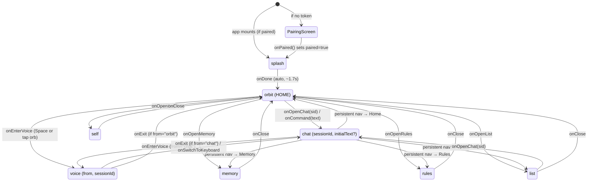
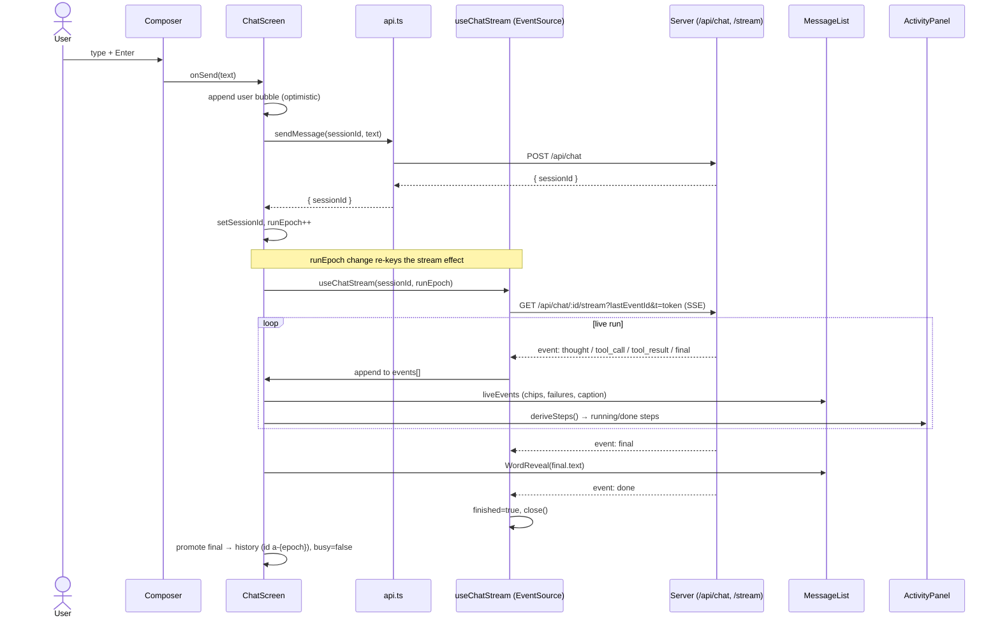

# 09 — The Web / PWA Frontend

This document covers Ava's **frontend**: the Vite + React 19 single-page app in `web/`. It runs as an **installable PWA in a desktop browser on the owner's Windows PC** (it is also Tailscale- and phone-capable, but desktop is the primary, designed-for surface). The frontend talks to the Node/TS server in `server/` over plain HTTP/JSON plus a Server-Sent-Events (SSE) stream for live agent output, and a WebSocket for realtime voice.

The whole UI is a **state machine in `App.tsx`**, not a router. There are no URLs per screen; there is one in-memory `view` value, and changing it cross-fades between full-screen surfaces. Everything below builds on that.

Term note: "view" = a top-level screen (home, chat, voice, a settings panel). "Session" = one persisted chat conversation, identified by a `sessionId` string. "Run" / "turn" = one user message and Ava's full response to it (which may include many tool calls). "SSE" = Server-Sent Events, a one-way server→client stream over a long-lived HTTP response, consumed in the browser by `EventSource`.

---

## 1. Tech stack and entry point

| Piece | Choice | Where |
|---|---|---|
| Build tool / dev server | **Vite 7** | `web/vite.config.ts` |
| UI framework | **React 19** (StrictMode) | `web/src/main.tsx` |
| Animation | **GSAP 3.13+** (Flip, Morph, Draw, Scramble) + **Motion** (`motion/react`, the successor to Framer Motion) | `web/src/lib/gsap.ts` |
| 3D | **three.js** (the home's dotted surface) | `web/src/components/ava/DottedSurface.tsx` |
| Styling | **Tailwind CSS v4** + a small token layer | `web/src/theme.css` |
| Icons | **lucide-react** | throughout |
| PWA / service worker | **vite-plugin-pwa** (`injectManifest`) + `workbox-precaching` | `web/vite.config.ts`, `web/src/sw.ts` |

The entry chain is intentionally tiny. `web/index.html:12` loads `/src/main.tsx`; `web/src/main.tsx:6-10` mounts `<App />` into `#root` inside `<StrictMode>` and imports the global `theme.css`. There is **no router library** — `App.tsx` *is* the router.

> StrictMode caveat: in development React mounts every component twice to surface impure effects. Several effects here are written to tolerate that (e.g. the `autoSentRef` guard in `ChatScreen`, `useChatStream`'s `cancelled`/`finished` flags). Keep that in mind when reading the effects below — the double-invoke is expected, not a bug.

---

## 2. The view / navigation state machine (`App.tsx`)

`App.tsx` (192 lines) holds two pieces of state and nothing else:

```ts
const [paired, setPaired] = useState<boolean>(!!getToken());   // App.tsx:28
const [view, setView]     = useState<View>({ name: "splash" }); // App.tsx:29
```

- `paired` — is this device authenticated? Seeded from `getToken()` (a bearer token in `localStorage`, see §4). If false, **the entire app is replaced by the pairing screen** and nothing else renders: `if (!paired) return <PairingScreen ... />` (`App.tsx:59`).
- `view` — a discriminated union (`App.tsx:17-25`) describing the current screen and any data it needs:

```ts
type View =
  | { name: "splash" }
  | { name: "orbit" }                                              // the home
  | { name: "chat"; sessionId: string | null; initialText?: string }
  | { name: "voice"; from: "orbit" | "chat"; sessionId: string | null }
  | { name: "memory" }
  | { name: "rules" }
  | { name: "self" }
  | { name: "list" };                                              // all-chats list
```

Navigation = calling `setView({...})`. Each screen receives `on*` callbacks that do exactly that; screens never know about each other, only about the `view` they request next. The whole tree is wrapped in Motion's `<AnimatePresence>` (`App.tsx:68`) so the outgoing screen animates out while the incoming one animates in.

### View-navigation state diagram



Things worth noting from the diagram:

- **`orbit` (the home) is the hub.** Every panel returns to `orbit` on close. There is no global back-stack; "back" is hard-coded per screen (`memory`/`rules`/`self`/`list` always go to `orbit`). As of commit `b4e6ada`, **chat joined the persistent deck nav** (`NAV_FOR_VIEW.chat = "New"`, `App.tsx:72`): it no longer renders its own header or back arrow — the nav pill drives navigation off the chat surface (see §5 and the [Premium Chat feature doc](../features/premium-chat.md)).
- **Voice remembers where it came from.** The `voice` view carries `from: "orbit" | "chat"`. On exit, `App.tsx:130-134` routes back accordingly: `from === "chat"` → back to that chat (with the session id), otherwise → home. This is the only "return to caller" behavior in the app.
- **The two grouped behaviors** are *surfaces that own the Orb* (`splash`, `orbit`, `chat`, `voice`) vs. *panels* (`memory`, `rules`, `self`, `list`). This split drives both the GSAP Flip logic and the entry animation. As of the deck redesign (commit `5e24e00`), the four panels no longer slide up from the bottom — they **materialize** (fade + slight scale-in, then blur/shrink out) while the deck nav stays put; orb-surfaces still cross-fade. See §3 and the [Deck Design System feature doc](../features/deck-design-system.md). Commit `b4e6ada` then **moved chat onto the persistent nav** (it shows on chat now, lamp on "New") while chat keeps its orb-surface cross-fade.

### How `sessionId` threads between chat and voice

`sessionId` is the single value that keeps a conversation coherent as the user moves between typing and talking. It is **null for a brand-new chat** and becomes a real id the first time the server persists the session.

1. **New chat, no id.** From home: `onOpenChat(null)` (the "New" nav item) or `onCommand(text)` (the command bar) opens `{ name: "chat", sessionId: null, initialText? }`. Inside `ChatScreen`, the first `send()` POSTs with `sessionId: null`; the server replies `{ sessionId }`, which the screen stores in local state (`ChatScreen.tsx:144-146`).
2. **Opening an existing chat.** `onOpenChat(sid)` from the chat list passes a real id; `ChatScreen` fetches its history and adopts that id (`ChatScreen.tsx:49-61`).
3. **Chat → voice.** `chat`'s `onEnterVoice` builds `{ name: "voice", from: "chat", sessionId: view.sessionId }` (`App.tsx:115`) — the **current** session id is handed to voice, so spoken turns continue the same conversation.
4. **Voice → chat.** On exit/keyboard-switch, `VoiceScreen` calls back with the (possibly newly-created) session id, and `App.tsx:131-134` reopens `chat` with it. So a conversation can start typed, continue spoken, and return to typed without losing thread.

> Important subtlety: the `view.sessionId` carried in `App` and the `sessionId` held *inside* `ChatScreen` are two different variables. `App` passes its value in as the `requestedSessionId` prop; `ChatScreen` keeps its own `sessionId` state and updates it after the first send. When you open a brand-new chat and send a message, `App.view.sessionId` stays `null` (App never hears about the new id) — only `ChatScreen` knows the real id. That's why **chat→voice from a freshly-created, never-reopened chat passes `null`**, and voice has to create/adopt its own session. This is a real edge in the current design, called out here so it isn't mistaken for a bug.

---

## 3. The motion layer: GSAP Flip + AnimatePresence

Two animation systems cooperate, and the split is deliberate.

**Motion (`AnimatePresence`)** owns screen-to-screen transitions. Each `view` branch is a `motion.div` with `initial`/`animate`/`exit`. The four panels (`memory`/`rules`/`self`/`list`) **materialize**: `initial opacity:0` → `animate opacity:1`, and `exit { opacity:0, scale:0.985, filter:"blur(6px)" }` on the cinematic ease `[0.22, 1, 0.36, 1]`, with the duration cut to `0.15s` under reduced motion (`App.tsx:150-200`). `orbit` fades and zooms slightly on exit; `chat` fades up; `voice` plain-fades. (Until commit `5e24e00` the panels slid up `y:"100%"` → `0` over their own black background; that was replaced because it read as a separate app slamming in — see the [Deck Design System feature doc](../features/deck-design-system.md). The rich *entrance* now lives **inside** each panel, in `PanelShell`'s GSAP enter timeline, not in this `motion.div`.)

A load-bearing comment at `App.tsx:81-84` explains why there is **no `mode="wait"`**: the home and voice screens run *infinite* CSS animations (nebula drift, orb morph) that never fire an exit-complete, so `mode="wait"` would block the next view from ever mounting (panels appeared "dead/black"). Default concurrent mode cross-fades instead.

**The deck nav is persistent.** The `TubelightNav` pill is mounted **once, outside** the `AnimatePresence`; it fades/lifts out only on the immersive hero views (splash/voice, via `showNav`) and tracks the current view through `NAV_FOR_VIEW`. As of commit `b4e6ada` **chat is included** — `NAV_FOR_VIEW.chat = "New"` (`App.tsx:72`), so the nav now shows on chat too and chat no longer renders its own header. Because it never unmounts across panel swaps, the cyan "lamp" springs smoothly between items, and panels/chat no longer render an in-panel back button — the nav handles navigation.

**GSAP Flip** owns the **shared Orb**. The mercury orb carries a stable `flipId="ava-orb"` on `splash`, `orbit`, `voice`, and — since commit `b4e6ada` — `chat` via the **`ThinkingIndicator`** (the old chat header avatar that used to carry it is gone with the header). The `useLayoutEffect` at `App.tsx:39-59` snapshots the orb's geometry before a view change and `Flip.from(...)` animates it from its old position/size to its new one — so the orb *flies* between surfaces (splash center → home hero → chat thinking row → voice hero) instead of cutting. On chat the orb only exists while the thinking row is mounted, so `document.querySelector` returns null otherwise and the Flip cleanly degrades. **Exactly one element may carry `flipId="ava-orb"` at a time** — see the [Premium Chat feature doc](../features/premium-chat.md) for that invariant. Guards:

- Only runs for `VIEWS_WITH_ORB = ["splash","orbit","chat","voice"]` (`App.tsx:41`). Panels have no orb, so Flipping during those transitions would hijack the *exiting* home orb — explicitly avoided.
- `useReducedMotion()` short-circuits the whole thing (`App.tsx:42`).
- Every GSAP call is wrapped in `try/catch` to degrade to a hard cut if the orb is absent mid-swap.

`web/src/lib/gsap.ts` is the **single registration point** for GSAP and its plugins (Flip, MorphSVG, DrawSVG, ScrambleText, and — added in commit `b4e6ada` — **ScrollTrigger**). Components import `{ gsap, useGSAP, Flip, ScrollTrigger }` from there and never register plugins ad hoc, so registration happens exactly once. ScrollTrigger is registered **behind a browser guard** — `ScrollTrigger.register()` calls `window.matchMedia`, which jsdom (the component-test env) lacks, so it registers only when `window.matchMedia` is a function (`gsap.ts:22-24`); the object is exported either way. Anything scroll-driven (the chat bubble reveals, the FlowingLines parallax) must import it from here and **kill its triggers on cleanup** — `useGSAP` reverts tweens but does not kill ScrollTriggers. See the [Premium Chat feature doc](../features/premium-chat.md).

---

## 4. The API client (`api.ts`) and auth

`web/src/api.ts` (254 lines) is the **only** place that knows endpoint shapes. Almost everything goes through one helper:

```ts
async function request<T>(path, init) {        // api.ts:9
  headers.set("content-type", "application/json");
  const token = getToken();
  if (token) headers.set("authorization", `Bearer ${token}`);
  const r = await fetch(path, { ...init, headers });
  ...
  if (!r.ok) throw new ApiError(r.status, body?.error ?? `HTTP ${r.status}`);
  return body as T;
}
```

So **every request auto-attaches the bearer token** from `localStorage` (key `ava.token`, managed by `web/src/auth/tokens.ts`), and non-2xx responses throw a typed `ApiError(status, message)` (`api.ts:3-7`) that callers can branch on by `status`.

Two endpoints bypass `request()` on purpose:

- `patchMemoryLine` (`api.ts:228-247`) — needs to treat **HTTP 409 (stale)** as a normal result (returns `{ ok:false, stale }`) for optimistic-concurrency editing, not as a throw.
- The **SSE stream** in `useChatStream` (§6) uses raw `EventSource`, which can't send an `Authorization` header — so the token is passed as a `?t=` query param instead.

### Endpoint catalogue (everything the client calls)

| Function / call site | Method + path | Purpose |
|---|---|---|
| `api.pair` | `POST /api/auth/pair` | Exchange a 6-char code for a device token |
| `api.sendMessage` | `POST /api/chat` | Start a turn; returns `{ sessionId }` |
| `api.kill` | `POST /api/chat/:id/kill` | Abort the running turn |
| `api.deleteSession` | `DELETE /api/sessions/:id` | Delete a chat |
| `fetchSessions` | `GET /api/sessions` | List chats (chat list) |
| `fetchSession` | `GET /api/sessions/:id` | One chat + its messages |
| `useChatStream` (raw `EventSource`) | `GET /api/chat/:id/stream?lastEventId=&t=` | **Live SSE** of a run |
| `fetchVapidPublicKey` | `GET /api/push/vapid-public` | Web-push public key |
| `registerPushSubscription` | `POST /api/push/subscribe` | Save a push subscription |
| `fetchRules` / `createRule` / `patchRule` / `deleteRuleApi` | `GET/POST/PATCH/DELETE /api/rules[/:id]` | Autonomy rules |
| `approveApproval` / `denyApproval` | `POST /api/approvals/:id/{approve,deny}` | Resolve an approval |
| `fetchSuggestedChips` | `GET /api/chips/suggested` | Composer quick-prompt chips |
| `fetchPinnedChips` / `createPinnedChip` / `updatePinnedChip` / `deletePinnedChip` | `GET/POST/PATCH/DELETE /api/chips[/:id]` | Manage pinned chips |
| `fetchReasoning` / `putReasoning` | `GET/PUT /api/reasoning` | Speed vs. depth (`fast`/`thorough`) |
| `fetchVoiceEngine` / `setVoiceEngine` | `GET/POST /api/voice/engine` | Voice provider (`openai`/`hume`) |
| `fetchMemory` | `GET /api/memory` | Personality + observations + projects |
| `patchMemoryLine` / `postMemoryLine` | `PATCH/POST /api/memory/lines` | Edit/add a memory line |
| `fetchDevices` / revoke (inline in `RulesScreen`) | `GET/DELETE /api/auth/devices[/:id]` | Paired-device management |
| `getSelf` / revert (inline in `useSelfJournal`) | `GET /api/self`, `POST /api/self/:id/revert` | Self-improvement journal |

### Key client types

- `VoiceEngine = "openai" | "hume"` (`api.ts:193`) — how Ava's voice is produced. `"openai"` = the OpenAI realtime model speaks and `/api/speak` is OpenAI TTS; `"hume"` = Hume EVI ("Alice Bennett") speaks (needs `HUME_API_KEY` server-side). The comment in `api.ts:190-192` is the authoritative description; note the in-code type is now only those **two** values (the older chatterbox/hybrid options were retired).
- `ReasoningPref = { level: "fast" | "thorough"; supported: boolean }` (`api.ts:177`) — `supported:false` means the active model can't vary reasoning depth (the Rules UI then notes depth needs the OpenAI provider, while voice speed always applies).
- `SessionRow`, `RuleRow`, `SuggestedChip`, `ChipOverrideRow`, `MemoryView` — the row/view shapes the screens render.

### Pairing flow (how a device becomes trusted)

`web/src/auth/PairingScreen.tsx`: the owner reads a **6-character code from the Ava systray icon on the PC** and types/pastes it into six single-char boxes (auto-advance, paste-to-fill, shake-on-error). `submit()` calls `api.pair(code, label)`; on success it `setToken(r.token)` and calls `onPaired()`, flipping `App.paired` to true and revealing the app. Tokens live in `localStorage`; `clearToken()` exists for sign-out but the UI path to it is device-revocation from the Rules screen.

---

## 5. The chat surface (`web/src/chat/`)

`ChatScreen.tsx` (313 lines) is the most complex screen. It composes:

- **`MessageList`** — the scrollback (history + the live, in-progress turn).
- **`Composer`** — the input box, suggestion chips, send/stop, and the mic button.
- **`ActivityPanel`** — a right-docked, collapsible list of tool steps for the current run.
- **`useChatStream`** — the hook that consumes the SSE event stream.
- Background + edges: **`FlowingLines`** (the cyan/mercury flowing-lines field, `charged` while executing) and two **`EdgeFade`** strips pinned over the top/bottom of the scroll column. (Commit `b4e6ada` replaced the old `EtherealShadows` backdrop and removed the chat header; the avatar `Orb` now lives in the bubbles and the `ThinkingIndicator`.) See the [Premium Chat feature doc](../features/premium-chat.md) for these components, the ScrollTrigger rules, and the chat layer stack.

### State model inside `ChatScreen`

| State | Role |
|---|---|
| `sessionId` | The real session id (null until first send resolves) |
| `history: ChatMessage[]` | Settled messages (user turns + **completed** assistant replies) |
| `runEpoch: number` | Monotonic counter; **bumped once per send** to scope the live stream to the current turn |
| `events` (from `useChatStream`) | The accumulated SSE events across runs |
| `pending` | **Synchronous optimistic-send flag** (commit `b4e6ada`): flips true the same frame `send()` fires, *before* the awaited POST resolves, so the thinking row is instant (`busy` lags by the round-trip). Drives `optimisticThinking` (`ChatScreen.tsx:38`, `130`) |
| `scrollerNode` | The chat scroll node's *identity* in state, shared so `FlowingLines`' parallax re-attaches when the scroller is swapped on a session switch (`ChatScreen.tsx:43-44`) |
| `activityCollapsed` | Activity-panel collapse, persisted in `localStorage` (`ava.activityCollapsed`) |

> The chat header (and its `title` state) was **removed** in commit `b4e6ada` — navigation is now the persistent deck nav. The header orb's `flipId` moved to the `ThinkingIndicator`.

The central idea: **`history` holds finished turns; `events` holds the live one.** When a run finishes, its `final` text is *promoted* into `history` exactly once (the effect at `ChatScreen.tsx:70-91`), keyed by `a-${epoch}`. Without that promotion, the previous reply vanished on the next user turn (the fix comment at `ChatScreen.tsx:66-69` documents the original bug). To avoid double-rendering, live events are filtered to the current `runEpoch`, and the live `final` is dropped once it's been promoted (`ChatScreen.tsx:108-113`).

Derived UI state:

- `busy` — a run is in flight (`runEpoch > 0` and no terminal event yet). Drives the Composer's send→stop swap.
- `headerState` — `idle | thinking | responding`; flips to `responding` once a `final` event exists for the current run. (Now feeds the `ThinkingIndicator`'s chip state rather than a header orb — the header is gone.)
- `optimisticThinking` = `(pending || busy) && !lastFinalCurrent && !currentRunFinished` (`ChatScreen.tsx:130`) — instant on send, held through the run, dropped when the `final` lands or the run ends. Drives the premium thinking row.
- `steps`, `executing`, `runningTool` — derived from the live stream by `activity-steps.ts` (see §6); `executing` (a tool is mid-flight) charges the `FlowingLines` background and auto-expands the Activity panel (`ChatScreen.tsx:143-147`).

`initialText` (set when the home command bar opens a fresh chat) is auto-sent **exactly once**, guarded by `autoSentRef`, and only for a brand-new (`requestedSessionId === null`) session (`ChatScreen.tsx:151-160`).

### Composer (`Composer.tsx`)

A sticky, frosted-glass input with: a horizontal strip of **suggestion chips** fetched from `/api/chips/suggested` (tap → fills the box, does **not** auto-send), an auto-growing `<textarea>` (48–150px), an **Enter-to-send / Shift+Enter-newline** key handler, a **mic button** (the small Orb) that calls `onMicTap` → enters voice mode, and a **send button that becomes a red Stop** while `busy` (calling `onKill`). `submit()` no-ops while busy or empty.

As of commit `b4e6ada` the composer **expands on focus** (`Composer.tsx:51-84`): tapping in scales the box `1.012`, glows cyan, raises the textarea `minHeight` floor to 64, and runs one specular glint; it collapses back on blur **only when the box is empty** (a draft keeps it expanded). Focus sets the floor, the text auto-grow grows the ceiling above it — the two compose. Reduced motion sets the floor with no tween.

### MessageList rendering rules (`MessageList.tsx`)

- **History**: user turns render as right-aligned **mercury glass bubbles** (`OwnerBubble`); assistant turns as a left-aligned **cyan glass slab** (`AvaBubble`, a `.lg-slab`-derived surface) beside a static Orb, each with a `MessageActions` row. Both carry `data-bubble`, hover-lift + specular sweep, and reveal with a blur-up via a single-source `ScrollTrigger.batch` (commit `b4e6ada`; see the [Premium Chat feature doc](../features/premium-chat.md)).
- **Live events** (current run only) render in order:
  - `approval_required` → an **`ApprovalCard`** (§7).
  - `tool_call` → a `ToolCallChip` breadcrumb (humanized label).
  - `tool_result` → **only failures render inline** (`ok:false`); successes are intentionally suppressed in the chat flow because the Activity panel already shows them (`MessageList.tsx:105-110`).
  - `thought` → **not rendered as a bubble**; the latest thought/tool feeds the "thinking…" caption instead.
  - `error` / `killed` / `gap` → small status lines (a `gap` means buffered SSE events were missed and points the owner at Sessions for the full trace).
- The **live `final`** renders via `WordReveal` (`MessageList.tsx:221-232`) — a one-shot, time-boxed, word-by-word blur-up. This is necessary because Ava's answer arrives as a **single `final` event, not token-streamed**, so the reveal animation *is* the "typing" feel.
- A premium **`ThinkingIndicator`** (commit `b4e6ada`) shows whenever `optimisticThinking && !lastFinal` (`MessageList.tsx:98`, `234`) — a breathing mercury orb (hosting the chat `flipId="ava-orb"`) + a state `.chip` + a cyan/mercury `ShiningText` caption. It appears the **instant** you send (the synchronous `pending` flag), before any live event, and cross-fades out when the `final` streams in. It replaced the old `MessageLoading`-dots indicator that only appeared once live events existed.
- Auto-scrolls to the bottom on every change in `history.length`, `liveEvents.length`, or `optimisticThinking`.

### Humanizing tool calls (`humanize.ts`)

`humanizeTool(tool, args)` converts raw tool names + args into short present-tense phrases so the owner sees **"Running git status"**, **"Writing notes.txt"**, **"Opening bing.com"** instead of `shell` / `fs_write` / `chrome_navigate` and stdout dumps. It special-cases the known tools (shell, fs_*, claude_code, chrome_*, computer_use, memory_*, self_improve…) and falls back to a title-cased version of the raw name. Pure and unit-tested; shared by the chips, the Activity panel, and the approval card so the wording is consistent everywhere.

### Message actions (`MessageActions.tsx` + `message-actions.ts`)

Under each assistant reply: **Retry / Copy / Like / Dislike / Share**. Retry re-sends the last user message (`ChatScreen.retryLast`). Copy uses the clipboard API with a check-mark confirmation; Share uses the Web Share API and falls back to copy. Like/Dislike are mutually-exclusive local toggles (pure logic in `message-actions.ts`); they are **client-only today** (no feedback endpoint is called).

---

## 6. KEY WORKFLOW — "send a message and watch it stream"

This is the core client loop, verified against the code. It shows how a keystroke becomes a streamed, tool-using answer.

### Step by step

1. **Type + submit.** The owner types in the `Composer` and hits Enter. `Composer.submit()` (`Composer.tsx:39-45`) trims, guards against empty/busy, calls `onSend(text)`, and clears the box.
2. **Optimistic echo + instant thinking + POST.** `ChatScreen.send(text)` (`ChatScreen.tsx:154-160`) immediately appends the user bubble to `history` *and* sets `pending = true` (the same frame, before the await — this is what makes the thinking row instant), then `await api.sendMessage(sessionId, text)`. The server persists the turn and returns `{ sessionId }`.
3. **Adopt id + bump epoch.** `send()` stores the returned `sessionId` and does `setRunEpoch(n => n + 1)`. Bumping `runEpoch` is what (a) scopes the upcoming live events to *this* turn and (b) **re-keys the `useChatStream` effect**, forcing a fresh stream connection.
4. **Open the SSE stream.** `useChatStream(sessionId, runEpoch)` (`useChatStream.ts:19-83`) opens `new EventSource('/api/chat/{sessionId}/stream?lastEventId={n}&t={token}')`. The token rides in the query string because `EventSource` can't set headers. It registers listeners for every event kind: `thought, tool_call, tool_result, final, error, killed, done, gap, approval_required, approval_resolved`.
5. **Server streams events.** The server writes SSE frames (`server/src/sse/stream.ts`): each frame is `id: <n>` + `event: <kind>` + `data: <json>`. The client's per-kind handler (`useChatStream.ts:44-60`) parses `data`, tracks the highest `lastEventId` seen (for resume), and appends `{ kind, payload, id, runEpoch }` to `events`.
6. **Render the live turn.** `ChatScreen` recomputes `liveEvents` (current run, minus an already-promoted final) and passes them to:
   - **`MessageList`** — shows tool-call breadcrumbs, inline failures, approval cards, and the thinking caption.
   - **`ActivityPanel`** — `deriveSteps(liveEvents)` (`activity-steps.ts:14-34`) turns each `tool_call` into a **running** step and completes it on the matching `tool_result` (marking `ok`). `isExecuting` (any step still running) charges the `FlowingLines` background (warms it toward exec-amber + quickens), swaps the thinking orb to `working`, and auto-expands the panel.
7. **Final answer reveals.** When a `final` event arrives, `MessageList` renders its text with `WordReveal` (word-by-word blur-up) — the stand-in for token streaming, since the answer comes whole.
8. **Terminal → promote + close.** On `done` / `killed` / `error`, `useChatStream` sets `finished = true` and closes the `EventSource`. The promotion effect (`ChatScreen.tsx:70-91`) moves the run's `final` text into `history` as a settled assistant message (id `a-{epoch}`), and the live copy stops rendering. `busy` flips false → the Stop button reverts to Send.
9. **Stop (optional).** If the owner hits Stop mid-run, `Composer.onKill` → `ChatScreen.kill()` → `api.kill(sessionId)` (`POST /api/chat/:id/kill`); the server emits `killed`, which terminates the stream the same way.

### Sequence diagram



### Resilience built into the stream

`useChatStream` is written for flaky/backgrounded connections:

- **Auto-reconnect.** On `error` it closes and retries after 1s — unless the run already `finished` (`useChatStream.ts:40-43`).
- **Resume from last id.** It tracks `lastIdRef` and reconnects with `?lastEventId=`, so the server can replay buffered events it missed (and emit a `gap` event if some scrolled out of the buffer).
- **Tab-visibility refresh.** When the tab becomes visible again, it tears down and reopens the stream (`useChatStream.ts:67-73`) — important for a PWA the owner tabs away from.
- **Clean teardown.** Unmount/`sessionId`/`runEpoch` change sets `cancelled` and closes the `EventSource`.

---

## 7. Approvals (`web/src/approvals/ApprovalCard.tsx`)

When Ava wants to do something gated, the server streams an `approval_required` event and `MessageList` renders an **`ApprovalCard`** inline. The card:

- Shows the humanized action ("Ava wants to **Run …**"), an expandable raw `tool` + `args` blob, and **Cancel / Approve now** buttons.
- Runs a **15-second veto countdown** with a draining progress bar. The server **auto-approves after 15s unless the owner declines** — the countdown just mirrors that window (`ApprovalCard.tsx:24-31`). This matches Ava's "act-first" posture: confirm only briefly, default to proceeding.
- On tap, calls `approveApproval(id)` / `denyApproval(id)` and stays in a "Settling…" busy state; it does **not** optimistically resolve. It waits for the server's `approval_resolved` SSE event, which flips the card to its compact resolved form (`MessageList` passes `resolvedStatus` down). This keeps the UI honest about the server's actual decision.

Approvals also arrive as **web-push notifications** so the owner can respond when the app is closed (see §9), with native Approve/Deny notification actions.

---

## 8. Home, lists, and the settings panels

> **The four deck panels share one design system.** `Chats` (`ChatListScreen`), `Memory`, `Rules`, and `Self` are all built on **`PanelShell` / `PanelSection`** (`web/src/components/ava/PanelShell.tsx`) and the shared **`deckMotion`** module (`web/src/lib/deckMotion.ts`) — one material vocabulary (`.lg-slab`/`.lg-sweep`/`.btn-deck`/`.chip`/`.tgl`), one enter timeline (materialize → staggered section reveal → specular glint), and reduced-motion gating throughout. The per-panel notes below describe each screen's *content*; for the shared chrome, materials, and motion, see the [Deck Design System feature doc](../features/deck-design-system.md). Shipped in commit `5e24e00`.

### Home — `orbit/OrbitScreen.tsx`

The "de-spun" home (the old orbital ring was removed — see the locked aesthetic note in §10). Layout: a three.js `DottedSurface` + drifting `NebulaBackground` behind a vignette, a glass **`TubelightNav`** pill at top (New / Chats / Memory / Rules / Self), the **mercury `Orb` hero** (150px) with the "AVA" wordmark, and a **`CommandBar`** omnibox at the bottom. Interactions: **press Space (when not typing) or click the orb → voice** (`OrbitScreen.tsx:34-43`); the command bar submits text → opens a fresh chat seeded with it (`onCommand`).

### Command bar — `chat/CommandBar.tsx`

A small controlled form ("Ask Ava, or tell her to do something…"). On submit it hands the trimmed text up via `onSubmit`; the home wires that to open a new seeded chat. It does not itself navigate.

### All-chats — `orbit/ChatListScreen.tsx`

Lists sessions from `/api/sessions`, newest first. Tap a row → open that chat; **+** → new chat. Delete is **optimistic with a 5-second undo**: the row is removed immediately, a toast offers *undo*, and the actual `DELETE` only fires after the window (or immediately if another delete starts). If the server `DELETE` fails, the row is restored (`ChatListScreen.tsx:89-107`). It also demonstrates the deck's React-Flip list-reorder pattern (snapshot in the handler, replay in a `useGSAP` effect — see the feature doc).

> Note: `web/src/sessions/SessionsScreen.tsx` is a **legacy/dead screen** — an earlier, plainer sessions list. It is **not imported by `App.tsx`** (only referenced in old specs/plans) and has been superseded by `ChatListScreen`. Treat it as stale.

### Splash — `splash/Splash.tsx`

A ~1.7s cinematic intro: the mercury orb scales/blurs in over a nebula, "AVA" reveals letter-by-letter, then `onDone()` advances to home. The orb carries the shared `flipId`, so GSAP Flip flies it from splash-center into the home hero (no cut).

### Memory — `memory/MemoryScreen.tsx`

Reads `/api/memory` and renders four sections: **Personality** (read-only `.md`, collapsible), **Preferences** (inline add / edit / delete via `/api/memory/lines`), **Observations** (filterable by category via `SegmentedTabs`, each with a confidence-colored dot and edit/delete), and **Projects** (collapsible). Edits are optimistic-with-reload; the underlying `patchMemoryLine` understands HTTP 409 for concurrent-edit safety (see §4). As of commit `b4e6ada` Memory has a subtle cyan **`NeuralField`** WebGL backdrop, passed through `PanelShell`'s new `bg` slot (`MemoryScreen.tsx:46`) — see the [Premium Chat feature doc](../features/premium-chat.md).

### Rules — `rules/RulesScreen.tsx`

The control panel (419 lines), in sections:

- **Speed** — a `fast`/`thorough` `SegmentedTabs` bound to `/api/reasoning`. The hint explains it tunes **both voice responsiveness and chat reasoning depth**, and notes when depth needs the OpenAI provider (`reason.supported === false`).
- **Autonomy rules** — free-text rules (e.g. "never let shell delete files in C:/work without asking") POSTed to `/api/rules`, each row toggled on/off via the deck `.tgl` switch. New rules show a **`PARSING` → `ACTIVE` / `PARSE FAILED`** status chip; the screen **polls every 2s (max 30s)** while any rule is pending (`RulesScreen.tsx:48-85`), and draws a cyan underline onto the genuinely-new row (keyed by id, so a server re-sort can't misfire it).
- **Pinned chips** — manage the composer's pinned quick-prompts.
- **Notifications** — enable web push (`enablePush`), with status states (unsupported / granted / denied / pending / error).
- **Devices** — list and **revoke** paired devices via `/api/auth/devices`.

### Self — `self/SelfScreen.tsx` + `useSelfJournal.ts`

The self-improvement journal. `useSelfJournal` **polls `/api/self` every 4s** for the list of self-improvement intents (goal + status + outcome) and exposes **Pause/Resume** and **Revert last** (`POST /api/self/:id/revert`, targeting the most recent `swapped` intent). The screen shows the controls plus a live journal list.

---

## 9. The PWA: service worker and push

### Service worker — `web/src/sw.ts`

Built with `vite-plugin-pwa`'s **`injectManifest`** strategy: Workbox injects the precache manifest into *our* custom `sw.ts` (rather than generating one), so we control its behavior. The SW:

1. **`skipWaiting()` on install + `clients.claim()` on activate** (`sw.ts:12-13`) — a new build takes over **immediately** instead of waiting for every tab/instance to close. Paired with the manifest's `registerType: "autoUpdate"`, the page reloads once the new SW takes control.
2. **`precacheAndRoute(self.__WB_MANIFEST)`** — precaches the hashed build assets for offline/instant loads.
3. **Push** (`sw.ts:24-46`) — shows a notification from the pushed JSON; **approval pushes** (tag starts with `approval-`) get `requireInteraction` plus native **Approve/Deny** action buttons.
4. **Notification click** (`sw.ts:48-67`) — focuses an existing app window and navigates it to the notification's `deepLink` (or opens a new one).

> **Stale-bundle gotcha (documented, real).** A rebuilt `web/dist` is **not live until the service worker activates**. Historically an old SW kept serving the previous bundle, so shipped fixes "looked still broken" even after a plain reload. The `skipWaiting()` + `clients.claim()` above are the mitigation, but the safe move when a fix seems absent is still: **fully close and reopen the PWA** (not just refresh). When debugging "my change isn't showing," **suspect the SW cache first.**

### Push registration — `web/src/push/register.ts`

`enablePush(deviceLabel)` is the client half: feature-detects SW + `PushManager`, requests notification permission, fetches the **VAPID public key** from the server, `pushManager.subscribe({ userVisibleOnly:true, applicationServerKey })`, and POSTs the resulting subscription (endpoint + p256dh/auth keys + label) to `/api/push/subscribe`. It returns a typed `{ ok }` / `{ ok:false, reason }` so the Rules UI can show precisely why enabling failed.

---

## 10. The visual system (`components/ava/` and `components/ui/`)

The **locked aesthetic** (per project memory, `frontend_remodel_aesthetic`): a **liquid-mercury orb** + a **cyan command-deck**, GSAP/Motion-driven, **desktop-primary**. The design tokens live in `web/src/theme.css`:

- **Cyan accent system**: `--ac: #5cf2ff` (lead), `--ac-live: #39ffb0` (success), `--ac-exec: #ffd479` (executing), `--ac-stop: #ff6b6b` (destructive). Plus `--ac-text: #d7fbff` (legible text on cyan fills) and `--glass-deck` (the deck slab base), added in the deck redesign.
- **`.glass`** — the frosted surface (blur + subtle border) used by nav, composer, and the home/chat chrome.
- **`.mercury`** — the conic-gradient fill of the Orb; **`@keyframes orb-morph`** does the organic edge wobble (kept in CSS because multi-value `border-radius` tweening is awkward in GSAP).
- **`.hud`** — the monospace, upper-case, wide-tracked label style for status lines, step lists, and chips.
- **The deck material vocabulary** — `.lg-slab` (the premium glass card, which replaced the four panels' old `border-white/8 + bg-white/[0.02]` cards), `.lg-rim-mercury` (focused rim), `.lg-sweep` (the `--sweep-x`-driven specular glint), `.lg-edgelight`, `.btn-deck` + `.btn-primary`/`.btn-ghost`/`.btn-danger`, `.chip` + `.chip-live`/`-exec`/`-stop`/`-ac`, and the `.tgl` toggle. These are scoped to the four deck panels and documented in full in the [Deck Design System feature doc](../features/deck-design-system.md).
- A global **`prefers-reduced-motion`** block collapses all CSS animation to near-instant; the deck's GSAP layer gates separately on a `reduced` flag.

### `components/ava/` — the bespoke, Ava-branded pieces

| Component | Role |
|---|---|
| **`Orb.tsx`** + `orb-state.ts` | The canonical avatar/hero. GSAP drives spin/rim-pulse/(listening) ripples; CSS does the morph. `orbMotion(state, amplitude)` maps `idle/listening/thinking/responding/working` → spin/morph/rim numbers (pure, tested). **Perf-critical detail:** only orbs ≥40px animate; the many tiny avatars (chat header, every message, composer ≈14–28px) render as a **static** mercury disc, or a long chat would spin up ~20 infinite GSAP timelines and choke the main thread (`Orb.tsx:30-31`). |
| **`TubelightNav.tsx`** + `tubelight-nav.ts` | The glass home nav pill; a cyan "lamp" springs to the active item via Motion `layoutId`. Items fire view-switches, not routes. |
| **`DottedSurface.tsx`** | three.js animated dot-grid wave — the home's depth layer. |
| **`NebulaBackground` / `PathsBackground` / `RainBackground` / `SpaceBackground` / `EtherealShadows`** | Per-surface decorative backdrops. `PathsBackground` (pairing) animates flowing SVG strokes. (`EtherealShadows` was the chat backdrop until commit `b4e6ada` replaced it with `FlowingLines`; it remains in the codebase but is no longer used by chat.) All freeze under reduced motion and are `aria-hidden`. |
| **`FlowingLines.tsx`** | **(commit `b4e6ada`)** The chat hero background — a slow looping bundle of cyan/mercury lines (one GSAP `strokeDashoffset` draw timeline over 16 paths), a single-layer opacity breathe, tab-hidden pause, and one ScrollTrigger parallax. `charged` warms + quickens. Replaced `EtherealShadows` on chat. See the [Premium Chat feature doc](../features/premium-chat.md). |
| **`EdgeFade.tsx`** | **(commit `b4e6ada`)** Pure-CSS stacked-blur + gradient edge fade, mounted as a viewport-pinned overlay over the chat scroll column (top + bottom) so messages dissolve into the substrate. No JS/rAF; reduced motion → tint only. |
| **`NeuralField.tsx`** | **(commit `b4e6ada`)** A subtle fixed/viewport-sized raw-WebGL "neuro" fbm shader (cyan), now Memory's backdrop. One fullscreen triangle, one draw call; reduced-motion static frame; gl-null CSS-haze fallback. |
| **`WordReveal.tsx`** | Word-by-word blur-up for Ava's final answers (since answers aren't token-streamed). Time-boxed so long replies don't crawl; reduced motion renders plainly. |
| **`ShiningText` / `TextEffect` / `CyclingText` / `MessageLoading`** | Small text/loading flourishes. `ShiningText` is the cyan/mercury "thinking…" caption (recolored via `.shine-deck`); its shimmer is a **Framer Motion loop**, so the CSS reduced-motion gate can't stop it — commit `b4e6ada` added a `reduced` prop that renders a static lit gradient instead. `MessageLoading` is the three-dot SVG spinner. |
| **`SegmentedTabs.tsx`** | The pill toggle (with a spring-animated cursor) used by Rules' Speed and Memory's category filter. |
| **`GlassFilter.tsx`** | A hidden SVG `feTurbulence`/`feDisplacementMap` filter (`#ava-glass`) mounted once at the app root for liquid-glass distortion. |

Most of these have co-located `*.smoke.test.tsx` files (render-without-crashing checks), and the pure helpers (`orb-state`, `tubelight-nav`, `activity-steps`, `humanize`, `message-actions`) have real unit tests.

### `components/ui/` — the design-language primitives

A small shadcn-style kit — `button`, `card`, `textarea`, `badge`, `dialog` (Radix), `alert` (with variants like `info`/`destructive`, used by the chat-list undo toast and the pairing error). These are the neutral building blocks the Ava-branded components and screens compose on top of.

---

## 11. Build and serve

- **Dev:** `npm -w web run dev` runs Vite. `vite.config.ts` **proxies** `/api` → `http://127.0.0.1:8787` and `/api/voice/realtime` → `ws://127.0.0.1:8787` (WebSocket upgrade). Two non-obvious, documented reasons live in that config: it pins **127.0.0.1 (IPv4)** because Node resolves `localhost` to `::1` first and gets `ECONNREFUSED`; and the voice entry must be marked **`ws: true`** and listed **before** the generic `/api` entry, or the realtime socket hangs on "connecting."
- **Build:** `npm -w web run build` = `tsc -b && vite build` → emits `web/dist/` (hashed assets + `sw.js` + the PWA manifest).
- **Serve (production):** the **Node server serves the SPA**. `server/src/index.ts:336-337` resolves `../../web/dist/` and `app.use("/", express.static(webDistDir))`, mounted **after** all `/api` routes so API calls win. So in production there is no separate web host — the same Express server serves both the static PWA and the API. (`server/src/self/flightcheck.ts` even verifies `web/dist/index.html`, `sw.js`, and a hashed `index-*.js` exist before allowing a self-update swap.)

---

## Unresolved questions / notes for follow-up

1. **`view.sessionId` vs. `ChatScreen.sessionId` divergence.** As detailed in §2, opening a brand-new chat and then going to voice passes `null` (App never learns the id `ChatScreen` created). Voice has to create/adopt its own session. Is that intended, or should `ChatScreen` lift the new id back up to `App` so chat→voice always continues the same thread? (I documented it as a known edge, not a bug, but it's worth a decision.)
2. **`VoiceScreen` is out of this doc's scope** but is a first-class node in the navigation state machine (it owns the `from`/`sessionId` return logic). A dedicated voice-frontend doc should cover the realtime WS, mic amplitude → orb, and the `openai`/`hume` engine handling.
3. **Like/Dislike are client-only.** `MessageActions` toggles reaction state locally but no feedback endpoint is called. If this is meant to train/inform Ava, the wiring is missing.
4. **`SessionsScreen.tsx` is dead code.** Recommend deleting it (or noting it as deprecated) to avoid confusion, since `ChatListScreen` fully replaces it.
5. **Reasoning `supported` flag.** The Rules UI degrades gracefully when `supported:false`, but the exact set of models that report `false` isn't visible from the client; that lives server-side (`/api/reasoning`).
