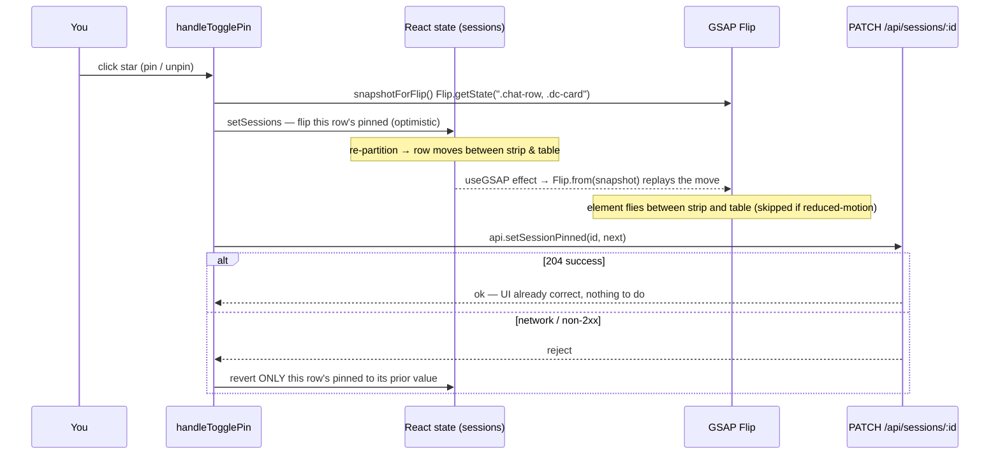

# Chats screen redesign + session pinning

> Shipped in two commits on `feat/premium-frontend-remodel`:
> - `4f206ee` — `feat(web): redesign Chats screen — Important-chats cards, table, pinning`
> - `42eb302` — `fix(web): register CustomEase so the cinematic deck ease actually applies` (a correctness fix that rides along — covered in its own section at the end).

## What it does

The Chats screen got two things: **session pinning** and a **rebuilt layout**. You can now mark any chat as "important" with a star; pinned chats float to the top and surface in a dedicated **"Important chats"** strip — up to four glass cards that sit as a skewed depth-cued fan at rest and GSAP-spread into a flat, readable row on hover. Everything else now lives in a clean **semantic table** (Title · Last active · Actions) instead of the old two-column card grid. Pin/unpin is **optimistic** (the UI reacts instantly and the row physically flies between the strip and the table), persisting to a new SQLite `pinned` column behind a new `PATCH /api/sessions/:id` endpoint.

## Why it exists

Two problems. **Function:** there was no way to keep a few high-value conversations within reach — every chat was equal, ordered only by recency, so an important thread sank as soon as you started a few new ones. Pinning fixes that. **Form:** the old "All chats" grid of identical lifted cards read as a thin web form on a wide desktop window (the deck is desktop-primary), and gave no visual hierarchy — a one-off chat looked exactly like a project you return to daily. The redesign promotes the chats you care about into a premium object (the fanned cards) and demotes the long tail into a dense, scannable table.

## How the owner interacts with it

There is one new control: a **star** on each chat.

- **In the table** (every non-pinned chat): a dim star sits in the Actions column next to the trash icon. Click it to pin — the row instantly leaves the table and animates up into the Important-chats strip. The star icon is hollow when unpinned, filled cyan when pinned.
- **In the strip** (pinned chats): each card carries a **lit cyan star**; clicking it unpins, and the card animates back down into the table.
- **Hover the strip:** the fanned pile of cards spreads out into a flat row so all of them are readable side by side; moving the cursor off collapses it back to the fan. Each card also lights a cursor-following cyan border as you move over it.
- **Opening a chat** is unchanged: click the card body (in the strip) or the row (in the table). The trash icon + 5-second undo toast are preserved exactly as before.

States you'll see: with nothing pinned, the strip is hidden and you get just the table. Pin everything and the table area shows **"ALL CHATS ARE PINNED"**. A brand-new account still shows the **"NO CHATS YET"** empty state.

**Reduced motion** (`prefers-reduced-motion: reduce`): the fan never forms — the strip renders as a plain flat CSS grid of fully-readable cards, and the pin/unpin move happens with no Flip animation. The table is unaffected (its only motion is a CSS hover tint).

## How it works

### Backend — the `pinned` flag

Pinning is a single integer column on `sessions`, added by an **idempotent migration** so existing databases pick it up on next boot without a manual step:

```ts
// server/src/state/db.ts:17
tryAddColumn(db, "sessions", "pinned", "INTEGER NOT NULL DEFAULT 0");
```

`tryAddColumn` runs `ALTER TABLE … ADD COLUMN` and swallows the "duplicate column" error, so re-running is a no-op (see the migration mechanism in [05](../architecture/05-auth-sessions-data-model.md) §13). Every existing row defaults to `0` (unpinned).

The repo layer (`server/src/state/sessions.ts`):

- `pinned: number` is added to the `Session` type (`sessions.ts:10`) and to the `createSession` return shape as `0` (`sessions.ts:19`).
- **`setPinned(db, id, pinned)`** (`sessions.ts:69`) writes `pinned = 0|1`, scoped `AND deleted_at IS NULL` so a soft-deleted row can't be re-pinned. **Critically, it does NOT touch `updated_at`** — pinning is orthogonal to recency, so pinning an old chat must not make it look freshly used.
- **`listSessions`** now orders `pinned DESC, updated_at DESC` (`sessions.ts:54`): pinned rows first, each group still newest-first by recency. This is the single source of ordering for both the strip and the table — the frontend just partitions the one list.

The endpoint (`server/src/routes/sessions.ts:27`):

```
PATCH /api/sessions/:id   body: { pinned: boolean }
  → 204  on success
  → 400  if pinned is missing or not a boolean
  → 404  if the session doesn't exist OR was soft-deleted
```

`getSession` already excludes soft-deleted rows, so a PATCH against a deleted chat returns 404 rather than silently resurrecting a pin. The endpoint is covered by route tests (204/400-non-boolean/400-missing/404) and the repo behavior by state tests (flag flips both ways; a pinned older chat sorts ahead of a newer unpinned one) — `sessions.test.ts` and the route `sessions.test.ts`.

The web API client mirrors this: `SessionRow.pinned: number` (`web/src/api.ts:56`) and `api.setSessionPinned(id, pinned)` (`web/src/api.ts:42`) issuing the PATCH.

### Frontend — the layout

`ChatListScreen` fetches the one ordered list and **partitions it locally** (`ChatListScreen.tsx:50-51`):

```ts
const pinned = sessions.filter((s) => s.pinned);
const rest   = sessions.filter((s) => !s.pinned);
```

- `stripPinned` (`pinned.slice(0, MAX_FANNED)`) → mapped to `DisplayCard`s and rendered by **`DisplayCards`** inside an "Important chats" `PanelSection` (only shown when there is at least one pinned chat).
- `tableRows` (`[...pinned.slice(MAX_FANNED), ...unpinned]`) → rendered as the `.chat-table` (only shown when non-empty), so overflow pins and unpinned chats share the table.

**`DisplayCards`** (`web/src/components/ava/DisplayCards.tsx`) lays out up to `MAX_FANNED = 4` cards (`DisplayCards.tsx:20`). At rest, each `.dc-card` is absolutely stacked and GSAP-posed into a fan by a per-index `geom()` function (`DisplayCards.tsx:43`): each card forward in the pile is nudged down/right (`restX`/`restY`), rotated a few more degrees (`restRot`), and scaled + dimmed by depth (`restScale`/`restBright`). On hover, `spread(true)` (`DisplayCards.tsx:73`) tweens every card to its own column (flat, full size and brightness); on leave it collapses back. None of this runs under reduced motion — that branch returns a plain CSS `grid` of flat cards (`DisplayCards.tsx:100`). Each card lights its cyan border via `igniteBorder`/`douseBorder` and carries the lit unpin star.

**The cursor-following border** was extracted out of the `BorderGlow` component into two standalone helpers so any `.bg-card` can share it. `igniteBorder(e)` (`web/src/components/ava/BorderGlow.tsx:18`) reads the pointer position off `e.currentTarget`'s bounding box and sets two CSS custom properties — `--edge` (0 at centre → 1 at any edge, driving the ring opacity) and `--angle` (the gradient rotation toward the cursor); `douseBorder(e)` (`BorderGlow.tsx:34`) resets `--edge` to 0 on leave. `BorderGlow` itself now just wires these as `onPointerMove`/`onPointerLeave` instead of holding its own ref and callbacks.

**The table** (`ChatListScreen.tsx:207`) is a real semantic `<table className="chat-table">` with `<thead>` (Title · Last active · Actions) and one `<tr className="chat-row">` per chat. Styling lives in `web/src/theme.css` (`.chat-table`/`.chat-row`/`.chat-act`, added in commit `4f206ee`): thin cyan hairlines, glass rows, a `.hud` mono column head, a left cyan inset bar on row-hover, and action buttons that are dim at rest and brighten on row-hover/focus. The pin star uses `data-on="true"` to read as lit cyan.

### The pin flow (optimistic + Flip + revert)

`handleTogglePin` (`ChatListScreen.tsx:133`) is the whole interaction:

```ts
function handleTogglePin(s: SessionRow) {
  const next = s.pinned ? 0 : 1;
  snapshotForFlip();                                   // capture current layout
  setSessions(prev => prev.map(x =>                    // optimistic flip → re-partition
    x.id === s.id ? { ...x, pinned: next } : x));
  api.setSessionPinned(s.id, next === 1).catch(() => { // persist; revert this row on failure
    setSessions(prev => prev.map(x =>
      x.id === s.id ? { ...x, pinned: s.pinned } : x));
  });
}
```

The move between strip and table is animated with the deck's React-Flip pattern (the same one delete/undo uses). `snapshotForFlip()` captures the layout of **both** the table rows and the strip cards in one shot — `Flip.getState(".chat-row, .dc-card")` (`ChatListScreen.tsx:100`) — *before* the state change. React re-partitions and re-renders (the row leaves the table, a card appears in the strip, or vice-versa), and a `useGSAP` layout-effect keyed on `sessions` (`ChatListScreen.tsx:59-67`) replays the captured layout with `Flip.from`, so the element physically flies from where it was to where it now is. Because the snapshot spans both regions with one selector, a single element can fly *between* them. The Flip is reduced-motion gated (`snapshotForFlip` stores `null` when reduced, so the effect skips straight to the committed DOM).



**Why the revert looks the way it does:** on failure it restores `pinned` for the single affected row from the closed-over `s.pinned` — it does **not** re-fetch the list or roll back unrelated optimistic changes. There is no second Flip on the revert path, so a failed pin snaps back rather than animating back.

## Edge cases & limitations

- **More than four pinned chats:** the strip lays out only the first four (`MAX_FANNED`), but a fifth+ pinned chat is **never invisible** — it overflows into the table (at the top, ahead of the unpinned rows) with a lit star, so it stays reachable and un-pinnable. `ChatListScreen` caps the strip at the exported `MAX_FANNED` and builds the table from `[...pinned.slice(MAX_FANNED), ...unpinned]` (`ChatListScreen.tsx`). The strip is a featured preview of your top four pins; the table is the complete list. (Earlier the overflow fell through both views and vanished — fixed in a follow-up commit.)
- **Revert is silent.** A failed PATCH reverts the row but shows **no error toast** — the star just flips back. On a flaky connection a pin can appear to "not stick" with no explanation. (Delete failures are equally silent today; this matches the existing pattern.)
- **No optimistic-write coalescing.** Rapid double-clicks fire multiple PATCHes; the last write wins on the server, and each click re-snapshots/re-Flips. It's correct but can look jittery if mashed.
- **The fan is hover-only.** The spread is driven by `onMouseEnter`/`onMouseLeave`, so on a touch device (the PWA *can* run on a phone) the cards never spread — you'd see them only in the resting fan, with the front card fully readable and the others peeking. Reduced-motion users get the flat grid instead, which is actually more usable on touch.
- **Pin does not bump recency, by design.** Pinning an ancient chat keeps its old "Last active" timestamp (correct), but note this means a pinned-then-ignored chat will eventually have a very stale subtitle. That's intended.
- **No per-device pinning.** `pinned` is a property of the session row, not the device — consistent with the rest of the single-user model (any paired device sees the same pins). There is no ownership check.
- **The "Important chats" label is purely the pinned set** — there's no smart/auto promotion (frequency, recency-weighting, etc.). It's exactly what you starred.

## Decisions log

- **Optimistic + single-row revert, over server-confirm.** Pinning is a low-stakes, reversible toggle, and the whole point of the redesign is that the strip feels physical and immediate — waiting on a round-trip before moving the card would kill that. So the UI flips instantly and only *reverts the one affected row* if the PATCH rejects. We don't re-fetch or roll back the whole list on failure because that could clobber other concurrent optimistic changes (a pending delete, another pin) and cause a jarring full re-layout. The trade-off accepted: a failed pin is silent (no toast) — matched to how delete failures already behave.
- **A semantic `<table>` over the card grid for the long tail.** The old grid gave every chat equal visual weight and stretched edge-to-edge on desktop. A real table (with `.hud` column heads and tight rows) is denser, scannable, properly columnar (Title / Last active / Actions), and uses correct semantics for what is fundamentally tabular data. The *cards* are now reserved for the few chats that earn the premium treatment — pinning, not list membership, is what gets you a card. This also draws a clean visual line: cards = important, table = everything.
- **`pinned` does NOT bump `updated_at`.** Recency and importance are two different axes. If pinning bumped `updated_at`, pinning an old chat would lie about when you last used it, and the `pinned DESC, updated_at DESC` ordering inside the pinned group would be meaningless. Keeping them orthogonal means the pinned cards stay sorted by *real* recency and the unpinned table is untouched by pin activity. Cost: `setPinned` needed to be its own function rather than reusing the `… SET x = ?, updated_at = ?` pattern every other mutator uses.
- **One ordered list, partitioned client-side, over two endpoints.** `listSessions` already returns everything in the right order (`pinned DESC, updated_at DESC`); the frontend just filters it into `pinned`/`rest`. This avoids a second round-trip and a second query, and guarantees the two views can never disagree about order or membership — they're slices of the same array. It also makes the Flip-between-regions trivial: it's all one list re-partitioning, so React naturally moves the element.
- **Border helpers extracted from `BorderGlow`, not duplicated.** The cursor-following border math (edge proximity + angle → `--edge`/`--angle`) was inside `BorderGlow`'s component closure. To let the `DisplayCards` cards share the exact same effect, the logic was pulled into pure `igniteBorder`/`douseBorder` functions that operate on `e.currentTarget` (so any `.bg-card` can wire them as event handlers), and `BorderGlow` was refactored to consume them. One implementation, two consumers — no drift.
- **Four-card fan cap for legibility, with overflow into the table.** Four glass slabs fan and spread cleanly in the available width; more would overlap illegibly. Rather than a scroll/overflow UI inside the strip, any pinned chat beyond the fourth simply appears in the table (ahead of the unpinned rows, star lit) — so the cap is purely visual and nothing is ever hidden. `MAX_FANNED` is exported from `DisplayCards` and reused by `ChatListScreen` as the strip/table boundary, so the two can't drift.

---

## The CustomEase correctness fix (`42eb302`)

This commit is small but consequential, and it explains why the deck's panel transitions may have felt subtly *off* before now.

**What was wrong.** The deck authored its signature ease as the CSS curve `cubic-bezier(0.22,1,0.36,1)` and exported the *same literal string* for GSAP to reuse:

```ts
// before — web/src/lib/deckMotion.ts
export const EASE = "cubic-bezier(0.22,1,0.36,1)";
```

But **GSAP core cannot parse a raw `cubic-bezier(...)` string.** When you hand GSAP an ease it doesn't recognize, it silently falls back to its default ease (`power1.out`) — no error, no warning. So *every* `ease: EASE` tween in the deck — the entire `buildPanelEnter` panel-open timeline (every panel materialize), plus Composer, MessageList, ThinkingIndicator, MemoryScreen, FlowingLines, and the new DisplayCards spread — was running on the wrong curve the whole time. The intended cinematic ease never actually applied to any GSAP animation; it only worked in the pure-CSS paths (where the browser *can* parse `cubic-bezier()`).

**The fix.** Register GSAP's `CustomEase` plugin and create the curve as a real named ease, built from the SVG path that is the exact equivalent of that bezier (`web/src/lib/gsap.ts:26`):

```ts
import { CustomEase } from "gsap/CustomEase";
gsap.registerPlugin(/* …, */ CustomEase);
CustomEase.create("cinematic", "M0,0 C0.22,1 0.36,1 1,1");
```

Then `deckMotion`'s `EASE` points at the registered name instead of the CSS string (`web/src/lib/deckMotion.ts:15`):

```ts
export const EASE = "cinematic";
```

The literal CSS curve still lives in `theme.css` as `--ease-cinematic`, so the CSS and GSAP paths now use the *same* curve — one as a registered GSAP ease, one as a CSS variable — and stay in sync. This is a pure correctness fix: no animation was added or changed, but every GSAP tween that names `EASE` now actually moves on the intended cinematic curve. Panel transitions should feel as they were designed to.

> **Doc reconciliation:** the [Deck Design System feature doc](./deck-design-system.md) ("Constants" section) was updated in the same pass to describe `EASE` as the registered CustomEase name `"cinematic"` (it previously documented the dead `"cubic-bezier(...)"` string). The two docs now agree.
