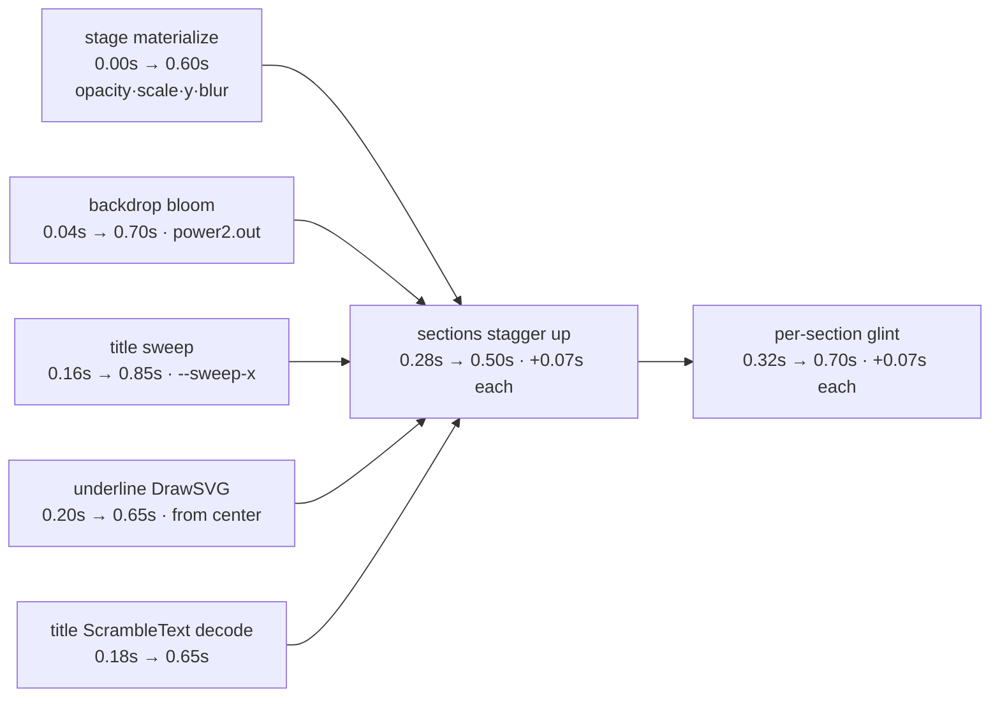
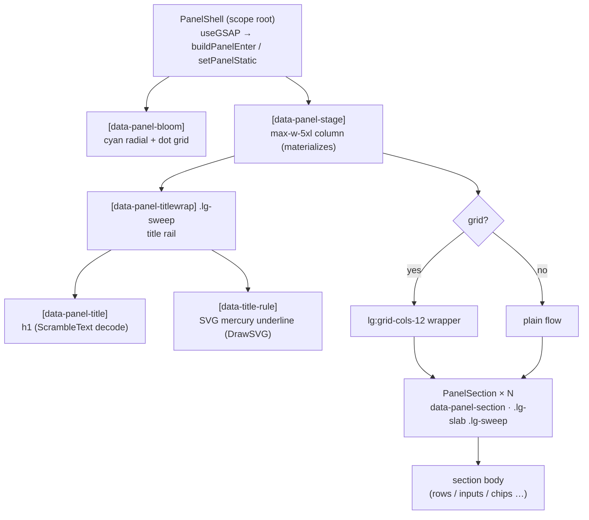

# Deck Design System

> The shared visual + motion vocabulary for Ava's four "deck" panels — **Chats, Memory, Rules, Self**.
> Shipped in commit `5e24e00` (`feat(web): luxury-premium redesign of the deck screens`).

## What it is

A small, reusable system that gives the deck panels one cohesive "command-deck" look and one motion language. It has three parts:

1. **Material vocabulary** — a set of CSS classes in `web/src/theme.css` (`.lg-slab`, `.lg-sweep`, `.btn-deck`, `.chip`, `.tgl`, …) that replace the old hand-rolled `border-white/8 + bg-white/[0.02]` cards and ad-hoc buttons.
2. **One motion system** — `web/src/lib/deckMotion.ts`, the single source of every reusable deck timing, easing, shadow, and animation helper. Nothing re-implements eases or durations.
3. **Shared chrome** — `web/src/components/ava/PanelShell.tsx`, the `PanelShell` / `PanelSection` components every deck screen composes onto.

It is scoped to the four panels reachable from the persistent nav. It does **not** govern the home, voice, or splash surfaces — those keep their own bespoke look.

> **Chat update (commit `b4e6ada`).** The chat surface was redesigned to *join* the deck — it now uses the persistent nav (no own header) and the deck materials (`.lg-slab`/`.lg-sweep`, `.chip`, `.btn-danger`) for its bubbles and composer, while keeping its own bespoke atmosphere (a flowing-lines background and instant thinking row). That redesign also added three reusable atmosphere components (`FlowingLines`, `EdgeFade`, `NeuralField`) and the `PanelShell` `bg` slot below. The chat composition, those components, and the ScrollTrigger rules are documented in the [Premium Chat feature doc](./premium-chat.md).

## Why it exists

The panels looked cheap and stretched, and the way they arrived on screen was jarring.

- **Visual problem.** Each screen had grown its own card styling (`border-white/8 + bg-white/[0.02]`), its own buttons, and its own header. On a wide desktop window the content stretched edge-to-edge and read as a thin web form, not a premium instrument. There was no shared material, so nothing felt like the same product.
- **Motion problem.** The dashboard→panel transition was a crude full-height slide-up (`y: "100%"` → `0`). Combined with each panel painting its own black background and its own back button, opening a panel felt like a different app slamming up from the bottom, not a layer materializing in place.

The redesign unifies the material, replaces the slide-up with a cinematic "materialize," and keeps the deck nav persistent so moving between panels feels like one continuous surface.

## How the owner interacts with it

There is **no new control or setting** — this is presentation, not function. Every existing control, fetch, and handler on the four screens was preserved; only the styling and motion changed. What the owner notices:

- Panels now sit in a centred, readable column (`max-w-5xl`) under the deck nav, which **stays put** while panels swap (the cyan "lamp" springs between nav items instead of the whole bar redrawing).
- Opening a panel **materializes** it (fade + slight zoom-in + de-blur) instead of sliding up; sections cascade in with a staggered reveal and a one-pass specular glint.
- Cards lift slightly and glint on hover; buttons depress on press; counts scramble-settle into place.
- **Reduced motion** (`prefers-reduced-motion: reduce`): every animation is skipped and the panel renders in its final, lit state instantly. Nothing pulses or loops.

It matters most on the **desktop PWA** (the primary, designed-for surface), where the wide window made the old stretched layout worst.

---

## The material vocabulary (`web/src/theme.css`)

These classes are the building blocks. Tailwind utilities still do layout/spacing; these provide the **surface, light, and state** language. New tokens added alongside them: `--ac-text: #d7fbff` (legible text on cyan fills, `theme.css:32`) and `--glass-deck: rgba(12,15,22,.55)` (the slab base, `theme.css:33`). They sit beside the existing palette (`--ac` cyan lead, `--ac-live`/`--ac-exec`/`--ac-stop`, `--ease-cinematic`, `--motion-fast`).

### Surfaces

| Class | What it is | When to use it |
|---|---|---|
| **`.lg-slab`** (`theme.css:60`) | The premium glass card material: a top-down white sheen gradient over `--glass-deck`, `1px` border, `20px` radius, `blur(16px) saturate(1.2)` backdrop, layered inset + drop shadows. Replaces `border-white/8 + bg-white/[0.02]`. | Every card/section surface on the deck — section bodies (via `PanelSection`), list rows, skeletons. |
| **`.lg-rim-mercury`** (`theme.css:73`) | A **focused** rim: cyan-tinted border + a cyan glow halo on top of the slab shadows. Applied *in addition to* `.lg-slab`. | Primary/attention surfaces that must read as "act on me." Currently only the Self **plan-review** panel (`SelfScreen.tsx:207`). |
| **`.lg-sweep`** (`theme.css:82`) | A **specular glint** layer: an `::after` pseudo-element with a diagonal screen-blend highlight whose X position reads the `--sweep-x` CSS variable. The element parks off-canvas (`-120%` default) until something drives `--sweep-x` across. `overflow:hidden + isolation:isolate` keep it clipped. | Add next to `.lg-slab` on any surface you want to glint on enter or hover. **You must set `--sweep-x` on the element** (see the [per-section `--sweep-x` gotcha](#edge-cases--limitations)). |
| **`.lg-edgelight`** (`theme.css:91`) | A thin liquid-metal horizontal gradient bar (white→cyan→silver, fading at both ends). | Dividers / gutters that want a mercury edge. Used as the vertical accent line beside the Self plan text (`SelfScreen.tsx:218`). |

### Buttons — `.btn-deck` + a variant

Always pair `.btn-deck` (the base: fixed height, radius, flex, `--motion-fast` transitions — `theme.css:96`) with exactly one variant:

| Variant | Look | Use for |
|---|---|---|
| **`.btn-primary`** (`theme.css:99`) | Cyan gradient fill, cyan border, `--ac-text` label, glow on hover. Has a `:disabled` dim state. | The main action in a context (Add rule, Approve & run, Resume, Add). |
| **`.btn-ghost`** (`theme.css:104`) | Transparent, faint border, brightens to cyan on hover. `:disabled` dim. | Secondary actions (New, Revert last, Cancel/edit, icon buttons). |
| **`.btn-danger`** (`theme.css:107`) | Transparent with a red border/label, red wash on hover. | Destructive actions (delete, revoke, Reject, Stop). |

### `.chip` — state indicator

`.chip` (`theme.css:110`) is a small uppercase mono pill with a glowing dot (the `::before`). It carries **state**, never decoration — pick the colour by meaning:

| Modifier | Colour token | Means |
|---|---|---|
| **`.chip-live`** (`theme.css:114`) | `--ac-live` green | success / active / enabled |
| **`.chip-exec`** (`theme.css:115`) | `--ac-exec` amber | executing / parsing / running |
| **`.chip-stop`** (`theme.css:116`) | `--ac-stop` red | failed / cancelled / paused |
| **`.chip-ac`** (`theme.css:117`) | `--ac` cyan | neutral / count / awaiting |

Examples: rule parse status (`RulesScreen.tsx:21`), self-improvement status (`SelfScreen.tsx:9`), the Memory/Self counts (`chip chip-ac` wrapping a scramble-settled number).

### `.tgl` — mercury toggle

`.tgl` + `.tgl-knob` (`theme.css:119`–`125`) is the on/off switch. The track reads its state from a **`data-on="true"|"false"` attribute** (which slides the knob `18px` and turns the track cyan with an inner glow). It is rendered on a real `<button role="switch" aria-checked>` for accessibility. Only the Rules autonomy-rule rows use it today (`RulesScreen.tsx:308`–`318`).

**Reduced-motion safety of the materials:** all of these animate only via CSS `transition`/`animation` (which the global `@media (prefers-reduced-motion: reduce)` block at `theme.css:213` collapses to `~0ms`) or via the GSAP helpers below (which no-op when `reduced`). The `.lg-sweep` glint never moves on its own — it only animates when JS drives `--sweep-x`, and JS is gated on `reduced`. So nothing here animates against the owner's accessibility preference.

---

## The motion system (`web/src/lib/deckMotion.ts`)

One module owns every deck timing, ease, shadow, and animation helper. **Every helper that animates takes a `reduced` flag** (from `useReducedMotion()`) and either no-ops or parks to the final state when it's true.

### Constants

- **`EASE`** = `"cinematic"` (`deckMotion.ts:15`) — the cinematic ease, as a **registered GSAP `CustomEase`** (created in `lib/gsap.ts:26` from the SVG path of `cubic-bezier(0.22,1,0.36,1)`). It used to be the literal CSS string `"cubic-bezier(0.22,1,0.36,1)"`, but **GSAP core cannot parse a raw `cubic-bezier()` string** and was silently falling back to its default ease on every `ease: EASE` tween; commit `42eb302` registered the curve as a real named ease so it actually applies. The literal CSS curve still lives in `theme.css` as `--ease-cinematic`, so the CSS and GSAP paths stay in sync. See [`features/chats-screen-pinning.md`](./chats-screen-pinning.md#the-customease-correctness-fix-42eb302).
- **`D`** (`deckMotion.ts:13`) — the one motion clock: `{ fast: .2, press: .12, screen: .3, section: .5, materialize: .6 }` (seconds).
- **`SHADOW`** (`deckMotion.ts:16`) — the `rest` and `hover` box-shadow strings, so hover handlers and the resting CSS agree on the exact shadow.

### Functions

| Export | Signature | What it does | Reduced-motion |
|---|---|---|---|
| **`buildPanelEnter`** (`deckMotion.ts:34`) | `(root, title) → gsap.Timeline` | The **master panel-enter timeline** (see timeline below). Materializes the stage, blooms the backdrop glow, sweeps + scrambles the title, draws the mercury underline, then staggers the sections in with a per-section glint. | Not called when reduced — `PanelShell` calls `setPanelStatic` instead. |
| **`setPanelStatic`** (`deckMotion.ts:55`) | `(root, title) → void` | Jumps the stage / bloom / sections to their final lit state and sets the title text directly. No transforms, no scramble, no loops. | This *is* the reduced path. |
| **`hoverLift`** (`deckMotion.ts:68`) | `(el, on, reduced) → void` | Pointer hover for any `.lg-slab` card: lifts `y:-3`, swaps to `SHADOW.hover`, and glints the `--sweep-x` across once on enter. | `reduced` → no-op (returns immediately). |
| **`press`** (`deckMotion.ts:77`) | `(el, down, reduced) → void` | Press feedback for any button: scale to `.96` on down, back to `1` on up. | `reduced` → no-op. |
| **`settleText`** (`deckMotion.ts:83`) | `(el, text, reduced, chars?) → void` | Settles a number/label into place via GSAP **ScrambleText** (digits by default). Used for counts and timestamps. | `reduced` → sets `el.textContent = text` directly. |
| **`flipReorder`** (`deckMotion.ts:97`) | `(getState, mutate, reduced, vars?) → void` | Runs a GSAP **Flip** reorder around a *synchronous* DOM mutation (snapshot → mutate → animate). | `reduced` → just runs `mutate()`, no animation. |

> **Flip + React caveat (documented in the source, `deckMotion.ts:90`).** `flipReorder` is for the synchronous case. In React, list reorders/deletes commit *asynchronously* through state, so screens snapshot the layout in the event handler (`Flip.getState`) and call `Flip.from` in a `useGSAP` layout-effect keyed on the list. `ChatListScreen.tsx:32`–`87` is the reference pattern for that.

### The panel-enter timeline

`buildPanelEnter` is scoped via `useGSAP({ scope })` so its selector strings resolve inside the `PanelShell` root. The steps overlap on one timeline; each label below shows its **start offset → duration** (seconds), all on `EASE` unless noted:



Verbatim mechanism (`deckMotion.ts:36`–`51`):
1. `[data-panel-stage]` — materialize: opacity `0→1`, scale `.97→1`, y `8→0`, blur `10→0px` over `D.materialize`.
2. `[data-panel-bloom]` — glow blooms in (scale `1.12→1`, `power2.out`).
3. `[data-panel-titlewrap]` — specular sweep across the title rail (`--sweep-x` `-120%→120%`, `power2.inOut`).
4. `[data-title-rule]` — DrawSVG the mercury underline out from centre.
5. `[data-panel-title]` — ScrambleText decode into `title` (upper-case chars).
6. `[data-panel-section]` — stagger up (y `22→0`, opacity `0→1`, `0.07` stagger), then a per-section specular sweep (`--sweep-x` `-130%→130%`).

---

## The chrome: `PanelShell` / `PanelSection`

### `PanelShell` (`PanelShell.tsx:20`)

The shared frame for all four panels. Props: `{ title: string; grid?: boolean; children }`.

It:
- Renders a full-height scroll container with a `[data-panel-bloom]` backdrop (cyan radial bloom + dot-grid).
- Lays out a centred `max-w-5xl` stage (`[data-panel-stage]`) padded to clear the persistent nav (`pt-28`).
- Renders the **title rail** (`[data-panel-titlewrap]`, `.lg-sweep`): an `h1` (`[data-panel-title]`) with a silver-gradient fill, plus an SVG mercury underline (`[data-title-rule]`).
- Runs the enter timeline in a `useGSAP` keyed on `[reduced, title]`: `buildPanelEnter(root, title)` normally, or `setPanelStatic(root, title)` when reduced (`PanelShell.tsx:27`–`35`).
- With `grid` true, wraps `children` in a 12-column grid (`lg:grid-cols-12`); sections then place themselves with a `span` class.

> **`bg` slot (added commit `b4e6ada`).** `PanelShell` now takes an optional `bg?: ReactNode` rendered between the black root and the cyan bloom (so the bloom stays on top of it) — `PanelShell.tsx:43`–`44`, props at `PanelShell.tsx:24`. Memory uses it for the low-opacity `NeuralField` WebGL noise (`MemoryScreen.tsx:46`); other panels pass nothing and are unaffected. See the [Premium Chat feature doc](./premium-chat.md) for `NeuralField`.

### `PanelSection` (`PanelShell.tsx:105`)

A titled `.lg-slab .lg-sweep` card. Props: `{ title; right?; onClickHeader?; span?; children }`.

- Carries **`data-panel-section`** — this is how it **auto-joins the enter stagger and the per-section glint**. Any block you want in the cascade must have this attribute; `PanelSection` adds it for you.
- Sets `--sweep-x: -130%` inline so its `.lg-sweep` glint starts off-canvas.
- Renders a HUD header with a cyan dot + `title`, an optional `right` slot (counts/buttons), and makes the header a clickable disclosure when `onClickHeader` is given.
- `span` (e.g. `"lg:col-span-5"`) places it in the parent's grid; ignored in non-grid shells.

### Anatomy



---

## How a screen is composed (minimal example)

The screen owns its data + handlers and only describes structure. A two-section, single-column panel:

```tsx
export function ExampleScreen() {
  return (
    <PanelShell title="Example">
      <PanelSection title="Controls" right={<span className="chip chip-live">ACTIVE</span>}>
        <button className="btn-deck btn-primary">Do it</button>
      </PanelSection>
      <PanelSection title="Items">
        {/* rows… */}
      </PanelSection>
    </PanelShell>
  );
}
```

A 12-column grid panel places sections with `span` (this is how Memory and Rules lay out):

```tsx
<PanelShell title="Memory" grid>
  <PanelSection title="Personality"  span="lg:col-span-5" onClickHeader={toggle} />
  <PanelSection title="Preferences"  span="lg:col-span-7" />
  <PanelSection title="Observations" span="lg:col-span-7" right={<CountChip … />} />
  <PanelSection title="Projects"     span="lg:col-span-5" onClickHeader={toggle} />
</PanelShell>
```

Reference implementations: `ChatListScreen.tsx` (single section + per-card Flip), `MemoryScreen.tsx` (grid + disclosures + scramble counts), `RulesScreen.tsx` (grid + `.tgl` toggles + draw-on underline), `SelfScreen.tsx` (status chips + spine pulse + `.lg-rim-mercury` plan panel).

### How a screen wires the interactions

The shell handles the *entrance*; the screen wires the *interactions* using the `deckMotion` helpers, always passing `reduced`:

- **Hover-lift cards:** `onMouseEnter/Leave → hoverLift(e.currentTarget, on, reduced)`. Wrap in `useGSAP().contextSafe(...)` so GSAP cleans up on unmount (`MemoryScreen.tsx:265`, `RulesScreen.tsx:182`).
- **Press buttons:** `onPointerDown/Up → press(e.currentTarget, down, reduced)`.
- **Scramble a count:** in a `useGSAP` keyed on the value, `settleText(ref.current, String(n), reduced)` (`SelfScreen.tsx:28`, the `CountChip` in `MemoryScreen.tsx:169`).
- **Reorder a list:** snapshot `Flip.getState(".card")` in the mutating handler, replay it in a `useGSAP` layout-effect keyed on the list (`ChatListScreen.tsx:44`–`87`).

---

## The panel transition (`web/src/App.tsx`)

The dashboard→panel transition changed from a crude slide-up to a "materialize," and the deck nav is now persistent.

**Before:** each panel branch was `initial={{ y: "100%" }}` → `animate={{ y: 0 }}` → `exit={{ y: "100%" }}` over a black-background `motion.div` (the panel slammed up from the bottom).

**After** (`App.tsx:150`–`200`), every panel branch (`memory`/`rules`/`self`/`list`) is now:

```tsx
initial={{ opacity: 0 }}
animate={{ opacity: 1 }}
exit={{ opacity: 0, scale: 0.985, filter: "blur(6px)" }}
transition={{ duration: reduced ? 0.15 : 0.3, ease: [0.22, 1, 0.36, 1] }}
```

So a panel **fades in** in place (the rich entrance is the `PanelShell` timeline inside it), and **fades + shrinks + blurs out** on the way to its next view, on the cinematic ease. The black-background class was dropped because `PanelShell` paints its own backdrop. Reduced motion shortens the duration to `0.15s`.

Two things were deliberately preserved:
- **The persistent deck nav.** `TubelightNav` stays mounted at the top (`App.tsx:205`–`212`); it fades/lifts out only on the immersive views (splash/chat/voice) and tracks the active view via `NAV_FOR_VIEW`. Because it never unmounts across panel swaps, the cyan lamp springs smoothly between items. Panels no longer render their own back button — the nav handles navigation (`ChatListScreen.tsx:11`–`13`).
- **The orb Flip.** The shared-orb GSAP Flip (`App.tsx:39`–`59`) is unchanged: it still only runs for the orb-owning surfaces (`splash/orbit/chat/voice`) and explicitly skips panels, so the materialize doesn't fight the orb.

---

## How to build a new deck screen (recipe)

1. **Wrap in `PanelShell`.** `<PanelShell title="Thing">…</PanelShell>`. Add `grid` if you want a 12-col layout, then give each section a `span`.
2. **Use `PanelSection` for every block.** It supplies the `.lg-slab` surface and — critically — the `data-panel-section` hook that joins the enter stagger. Pass `right` for a header count/button, `onClickHeader` for a disclosure.
3. **Use the materials, not bespoke styling.** `.btn-deck` + a variant for buttons; `.chip chip-*` for state; `.tgl` for on/off; `.lg-slab .lg-sweep` + inline `--sweep-x: -130%` for any extra hover card.
4. **Wire interactions through `deckMotion`,** always passing `reduced` from `useReducedMotion()`. Wrap GSAP event handlers in `useGSAP().contextSafe(...)`.
5. **Add the route.** Add the view to `App.tsx`'s `View` union and a `motion.div` branch using the materialize pattern (copy an existing panel branch), plus an entry in `navItems` / `NAV_FOR_VIEW`.
6. **Handle loading/error WITHOUT `PanelShell`** — see the gotcha below.

---

## Edge cases & limitations

- **Loading / error early-returns must NOT use `PanelShell`.** If you render `PanelShell` for a loading state and then re-render it with real content, the enter stagger has already played against empty sections and won't replay. `MemoryScreen.tsx:38`–`40` shows the correct pattern: plain centred `<div>`s for the `err` / `!m` early returns, so `PanelShell` mounts **fresh** with real content and its timeline plays from the start. (`ChatListScreen` and `RulesScreen` instead render `PanelShell` immediately and show skeletons/loading text *inside* a section — also valid, because the shell stays mounted; the cards stagger in via their own list effect.)
- **The per-section `--sweep-x` must be set on the element.** `.lg-sweep`'s glint reads `--sweep-x`; if you forget to set it, the variable falls back to `-120%` (off-canvas) and the hover/enter glint has nowhere to start from. `PanelSection` sets `-130%` for you, but any *extra* `.lg-sweep` card you add by hand must set `style={{ "--sweep-x": "-130%" }}` (every row in the screens does — e.g. `ChatListScreen.tsx:166`).
- **`hoverLift` is hover-only,** driven by mouse/pointer enter/leave — there's no touch equivalent, so the lift/glint won't fire on a phone tap. The press feedback does fire on `pointerdown`.
- **`flipReorder` is the synchronous-only helper;** React state-driven list changes can't use it directly (they commit async). Use the snapshot-in-handler / replay-in-effect pattern instead.
- **Reduced motion is honoured everywhere,** but via two independent gates that must both be respected: the CSS global block (`theme.css:213`) collapses transitions/keyframes, and every `deckMotion` helper plus the `PanelShell`/screen `useGSAP` effects branch on the `reduced` flag. A new screen that animates *without* checking `reduced` would bypass the second gate.
- **Scope only.** This system is for the four panels. The home/chat/voice/splash surfaces are intentionally outside it and keep their own visual + motion code.

## Decisions log

- **Materialize (fade + scale + blur) over slide-up.** The slide-up read as a separate app shoving in from the bottom and fought the persistent nav. A fade-in-place lets the *inside* of the panel (`PanelShell`'s staggered reveal) carry the "premium entrance," while the panel itself just resolves into focus. The blur-on-exit gives a sense of depth/defocus rather than a hard cut.
- **One `deckMotion` module over per-screen GSAP.** Four screens each rolling their own eases/durations/shadows is how the deck drifted apart visually in the first place. Centralizing `EASE`/`D`/`SHADOW` + the shared helpers means the panels are guaranteed to move identically, and a tuning change is one edit.
- **`--sweep-x` CSS variable driving a `::after` pseudo-element** (over an extra DOM node per card). The glint needs to be clipped to the card and blend over its content; a pseudo-element with a single animatable custom property is the cheapest way to do that and lets GSAP drive it without touching the DOM tree.
- **`data-*` hooks (`data-panel-section`, `data-panel-stage`, …) over class-name selectors.** The enter timeline selects by data-attribute so styling classes and animation targets stay decoupled — restyling a section can't accidentally break the stagger, and the timeline reads as a clear contract.
- **`reduced` passed explicitly into every helper** (rather than each helper calling `useReducedMotion` itself). Helpers are plain functions, not hooks, so they can be called from event handlers and `contextSafe` callbacks; the caller already holds `reduced` from the component. This keeps the motion layer hook-free and trivially testable.
- **`.chip` colour = state, never decoration.** The live/exec/stop/cyan palette is reserved for real status (running, failed, parsing, awaiting). This is a deliberate constraint so colour stays meaningful across the deck (`SelfScreen.tsx:8` comment makes it explicit).
- **Keep the orb Flip and nav untouched.** The orb-Flip guard already excludes panels, and the nav was already persistent-capable; the redesign rode on both rather than reworking navigation, which kept the diff to presentation + motion and avoided regressing the home/voice transitions.
