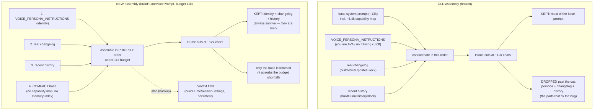

# Hume voice: stop it losing its memory + identity (prompt truncation)

## What it does

Fixes two related failures that only happened when Ava spoke through the **Hume EVI** voice (not OpenAI): Hume would "draw a blank" on the recent conversation it had just had, and it would **confabulate its own identity** — describing itself with an LLM "training cutoff late 2024" and inventing a generic "self-improvement" story instead of citing Ava's real changelog. After this fix, the parts of the prompt that prevent both problems — the anti-confabulation persona ("you are AVA / never describe yourself by a training cutoff"), Ava's real changelog, and the recent conversation turns — are placed at the **front** of the Hume prompt under a tight character budget, so they survive Hume's silent truncation. The same recollection is also written to Hume's separate `context` field as a backup.

This change is Hume-only. The OpenAI realtime path is untouched — it already seeds memory as conversation items and does not truncate the prompt.

Two terms used below:
- **Hume EVI** — Hume AI's Empathic Voice Interface, the alternate spoken upstream (the "Alice Bennett" voice). It runs its **own** language model. See `hume-voice.md`.
- **System prompt truncation** — Hume EVI silently cuts `session_settings.system_prompt` at roughly **12,000 characters**; anything past the cut is dropped without warning.

## Why it exists

Ava is a *specific* agent on the owner's Windows PC with a real, evolving codebase that Claude ships changes to (the Claude→Ava update log). Honesty about who actually did what is a hard requirement, so Ava must answer "what's your latest update?" from her real changelog, and must remember the conversation she is in.

The Hume prompt is assembled from several blocks. The blocks that *fix* the recall/identity problem are:
1. `VOICE_PERSONA_INSTRUCTIONS` — the spoken persona, which contains both "You are AVA … NEVER describe yourself in terms of an LLM 'training cutoff' or 'my training data'" and the clause routing update questions to the real changelog (`server/src/routes/voice-realtime.ts:178`–`:195`).
2. The **real changelog** block — `buildVoiceUpdatesBlock` (`voice-realtime.ts:350`).
3. The **recent conversation** block — `buildHumeHistoryBlock` (`voice-realtime.ts:326`).

The old assembly concatenated the **full base system prompt first** — roughly 13k characters per the commit's own measurement — and only then appended persona + changelog + history:

```
buildHumeSessionSettings(system + VOICE_PERSONA_INSTRUCTIONS + updates + history, hume)
```

Because the base prompt alone already exceeded Hume's ~12k cut, everything appended after it — the entire anti-confabulation persona, the real changelog, and the recent turns — landed **past the truncation line and was dropped**. Hume never saw the instructions that would have stopped the confabulation, nor the history it needed to recall. The base prompt also carries a large capability/tool map (`CAPABILITIES_MD`, ~4.4k chars) that is **dead weight for Hume**, because Hume EVI is given **no tools** — it cannot call `do_on_computer`, so it can never act on a tool map. That dead weight was a big part of what pushed the useful blocks past the cut.

## How the owner interacts

No new controls. The owner speaks to Ava with Hume selected (`voice_engine_pref = hume` and `HUME_API_KEY` set; see `hume-voice.md`) and:
- asks "what did you just do?" / "what were we talking about?" → Ava continues the prior conversation instead of starting blank;
- asks "what's your latest update / what has Claude been building?" → Ava answers from the seeded real changelog rather than a made-up "training cutoff" story.

## How it works

The fix has three pieces.

### 1. A compact base prompt for Hume (`compact` option)

`buildSystemPrompt` gains a `compact?: boolean` option (`server/src/orchestrator/system-prompt.ts:20`, applied at `:78`–`:79`). When set, it **omits** `CAPABILITIES_MD` (the ~4.4k tool map) and the memory index — both dead weight for a model that cannot run tools — while keeping persona, preferences, and observations. This shrinks the base so the priority blocks fit a tight budget. The Hume open-handler builds the base with `buildSystemPrompt({ memoryDir, mode: "conversation", compact: true })` (`voice-realtime.ts:1120`).

### 2. A priority-ordered, budget-capped assembly (`buildHumeVoicePrompt`)

`buildHumeVoicePrompt(parts, budget = 11000)` (`voice-realtime.ts:369`) assembles the prompt in **priority order**: identity persona → real updates → recent history → compact base. It fills up to the `budget` (default **11,000** chars, comfortably under Hume's ~12k cut) and, when it runs out of room, trims the **last** block it is adding — which, given the ordering, is always the base. So the critical front (persona + changelog + history) is guaranteed to survive; only the least-critical block (the base) absorbs the trim. Empty blocks are skipped.

### 3. Recollection also via the `context` field (belt-and-suspenders)

The recent turns (changelog + history) are **also** passed to `buildHumeSessionSettings` as `contextText`, which populates Hume's separate persistent `context` field (`voice-realtime.ts:1125`–`:1126`; field set at `:314`). Whether Hume reliably honors `context` is unverified, so this is a backup channel: the **prompt** (now surviving the cut) is the guaranteed channel, and `context` is the extra one. The call site:

```ts
const compactBase = buildSystemPrompt({ memoryDir: deps.memoryDir, mode: "conversation", compact: true });
const history = hybrid && sessionId ? buildHumeHistoryBlock(listMessages(deps.db, sessionId), seedN) : "";
const updates = buildVoiceUpdatesBlock(readDevLog(dirname(deps.memoryDir), 8));
const humePrompt = buildHumeVoicePrompt({ voicePersona: VOICE_PERSONA_INSTRUCTIONS, updates, history, base: compactBase });
const contextText = (updates + history).trim();
upstream.send(JSON.stringify(buildHumeSessionSettings(humePrompt, hume, contextText)));
```

### Prompt assembly + truncation diagram



## Edge cases & limitations

- **KNOWN GAP — Hume update answers are an in-prompt snapshot, not live.** Hume EVI is still given **no tools** (no `do_on_computer`), so unlike the OpenAI path it **cannot** call `read_claude_updates` to fetch the authoritative, current changelog at the moment it is asked. It answers update questions from the changelog **snapshot folded into its prompt at connect time** (`buildVoiceUpdatesBlock`, last 6 shipped/`note` entries). That snapshot now survives truncation, so the answer is real and grounded — but it is only as fresh as the moment the session connected, and won't reflect a change Claude ships mid-session. Closing the gap (wiring the tool into the Hume branch) is a separate fix.
- **Whether Hume honors `context` is unverified.** The `context` field is populated as a backup, but the project has not confirmed Hume reliably reads it. The surviving in-prompt copy is the channel relied on; `context` is extra insurance, not the primary mechanism.
- **Not verified against a live Hume session.** The Hume account hit a **zero-credits `E0300`** error during this work (Hume's socket opens, then errors post-open; see `hume-voice.md`), so this fix could not be exercised end-to-end against live Hume. It is verified by logic and by 6 unit tests (below).
- **The budget is a heuristic, not Hume's exact limit.** 11,000 is chosen as a safe margin under the observed ~12k truncation; Hume's true cut is approximate and could shift. If Hume ever truncated *below* 11k, the very tail of the compact base (lowest-priority text) would be the first thing lost — never the identity or recollection.
- **A single oversized priority block could still crowd out the rest.** The assembler trims the block that overflows and then stops. If, for example, the recent-history block alone were enormous, it could consume the budget before the compact base is added. In practice persona + changelog + a bounded history (`REALTIME_SEED_TURNS`, default 12 turns) sit well under 11k, so the base reliably fits.
- **Only `shipped`/`note` changelog entries are seeded.** In-flight (`started`) entries are excluded, so Ava won't narrate an unfinished change as done — unchanged from `voice-self-knowledge.md`.

## Decisions log

- **Identity-first ordering + a hard budget cap (commit 71dc643).** The root cause was *ordering against a silent truncation*, not missing content. Putting the anti-confabulation persona, real changelog, and history **first**, under an 11k budget, guarantees the bug-fixing blocks survive the ~12k cut and lets the least-important block (the base) absorb the trim. Chosen over simply shortening the base, because ordering is what makes the guarantee robust to future prompt growth.
- **Drop the capability/tool map for Hume (`compact`).** Hume EVI has no tools, so the ~4.4k capability map is pure dead prefill that only pushes useful blocks past the cut. Omitting it (and the memory index) for the Hume path frees budget for identity and recollection with zero capability loss — Hume couldn't have acted on that map anyway.
- **Also write recollection to the `context` field (belt-and-suspenders).** Because whether Hume honors `context` is unverified, the fix does not depend on it: the now-surviving prompt is the guaranteed channel, and `context` is a cheap second channel in case Hume does read it. Seeding both maximizes the chance of recall without betting on the unverified path.
- **Ship on logic + tests despite no live Hume run.** A zero-credits `E0300` blocked live verification. Rather than block the fix, it was verified by 6 unit tests asserting the invariants (priority order, survival under a huge base, compact-mode omissions, the `context` field), with live verification deferred until the account has credits.

## Test coverage

Six tests pin the invariants (`server/src/routes/voice-realtime.test.ts`, `server/src/orchestrator/system-prompt.test.ts`):
- `buildHumeVoicePrompt` orders identity → updates → history → base.
- `buildHumeVoicePrompt` keeps identity + updates + history when the base is huge (50k chars) and stays within the 11k budget, trimming only the base.
- `buildHumeVoicePrompt` skips empty blocks.
- `buildHumeSessionSettings` sets the persistent `context` field when `contextText` is passed.
- `buildHumeSessionSettings` omits `context` when there is nothing to seed.
- `buildSystemPrompt({ compact: true })` omits the capability map + memory index but keeps persona/prefs/observations, and is smaller than the full conversation prompt.
