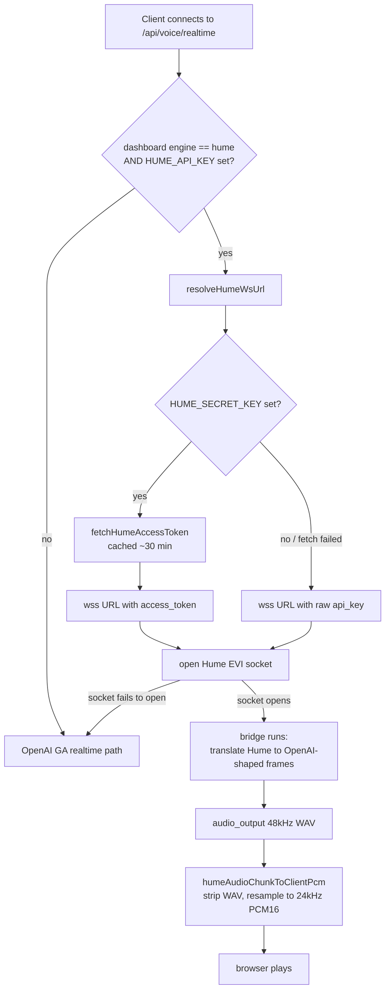

# Hume EVI voice provider (Alice Bennett)

## What it does

Lets Ava speak with **Hume AI's EVI** (Empathic Voice Interface) instead of OpenAI's realtime voice. When enabled, Ava's spoken replies come out in a Hume voice — by default **"Alice Bennett"** — and the conversational behaviour (warmth, pacing, the do_on_computer action handoff) is identical to the OpenAI path. The web client never knows the difference: the server translates Hume's wire protocol into the same OpenAI-shaped frames the browser already understands.

Hume is an *alternative upstream*, not a replacement. OpenAI stays the default and the fallback.

## Why it exists

Sir picked the "Alice Bennett" voice and wanted Ava to use it. Hume EVI produces a noticeably warmer, more natural-sounding voice than OpenAI's TTS, so it was added as a configurable provider while keeping OpenAI as the proven default in case Hume is misconfigured or unavailable.

Two terms used below:
- **EVI** — Hume's Empathic Voice Interface, a websocket service that takes mic audio and returns spoken audio + transcripts.
- **OAuth access token** — a short-lived credential (≈30 min) minted from the API key + secret key, used instead of putting the raw API key in the websocket URL.

## How Sir interacts

Sir sets these in `server/.env` (the server reads `process.env` only — it never opens or parses the `.env` file itself):

| Variable | Required? | Effect |
|---|---|---|
| `AVA_VOICE_PROVIDER=hume` | yes | Selects Hume as the upstream. Anything else (or unset) = OpenAI. |
| `HUME_API_KEY` | yes | Without it, selection falls back to OpenAI. |
| `HUME_SECRET_KEY` | strongly recommended | Enables OAuth access-token auth (robust). Without it, the raw API key is used as a URL query param, which is rate-limited and the source of intermittent "auth failed". |
| `HUME_VOICE_NAME` | no | Defaults to `Alice Bennett`. |
| `HUME_VOICE_ID` | no | Pins an exact Hume voice id (most reliable; preferred over the name). |
| `HUME_CONFIG_ID` | no | An optional EVI config id. |

There is ALSO a runtime dashboard toggle (see `voice-engine-toggle.md`). **Both** gates must point at Hume for it to speak: `AVA_VOICE_PROVIDER=hume` decides whether Hume is *configured at all* (resolved once at server boot), and the dashboard toggle (`voice_engine_pref`, read on each connect) decides whether to *use* it for the current session. If either says OpenAI, OpenAI speaks.

## How it works

The voice proxy (`server/src/routes/voice-realtime.ts:734` `startSession`) checks the dashboard engine and the resolved provider config on each connect. If both select Hume, it tries Hume first; only if the Hume socket fails to OPEN does it fall through to OpenAI.

**Auth (`voice-provider-config.ts`)**
- `resolveHumeWsUrl` (`:171`) prefers OAuth: if a secret key is set it calls `fetchHumeAccessToken` and embeds `access_token` in the websocket URL. If no secret key — or the token fetch throws — it falls back to `buildHumeRealtimeUrl` (`:135`), which embeds the raw `api_key` query param.
- `fetchHumeAccessToken` (`:149`) POSTs `grant_type=client_credentials` to `https://api.hume.ai/oauth2-cc/token` with HTTP Basic `apiKey:secretKey`, and **caches the token** in a module-level variable (`humeTokenCache`, `:144`) until ~1 minute before expiry, so reconnect churn reuses one token instead of hammering the rate-limited query-param path.

**Audio resample (`voice-realtime.ts`)**
- Hume returns each `audio_output` as a self-contained **48 kHz 16-bit mono WAV clip**. The browser plays raw PCM16 at 24 kHz (`CLIENT_PCM_RATE`, `:377`), so playing the WAV bytes verbatim makes Ava sound an octave low and half-speed (and clicks on the header).
- `humeAudioChunkToClientPcm` (`:409`) strips the RIFF/WAVE container, reads the real sample rate from the `fmt ` chunk, and calls `resamplePcm16` (`:382`) to convert to 24 kHz. Non-WAV input (already raw PCM) passes through unchanged.
- `resamplePcm16` is a **box-filter** resample: it averages the source samples spanned by each output sample, so the 2:1 downsample also low-passes (less aliasing) instead of bare decimation.

**Session settings (`buildHumeSessionSettings`, `:290`)**
- Sends a `session_settings` frame with the **`system_prompt`** (persona + changelog + recent history; see `voice-continuity.md` and `voice-self-knowledge.md`), the chosen voice (by id when `HUME_VOICE_ID` is set, else by name), and `audio: linear16 @ 24000`.
- **`context` is NOT used for recollection.** Hume truncates the long (~12k char) system prompt, and a verified test showed appended history was silently dropped; the separate `context` field *was* honored in that test, but the shipped code folds recent turns into the **system_prompt** anyway (`buildHumeHistoryBlock`) because the prompt is the reliable channel for this provider. The `context` field is only populated if a non-empty `contextText` argument is passed, which the live proxy does not do.

## Edge cases & limitations

- **CRITICAL: Hume needs account credits.** A Hume account with **zero credits** does not fail at the socket layer — the socket *opens* successfully, then Hume sends a post-open **error E0300** that the bridge surfaces to the user as "auth failed". Because the proxy only falls back to OpenAI when the socket **fails to open** (`tryStartHumeSession` resolves `false` only on a pre-open error/close, `voice-realtime.ts:1189`–`:1205`), a **post-open credit error does NOT trigger fallback** — voice just errors. If Hume voice reports "auth failed" despite a correct key, check the Hume account balance first.
- **OAuth fallback is silent.** If the token fetch fails, the code quietly drops to raw-api_key auth (`resolveHumeWsUrl` catch block). That path is rate-limited, so under reconnect churn it can still produce intermittent "auth failed" — set `HUME_SECRET_KEY` to avoid it.
- **Model recitation is loose.** Hume's underlying language model is less reliable than OpenAI's at reciting facts verbatim from the system prompt (see `voice-self-knowledge.md`).
- **Secrets are never logged.** The provider config only ever logs presence booleans + the public voice name (`describeVoiceProvider`), URLs that embed a secret are never logged, and any upstream Hume error message is run through `redactSecrets` before it reaches a log or the client (`voice-realtime.ts:1065`).

## Decisions log

- **OAuth access-token over raw api_key (commit 10514b1).** The raw `api_key` query-param auth is rate-limited, which caused intermittent "auth failed" under reconnect churn. OAuth client-credentials tokens are cached ~30 min and reused, fixing the flakiness. Raw api_key is kept as a fallback ("better a rate-limited connect than none").
- **Resample with a box filter, not decimation (commit a27c4ef).** Averaging the spanned samples low-passes, avoiding the aliasing of bare 2:1 decimation.
- **Recollection via system_prompt, not `context` (commit 67e3356).** Hume truncates the system prompt but the prompt is still the channel that reliably influences the model; folding recent turns into the prompt matched the OpenAI path's recollection.
- **Translate Hume → OpenAI-shaped frames (commit 5dfaaf1).** Keeping the web client provider-agnostic meant the server absorbs all the protocol differences; the browser code is unchanged whether OpenAI or Hume is speaking.
- **Fallback only on failure-to-open, by design.** Once a Hume session is live it runs independently; mid-session it does not silently switch providers. The documented downside is the zero-credits E0300 case above.
