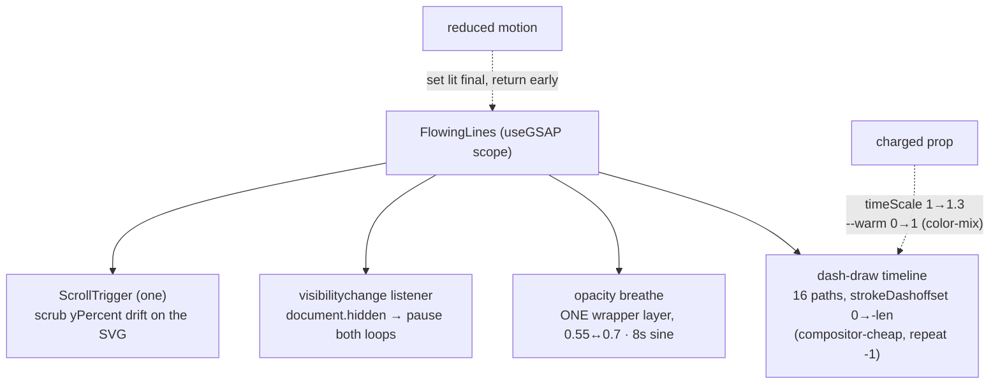
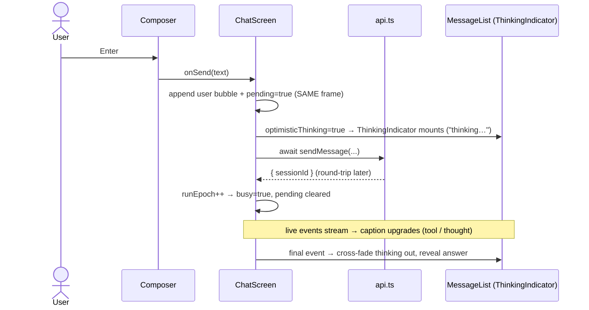
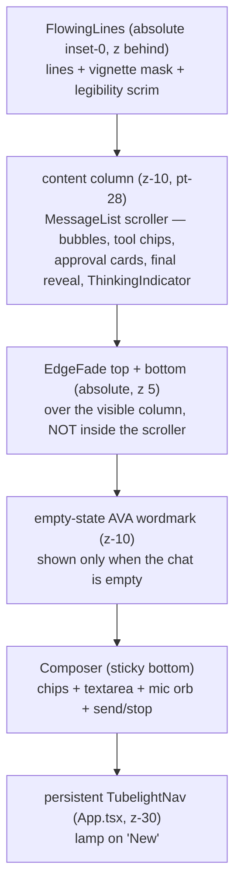

# Premium Chat

> The redesigned chat surface — a living cyan/mercury flowing-lines background, instant "thinking" feedback, premium glass bubbles, an expand-on-focus composer, and the persistent deck nav — plus the three shared atmosphere components it introduced (`FlowingLines`, `EdgeFade`, `NeuralField`).
> Shipped in commit `b4e6ada` (`feat(web): premium chat — flowing-lines bg, instant thinking, premium bubbles, expand-on-focus`).

## What it is

A visual + interaction overhaul of `web/src/chat/` and three reusable atmosphere components in `web/src/components/ava/`. The chat screen went from a bespoke, header-owning surface with a turbulence backdrop to a deck-citizen surface: it shares the persistent nav, sits over a GSAP-driven flowing-lines field, fades messages into the substrate at the top/bottom edges, and shows a premium "thinking" row the *instant* you send — before any data comes back.

The four pieces that are genuinely reusable now live in `components/ava/` and are imported through the central GSAP lib:

1. **`FlowingLines`** — the chat hero background (a slow looping bundle of cyan/mercury lines).
2. **`EdgeFade`** — a pure-CSS gradient/blur fade pinned over the top and bottom of the scroll column.
3. **`NeuralField`** — a low-opacity WebGL "neuro" shader, now the Memory panel's backdrop.
4. **`ThinkingIndicator`** — the premium in-stream thinking row (chat-only, but it owns a system-wide invariant: it hosts the one and only `flipId="ava-orb"` on chat).

It also touched two shared primitives: `ShiningText` gained a `reduced` prop, and `PanelShell` gained a `bg` slot.

## Why it exists

The chat surface had drifted from the rest of the app and the feedback loop felt slow.

- **Visually off.** Chat kept its own header (with a back arrow and a header orb), and its background was `EtherealShadows` — a violet/cyan turbulence field that didn't match the cyan command-deck the panels had moved to. Bubbles were flat. The screen read as a different generation of the product than the deck panels.
- **Slow-feeling.** The old "thinking" indicator only appeared once live events existed (`liveEvents.length > 0`), which lags by the full POST + first-SSE-frame round-trip. On a slow turn the screen looked frozen for a beat after you hit send.
- **No edge polish.** Messages hit the top nav pill and the bottom composer with a hard cut; nothing dissolved them into the background.

The redesign makes chat a first-class deck surface (persistent nav, cyan atmosphere, glass bubbles), gives instant feedback the same frame you send, and adds the edge-fade polish — without changing any chat *functionality* (streaming, send, stop, chips, voice handoff, tool chips, message actions all preserved).

## How the owner interacts with it

There is **no new control or setting** — this is presentation + feedback timing. What you notice:

- **The persistent deck nav is now on chat too.** The glass nav pill stays at the top with the chat lamp on **"New"**; chat no longer has its own header or back button. Tapping a nav item jumps straight to that panel.
- **A living background.** Behind the conversation, a slow bundle of cyan/mercury lines drifts and breathes. While Ava is running a tool, it warms toward exec-amber and quickens — a *felt* "working" signal, not a banner.
- **Instant thinking.** The premium thinking row (a breathing mercury orb + a state chip + a shimmering caption) appears the **same frame** you hit send, before any server response. Its caption upgrades as real events stream in (`thinking…` → `Running git status…` → a sliced thought).
- **Edge fades.** Messages dissolve into the substrate as they reach the top nav and the bottom composer, instead of cutting hard.
- **Expand-on-focus composer.** Tapping the input box scales it up slightly, glows cyan, and grows the text floor; it settles back when you tap away **and the box is empty** (a draft is kept).
- **Premium bubbles.** Your messages are a bright mercury glass; Ava's are a cyan-tinted glass slab beside a small orb. Both lift on hover and reveal with a blur-up as they scroll into view.
- **Memory got an atmosphere too.** The Memory panel now has a faint cyan "neuro" haze behind its cards.
- **Reduced motion** (`prefers-reduced-motion: reduce`): the lines freeze as a static lit bundle, the thinking row stops breathing and its caption stops shimmering, the WebGL field renders one static frame, the bubble reveals and composer expand are skipped, and the edge fades drop their blur strips (keeping only the gradient tint).

It matters most on the **desktop PWA** — the primary, designed-for surface.

---

## The shared atmosphere components

### `FlowingLines` (`web/src/components/ava/FlowingLines.tsx`)

The chat hero background: a slow, looping bundle of cyan/mercury lines under a radial vignette mask + a legibility scrim. Replaces `EtherealShadows` on chat.

Props (`FlowingLines.tsx:6`): `charged?` (working/executing → warm + quicken), `scrollerRef` (the real scroll element for parallax), `scrollerNode` (the node *identity* in state, for re-init on session switch — see the gotcha below), `className`.

How it draws (`FlowingLines.tsx:83`–`152`):

- **16 paths total** — two mirrored groups of `COUNT = 8` (`FlowingLines.tsx:34`, `192`–`193`), each a cubic Bézier from the verified FloatingPaths set. Even paths are `--lines-cyan`, odd are `--lines-mercury` (`FlowingLines.tsx:54`).
- **One always-on effect: the dash draw.** A single repeating GSAP timeline animates each path's `strokeDashoffset` from `0 → -length` (`FlowingLines.tsx:97`–`103`). This is the compositor-cheap "DrawSVG-style" loop — animating the dash offset attribute causes no layout/reflow.
- **One opacity breathe — on the wrapper, not per path.** A single tween yo-yos the wrapper layer's opacity (`0.55 ↔ 0.7`, 8s sine) (`FlowingLines.tsx:108`–`116`). The old design breathed each of the (then 24) paths independently — a stack of continuous SVG repaints. Breathing one composited layer instead is the key perf win.
- **Tab-hidden pause.** A `visibilitychange` listener pauses both the draw timeline and the breathe whenever `document.hidden` (`FlowingLines.tsx:118`–`125`) — no rAF or repaints while you're on another tab.
- **Parallax: exactly one ScrollTrigger.** When a scroller is present, one `ScrollTrigger.create` scrubs a small vertical drift (`yPercent: -6 * progress`) on the SVG (`FlowingLines.tsx:128`–`141`). The cleanup kills the ScrollTrigger, the breathe, and the timeline, and removes the visibility listener (`FlowingLines.tsx:142`–`147`).
- **`charged`** runs a second `useGSAP` that tweens the timeline's `timeScale` (`1 → 1.3`) and a `--warm` custom property (`0 → 1`) which `color-mix` reads to shift strokes toward exec-amber (`FlowingLines.tsx:155`–`162`).
- **Reduced motion** sets every path to its lit final state and returns early — no timeline, no breathe, no scroll (`FlowingLines.tsx:88`–`95`).

Stroke palette tokens live in `web/src/theme.css:35`–`37` (`--lines-cyan`, `--lines-mercury`, `--lines-warm`).



### `EdgeFade` (`web/src/components/ava/EdgeFade.tsx`)

A GradualBlur-style edge fade for a scroll container — **pure CSS, no JS, no rAF**. It fades messages into the substrate as they reach the top nav or the bottom composer.

Props (`EdgeFade.tsx:4`): `edge` (`"top" | "bottom"`), `height?` (band height px, default 64), `strength?` (max blur of the strip nearest the edge, default 9), `className`.

Mechanism (`EdgeFade.tsx:63`–`74`): three stacked `backdrop-blur` strips whose blur ramps from the edge inward (each masked by a `linear-gradient` so the blur reads as a *gradual* fade, not a frosted band), plus one non-filter tint strip (`--ava-bg → transparent`). Reduced motion drops all three blur strips and renders only the tint (`EdgeFade.tsx:65`–`71`).

**Where it's mounted matters.** It is **not** inside the scroll node — it's an absolute, `pointer-events-none` sibling pinned over the *visible* scroll column from `ChatScreen`'s relative wrapper (`ChatScreen.tsx:225`, `237`–`238`). If it were inside the `overflow-y-auto` scroller, it would pin to the scroller's full content box and scroll away with the messages. Mounting it over the viewport-height column keeps the fade fixed at the visible edges.

### `NeuralField` (`web/src/components/ava/NeuralField.tsx`)

A subtle WebGL "neuro" field — a tinted cyan/mercury fbm (fractal-noise) shader at very low opacity, now the Memory panel's backdrop behind its bloom.

Props (`NeuralField.tsx:4`): `opacity?` (default `0.25`), `color?` (lead rgb, default cyan `#5cf2ff`), `reactive?` (calm pointer-driven drift, lerped inside the rAF), `className`.

It's **raw WebGL, no three.js** — one fullscreen triangle, one fragment program, one draw call per frame (~0.4–0.8ms), DPR capped at 1.25 (`NeuralField.tsx:103`–`201`). Lifecycle mirrors the existing `DottedSurface`:

- **Reduced motion** renders exactly one static frame and never schedules rAF (`NeuralField.tsx:195`–`201`).
- **No-WebGL fallback** — if `gl === null`, it appends a static CSS cyan radial-gradient haze so Memory never loses its backdrop (`NeuralField.tsx:108`–`121`).
- **Cleanup** cancels the rAF, removes the pointer listener, deletes the GL buffers/program/shaders, loses the GL context, and removes the canvas (`NeuralField.tsx:203`–`213`).

**`position: fixed`, not `absolute`** (`NeuralField.tsx:216`–`222`). This is load-bearing: inside `PanelShell`'s `overflow-y-auto` scroll root, an `absolute inset-0` would size the WebGL canvas to the entire scrollable *content* height (2–3× the viewport once Observations/Projects expand) and scroll away — an oversized fragment shader re-rendered every rAF. `fixed` caps the canvas at viewport size and pins it behind the bloom.

It mounts via `PanelShell`'s new `bg` slot: `MemoryScreen.tsx:46` passes `bg={<NeuralField opacity={0.25} />}`.

---

## ScrollTrigger: registration and the rules

`ScrollTrigger` is GSAP's scroll-driven plugin. As of this commit it is **registered and exported from the central GSAP lib** (`web/src/lib/gsap.ts`) — import it from there, never from `gsap/ScrollTrigger` directly, so registration happens exactly once.

### Browser-guarded registration

`ScrollTrigger.register()` enables the plugin, which internally calls `gsap.matchMedia()` → `window.matchMedia()`. Our jsdom component-test env defines `window` but **not** `matchMedia`, so registering there throws. The lib guards it (`gsap.ts:22`–`24`):

```ts
if (typeof window !== "undefined" && typeof window.matchMedia === "function") {
  gsap.registerPlugin(ScrollTrigger);
}
```

The `ScrollTrigger` object is still exported regardless (`gsap.ts:26`) and is usable when registered. Tests never render ScrollTrigger-driven UI, so skipping registration there is harmless. This is why all four new components ship a `*.smoke.test.tsx` that just asserts the module exports a function — they render fine under jsdom because the ScrollTrigger paths are gated on real-browser conditions.

### Two non-negotiable rules

1. **Always kill ScrollTriggers on cleanup — `useGSAP` does NOT do it for you.** `useGSAP` reverts the *tweens* it created but does **not** kill ScrollTriggers. Every place that creates one must capture and `.kill()` it in the effect's cleanup, or they leak and stack across re-runs:
   - `FlowingLines.tsx:142`–`147` kills its parallax trigger in the return.
   - `MessageList.tsx:110`–`136` builds the bubble-reveal `ScrollTrigger.batch`, then collects every trigger bound to the current scroller and kills them all on cleanup (`MessageList.tsx:132`–`135`).

2. **Bind to the *real* scroll element, and re-init on node identity.** ScrollTrigger needs the actual scrolling DOM node passed as `scroller`. The chat scroll node is created in `MessageList` and shared up to `ChatScreen` so both `FlowingLines`' parallax and the bubble reveals target the same node. Because the parallax effect depends on the node *identity* (the scroller can be replaced on a session switch), `ChatScreen` tracks it **both** as a ref (`MessageList` writes `.current` for synchronous reads) **and** as state (`scrollerNode`), and `FlowingLines`' `useGSAP` lists `scrollerNode` as a dependency so it re-attaches when the node changes (`ChatScreen.tsx:43`–`44`, `FlowingLines.tsx:149`–`151`, `MessageList.tsx:64`–`69`). The stable ref *object* alone wouldn't re-trigger the effect.

---

## The chat composition

### Persistent sidebar, no own header (`web/src/App.tsx`)

The persistent `AppSidebar` now owns navigation. A fresh composition marks New chat; after the server returns a session, `ChatScreen.onSessionChange` gives the canonical ID to `App`, enabling a one-click Current chat return from every other workspace and after reload. Expanded navigation also exposes recent chats and the full Chats workspace. `ChatScreen` still needs no duplicate header or back button. See [Persistent sidebar navigation](persistent-sidebar-navigation.md).

The orb Flip guard (`App.tsx:39`–`59`) still lists `chat` in `VIEWS_WITH_ORB`, but on chat the orb only exists when the `ThinkingIndicator` is mounted; when chat has no thinking row, `document.querySelector("[data-flip-id='ava-orb']")` returns null and the Flip cleanly degrades to no animation.

### The one-`flipId="ava-orb"` invariant

GSAP Flip matches a single element carrying the shared `flipId` across the DOM swap to fly the orb between surfaces. **Exactly one element may carry it at a time, app-wide.** On chat, that one element is hosted by `ThinkingIndicator` (`ThinkingIndicator.tsx:76`), and *only* when it's mounted. The two other chat orbs deliberately do **not** carry it:

- The final-block / message avatar orb in `MessageList`'s `AvaBubble` (`MessageList.tsx:289`) — no `flipId`.
- The composer's mic-button orb (`Composer.tsx:174`) — no `flipId`.

`ThinkingIndicator` is mounted gated on `optimisticThinking && !lastFinal` (`MessageList.tsx:98`, `234`), so the moment Ava's answer streams in, the thinking orb leaves the DOM and the answer's plain orb takes the avatar slot — keeping the count at one (or zero). The comments at `MessageList.tsx:282` and `ThinkingIndicator.tsx:38`–`40` encode this rule. The old header orb that previously carried the chat flipId is gone with the header.

### Instant thinking (the synchronous `pending` flag)

The thinking row appears the same frame you send, before the awaited POST resolves. The mechanism is a synchronous `pending` flag:

- `ChatScreen.send()` sets `pending = true` **before** `await api.sendMessage(...)` (`ChatScreen.tsx:154`–`160`). `busy` only becomes true after the POST resolves and `runEpoch` bumps, so it lags by the full round-trip; `pending` does not.
- `optimisticThinking = (pending || busy) && !lastFinalCurrent && !currentRunFinished` (`ChatScreen.tsx:130`). It's instant on `pending`, held through `busy`, and dropped the moment the run's `final` lands or the run terminates. An effect clears `pending` once `busy || currentRunFinished` (`ChatScreen.tsx:127`–`129`).
- `MessageList` renders `ThinkingIndicator` when `optimisticThinking && !lastFinal` (`MessageList.tsx:98`). The caption seeds `"thinking…"` and upgrades by backward-walking the live stream for the latest `tool_call` (humanized) or `thought` (sliced to 80 chars) (`MessageList.tsx:85`–`90`). The chip state is `executing` / `responding` / `thinking` derived from `executing` + `headerState` (`MessageList.tsx:92`–`96`).
- When the `final` streams in, a `useGSAP` cross-fades the thinking row out (`opacity:0, y:-6`) once per run, re-armed when the final clears (`MessageList.tsx:141`–`153`).



### The `ThinkingIndicator` itself (`web/src/chat/ThinkingIndicator.tsx`)

A premium in-stream row, left-aligned and sharing the assistant bubble's geometry so the answer replaces it with no layout jump. Props (`ThinkingIndicator.tsx:9`): `caption`, `state` (`thinking | executing | responding`), `tool?`, `reduced`, `className`.

- It hosts the re-hosted `flipId="ava-orb"` on a static size-22 orb (`ThinkingIndicator.tsx:76`).
- A slow mercury **breath** (2.2s scale + opacity yo-yo, transform-origin left) is the envelope around the static orb — it is **not** a spinner (`ThinkingIndicator.tsx:46`–`63`). Reduced motion skips it.
- A `.chip` carries the state label (`THINKING` / `EXECUTING` / `RESPONDING`) (`ThinkingIndicator.tsx:25`–`29`, `79`).
- The caption is a `ShiningText` recolored cyan/mercury via `.shine-deck` (`theme.css:67`–`80`), passed `reduced` so the shimmer is frozen under reduced motion (`ThinkingIndicator.tsx:80`).
- `tool` is kept on the props (stable call-site contract) but deliberately **not** concatenated onto the chip — a long tool name would overflow; the tool surfaces in the humanized caption instead (`ThinkingIndicator.tsx:65`–`70`).

### Premium bubbles + single-source reveal (`web/src/chat/MessageList.tsx`)

- **Owner bubble** (`MessageList.tsx:255`) — a brighter mercury glass, right-aligned, `rounded-br-md`, hover-lift, specular sweep via `.lg-sweep`.
- **Ava bubble** (`MessageList.tsx:284`) — a `.lg-slab`-derived cyan glass slab beside a static size-22 orb (no flipId), hover-lift + sweep.
- Both carry `data-bubble` for the reveal.

**One source of truth for reveals: `ScrollTrigger.batch`** (`MessageList.tsx:110`–`138`). `batch` fires `onEnter` for elements already in view at creation time too, so a single batch covers both the just-appended newest bubble and older bubbles scrolling into view. The selector `[data-bubble]:not([data-entered])` keeps the set disjoint across re-runs: `onEnter` stamps `data-entered` on each element, and already-revealed bubbles are skipped when the batch rebuilds (on `history.length` change). This replaced a separate per-append `gsap.from` that used to **double-animate** the newest node (the two fought over opacity/transform). Reduced motion skips the batch entirely.

### Expand-on-focus composer (`web/src/chat/Composer.tsx`)

The composer now reacts to focus, layered over the existing text-driven auto-grow:

- **Auto-grow** (text-driven, unchanged) keeps the textarea between 48–150px on every change (`Composer.tsx:42`–`48`).
- **On focus** (`Composer.tsx:51`–`67`): GSAP scales the box to `1.012`, swaps to a hover shadow + a cyan glow, brightens the border to cyan, raises the textarea's `minHeight` floor to 64, and runs one specular glint across the box (`--sweep-x`). Reduced motion just sets the `minHeight` floor with no tween.
- **On blur** (`Composer.tsx:70`–`84`): collapses everything back — but **only when the box is empty**; a non-empty draft keeps the box expanded so you don't lose your place.

Focus sets the floor; text grows the ceiling above it — the two compose.

---

## The chat layer stack

ChatScreen stacks, back to front:



(`ChatScreen.tsx:180`–`259`: `FlowingLines` first, then the `z-10` content column holding the empty-state hero, the `relative max-w-[760px]` wrapper with `MessageList` + the two `EdgeFade`s, the optional `ActivityPanel`, and the sticky `Composer`. The nav lives one level up in `App.tsx`.)

---

## Edge cases & limitations

- **`FlowingLines` parallax needs a mounted scroller.** If `scrollerRef.current` is null when the effect runs, no ScrollTrigger is created (the lines still draw + breathe, just without the scroll drift). The `scrollerNode` state dependency is what re-creates it once the scroller mounts or is swapped — passing only the ref object would not.
- **`EdgeFade` relies on `backdrop-filter`.** The blur strips need `backdrop-filter` support; where it's unsupported (or under reduced motion) only the gradient tint renders, which still hides the hard edge but without the frosted depth.
- **`NeuralField` is fixed, so it covers the viewport, not just its panel.** Because it's `position: fixed`, the field spans the whole viewport behind whatever is mounted, not only Memory's content box. That's intentional (it sits at very low opacity behind the bloom), but it means it's a viewport-wide layer, not a panel-clipped one. The no-WebGL fallback is a static CSS haze — no animation at all.
- **One `flipId="ava-orb"` is a hard invariant, not enforced by a type.** Nothing in the code stops a future edit from adding a second `flipId="ava-orb"` to the DOM; if two are ever live on the same view, GSAP Flip's match becomes ambiguous and the orb fly will misbehave. The rule lives in comments (`MessageList.tsx:282`, `ThinkingIndicator.tsx:38`–`40`) and must be respected by hand.
- **Instant thinking is optimistic — it shows before the POST is even accepted.** If `api.sendMessage` *fails*, `pending` is cleared by the `busy || currentRunFinished` effect path only indirectly; in practice a failed send leaves the run without a `final`, and the indicator clears when the run terminates. The optimistic row is a UX bet that sends almost always succeed.
- **The ScrollTrigger registration guard means scroll-driven UI is inert in tests.** That's deliberate (jsdom has no real layout/scroll), but it also means the bubble reveals and parallax are **not** exercised by the smoke tests — they only assert the modules export. Visual verification is manual.
- **`charged` reads from `executing`,** which is derived from the live tool stream. Pure chit-chat turns (no tool calls) never warm the background — the warm tint is specifically a "running a tool" signal, not a "Ava is responding" one.

## Decisions log

- **One opacity breathe on the wrapper layer over per-path opacity yo-yos.** The source FloatingPaths design animated each path's opacity independently — with ~24 paths that's two dozen continuous SVG repaints fighting for the main thread. Breathing a single composited wrapper layer gets the same "living" feel for one composited animation. Paired with cutting the path count to 16 (8/group from the source's 72) and animating only the compositor-cheap `strokeDashoffset` attribute, the background is cheap enough to run behind a live chat.
- **Tab-hidden pause via `visibilitychange`.** A PWA the owner tabs away from shouldn't burn rAF/repaints offscreen. Pausing both loops when `document.hidden` is a few lines and meaningfully cuts background cost.
- **`NeuralField` is `position: fixed`, not `absolute`.** Inside Memory's `overflow-y-auto` shell, an absolute field would size its WebGL canvas to the full scrollable content height (2–3× the viewport once sections expand) and scroll away — an oversized fragment shader re-rendered every frame. Fixing it caps the canvas at screen size and pins it. This is the single most important perf decision in the component (called out verbatim in the source at `NeuralField.tsx:216`).
- **Raw WebGL over three.js for `NeuralField`.** A single fullscreen triangle + one fragment program + one draw call is ~0.4–0.8ms/frame and pulls in zero new dependency weight. three.js would be overkill for a flat noise field behind a panel.
- **`EdgeFade` mounted as a viewport-pinned overlay, NOT inside the scroller.** A fade *inside* the `overflow-y-auto` node would pin to the scroller's full content box and scroll up with the messages, defeating the point. Mounting it as an absolute sibling over the visible column keeps it fixed at the real top/bottom edges.
- **`EdgeFade` is pure CSS (no JS/rAF).** The fade is static geometry; a JS-driven version would add a render loop for zero benefit. Stacked masked `backdrop-blur` strips give the gradual-blur look entirely in CSS.
- **Instant thinking via a synchronous `pending` flag, not the old `liveEvents.length > 0`.** The old heuristic could only show the indicator after the POST resolved and the first SSE frame arrived — a visible lag on slow turns. A flag flipped the same frame as `send()` makes the feedback instant; the caption then upgrades as real events stream in, so the optimism never shows stale content.
- **Single-source `ScrollTrigger.batch` reveal over per-append `gsap.from`.** The previous approach ran a fresh `gsap.from` on each append *and* relied on a batch, so the newest bubble was animated twice and the two tweens fought over its opacity/transform. `batch` alone (with a `data-entered` guard) covers both the new bubble and older ones scrolling in, and guarantees each bubble animates exactly once.
- **`ScrollTrigger` registered in the central lib, behind a `matchMedia` guard.** Registering it where every component can import it (rather than ad hoc) keeps registration single-source — but `register()` calls `window.matchMedia`, which jsdom lacks, so it's guarded to real browsers. The object is still exported either way, so imports never break in tests.
- **`tool` kept on `ThinkingIndicator`'s props but off the chip.** Removing the prop would churn the call site; concatenating a long tool name onto the small mono chip would overflow the bubble. Keeping the contract stable while surfacing the tool only in the humanized caption is the compromise.
- **`reduced` as an explicit prop on `ShiningText`.** The shimmer is a Framer Motion loop (animated `backgroundPosition`), and the CSS `prefers-reduced-motion` gate only neutralizes *CSS* animations — it cannot stop a Framer loop. So the only way to honor reduced motion is to branch in JS and render a static lit gradient; an explicit `reduced` prop lets the caller (which already holds `useReducedMotion()`) drive it.
- **`bg` slot on `PanelShell` rather than baking `NeuralField` into the shell.** Only Memory wants the field today; a generic `bg` slot keeps the shell agnostic (it just renders the node between the black root and the bloom) and lets any future panel opt in without the others paying for it.
- **Chat joined the deck nav rather than keeping its own header.** A persistent nav across chat + panels makes the whole product read as one surface and lets the cyan lamp spring smoothly when you jump between them. Chat's old nav props were kept inert so the `App.tsx` call site didn't have to change in the same diff.
