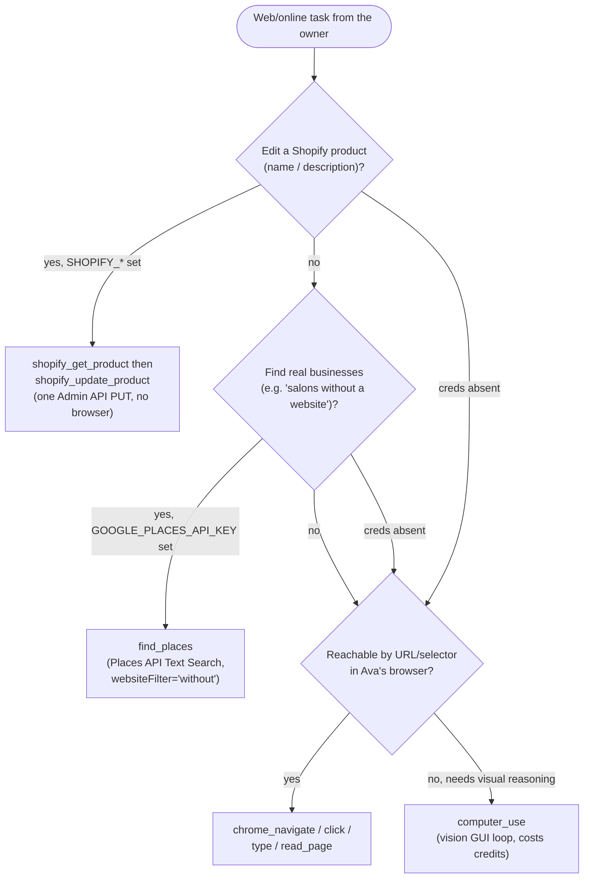

# Reliable task execution: lifted step cap + direct API tools

Two changes, shipped together, fix the same failure: real tasks dying mid-run with *"I reached my step limit"* before finishing even one item.

- **Change 1 (commit `e340c92`)** — the hard 48-turn agent cap is gone. The loop limit is now a runaway *backstop*, not a task budget.
- **Change 2 (commit `efa7ea0`)** — two task types that kept failing as browser automation (a Shopify product rename, a "salons without a website" search) now have **direct API tools** that don't drive a browser at all.

The first change unblocks the symptom; the second removes the root cause for those two tasks.

## What it does

### 1. The 48-turn cap no longer ends real work

The agent loop runs the model, lets it call tools, feeds results back, and repeats — once per "turn." Previously this was capped at a hard **48 turns**, after which the run ended with a graceful "I reached my step limit" message. That cap was the binding constraint on real multi-step tasks: a single Shopify product edit needs ~10–12 turns, and login/navigation can eat another 10–15, so 48 couldn't reliably finish **one** product, let alone a list.

Now the cap is `Number(process.env.AVA_MAX_AGENT_TURNS) || 1000` (`server/src/orchestrator/agent.ts:148`) — high enough to be effectively unlimited for any human-scale task, and overridable via the `AVA_MAX_AGENT_TURNS` env var. It exists only to stop a *truly* runaway loop, not to budget normal work.

The same fix was applied one level down: the per-call GUI loop inside `computer_use` (the vision-driven "screenshot → click → screenshot" agent) had its own iteration cap of **25**, raised to **100** (`server/src/tools/computer-use.ts:62` and `:263`) so a single `computer_use` invocation can finish a real sub-task instead of stopping halfway.

The real brakes are unchanged and intact:

- **The Stop button** aborts within ≤1 turn (`agent.ts:182`, the abort check at the top of every loop iteration).
- **The stuck-loop detector** (`server/src/orchestrator/stuck-loop.ts`) halts a run that's making no progress — see [edge cases](#edge-cases--limitations) below.
- **Per-tool timeouts** (`TOOL_BUDGET_MS`) bound each individual call.
- **Approval gates** still hold every `medium`/`high` action for your veto.

### 2. Direct API tools for Shopify and Google Places

Two new tool modules call vendor APIs over HTTP instead of clicking through a website. They register **only when their credentials are present**, so they are completely inert until you configure them.

**Shopify** (`server/src/tools/shopify-mcp.ts`) — three tools:

| Tool | What it does |
|---|---|
| `shopify_list_products` | Lists products (id + title) via the Admin API; optional case-insensitive title `query` filter to find ids before editing (`shopify-mcp.ts:57`). |
| `shopify_get_product` | Fetches one product's full current `title` + `body_html` (description) — including any `` tags embedded in the description — so the model edits the *real* current text (`shopify-mcp.ts:87`). |
| `shopify_update_product` | Edits a product's name and/or description via **one Admin API `PUT`** (`shopify-mcp.ts:140`). No browser, no clicking. |

The owner's rule — *"don't touch the pictures in the description"* — is enforced two ways in `shopify_update_product`:

1. **The `images` array is never sent.** The PUT body is built from only `{ id, title?, body_html? }` (`shopify-mcp.ts:132–134`); the product's `images` field is never in the request, so a name/description edit **cannot** disturb the product's pictures.
2. **The tool description instructs the model to preserve `` tags** inside `body_html` — *"if the description (body_html) contains `` tags, you MUST keep those exact `` tags in the new body_html"* (`shopify-mcp.ts:115–117`). Pictures embedded *inside* the description text are HTML the model rewrites, so this is a model-followed instruction, not a hard guarantee (see [limitations](#edge-cases--limitations)).

**Google Places** (`server/src/tools/places-mcp.ts`) — one tool:

- `find_places` queries the **Google Places API (New) Text Search** endpoint and returns structured business data: name, address, phone, `websiteUri`, Google Maps link, rating (`places-mcp.ts:29`).
- The key feature is `websiteFilter`: `'without'` returns **only** businesses with no website, `'with'` only those that have one, `'any'` (default) returns all (`places-mcp.ts:83–84`). This turns *"salons in Dublin without a website"* into a precise filter rather than a guess — and replaces scraping Google Maps, which is blocked and fragile.
- It pages until it has enough results (the website filter can drop some) or Google stops returning a `nextPageToken`, capped at 4 pages so it never loops (`places-mcp.ts:58`).

## Why it exists

On one day, **both** real tasks the owner asked for died the same way — "I reached my step limit" — before completing even one item:

- A **Shopify product rename** (edit a product's title + description).
- A **Google-Maps salon search** ("find salons without a website").

Two distinct problems sat behind that single symptom:

1. **The 48-turn cap was simply too low** for any real multi-step task. That's Change 1 — lift the cap so the *actual* safety mechanisms (Stop, stuck-detector, timeouts, approvals) are what bound a run, not an arbitrary turn count.
2. **Driving a browser was the wrong tool** for these two jobs. Clicking through the Shopify admin UI is slow and turn-hungry; scraping Google Maps is outright blocked. That's Change 2 — give the agent direct, reliable API calls that are fast, deterministic, and don't burn turns. A Shopify edit becomes one HTTP `PUT`; a places search becomes one HTTP `POST`.

## How you set it up

All three tools are **off until you provide credentials** in `server/.env`. The server reads them at boot (`server/src/config.ts:91–93`) and only registers each tool when its credentials are present (`server/src/routes/chat.ts:392–393`).

| Env var | Used by | Notes |
|---|---|---|
| `SHOPIFY_STORE` | Shopify tools | Your store domain, e.g. `my-store.myshopify.com`. |
| `SHOPIFY_ADMIN_TOKEN` | Shopify tools | An Admin API access token (`shpat_…`). **Both** `SHOPIFY_STORE` and `SHOPIFY_ADMIN_TOKEN` must be set, or none of the Shopify tools appear (`index.ts:287–288`). The token's app needs the `read_products` + `write_products` scopes. |
| `GOOGLE_PLACES_API_KEY` | `find_places` | A Google Places API (New) key. The Places API must be **enabled with billing** on the Google Cloud project. |

> Do not commit real values — these live only in the gitignored `server/.env`. The committed defaults are all `null`, so a fresh checkout has the tools disabled.

Restart (or let `tsx watch` reload) the server after editing `.env` so the new config takes effect.

## How the model picks an API tool over the browser

There is no routing code that forces the choice — the model picks, and each tool's **description is written to steer it**:

- `find_places`: *"Find real businesses/places via the Google Places API (reliable structured data — do NOT scrape Google Maps or write a scraper for this)."*
- `shopify_update_product`: *"Update ONE Shopify product's name and/or description via the Admin API — directly, no clicking."*

So when the relevant credentials are configured, the API tool is in the catalog with a description that explicitly tells the model to prefer it over browsing for that job. When the credentials are **absent**, the tool isn't offered at all, and the model falls back to the browser tools (`chrome_*` / `computer_use`) as before.

## Edge cases & limitations

- **Tools are inert without credentials.** No `SHOPIFY_*` → no Shopify tools; no `GOOGLE_PLACES_API_KEY` → no `find_places`. This is by design (`chat.ts:392–393`), and means the model silently has no API path and reverts to browser automation.
- **Shopify needs the right scopes.** The Admin token must grant `read_products` (for list/get) and `write_products` (for update). A token missing `write_products` will fail the `PUT` with a Shopify `403`, surfaced to the model as `Shopify update failed: 403 …` (`shopify-mcp.ts:147`).
- **Google Places needs billing enabled.** The Places API (New) is a billed Google Cloud service; without billing the request returns an error the tool surfaces as `Places search failed: <status> …` (`places-mcp.ts:72`).
- **The ``-preservation rule depends on the model following the instruction.** The hard guarantee is only that the *separate* `images` array is never sent (so the product's image gallery is untouchable by these tools). Pictures embedded *inside* the description (`body_html`) are HTML the model rewrites; keeping those `` tags intact relies on the model obeying the tool description, which is why `shopify_get_product` is required first (to show the model exactly what to preserve) and why the description states the rule in capitals.
- **A higher turn cap means a genuinely-stuck-but-still-changing loop could run longer.** The stuck-loop detector halts on two conditions: a **5-minute wall-clock** ceiling (`STUCK_WALLCLOCK_MS`, `stuck-loop.ts:1`), and a **no-progress** check — if the last 5 visual-tool results (`chrome_read_page` / `chrome_screenshot` / `computer_use`) are near-identical (Levenshtein ≤ 50) with no new "thought" in between, it halts as `no-progress` (`stuck-loop.ts:64–97`). A loop that keeps producing *different* output but never actually finishes would not trip the no-progress check, and could run up to the 5-minute wall-clock — or, in the worst case, toward the 1000-turn backstop. **Stop** ends it instantly either way.
- **Title filter is client-side.** `shopify_list_products`' `query` filters titles in memory over the fetched page (default 100, cap 250) — it is not a server-side Shopify search, so a product beyond the scanned page won't be found by the filter (`shopify-mcp.ts:58,68–69`).

## Decisions log

- **APIs over UI automation for these two task types (`efa7ea0`).** Clicking through the Shopify admin is slow, fragile, and turn-hungry; scraping Google Maps is blocked. A direct API call is reliable, fast, deterministic, and doesn't consume agent turns — one `PUT` for a product edit, one `POST` for a places search. UI automation (`chrome_*`, `computer_use`) remains the fallback when no API tool fits or credentials are absent.
- **A high backstop + wall-clock/Stop, not a low turn count (`e340c92`).** A fixed turn count is a *bad* proxy for "this task is stuck" — it cut off healthy, progressing work (it couldn't finish one Shopify product). The right signals for "stop now" are: the owner pressed **Stop**, the run made **no visible progress for 5 minutes**, a **tool timed out**, or an **approval was denied**. Those are the real brakes; the turn cap is set high (1000, env-overridable) purely as a runaway backstop and still emits a graceful final on the rare exhaustion rather than ending silently (`agent.ts:141–148`).
- **Never send the `images` array (`efa7ea0`).** The cleanest way to honor "don't touch the pictures" is to make it *structurally impossible* for a name/description edit to alter the image gallery: build the PUT body from only the fields being changed, and never include `images`. That's a hard guarantee independent of model behavior; the ``-in-description rule is the softer, instruction-based layer on top for pictures that live inside the description HTML.
- **Register only when configured (`efa7ea0`).** Credential-gated registration keeps the tool catalog honest — the model is never offered a tool it can't actually use, and a fresh checkout ships with these integrations safely off.
