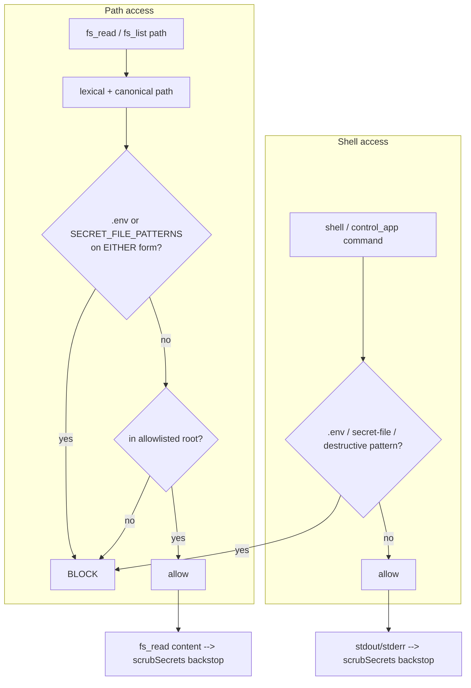

# Security hardening (adversarial-audit batch)

## What it does

Closes a set of credential-leak and destructive-command holes found by an adversarial audit of Ava's deliberately broad machine access, **without re-restricting that access**. Concretely: it hard-blocks secret files (cloud creds, SSH/private keys, token stores) even inside Ava's authorized roots; closes an NTFS-junction bypass of that block; widens the secret-scrubber that redacts tokens from tool output; tightens the destructive-shell blocklist (and fixes a false positive that broke normal PowerShell); and runs file-read output through the scrubber as a backstop.

## Why it exists

Sir wants Ava to have broad, fast access to his machine — launch any app, open any file under his home profile, run system commands "in seconds". That power means a single prompt-injection or model slip could exfiltrate live credentials or wreck files. The audit found exactly those paths. The guiding principle of every fix here is: **broad access stays allow-by-default; only add narrow hard-blocks on genuinely dangerous things, and never over-block anything benign that worked before.**

## How Sir interacts

Invisible in normal use — Ava still launches apps, opens files, and runs commands freely. Sir only sees a refusal if Ava (or an injected instruction) tries to read a credential file or run a destructive command; those come back as a blocked-reason string instead of executing.

## How it works

Four layers, all "check the deny-list before the allow-list, then allow".

**1. Secret-file hard-block + junction-bypass closure (`server/src/security/path-allowlist.ts`)**
- `SECRET_FILE_PATTERNS` (`:21`) is a curated list checked **before** the allowlist, so these are refused even inside the broad authorized roots: `.credentials.json`, `.aws/`, `.ssh/`, SSH private keys by filename (`id_rsa`/`dsa`/`ecdsa`/`ed25519` ±`.pub`), `gh/hosts.yml`, `.git-credentials`, `.pem`/`.pfx`/`.key`, plus credential stores `.npmrc`, `.docker/config.json`, `.kube/config`, `.pgpass`, `.netrc`/`_netrc`, `.p12`/`.p8`/`.pkcs12`/`.keystore`/`.jks`, and gcloud `access_tokens.db`.
- **Junction/symlink bypass:** the block originally matched only the *lexical* path, so a benign-named NTFS junction (e.g. `C:/Users/nikug/ml` → `C:/Users/nikug/.ssh`) let `fs_read` reach the real key. `canonicalizePath` (`:61`) resolves the path through the real filesystem (`realpathSync.native`, falling back to the existing parent's realpath for not-yet-created write targets), and the block now fires if **either** the lexical **or** the canonical path matches (`:89`–`:95`). This is purely additive — the allowlist match itself stays lexical, so no legitimately-allowed file is newly denied.
- **`id_rsa` false-positive fix (commit 1dd7107):** the old rule was a prefix (`/(^|[\/])id_rsa/`), which blocked innocent files like `id_rsa_setup_guide.md` and even `valid_rsa`. It's now anchored to a real filename boundary (`:30`) that accepts a path separator OR a command-string delimiter (because `matchSecretFile` runs on both resolved paths and raw shell strings), with a trailing boundary that keeps look-alikes readable.

**2. Expanded secret scrubber (`server/src/security/scrub.ts`)**
- `scrubSecrets` redacts modern token formats the old version missed: GitHub (`ghp/gho/ghu/ghs/ghr` + `github_pat_`), Google `AIza`, Slack `xox`, JWTs (`eyJ…`), PEM private-key blocks, DB connection strings (redacting only the credential segment so host/db survives), Stripe `sk_live/test`, Anthropic `sk-ant-(oat|ort)`, Figma `figu_`, Supabase `sba_`, AWS `AKIA…`, Bearer tokens, and a broadened OpenAI `sk-[A-Za-z0-9-]{20,}` (so project keys are caught). A trailing generic yaml-ish rule redacts `api_key:`/`password:`/`secret:`/`token:` values, with a negative lookahead so already-redacted `***` values aren't touched.

**3. Destructive-shell blocklist (`server/src/tools/shell-allowlist.ts`)**
- `DESTRUCTIVE_PATTERNS` (`:21`) is scanned against the **full** command string (so a destructive op hidden after a pipe/`&&` is still caught). Fixes from the audit (commit 0159bfa): `Remove-Item`/`del` with **Force OR Recurse** (was wrongly AND); `del`/`rd`/`rmdir` targeting a wildcard or path; `[IO.File]::Delete`; `Clear-Content`; redirect-truncation to an absolute path; `format` narrowed to `\bformat\s+[A-Za-z]:` (so `Format-Table` / `--pretty=format:` / `npm run format` stay allowed); curl/IWR exfil flags; and secret-env reads (`$env:*KEY/*TOKEN/*SECRET`, `Get-ChildItem Env:`, `gh auth token`, `git config --list`). The `.env` match is a plain substring.
- **The `-eq` false-positive fix (commit 31d8cb1):** the encoded-command lookahead `/-e(?!x|rr|ncodi)[a-z]*\s/` matched the comparison/alias operators `-eq`, `-ea`, `-ev` that appear constantly inside `powershell -Command "… -eq …"`, so a routine `if ($x -eq 5)` was refused as if it were `-enc <base64>`. The lookahead now also skips `q`/`a`/`v` after `-e` (`:60`); real encoded flags (`-e`/`-ec`/`-enc`/…/`-encodedcommand`) still match and stay blocked.
- `control_app`'s arbitrary PowerShell is gated through the **same** `isAllowed()` (`control-app-mcp.ts:150`) so it can't be a bypass around the shell safety net.

**4. fs_read + tool-output scrubbing backstop**
- `fs_read` runs file contents through `scrubSecrets` before the model sees them (`filesystem-mcp.ts:54`) — so anything that slips the path block (e.g. an unlisted credential file) still can't leak raw token material. The shell tool and `control_app` likewise scrub stdout/stderr before returning (`control-app-mcp.ts:180`).

## Edge cases & limitations

- **Conservative `.key`/`.pem`/`.pfx`/`.credentials.json` blocks** can catch a rare benign look-alike (e.g. `public.key`, `license.key`). This is a deliberate trade-off favouring safety; the `fs_read` content-scrub backstop limits the downside (a blocked public key isn't a leak, just a refusal).
- **The block list is curated, not exhaustive.** It targets the high-value credential stores the audit found; a novel secret-file location not in the patterns relies on the scrubber backstop rather than the path block.
- **Scrubbing is pattern-based.** A secret in an unrecognised format can pass the scrubber; the layered design (path block + destructive block + output scrub) is defense-in-depth, not a single guarantee.
- **Allowlist match is intentionally lexical** (`:96`), so a *root* that itself sits behind a junction isn't spuriously denied — broad access preserved. Only the secret/.env blocks consult the canonical path.

## Decisions log

- **Allow-by-default, deny narrowly (commits 0159bfa, 1dd7107, 31d8cb1).** Every fix preserves Ava's broad machine access; the audit response only *adds* hard blocks on secret material and tightens destructive patterns. Nothing benign that worked before is newly blocked — and two commits (1dd7107, 31d8cb1) exist specifically to undo over-blocking the first pass introduced.
- **Check secret/.env block before the allowlist.** A file living inside a writable root must still be refused if it's a credential — order matters.
- **Canonical-path check is additive, not a replacement.** Keeping the allowlist lexical avoids denying legitimately-allowed files behind junctions; only the secret block gained the canonical check, closing the bypass without collateral.
- **Scrub `fs_read`/tool output as a backstop.** The path block is the primary defense; output scrubbing ensures a slip can't leak raw tokens.
