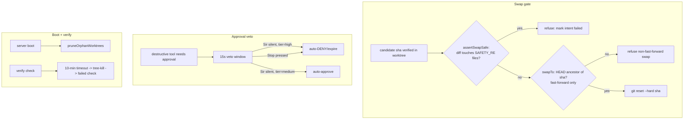

# Self-improvement safety guards

## What it does

Hardens Ava's self-improvement pipeline — the machinery that lets her verify a candidate code change in an isolated git worktree and "swap" it into the live branch — so it can never silently destroy work, weaken its own guardrails, or wedge itself. Five guards: (1) swaps are **fast-forward-only**, (2) a swap whose diff touches **safety-critical code is refused**, (3) a genuinely **destructive op left undecided auto-DENIES** (never auto-approves) when Sir's veto window expires, (4) leaked **orphan worktrees/branches are pruned** on boot, and (5) each **verify check has a wall-clock timeout** so a hung test can't hang the pipeline.

## Why it exists

Self-improvement is powerful and runs partly unsupervised (an overnight loop). Without guards it could: reset the live branch over commits Sir or another session made in the meantime (data loss); ship a change that edits the very security/approval code meant to contain it; auto-run a destructive command Sir never actually saw; pile up orphaned worktrees after a crash; or pin a worktree forever on a hung `npm test`. Each guard closes one of those.

Terms:
- **Worktree** — a second checkout of the repo (a temp dir + a `self/<id>` branch) where a candidate change is built and verified in isolation.
- **Swap** — moving the live branch/working tree to the verified candidate commit (`git reset --hard`).
- **Fast-forward** — moving forward to a commit that *contains* the current HEAD as an ancestor (so no commits are dropped).
- **LKG** — last-known-good commit, the rollback target.

## How Sir interacts

Mostly invisible — these guards protect the autonomous pipeline. Sir sees them only as: a self-improvement that *refuses to swap* (logged reason: non-fast-forward, or touches safety-critical code), a destructive approval that *expires as denied* rather than running if he doesn't respond, or boot log lines about pruned `self/*` branches.

## How it works

**1. Fast-forward-only swap (`server/src/self/swap.ts:15` `swapTo`)**
- Before `git reset --hard sha`, checks `isAncestor(HEAD, sha)`. If commits landed on the live branch *after* the worktree was created (Sir editing, a concurrent session, another improvement), HEAD is **not** an ancestor of the candidate, so resetting would **silently drop** them. The swap throws `refusing non-fast-forward swap`; `runImprovement`'s try/catch then marks the intent failed instead of clobbering work.
- The watchdog rollback (`revertTo`, `:39`) is intentionally *backward* (it undoes a bad swap) so it does **not** enforce fast-forward — but it's guarded by `expectedHead`: if HEAD moved on since the swap, the rollback is **skipped** rather than resetting over newer work.

**2. Safety-code gate (`server/src/self/safety-guard.ts:9` `SAFETY_RE` + `assertSwapSafe`)**
- A single shared regex matches any path under `security/`, `policy/`, `auth/`, the self-improvement machinery (`self/verify|swap|watchdog|improver|safety-guard|…`), plus `approval`, `settings.local`, `.claude/`, `path-allowlist`, `workerEnv`, `scrub`. `assertSwapSafe(repoRoot, lkg, sha)` (`:23`) diffs the candidate against LKG and **throws** if any changed file matches — Ava must not hot-swap a change that weakens its own guardrails. Both the live interactive path and the overnight loop import this one regex.

**3. High-risk auto-deny on veto timeout (`server/src/policy/runtime.ts:81`)**
- Approvals have a **15s veto window** (`DEFAULT_AUTO_APPROVE_MS`, override `APPROVAL_AUTO_APPROVE_MS`). The timeout behaviour depends on the classifier **tier** carried on the "ask" decision:
  - **medium** → `"approve"` on timeout (convenience — Sir didn't decline in time).
  - **high** → `"expire"` on timeout, i.e. **auto-DENY** — genuinely destructive ops (`fs_delete`, `rm -rf`, `format`, `reg delete`, `shutdown`, submit/checkout-like selectors, destructive `control_app` scripts; see `policy/classify.ts:46`) are *cancelled*, not silently executed, if Sir never saw them.
- A **Stop** mid-window aborts the run's signal, which `waitForDecision` resolves as expired (not approved) in **both** tiers — Stop cancels a pending approval, never runs the tool (`:82`).

**4. Orphan-worktree pruning (`server/src/self/worktree.ts:65` `pruneOrphanWorktrees`)**
- Run on boot. A crash/restart mid-improvement leaves a temp worktree dir + a `self/<id>` branch behind. This (1) `git worktree prune`s admin entries whose dirs are gone, then (2) deletes any `self/*` branch **not** backing a live worktree. Every step is wrapped so a boot can never crash on it; if it can't enumerate live worktrees it bails rather than risk deleting a live branch.

**5. Verify-runner timeout (`server/src/self/verify-runner.ts:9`)**
- Each verify check (e.g. `npm test`, build) gets a hard **10-minute** wall-clock cap (`RUN_TIMEOUT_MS`). On timeout it **tree-kills** the `npm.cmd → node` subtree (a bare kill would orphan node) and resolves a *failed* check, so a watch flag or a test awaiting input can't hang the pipeline or pin its worktree forever.

## Edge cases & limitations

- **Fast-forward refusal fails the improvement, it doesn't merge.** If the live branch advanced, the candidate is abandoned (recoverable via reflog only if needed) rather than rebased — a deliberate "fail safe, don't get clever" choice.
- **The safety regex is path-based.** It blocks by *filename pattern*, so it's conservative — it may refuse a benign edit that merely lives under `security/` etc. That's the intended bias (refuse rather than risk weakening a guardrail).
- **Pruning only touches `self/*` branches.** It never deletes a branch backing a live worktree; a non-`self/` leaked branch isn't its concern.
- **Verify timeout is fixed at 10 min** (constructor-overridable in tests). A legitimately longer build would be cut off — 10 min is set comfortably above a real full build+test on this repo.
- **Medium-tier ops still auto-approve on timeout** — the convenience default. Only `high` tier flips to auto-deny.

## Decisions log

- **Fast-forward-only + safety-code gate (commit 96f6d01).** Two distinct failure modes — dropping concurrent commits, and self-weakening edits — each get a guard that *fails the intent* rather than proceeding.
- **High-risk timeout = deny, medium = approve (commit 96f6d01 / approvals 935da3d).** The 15s veto window auto-approves for convenience on ordinary ops, but genuinely destructive ops must never run unseen, so they expire as denied.
- **One shared `SAFETY_RE`.** The interactive path and the overnight loop import the same regex, so there's exactly one definition of "safety-critical" and it can't drift.
- **Watchdog revert is guarded but not fast-forward-only.** It's a deliberate backward move to undo a bad swap; the `expectedHead` guard prevents it from clobbering work committed after the swap.
- **Tree-kill on verify timeout.** Consistent with the Stop tree-kill principle (see `stop-tree-kill.md`): kill the whole subtree so no orphaned `node` survives.
