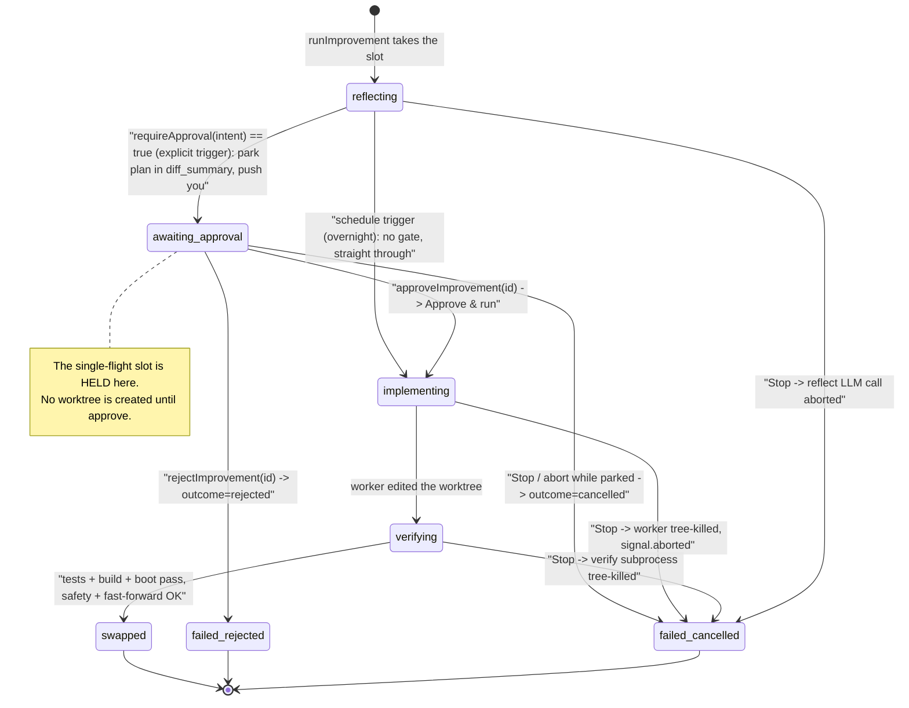

# Self-improvement: stoppable, and gated behind a plan you approve

## What it does

Two paired changes make Ava's self-improvement pipeline controllable from the
outside instead of running away unseen:

1. **It can be stopped.** A self-improvement now carries an `AbortController`
   that threads into every long step — the LLM `reflect` call, the `claude_code`
   worker that edits files, and the `npm test`/build verify subprocess. The Self
   screen shows a **Stop** button on any running improvement, and the red global
   **Stop** button (`/kill`) now also cancels *all* self-improvements. A cancelled
   run is recorded `status="failed"`, `outcome="cancelled"` (not a plain failure).
2. **It shows its plan first.** A *user-triggered* improvement drafts its change
   brief, then **pauses** at a new `awaiting_approval` state and waits — no code is
   written until you press **Approve & run**. You can **Reject** it (nothing is
   written) or **Stop** it while it waits. The drafted plan is rendered in the
   Self screen so you see exactly what it intends before it touches anything.

Together: you can prevent a self-edit up front (the gate) *and* kill one already
in flight (Stop).

## Why it exists

The self-improvement pipeline used to run **fully detached** with no abort path.
Chat/voice runs register an `AbortController` in `ActiveRuns` and the red Stop
button (`POST /api/chat/:sessionId/kill`) aborts them — but a self-improvement
isn't a session run, so Stop couldn't reach it. Once a self-improvement started,
it ran to completion (or its own internal timeouts) regardless of the button.
That was the exact "I pressed Stop and it kept going" runaway, and it was
previously documented as a known gap (see `docs/architecture/07-self-improvement.md`
§13.1 and `docs/ARCHITECTURE.md` W4/§7 — now corrected).

The gate closes the *other* half of the same problem: even with a kill switch, a
user-asked self-edit would still begin writing code the moment it was queued,
before you'd seen what it planned to do. Parking at `awaiting_approval` means a
human sees and approves the brief before any file changes — runaway prevention at
the front door, to pair with the kill switch at the back.

Terms:
- **Intent** — one self-improvement record (`Intent` in `intents.ts`): goal,
  status, commit, last-known-good, etc.
- **Trigger** — how the intent was created. `explicit` = you asked ("improve
  yourself"); `schedule` = the unattended overnight loop chose it.
- **Single-flight slot** — only one improvement may mutate the live git tree at a
  time; others queue FIFO (`improver.ts:32-33`).
- **Reflect / implement / verify / swap** — the pipeline stages (reflect = LLM
  drafts the brief; implement = Claude worker edits a worktree; verify =
  tests/build/boot; swap = move the live tree onto the verified commit).

## How you interact

Everything is in the **Self screen** (`web/src/self/SelfScreen.tsx`, reachable from
the app) plus the red global **Stop** button.

- **Stop a running improvement.** Any intent in a running state
  (`queued`/`reflecting`/`implementing`/`verifying`, per `isRunningStatus`,
  `useSelfJournal.ts:83-85`) shows a small red **Stop** button
  (`SelfScreen.tsx:73-80`). It hits `POST /api/self/:id/cancel`.
- **The red global Stop also reaches self-improvements.** Pressing the main Stop
  button (the chat `/kill` endpoint) now cancels **every** running and queued
  self-improvement in one shot, matching what you expect from the red button
  (`routes/chat.ts:516-520`).
- **Review and approve a plan.** When a user-triggered improvement parks, the Self
  screen shows the drafted plan in a panel labeled *"Plan — review before it runs"*
  with **Approve & run** and **Reject** buttons (`SelfScreen.tsx:86-107`). You also
  get a push notification ("A self-improvement plan is ready for your review: …",
  `index.ts:155-158`). Approving proceeds to implement; rejecting stops it with
  `outcome="rejected"`; pressing **Stop** while it waits stops it with
  `outcome="cancelled"`.
- **The `self_improve` tool now tells the truth about timing.** When Ava queues a
  self-improvement, the tool reply says a plan is coming for your review — Ava
  must **not** claim the change is done (`tools/self-improve-mcp.ts:8,17`).

## How it works

### The gated lifecycle

> **On stored status vs. outcome.** `awaiting_approval` is a real persisted status
> (`intents.ts:5-7`). `failed_rejected` and `failed_cancelled` above are **not**
> separate statuses — both are stored as `status="failed"` and distinguished by the
> `outcome` column (`"rejected"` vs `"cancelled"`). A normal failure has no
> `outcome="cancelled"`, so a stopped run reads distinctly from a broken one.

### Part A — the abort path (`improver.ts` + the stages)

- **Per-improvement controller registry.** `runImprovement` constructs a fresh
  `AbortController` per run and registers it by intent id in a module-level
  `Map<string, AbortController>` (`improver.ts:38, 103-105`). The signal is threaded
  into `deps.reflect(goal, null, signal)` (`:112`), `deps.implement(brief, wt.path,
  signal)` (`:142`), and `deps.verify(wt.path, signal)` (`:150`), with a
  `throwIfAborted()` check between every stage (`:106, 110, 113, 147, 153`).
- **`cancelImprovement(db, id)`** (`improver.ts:68-78`) aborts the running one (if a
  controller exists), or — if the id is only *queued* on `pending` — drops it from
  the FIFO and records `failed` / `outcome="cancelled"` directly.
- **`cancelAllImprovements(db)`** (`improver.ts:82-91`) aborts every registered
  controller and clears the whole `pending` queue, recording each dropped queued
  intent as cancelled. Returns the count. This is what the red button calls.
- **`hasActiveImprovement()`** (`improver.ts:44-46`) reports whether anything is
  running or queued.
- **A cancel is recorded as cancelled, not failed.** The catch block checks
  `signal.aborted`: if set, it writes `outcome="cancelled"` and emits a `cancelled`
  step; otherwise it's an ordinary `failed` (`improver.ts:164-174`).
- **The stages honor the signal.**
  - `reflect.ts:7,21` — passes `o.abort` straight to `provider.stream({... abort})`
    instead of the old throwaway `new AbortController().signal`, so the LLM call is
    actually cancellable.
  - `verify.ts:10-20` — checks `o.signal?.aborted` before each command and the boot
    smoke, returning `{ ok:false, log:"cancelled" }` early.
  - `verify-runner.ts:16-49` — on abort (or timeout) it **tree-kills** the
    `npm.cmd → node` subtree (`killTree(child.pid, "SIGTERM")`, `:23-26, 43`) so a
    bare kill can't orphan `node`, then resolves a failed check.
  - `implement` is `selfClaudeCode.run({ ..., signal })` (`index.ts:171`,
    `auto-improve-loop.ts:75`) — the worker's existing `claude_code` abort support
    kills the `claude -p` child mid-edit.
- **The red Stop reaches it.** `routes/chat.ts:519` calls `cancelAllImprovements(db)`
  inside the `/kill` handler (imported at `chat.ts:20`) and returns
  `cancelledImprovements` in the JSON. The endpoint still does its existing job
  (abort the session run, tree-kill its PIDs) — cancelling self-improvements is an
  added step.
- **Wiring.** Both improver wirings pass the signal through (the live deps,
  `index.ts:159-175`, and the overnight loop, `auto-improve-loop.ts:68-78`). The
  HTTP route `POST /api/self/:id/cancel` is wired to `cancelImprovement`
  (`routes/self.ts:29-34`, `index.ts:326`).

### Part B — the approval gate (`improver.ts` + `index.ts`)

- **The gate is a dep, defaulted off.** `ImproverDeps` gains an optional
  `requireApproval?(intent): boolean` and `onAwaitingApproval?(id, plan)`
  (`improver.ts:9, 12`). Because both are optional, any wiring that omits them (the
  overnight loop) skips the gate entirely.
- **Park-and-wait.** After reflect, if `deps.requireApproval?.(intent)` is true,
  `runImprovement` (`improver.ts:118-138`):
  1. sets `status="awaiting_approval"` and stores the plan in `diff_summary`,
     prefixed `PLAN:` and capped at 4 KB (`:119`);
  2. emits the step and calls `deps.onAwaitingApproval?.(id, brief)` to push you
     (`:120-121`);
  3. `await`s a `Promise<boolean>` whose resolver is stashed in a module-level
     `planDecisions` map keyed by id (`:122-126`); a `signal` **abort** while parked
     resolves it `false` via a one-shot listener (`:125`);
  4. on resolve, deletes the decision (`:127`); if not approved, records
     `outcome="cancelled"` when `signal.aborted` else `outcome="rejected"`, and
     **returns before any worktree is created** (`:128-137`).
- **Approve / reject.** `approveImprovement(id)` and `rejectImprovement(id)`
  (`improver.ts:50-63`) look up the parked resolver and settle it `true`/`false`;
  each returns `false` if nothing was waiting for that id. Routed at
  `POST /api/self/:id/approve` and `/:id/reject` (`routes/self.ts:35-46`, wired
  `index.ts:327-328`).
- **Only explicit triggers gate.** The live wiring sets
  `requireApproval: (intent) => intent.trigger === "explicit"` and an
  `onAwaitingApproval` that pushes via `notifyDone` (`index.ts:154-158`). The
  overnight loop's `deps` object (`auto-improve-loop.ts:67-78`) sets **neither**, so
  scheduled improvements run straight through without a human in the loop.
- **Restart clears the parked state.** `failStaleIntents` now includes
  `awaiting_approval` in the set of non-terminal statuses it marks `failed` on boot
  (`intents.ts:42`) — a plan left waiting when the process died is reconciled, not
  left forever-pending.
- **The tool copy is honest.** The `self_improve` tool description and reply both
  say a plan is coming for review and that Ava must not claim it's done
  (`tools/self-improve-mcp.ts:8, 17`).

### The Self screen (`web/src/self/`)

- `useSelfJournal.ts` adds a generic `act(id, action)` that POSTs
  `/api/self/:id/{cancel|approve|reject}` then refreshes (`:63-70`), exposed as
  `cancel` / `approve` / `reject` (`:74-77`). `isRunningStatus()` (`:83-85`) decides
  when to show **Stop**; `planText()` (`:88-91`) strips the `PLAN:` prefix for
  display. The polled `Intent` type now carries `diff_summary` so the plan is
  available client-side (`:9-11`).
- `SelfScreen.tsx` renders the **Stop** button on running intents (`:73-80`), the
  parked-plan panel with **Approve & run** / **Reject** (`:86-107`), and relabels
  the status line to "awaiting your approval" for that state (`:83`).

## Edge cases & limitations

- **The single-flight slot is HELD while awaiting approval.** Because the run is
  blocked on the `await` inside `runImprovement`, `inFlight` stays `true` and any
  other improvement queues behind it (`improver.ts:100, 122-126`). A plan you leave
  un-actioned **blocks all other self-improvements** until you approve, reject, stop
  it, or restart the server (the `finally` that frees the slot only runs once the
  function returns, `improver.ts:175-182`). This is deliberate — see the decisions
  log — but it does mean a forgotten plan stalls the queue.
- **A restart drops a parked plan.** `failStaleIntents` marks an `awaiting_approval`
  intent `failed` on boot (`intents.ts:42`); the in-memory `planDecisions` resolver
  and the `inFlight` lock don't survive a restart anyway. You'd re-issue the goal.
- **Cancel vs. reject are different outcomes.** Rejecting a parked plan →
  `outcome="rejected"`; stopping it (Stop button / red button / abort) →
  `outcome="cancelled"` (`improver.ts:128-135`). Both end at `status="failed"`. This
  distinction is intentional so the journal shows whether *you declined the plan* or
  *killed the run*.
- **The overnight loop is NOT gated and is still stoppable in-process.** Scheduled
  improvements skip the approval gate (no `requireApproval` wired,
  `auto-improve-loop.ts:67`), by design — it runs unattended. The overnight loop is
  a **separate process** from the live server, so the live server's
  `cancelAllImprovements` and its in-memory controller map don't reach a job running
  in the overnight process. The abort *plumbing* is threaded through the overnight
  deps (`auto-improve-loop.ts:75-78`), but there's no in-process caller wired to
  fire it there; the loop's own stop conditions (credit exhaustion, consecutive
  failures, iteration cap) still apply.
- **Cancellation is cooperative, bounded by the stages' own kill paths.** `reflect`
  cancels via the provider's abort; `verify` tree-kills the subprocess; `implement`
  relies on `claude_code`'s abort to kill the `claude -p` child. A stage that
  ignored its signal would only be caught at the next `throwIfAborted()` between
  stages — in practice the worker and the verify subprocess are the long poles and
  both are killed directly.
- **`cancelImprovement` returns `false` for an unknown/finished id.** If the intent
  is neither running (no controller) nor queued, nothing is cancelled
  (`improver.ts:77`); the route still returns `{ ok:true, cancelled:false }`.
- **The SelfScreen "Pause" button is still a client-only no-op.** Unchanged by this
  work — Stop/approve/reject are the real controls; Pause toggles local label text
  only (`SelfScreen.tsx:38-44`).

## Decisions log

- **Gate only `explicit` (user-asked) triggers; leave the overnight loop ungated
  (commit c539c75).** The whole point of the unattended overnight loop is to improve
  Ava while no one is watching; gating it on human approval would defeat it. A
  user-asked improvement, by contrast, has a human right there to review — so that's
  where the plan-first gate belongs. Implemented as
  `requireApproval = (intent) => intent.trigger === "explicit"` with the overnight
  loop simply omitting the dep (`index.ts:154`, `auto-improve-loop.ts:67`).
- **Make Stop *also* cancel self-improvements (commit 0bd8b93).** The red button is
  the user's universal "stop everything." A self-improvement isn't a session run, so
  the existing `/kill` abort path didn't touch it — leaving the most prominent
  control unable to stop the most consequential background work. Calling
  `cancelAllImprovements(db)` inside `/kill` makes the button mean what the user
  expects (`routes/chat.ts:519`).
- **Hold the single-flight slot while awaiting approval (commit c539c75).** The
  alternative — free the slot while a plan waits — would let another improvement
  start (or the same one re-enter) and mutate the tree under a plan you're still
  reviewing. Holding the slot keeps "one improvement touches the tree at a time"
  true across the human pause, at the cost of a forgotten plan stalling the queue
  (called out under limitations). Reject/cancel/restart all free it promptly.
- **Record a stop as `outcome="cancelled"`, not a plain failure (commit 0bd8b93).**
  A user-initiated stop is not the pipeline breaking; conflating the two would make
  the journal misleading and could trip failure-counting logic. The catch block
  branches on `signal.aborted` to keep the two honest (`improver.ts:168`).
- **Park the plan in `diff_summary` (prefixed `PLAN:`) rather than a new column
  (commit c539c75).** `diff_summary` already exists and is already surfaced to the
  UI and the status tool; reusing it (and stripping the prefix client-side via
  `planText`) avoided a schema change. It's overwritten with the real
  `BRIEF:/WORKER:` summary once implement runs (`improver.ts:119` then `:145`).
- **Cooperative `AbortSignal` threaded through the deps, not a hard process kill
  (commit 0bd8b93).** The pipeline already injects every real action through
  `ImproverDeps`, so threading a signal through `reflect`/`implement`/`verify` (and
  tree-killing the subprocess) cancels cleanly without losing the worktree cleanup
  in `finally`. It also keeps the same orchestrator working for both the live and
  overnight wirings.

## See also

- `docs/features/self-improve-safety.md` — the swap/verify guardrails (fast-forward
  only, safety-file refusal, verify timeout) that this builds alongside.
- `docs/features/stop-tree-kill.md` — the tree-kill principle the verify-runner and
  the `/kill` endpoint share.
- `docs/architecture/07-self-improvement.md` — the full subsystem reference (now
  updated to reflect Stop reaching self-improvement and the approval gate).
