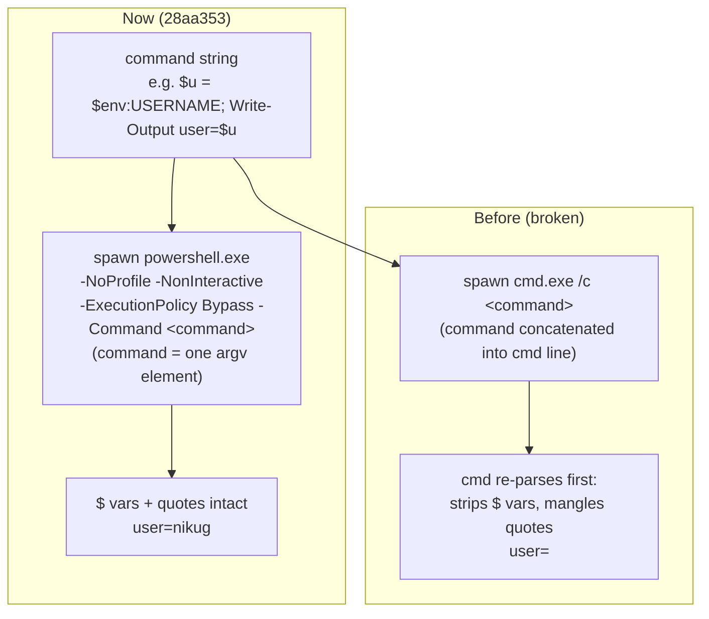

# The shell tool runs PowerShell directly, not cmd.exe

## What it does

Ava's `shell` tool runs commands and launches apps on your Windows PC. As of commit `28aa353`, it executes those commands through **Windows PowerShell 5.1**, spawned directly, instead of routing them through `cmd.exe /c`. A command like `$u = $env:USERNAME; Write-Output "user=$u"` now returns the real username (`user=nikug`) instead of an empty value — PowerShell `$` variables and nested quotes survive intact.

Nothing else about the tool changed: the same allowlist gate runs before a command executes, the same secret-scrubbing runs on output, and the same Stop/timeout tree-kill reaps the process subtree.

## Why it exists

The executor used to pick the OS shell like this — `cmd.exe /c <command>` on Windows. Every command Ava ran was handed to `cmd.exe` as a string. `cmd` then re-parsed that string with **its own** rules before PowerShell ever saw it, which broke PowerShell commands two ways:

- **`$` variables got stripped.** `cmd` treats `$env:USERNAME` (and any `$`-prefixed token) as nothing special and mangles it, so the variable arrived empty or malformed.
- **Nested quotes got mangled.** `cmd`'s quote handling differs from PowerShell's, so any command with embedded quotes (a `Write-Output "…"`, a path in quotes, a filter expression) came apart.

This is exactly the failure the owner hit: *"my diagnostic commands failed because of Windows quoting."* The diagnostic commands were PowerShell, the shell tunneled them through `cmd`, and `cmd` corrupted them before they ran.

The fix already existed elsewhere. The `control_app` tool had been bitten by the **same** `cmd /c` problem in an earlier session and solved it by spawning `powershell.exe` directly as an argv array — see the "HARD-WON LESSON" comment in `server/src/tools/control-app-mcp.ts:7`. That lesson had simply never been applied to `shell`. This change brings `shell` in line.

## How you interact

Nothing to do — it is transparent. You ask Ava to run something; it runs in PowerShell now. The one thing worth knowing is the **5.1 chaining caveat** (see below): PowerShell 5.1 has no `&&`/`||`, so multi-step commands are chained with `;`. Ava's tool descriptions were updated to tell the model this, so it composes commands correctly on its own.

## How it works

On Windows, the executor now spawns `powershell.exe` with the command passed as a **single argv element** after `-Command`. Because the command is one discrete argument in the argv array — not a string concatenated into a `cmd` line — no intermediate shell re-parses it. PowerShell receives it verbatim.



**The spawn (`server/src/tools/shell.ts:36`)**

```ts
const shell = isWin ? "powershell.exe" : "bash";
const args = isWin
  ? ["-NoProfile", "-NonInteractive", "-ExecutionPolicy", "Bypass", "-Command", opts.command]
  : ["-c", opts.command];
const child = spawn(shell, args, { cwd: opts.cwd });
```

The flags mirror `control_app` (`control-app-mcp.ts:67`):

- **`-NoProfile`** — skip the user's PowerShell profile, so startup is fast and no profile side effects leak into the command.
- **`-NonInteractive`** — if the command tries to prompt (a confirmation, a credential request), PowerShell **fails fast** instead of hanging the tool forever waiting on input that will never come.
- **`-ExecutionPolicy Bypass`** — so the command is allowed to run regardless of the machine's script-execution policy.
- **`-Command <command>`** — run the command text. As an argv element it is handed to PowerShell directly; `cmd` is never in the path.

**Non-Windows is unchanged** — it still uses `bash -c`. Only the Windows branch moved off `cmd`.

**The tool/prompt descriptions were corrected** off the old `cmd.exe` wording, so the model is told the truth about its shell:

- `server/src/tools/shell-tool.ts:18` — the `shell` tool description now says it's Windows PowerShell 5.1, to chain with `;` (not `&&`/`||`), prefer single-quoted strings, read env vars as `$env:VAR`, and launch apps with `Start-Process`.
- `server/src/orchestrator/capabilities-content.ts:25` — the "Act on the PC" capability text now describes PowerShell 5.1 and uses `Start-Process` / `Invoke-Item` examples instead of cmd-style `start "" "…"`.
- `server/src/orchestrator/tool-rubric.ts:15` — the rubric line the model reads now notes the `;`-not-`&&` chaining and `Start-Process` launching.

**The abort/timeout path is unchanged.** The executor still avoids `spawn(..., { signal })` (Node's spawn-abort kills only the direct child and orphans grandchildren) and instead tree-kills on abort or timeout via `killTree` → `taskkill /T` (`shell.ts:53`), so Stop still reaps the whole subtree. The only edit there was a comment: the direct child it kills is now `powershell`, not `cmd.exe` (`shell.ts:41`).

## Edge cases & limitations

- **PowerShell 5.1 chaining.** The machine has **Windows PowerShell 5.1**, not PowerShell 7 (`pwsh`). 5.1 does not support `&&` or `||`. Multi-step commands must chain with `;` (or use explicit `if`/`$?` checks for conditional flow). The tool description tells the model this; a literal `&&` in a command would be a PowerShell parse error.
- **`-NonInteractive` fails fast on prompts.** A command that pauses for interactive input does not hang the tool — PowerShell exits with an error instead. That is intentional (a hung tool is worse), but it means a command written to expect a prompt will fail rather than wait.
- **`control_app` already did this.** This change does **not** alter `control_app`; it brings `shell` to parity with the pattern `control_app` already used (spawn `powershell.exe` as argv, never through `cmd`). One difference remains: `control_app` writes the script to a `.ps1` file and runs it with `-File` (so it can also fix UTF-8 encoding for non-ASCII), whereas `shell` passes the command inline with `-Command`. For native-app UI Automation / SendKeys scripts, `control_app` is still the right tool.
- **The allowlist gate is unchanged.** `isAllowed(command)` still runs first and still refuses `.env`/secret access and the destructive blocklist before anything spawns (`shell.ts:21`). Switching shells does not widen what's permitted.

## Decisions log

- **PowerShell, not `pwsh` 7.** PowerShell 7 (`pwsh`) is not installed on this machine, so the executor targets `powershell.exe` (Windows PowerShell 5.1), which is always present on Windows. The cost is 5.1's missing `&&`/`||`, which the descriptions account for by steering the model to `;`.
- **`-Command`, not `-EncodedCommand`.** Base64-encoding the command (`-EncodedCommand`) would sidestep any residual quoting concern, but `-Command` keeps the executed text **readable** — in logs, in errors, and when debugging a failed command — which matters more here, since spawning as a single argv element already prevents the `cmd` re-parse that caused the bug. The allowlist's `-e`/`-enc` block (`shell-allowlist.ts:60`) exists to stop the **model** from smuggling an opaque encoded payload past the safety scan; it isn't a constraint on how the executor itself launches PowerShell.
- **Mirror `control_app`'s flags.** `-NoProfile -NonInteractive -ExecutionPolicy Bypass` is the exact, already-proven flag set `control_app` uses, chosen for speed, fail-fast-on-prompt, and run-regardless-of-policy. Reusing it keeps the two PowerShell-spawning tools consistent.
- **Don't touch the abort/timeout tree-kill.** The Stop reliability machinery (no `{ signal }` on `spawn`; tree-kill on abort/timeout) was correct already and was left as-is — only the shell binary and a comment changed.
