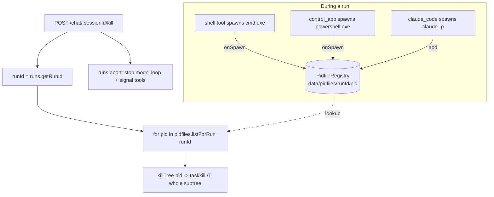

# Stop tree-kills the whole process subtree

## What it does

When Sir presses **Stop**, Ava doesn't just abort the next model turn — it **kills the entire process subtree** that the run spawned. Every child process a tool launched (`claude -p` from `claude_code`, a `cmd.exe`/`bash` from `shell`, a `powershell.exe` and any app it focused from `control_app`) and everything *those* launched is terminated. Stop actually halts running work, not just future work.

## Why it exists

Earlier, Stop aborted the model read-loop and signalled in-flight tools, but only the `claude_code` child was reliably reachable. A `shell` or `control_app` command — or any grandchild a tool spawned (a build's `node`, an app `Start-Process` opened) — could keep running after Stop, burning resources and, worse, *finishing a command Sir tried to cancel*. Node's built-in spawn-abort only kills the **direct** child, orphaning grandchildren. A real Stop needs a **tree** kill.

## How Sir interacts

Sir presses the red Stop button in chat, which hits `POST /api/chat/:sessionId/kill-all`; voice interruption uses the session-only `/kill` sibling. Both routes reach the active session's whole process subtree. Best-effort: a dead or already-exited PID never fails the request.

## How it works

Each tool that spawns a child **registers its PID** under the run's id in a pidfile registry; the kill endpoint looks up those PIDs and `killTree`s each one.

**Pidfile registry (`server/src/process/pidfile.ts`)**
- `PidfileRegistry` stores one empty file per PID at `data/pidfiles/<runId>/<pid>`. `add`/`remove` register and unregister; `listForRun(runId)` (`:25`) returns the PIDs for a run — used by the kill endpoint. A boot-time recovery (`state/recovery.ts`) clears any pidfiles left by a crashed run.

**Tools register their child PIDs**
- `shell` (`tools/shell.ts:35`) and `control_app` (`tools/control-app-mcp.ts:71`, `:174`) call `onSpawn`/`onExit` hooks wired to `reg.add`/`reg.remove` (`shell-tool.ts:42`, `control-app-mcp.ts:174`–`:175`). Crucially, neither passes `{ signal }` to `spawn`, **because** Node's spawn-abort kills only the direct child and orphans grandchildren — they tree-kill on abort/timeout instead (`shell.ts:29`, `control-app-mcp.ts:61`).
- `claude_code` (`tools/claude-code.ts:97`) registers its child via `cfg.pidfiles.add(runId, childPid)` and removes it on settle.

**Tree kill (`server/src/process/kill-tree.ts`)**
- `killTree(pid, signal)` wraps the `tree-kill` package, which on Windows shells out to `taskkill /T` (terminate the PID **and all descendants**). Returns `false` on error rather than throwing.

**The kill endpoint (`server/src/routes/chat.ts:494`)**
1. Look up the `runId` **before** unregistering (so the child PIDs are still findable) — `:501`.
2. `runs.abort(sessionId)` stops the model read-loop and signals in-flight tools (`:504`).
3. For every PID in `pidfiles.listForRun(runId)`, `await killTree(pid)` — best-effort, a dead PID never fails the request (`:509`–`:513`).
4. `runs.unregister(sessionId)` frees the run slot immediately so a new turn can start (`:514`).

## Edge cases & limitations

- **Best-effort, not guaranteed.** A PID that already exited, or a `taskkill` that fails, is swallowed (`catch { /* already gone */ }`) so Stop always returns. A process that detached fully from its parent tree wouldn't be reached by `taskkill /T`.
- **Only registered spawns are tree-killed.** A child a tool spawns *without* wiring the `onSpawn` hook wouldn't be in the registry. The current spawning tools (`shell`, `control_app`, `claude_code`) all register; the design is "belt-and-suspenders" with each tool's own abort handling.
- **`computer_use`'s GUI loop and `claude_code`'s child are also aborted via their abort listeners** (`:503`), so the tree-kill is an additional layer, not the only one.
- **PID reuse** is a theoretical risk (an exited PID's number reassigned before kill), mitigated by the registry being scoped per-run and cleared on settle/boot-recovery.

## Decisions log

- **Tree kill, not direct kill (commit 3adb8c4).** Node's spawn-abort orphans grandchildren; `taskkill /T` via the `tree-kill` package terminates the whole subtree, which is what makes Stop actually stop running work.
- **Per-run pidfile registry on disk.** Files under `data/pidfiles/<runId>/` survive within the process and are reconcilable on boot (recovery clears stale ones after a crash), so a restart doesn't leak zombie tracking.
- **Look up runId before unregister.** Unregistering first would lose the PID list; the endpoint resolves `runId` up front, then kills, then frees the slot.
- **Don't pass `{ signal }` to `spawn`.** It only kills the direct child; the tools handle abort/timeout with an explicit tree-kill so descendants die too.
