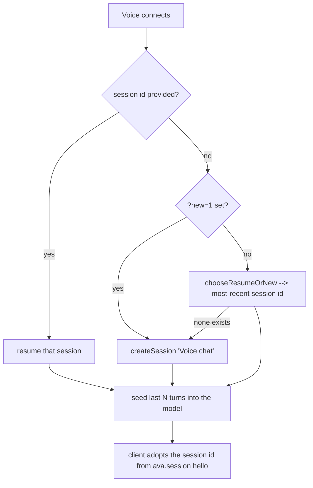

# Voice conversation continuity

## What it does

When Sir enters voice from the home orb, Ava **resumes the most-recent conversation** instead of starting a blank one. Ask something in voice, finish it in text chat, come back to voice and ask "what did you do?" — and Ava remembers, because voice and chat share one continuous conversation. A **"+new" control** lets Sir deliberately start a fresh conversation when he wants one. The recent turns are seeded into the speaking model on connect so it actually has the memory, not just a shared session id.

## Why it exists

Previously, every time Sir opened voice from the orb (with no session id), the proxy **minted a brand-new "Voice chat" session**. So voice always landed in an empty conversation with no recollection of what was just typed or spoken — a jarring "fresh start" each time. Voice and chat felt like two disconnected assistants. The fix makes them one memory.

## How Sir interacts

- **Enter voice from the orb** → Ava resumes the most-recent session automatically. No action needed.
- **Enter voice from a blank New chat** → Ava creates a new canonical session for
  that chat. It never falls back to the most-recent voice conversation.
- **Tap "+new"** (`web/src/voice/VoiceScreen.tsx:74`) → drops the current session and reconnects with `?new=1`, forcing a fresh "Voice chat" session (`useRealtimeVoice.ts:872` `newConversation`).
- Entering voice with an explicit session id (e.g. continuing a specific chat) resumes that exact session.

## How it works

**Resume-or-new decision (`server/src/routes/voice-realtime.ts:526` `chooseResumeOrNew`)**
- Pure function: `wantNew` true → `resumeId: null` (caller creates a fresh session); else `resumeId` = the most-recent session id. The caller resumes it, or creates a new "Voice chat" session if none exists.
- `wantNew` comes from the `?new=1` query param the client sets when "+new" is tapped (`voice-realtime.ts:719`).
- Both the OpenAI branch (`:813`) and the Hume branch (`:1083`) apply this. The Hume branch always passes `wantNew=false` to `chooseResumeOrNew` — Hume entry doesn't expose a "+new" path of its own; it resumes the latest.

**History seeding differs by provider** because the two upstreams have different ways to be told "here's what happened before":

- **OpenAI** seeds the last *N* turns as actual **conversation items** via `conversation.item.create` (`voice-realtime.ts:821`–`:838`), context only — no `response.create`, so the model doesn't reply to the seed. `N` defaults to 12 (`REALTIME_SEED_TURNS`). Each seeded item is OpenAI cost per connect, so the default stays small.
- **Hume** can't reliably consume seeded conversation items, so the recent turns are folded straight into the **system prompt** via `buildHumeHistoryBlock` (`:325`) — a formatted "# Recent conversation (most recent last)" block appended before the Hume session settings are sent (`:1089`). (See `hume-voice.md` for why the system prompt, not the `context` field, is used.)

**The `output_text` seed-type fix (`seedContentType`, `:534`)**
- The GA realtime schema is **asymmetric**: user/system turns use content-part type `input_text`, but **assistant** turns must use `output_text`. Sending `text` (the old code) for an assistant turn is rejected with *"Value must be 'output_text'"*.
- This bug stayed hidden until voice started *resuming* sessions that contain assistant turns — a fresh session has nothing to seed, so the rejection never fired. `seedContentType(role)` returns `"output_text"` for assistant and `"input_text"` otherwise (`:835`).

## Edge cases & limitations

- **Automatic resume uses actual activity order.** `getMostRecentSession` ignores pins; opening an explicit chat ID remains the authoritative way to continue a particular older conversation.
- **Seeding is bounded by `REALTIME_SEED_TURNS` (default 12).** Older turns beyond that window aren't seeded into the model on connect (though they remain in the DB). The bound exists because each seeded turn is per-connect OpenAI cost.
- **Persisted turns avoid double-counting.** In hybrid/voice mode the spoken user turn and the action result are each stored exactly once; the internal `/api/chat` run that executes tools persists nothing (`persist:false`), so resumed history isn't duplicated. A **spoken chit-chat reply** is also stored as exactly **one** row even though the model emits it as several transcript segments — the proxy buffers the segments and flushes once on turn-end (`flushAssistantTurn`, `voice-realtime.ts:822` OpenAI / `:1123` Hume). This matters here because that one clean row is what gets **re-seeded** as recollection on the next connect; the older per-segment writes seeded clause-fragments. See `docs/features/voice-message-coalescing.md`.

## Decisions log

- **Resume by default, "+new" to opt out (commit a3f6886).** The old behaviour minted a fresh session on every orb entry, breaking voice↔chat memory. Defaulting to resume makes them one continuous conversation; the explicit "+new" control preserves the ability to start clean.
- **Seed history rather than rely on a shared id alone.** A shared session id isn't enough — the realtime model needs the prior turns in-context to actually recall them, so they're seeded on connect (provider-appropriately).
- **`output_text` for assistant seeds (commit 9cc9b73).** Fixes the GA realtime rejection that only surfaced once resume started seeding assistant turns.

## Canonical mode handoff and live refresh (2026-08-27)

Voice and typed chat are two input modes over one canonical session transcript:

- `ChatScreen` passes its own current `sessionId` to `App` when the mic is tapped.
  This is important for a new chat: the server-assigned ID exists inside
  `ChatScreen`, while the route value in `App` can still be `null`.
- Voice Exit and Keyboard retire the microphone, audio graph, agent stream and
  WebSocket before navigating. Hook unmount performs the same cleanup as a safety
  net, so an old realtime connection cannot retain stale context or overlap a new
  voice connection.
- Home-orb fallback uses `getMostRecentSession`, which orders by actual activity.
  `listSessions` remains pin-first for display only; pinning an old chat no longer
  makes voice resume it.
- Both providers receive the durable earlier-conversation summary used by typed
  chat plus the recent raw turns. OpenAI additionally tracks a persisted message
  high-water and imports typed rows written by another client at the ordered
  speech-start/push-to-talk-commit boundary before the next spoken item.
- `?new=1` now reaches Hume as well as OpenAI.
- A null session ID is interpreted by origin: Home-orb entry keeps the
  resume-latest policy, while a blank New-chat entry sets `startFresh` and sends
  `?new=1`. The `ava.session` acknowledgement consumes that one-shot flag and
  synchronously adopts the returned ID, so later reconnects resume the same new
  conversation instead of minting another one. Exit/Keyboard also reads that
  authoritative ID directly, so even an immediate mode switch returns to the
  newly created chat rather than stale `null`. While that chat reloads its
  history, its requested ID remains authoritative for an immediate mic re-entry.

The reconnect seed remains bounded by `REALTIME_SEED_TURNS` (default 12) for
cost. Hume refreshes concurrent cross-window typed changes on reconnect because
this bridge has no proven ordered live item-insertion contract for Hume. Normal
in-app keyboard/voice switching reconnects by design.

## Durable cross-chat recall (2026-08-28)

Recent transcript seeding handles one chat. Older research and developed ideas
now use the source-verified SQLite memory index as a second, bounded layer:

- OpenAI Realtime searches after a transcript passes the gate and before it sends
  `response.create`. Only latest, relevant, scope-valid checkpoints with an
  unchanged source are injected as a system reference item.
- A retrieval epoch retires slow results after Stop, interruption, replacement,
  disconnect, or upstream failure, so stale memory cannot trigger a late reply.
- Hume applies the same retrieval service when connecting, using the active
  chat's latest user turn. This covers the important keyboard-to-Hume handoff.
  The current EVI bridge cannot deterministically retrieve from a brand-new
  spoken-only utterance before Hume begins responding, so that narrower case is
  explicitly not claimed yet.
- Mission Control shows `memory.retrieval.used`, `no_match`, `suppressed`,
  `unavailable`, or `error` for chat and OpenAI voice without storing the query or
  source excerpt in telemetry.
