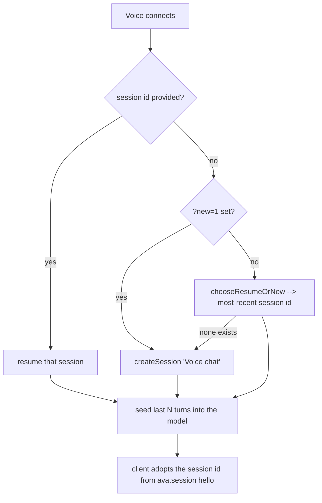

# Voice conversation continuity

## What it does

When Sir enters voice from the home orb, Ava **resumes the most-recent conversation** instead of starting a blank one. Ask something in voice, finish it in text chat, come back to voice and ask "what did you do?" — and Ava remembers, because voice and chat share one continuous conversation. A **"+new" control** lets Sir deliberately start a fresh conversation when he wants one. The recent turns are seeded into the speaking model on connect so it actually has the memory, not just a shared session id.

## Why it exists

Previously, every time Sir opened voice from the orb (with no session id), the proxy **minted a brand-new "Voice chat" session**. So voice always landed in an empty conversation with no recollection of what was just typed or spoken — a jarring "fresh start" each time. Voice and chat felt like two disconnected assistants. The fix makes them one memory.

## How Sir interacts

- **Enter voice from the orb** → Ava resumes the most-recent session automatically. No action needed.
- **Tap "+new"** (`web/src/voice/VoiceScreen.tsx:74`) → drops the current session and reconnects with `?new=1`, forcing a fresh "Voice chat" session (`useRealtimeVoice.ts:872` `newConversation`).
- Entering voice with an explicit session id (e.g. continuing a specific chat) resumes that exact session.

## How it works

**Resume-or-new decision (`server/src/routes/voice-realtime.ts:526` `chooseResumeOrNew`)**
- Pure function: `wantNew` true → `resumeId: null` (caller creates a fresh session); else `resumeId` = the most-recent session id. The caller resumes it, or creates a new "Voice chat" session if none exists.
- `wantNew` comes from the `?new=1` query param the client sets when "+new" is tapped (`voice-realtime.ts:719`).
- Both the OpenAI branch (`:813`) and the Hume branch (`:1083`) apply this. The Hume branch always passes `wantNew=false` to `chooseResumeOrNew` — Hume entry doesn't expose a "+new" path of its own; it resumes the latest.

**History seeding differs by provider** because the two upstreams have different ways to be told "here's what happened before":

- **OpenAI** seeds the last *N* turns as actual **conversation items** via `conversation.item.create` (`voice-realtime.ts:821`–`:838`), context only — no `response.create`, so the model doesn't reply to the seed. `N` defaults to 12 (`REALTIME_SEED_TURNS`). Each seeded item is OpenAI cost per connect, so the default stays small.
- **Hume** can't reliably consume seeded conversation items, so the recent turns are folded straight into the **system prompt** via `buildHumeHistoryBlock` (`:325`) — a formatted "# Recent conversation (most recent last)" block appended before the Hume session settings are sent (`:1089`). (See `hume-voice.md` for why the system prompt, not the `context` field, is used.)

**The `output_text` seed-type fix (`seedContentType`, `:534`)**
- The GA realtime schema is **asymmetric**: user/system turns use content-part type `input_text`, but **assistant** turns must use `output_text`. Sending `text` (the old code) for an assistant turn is rejected with *"Value must be 'output_text'"*.
- This bug stayed hidden until voice started *resuming* sessions that contain assistant turns — a fresh session has nothing to seed, so the rejection never fired. `seedContentType(role)` returns `"output_text"` for assistant and `"input_text"` otherwise (`:835`).

## Edge cases & limitations

- **"Most recent" = the top of `listSessions`.** If Sir wants a different older conversation, he must open it explicitly; voice only auto-resumes the single latest.
- **Seeding is bounded by `REALTIME_SEED_TURNS` (default 12).** Older turns beyond that window aren't seeded into the model on connect (though they remain in the DB). The bound exists because each seeded turn is per-connect OpenAI cost.
- **Persisted turns avoid double-counting.** In hybrid/voice mode the spoken user turn and the action result are each stored exactly once (`voice-realtime.ts:993`, `:936`); the internal `/api/chat` run that executes tools persists nothing (`persist:false`), so resumed history isn't duplicated.

## Decisions log

- **Resume by default, "+new" to opt out (commit a3f6886).** The old behaviour minted a fresh session on every orb entry, breaking voice↔chat memory. Defaulting to resume makes them one continuous conversation; the explicit "+new" control preserves the ability to start clean.
- **Seed history rather than rely on a shared id alone.** A shared session id isn't enough — the realtime model needs the prior turns in-context to actually recall them, so they're seeded on connect (provider-appropriately).
- **`output_text` for assistant seeds (commit 9cc9b73).** Fixes the GA realtime rejection that only surfaced once resume started seeding assistant turns.
