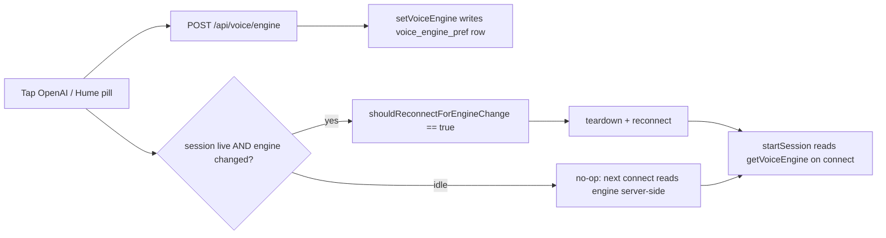

# Voice-engine toggle (OpenAI / Hume)

## What it does

A two-button toggle on the voice screen that picks **which provider speaks for Ava**: **OpenAI** (the GA realtime model) or **Hume** (Hume EVI, the "Alice Bennett" voice). The choice is a single global preference saved on the server, and changing it while a voice session is live tears down and reopens the session so the new provider takes effect immediately.

## Why it exists

Sir wanted to switch voices without editing config or restarting. The toggle previously had three local-clone options — **Chatterbox** (Sir's GPU-hosted cloned voice) and **Hybrid** (Chatterbox plus OpenAI fallback). Those were retired when Hume was added, because Hume gives a warm, natural cloud voice without needing a separate Python server running. The toggle is now a clean two-way OpenAI ↔ Hume switch.

## How Sir interacts

On the voice screen there are two pill buttons, **OpenAI** and **Hume** (`web/src/voice/VoiceScreen.tsx:131`–`:154`). Tapping one calls `setVoiceEngine`, which POSTs the choice to the server and (if a session is live) reconnects. The active button is highlighted with the accent colour.

Note: selecting **Hume** here only speaks Hume if Hume is also *configured* in `server/.env` (`AVA_VOICE_PROVIDER=hume` + `HUME_API_KEY`). If it isn't, the server falls back to OpenAI on connect even though the Hume button looks selected. See `hume-voice.md` for the full two-gate model.

## How it works

**Server preference (`server/src/state/voice-engine-pref.ts`)**
- `VoiceEngine = "openai" | "hume"` (`:13`). The older `"chatterbox"`/`"hybrid"` values were dropped; a stale DB row with either falls back to `"openai"` via the `isVoiceEngine` type-guard (`:17`).
- `getVoiceEngine` / `setVoiceEngine` read/write a single `voice_engine_pref` row scoped to `"global"`. Default is `"openai"`.

**Route (`server/src/routes/voice-engine.ts`)**
- `GET /` returns `{ engine }`; `POST /` validates the body with a Zod enum of exactly `["openai", "hume"]` and persists it.

**Connect-time read (`server/src/routes/voice-realtime.ts:741`)**
- The proxy calls `getVoiceEngine(deps.db)` at the start of each session, so a toggle change takes effect on the next connect with no server restart.

**Reconnect-on-change (`web/src/voice/voiceInputMode.ts:147` `shouldReconnectForEngineChange`)**
- Returns `false` if the engine is unchanged, `false` if the session is `idle` (the next connect reads the engine server-side anyway), and `true` for any live openai↔hume change — because the two providers speak over **entirely different upstream sockets** (OpenAI GA realtime vs Hume EVI), so the session must be rebuilt. The reconnect effect lives at `web/src/voice/useRealtimeVoice.ts:848`.

## Edge cases & limitations

- **UI selection vs. effective provider can diverge.** Choosing Hume when `server/.env` isn't configured for Hume still shows Hume selected, but OpenAI speaks (silent server-side fallback). This is intentional — the toggle expresses intent; the env gate expresses capability.
- **Idle toggles don't reconnect.** Switching while not in a call does nothing immediately; the choice is simply read on the next connect.
- **A stale `chatterbox`/`hybrid` row is harmless** — it reads back as `openai`.

## Decisions log

- **Retire Chatterbox + Hybrid (commit 777ecc0).** Chatterbox required a separate GPU-hosted Python server to be running, with OpenAI fallback when it wasn't; Hume delivers a warm cloud voice with no local dependency, so the 3-way toggle collapsed to a 2-way OpenAI/Hume one. The earlier 3-way toggle shipped in 65e5bbd.
- **Single global preference, mirroring reasoning-pref.** One row, one scope — voice provider is a machine-wide setting, not per-session.
- **Reconnect on every openai↔hume change.** Unlike the old openai↔hybrid switch (which built an identical realtime session and so could skip the reconnect), the two providers use different sockets, so any change must reconnect.
