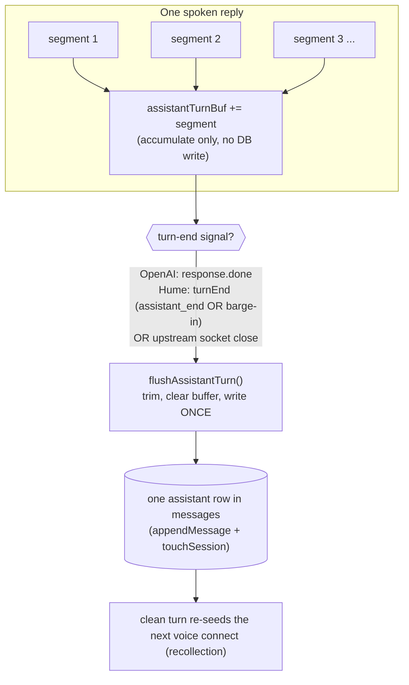

# Voice: one spoken reply = one message (segment coalescing)

## What it does

When Ava speaks a chit-chat reply, the realtime model delivers that single reply
to the server as **several transcript segments** — roughly one per sentence. Before
this fix the server stored **each segment as its own row** in the conversation, so
one spoken answer became **4–5 separate messages** in the chat history. This change
makes the server **buffer the segments of a spoken turn and write exactly one
message when the turn ends** — so one reply is one row, for both the OpenAI and the
Hume voice upstreams.

This is a server-side persistence fix only. It does not change what Ava says, how
fast she speaks, captions, or any client behavior.

Two terms used below:
- **Transcript segment** — one chunk of the spoken reply's text as the upstream
  emits it (OpenAI: a `response.output_audio_transcript.done` event; Hume: an
  `assistant_message` event). A normal reply produces several.
- **Turn-end signal** — the event that means "this spoken reply is finished, persist
  it now": OpenAI `response.done`; Hume `assistant_end` (or a barge-in, below).

## Why it exists

The symptom was concrete: you'd have a short spoken exchange, open the same
conversation in text chat, and Ava's one reply would appear **broken into 4–5
fragment rows** — each a clause or sentence, as if she'd sent five messages in a
row. The cause was that **both** provider paths called `appendMessage` on **every**
transcript segment.

The damage was worse than ugly history. Voice and chat **share one conversation**,
and on each voice reconnect the server re-seeds the model with the recent turns so
it remembers the conversation (the recollection / continuity feature —
`voice-continuity.md`, and for Hume `hume-voice-memory-fix.md`). When the stored
turns are clause-fragments, the **recollection seed is itself a pile of
half-sentences** — so the "recent conversation" Ava remembers reads garbled. In
particular this **undermined the Hume memory fix**: that fix carefully assembles the
prompt so persona + changelog + history survive Hume's truncation, but the *history
content* it carried was fragmented at the source. Fixing the assembly didn't help if
the turns being assembled were shredded. This change fixes the content.

## How the owner interacts

No new controls and nothing to configure. You speak to Ava as usual; the difference
is only visible in the result: a spoken reply now shows as **one** message in the
conversation (and re-seeds cleanly on the next voice connect). It applies whether
the active voice engine is **OpenAI** or **Hume** (`voice_engine_pref`).

## How it works

Each provider branch in `server/src/routes/voice-realtime.ts` keeps a
per-connection text buffer (`assistantTurnBuf`) and a `flushAssistantTurn()` helper.
As each transcript segment arrives it is **appended to the buffer** (no database
write). When the **turn-end signal** fires, `flushAssistantTurn()` trims the
accumulated text, **clears the buffer**, and — only when `hybrid && sessionId &&
text` — writes **one** `appendMessage` + `touchSession`.

**OpenAI branch** (`startSession`):
- Buffer + `flushAssistantTurn` declared at `voice-realtime.ts:821`.
- Each segment (`response.output_audio_transcript.done` or the beta
  `response.audio_transcript.done`) is appended at `voice-realtime.ts:946`–`:959`.
  It deliberately does **not** `return`, so the client's captions keep updating.
- Flush fires on `response.done` (`voice-realtime.ts:938`).

**Hume branch** (`tryStartHumeSession`):
- Buffer + `flushAssistantTurn` declared at `voice-realtime.ts:1122`.
- `translateHumeEvent` reports each spoken segment via `assistantText` and signals
  the boundary via a new `turnEnd?: boolean` field on the `HumeTranslation`
  interface (`voice-realtime.ts:403`).
- The event loop appends the segment and flushes when `turnEnd` is set
  (`voice-realtime.ts:1249`–`:1252`). `turnEnd` is set on **`assistant_end`**
  (`voice-realtime.ts:505`) **and on `user_interruption`** (`voice-realtime.ts:506`–`:509`).

## Edge cases & limitations

- **Barge-in (you interrupt Ava mid-reply).** Hume signals this as
  `user_interruption`. Ava *did* speak the part she got out before you cut in, so
  `translateHumeEvent` sets `turnEnd: true` on `user_interruption`
  (`voice-realtime.ts:506`) to **flush what was already spoken** as one row — rather
  than lose it, or worse, leave it in the buffer where it would silently merge into
  the **next** turn's reply. (This is the server-side persistence side of barge-in;
  the client-side "stop the audio / drop late deltas" handling is separate — see
  `06-voice-pipeline.md` §10.)
- **`do_on_computer` task replies are untouched.** When you ask Ava to *do*
  something, the realtime model is kept **silent** (the tool-result frame omits
  `response.create`, so no spoken transcript is produced), and the task result is
  stored by its own dedicated path (`appendMessage` at `voice-realtime.ts:989`
  success / `:1004` failure for OpenAI; `:1229` / `:1238` for Hume). The coalescing
  buffer therefore stays **empty** for a task, and a later flush of an empty buffer
  is a **no-op** — so the two paths never double-write the same turn.
- **Socket close (e.g. a 1006 drop).** If the upstream WebSocket closes while a turn
  is buffered but before its normal turn-end event, the close handler flushes the
  buffer as a tail-safety net (OpenAI `voice-realtime.ts:1067`; Hume
  `voice-realtime.ts:1276`), so a reply Ava actually spoke isn't lost on a flaky
  connection.
- **Double-flush is safe.** `flushAssistantTurn()` clears the buffer *before* the
  write guard, so two triggers in quick succession (e.g. `response.done` then an
  immediate close, or `assistant_end` then `user_interruption`) write **at most one**
  row — the second call sees an empty buffer and does nothing.
- **Empty / non-hybrid turns write nothing.** The flush only writes when
  `hybrid && sessionId && text` is truthy, so transcribe-only mode and empty replies
  never create a row.
- **Recollection tie-in.** This is the fix that makes the continuity/recollection
  seed *coherent*. The last-*N*-turns seed (OpenAI `conversation.item.create`; Hume
  `buildHumeHistoryBlock`) now reads **whole assistant turns**, so what Ava
  "remembers" on the next connect reads like the conversation actually happened
  rather than a stream of fragments. See `voice-continuity.md` and
  `hume-voice-memory-fix.md`.

## Decisions log

- **Buffer-and-flush-once vs. update-a-single-row-as-segments-arrive (commit
  9cb2089).** Accumulating into a string and writing once on turn-end is the
  simplest correct option: it needs no row id to update, no read-modify-write per
  segment, and it naturally yields one row. The chosen turn-end triggers
  (`response.done` / `assistant_end`) are the same boundaries the rest of the
  pipeline already treats as "reply complete."
- **Flush on barge-in too (not just on a clean `assistant_end`).** A user
  interruption is a real turn boundary — Ava spoke something — so it must persist and
  reset the buffer. Skipping it would either drop the spoken text or merge it into
  the next reply. This is also why `user_interruption` graduated from a no-op in
  `translateHumeEvent` to a `turnEnd` signal.
- **Flush on socket close as a safety net.** Cheap insurance against losing a
  just-spoken turn when the connection drops mid-turn; harmless when the buffer is
  already empty because the guard makes it a no-op.
- **Leave `do_on_computer` on its own store.** The task path already persists exactly
  one result message and keeps the model silent, so coalescing simply needs to *not*
  interfere — which it doesn't, because a silent model fills no buffer.

## Tests

`server/src/routes/voice-realtime.test.ts` pins the Hume turn-boundary logic
(`translateHumeEvent`): an `assistant_message` segment must **not** set `turnEnd`
(`:518`), while **`assistant_end`** (`:526`) and **`user_interruption`** (`:534`)
both must — so segments buffer and only a genuine turn boundary flushes. The commit
reports 886 server tests passing with a clean typecheck.
