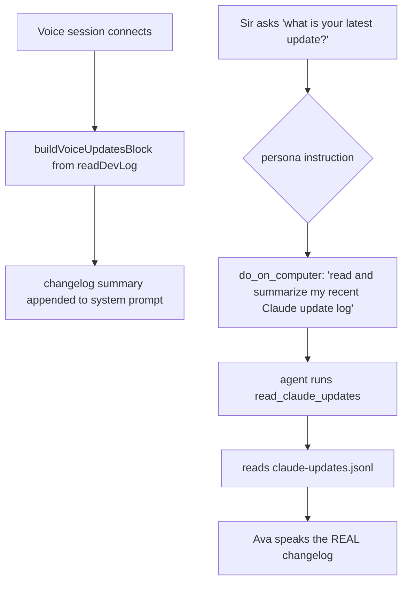

# Voice self-knowledge (no confabulated "training cutoff")

## What it does

Stops Ava from making things up about herself when speaking. Ava no longer describes herself in terms of an LLM "training cutoff" or "my training data", and when Sir asks "what's your latest update / what have you been working on / what did Claude build", she answers from her **real changelog** — the Claude→Ava update log — instead of inventing a plausible-sounding answer. For anything beyond a quick summary, the spoken model is told to call the action tool and read the authoritative log rather than recite from memory.

## Why it exists

Ava is a *specific* AI agent living on Sir's Windows PC, with a real, evolving codebase that Claude (Sir's coding agent) ships changes to. But the underlying voice model is a general LLM, so when asked about "your latest update" it would confabulate — talking about its training cutoff or inventing features — which is dishonest and erodes trust (honesty about who actually did what is a hard requirement). Seeding Ava's real changelog and routing update questions to the log makes her answers truthful.

Two terms:
- **Claude→Ava update log** — an append-only JSON-lines file (`server/data/claude-updates.jsonl`) where Claude records each change he ships to Ava's code (see `server/src/self/dev-log.ts`).
- **`do_on_computer` / `read_claude_updates`** — the spoken model's single action tool, and the agent tool it routes to, which reads that log.

## How Sir interacts

Sir just asks, in voice: "What's your latest update?", "What have you improved lately?", "What's Claude been building?". Instead of a made-up answer, Ava either summarises from the seeded changelog in her prompt or (for detail) runs `do_on_computer` with the task "read and summarize my recent Claude update log", which executes `read_claude_updates` and speaks the real list back.

## How it works

**Persona instruction (`server/src/routes/voice-realtime.ts:178` `VOICE_PERSONA_INSTRUCTIONS`)**
Appended to the base system prompt for any speaking provider. It explicitly tells the model:
- "You are AVA — a specific AI agent living on Sir's Windows PC, not a generic chatbot: NEVER describe yourself in terms of an LLM 'training cutoff' or 'my training data'."
- When Sir asks about a recent update / change / self-improvement / what Claude built, **call `do_on_computer`** with the task "read and summarize my recent Claude update log" — "the system has your exact changelog; never recite from memory or guess."

**Changelog seed (`buildVoiceUpdatesBlock`, `:349`)**
- Reads the dev log (`readDevLog`, last 8 entries), keeps `shipped` and `note` phases (drops the in-flight `started`), takes the last 6, and renders a "# Your ACTUAL recent updates" block appended to the system prompt for both OpenAI (`:795`) and Hume (`:1090`).
- This gives the model a short, real summary *in context* so even a quick spoken answer is grounded — while the persona instruction still routes detailed questions to the tool for the authoritative, current list.

## Edge cases & limitations

- **Hume recitation is loose — honest limitation.** Hume's underlying model is less reliable than OpenAI's at reciting verbatim from the prompt, so the seeded changelog block may be paraphrased imperfectly when Hume is speaking. The `do_on_computer` → `read_claude_updates` route is the reliable path for an exact answer; the in-prompt seed is best-effort context.
- **Only `shipped`/`note` entries are seeded.** An in-progress (`started`, not yet `shipped`) update is intentionally excluded from the seeded summary, so Ava won't claim an unfinished change as done. (A separate "in progress" check exists in `dev-log.ts` `currentInProgress`.)
- **The log must be populated.** If `claude-updates.jsonl` has no shipped entries, `buildVoiceUpdatesBlock` returns `""` (no seed); the persona instruction still steers away from confabulation and toward the tool.

## Decisions log

- **Seed the real changelog + route to the log (commit c73aa9b).** Rather than only forbidding confabulation, the fix gives the model the truth two ways — a short summary in the prompt for quick answers, and a tool route for the authoritative list — so "what's your latest update?" is answered honestly.
- **In-prompt seed AND tool route, not one or the other.** The seed handles snappy chit-chat answers without a tool round-trip; the tool route handles detail and guarantees currency. Belt and suspenders against confabulation.
- **Drop `started` from the seed.** Avoids Ava narrating an unfinished change as shipped — consistent with the honesty rule that Claude's in-flight work isn't claimed as done.
