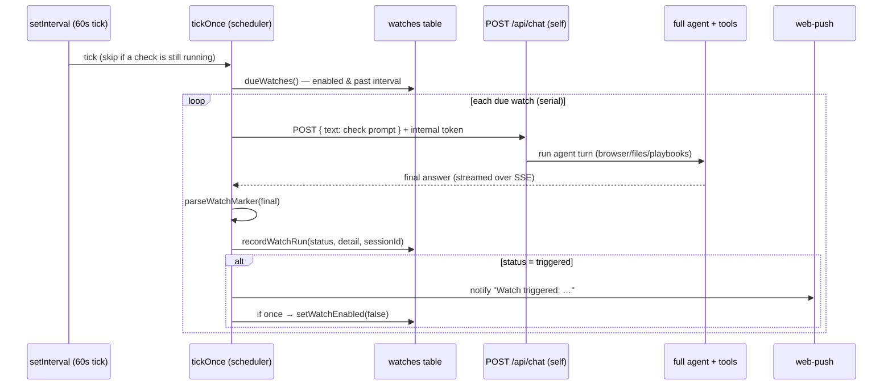

# Watches — reminders, monitoring, and scheduled task delivery

## What it does

A **watch** is a durable instruction that Ava handles on a schedule. An ordinary
watch is re-checked by AVA with her full toolset, so it can use Instagram,
WhatsApp, Chrome, web research, files, Claude tools, or any other available AVA
capability. A reminder is pushed directly. A targeted-agent watch uses a delivery
adapter that pins a concrete session and records delivery/completion evidence.

For standing monitoring, AVA re-checks a condition and
push-notifies Sir about when its condition is met — *"tell me if the RTX 5090
drops below $1800"*, *"let me know when the visa page changes"*, *"ping me if it's
going to rain in Tbilisi tomorrow"*. Sir asks once; Ava turns it into a durable
watch; a background scheduler runs each check as a **real agent turn** (full
toolset — browser, files, playbook recall) until the condition fires. Every check
lands in the watch's own chat session, so Sir can open it and see exactly what was
checked, step by step.

## Why it exists

Ava was purely request-response: it could answer *"what's the RTX 5090 price
right now?"* but had no way to keep watching after the conversation ended. Anything
"long-term" — a price, a restock, a site edit, a weather turn, a delivery — meant
Sir had to remember to ask again. Watches close that gap: they are Ava's
**persistence across time**, the standing equivalent of a `while (true)` that only
bothers Sir when something actually happens.

## How Sir interacts with it

Entirely through natural language, in a normal task. When Sir says *"notify me
if/when …"* in a typed chat (or via a voice action, which runs the same action
agent), Ava calls **`watch_create`** with a self-contained check prompt and an
interval, and confirms it created the watch. From then on it is hands-off:

- **A trigger arrives as a push notification** — `"Watch triggered: <one-line
  reason>"` — the same web-push channel as approval/done alerts. (Requires a
  registered push subscription; without one the trigger is still recorded and
  visible, just not actively pushed.)
- **Sir can ask "what are you watching?"** — Ava calls `watch_list` and reads back
  each watch, its interval, and its latest status.
- **Sir can cancel one** — *"stop watching the GPU price"* → `watch_delete`.

The Memory surface includes a **Standing watches** section for schedule, status,
latest result, pause/resume, and deletion. Each ordinary check also owns a chat
session (linked on its first run), so its history appears in the Chats list.
Pinned task watches additionally show whether delivery is waiting, dispatching,
delivered, running, completed, or failed.

## How it works

Two halves: **tools** (Ava registers/lists/deletes watches during a turn) and a
**scheduler** (a background timer that actually runs the checks). They share the
`watches` SQLite table.

### Execution modes

- **check** — AVA runs the prompt through `/api/chat` with the complete toolset.
  This is the general path for scheduled Instagram, browser, web, Claude, file,
  and other AVA work.
- **reminder** — the prompt is the notification; no model call is made.
- **codex** — the adapter pins the exact repository TUI thread and atomically
  stages one sanitized instruction. While the pinned thread is active, AVA
  writes a typed user turn to Codex's own durable `queue_1.sqlite`; Codex's
  existing writer consumes it at the next clean task boundary. When the thread
  is already idle, a trusted project Stop hook provides the wake/handoff path.
  Neither path starts a competing `codex exec resume` writer.
  AVA verifies the unique marker in the immutable JSONL session record. The
  adapter contract is deliberately
  isolated so another session target, such as Claude Code, can implement the
  same resolve/dispatch/inspect boundary without changing ordinary watches.

### The marker protocol

Each scheduled check is a full agent run, so its "answer" is free-form prose. To
get a machine-readable verdict out of it, the scheduler wraps Sir's condition in a
prompt (`buildCheckPrompt`, `server/src/watches/scheduler.ts:30`) that **demands
the reply end with exactly one line**:

```
WATCH: TRIGGERED — <one-line reason>     (condition met)
WATCH: OK — <one-line current status>    (otherwise)
```

`parseWatchMarker` (`scheduler.ts:40`) reads that line back with a strict regex.
`TRIGGERED` fires a push and, for a one-shot watch, disables it. `OK` records the
status silently. If the model forgets the marker, the status is recorded as
**`unclear`** — logged but **not** notified (see limitations).

### One check, end to end



**Why through the server's own `/api/chat`.** The scheduler doesn't call the model
directly — it `POST`s the check prompt to Ava's *own* HTTP endpoint over loopback
with an internal bearer token, then follows the SSE stream to the run's `final`
(`runCheckViaHttp`, `scheduler.ts:50`). That means a check is a genuine agent run:
it gets the full tool stack, policy gates, playbook recall/capture, and — crucially
— it is **recorded as a normal chat session** (`session_id` linked on the first run
via `recordWatchRun`, `server/src/state/watches.ts:54`) that Sir can open and
audit. It is the same trick the voice pipeline uses for `do_on_computer`.

### The pieces

| Concern | File | Notes |
|---|---|---|
| Table | `server/src/state/schema.sql` (`watches`) | Schedule/result fields plus pinned target, delivery marker, process, completion, and cycle ancestry evidence. |
| State module | `server/src/state/watches.ts` | `createWatch`, `dueWatches` (`:49`), `recordWatchRun` (`:54`), `setWatchEnabled`, `deleteWatch`. |
| Scheduler | `server/src/watches/scheduler.ts` | `startWatchScheduler` (`:130`, 60s tick), `tickOnce` (`:106`), `runCheckViaHttp` (`:50`), marker helpers (`:30`, `:40`). |
| Tools (Ava) | `server/src/tools/watches-mcp.ts` | `watch_create` / `watch_list` / `watch_delete` — action mode only. |
| HTTP API | `server/src/routes/watches.ts` | `GET /` · `POST /` · `POST /:id/enabled` · `DELETE /:id` (token-auth'd). |
| Target adapter | `server/src/watches/codex-dispatch.ts` | Exact Codex target resolution, lifecycle inspection, idempotent dispatch, and delivery evidence. |
| Active-thread queue | `server/src/watches/codex-queue.ts` | Validated access to Codex's installed durable queue plus prompt-hash receipts that prevent replay after consumption. |
| In-thread handoff | `server/src/watches/codex-handoff.ts`, `scripts/codex-watch-stop-hook.mjs`, `.codex/hooks.json` | Sanitized atomic inbox, same-writer Stop-hook delivery, completion receipt, and bounded successor wait. |
| Boot singleton | `server/src/process/server-lock.ts` | Atomic process ownership claim in AVA's data root, acquired before shared boot state can change. |
| UI | `web/src/memory/WatchesSection.tsx` | Read/manage surface with ordinary and targeted lifecycle visibility. |
| Boot wiring | `server/src/index.ts` | Scheduler and internal credentials start **only after this process owns the port** and only when an LLM provider exists. |

### Frugality guidance (baked into the tool)

`watch_create`'s description tells Ava to be **frugal** because *each check is a
real agent run that costs money* — default one-shot, recommend intervals of 15–60
min, never poll aggressively. The tool rubric (`orchestrator/tool-rubric.ts`)
repeats this so the model picks sensible intervals rather than minute-by-minute
polling. The interval is clamped to a minimum of 1 minute in `createWatch`, and the
HTTP route caps it at 24 h.

## Edge cases & limitations

- **The server must be running.** The scheduler is an in-process `setInterval`
  (`unref`'d so it never keeps the process alive). If the PC is asleep or the Ava
  server is down, **no checks happen** and none are back-filled — the next check is
  simply the next tick after the server is up. This is not a cloud cron.
- **The project Stop hook must be trusted by Codex for idle-thread wakeups.** Codex hashes unmanaged
  hooks and will not run a new or changed definition until that exact hash is
  trusted. Run `npm run codex:trust-watch` after installing or changing
  `.codex/hooks.json`; the helper uses Codex's typed `hooks/list` and
  `config/batchWrite` APIs, then verifies the resulting trusted hash. A staged instruction stays
  pending safely while the hook is unavailable; AVA does not fall back to a
  competing writer.
- **Delivery occurs at a clean task boundary.** A watch staged while Codex is
  working is consumed from Codex's durable queue when that turn finishes. A
  prompt-hash receipt prevents AVA from recreating a row that Codex has already
  consumed but has not yet written to the rollout. If Codex was
  already completely idle before AVA staged it, it is delivered at the end of
  the next turn. For `continue_cycle`, the Stop hook records completion and
  waits up to six minutes for AVA to plan and stage exactly one child; a planner
  outage ends the turn honestly rather than waiting forever.
- **Disabled without an LLM provider.** If no provider is configured at boot, the
  scheduler logs `watch scheduler disabled — no LLM provider` and never starts
  (`index.ts`). Checks are agent runs; no brain, no checks.
- **A missing marker = no notification.** If the check run ends without a valid
  `WATCH: …` line, the status is `unclear` and Sir is **not** pinged even if the
  condition was actually met. The verdict is only as reliable as the model's
  compliance with the marker protocol.
- **Recurring watches can be noisy.** `once` defaults to **true** (self-disable
  after the first trigger). If Ava creates a `once:false` watch, it will notify on
  **every** check while the condition stays true — there is no notification
  de-duplication. One-shot is the safe default for that reason.
- **Serial, browser-competing checks.** Checks run one at a time and drive the
  same persistent Chromium Sir's live requests use. The tick guard prevents ticks
  from stacking, and checks are deliberately background hygiene — but a long check
  holds the browser while it runs.
- **Cost is real and unbudgeted.** Every check spends LLM tokens (and any per-tool
  billing the check touches, e.g. a browser run). A watch on a 5-minute interval is
  ~288 agent runs/day. There is no spend cap — frugality is enforced only by the
  prompt guidance and Sir's judgment.
- **No editing.** A watch can be created, listed, and deleted, but not edited —
  change the interval or condition by deleting and re-creating.
- **Per-check wall clock.** A single check is capped at 240 s (`checkTimeoutMs`,
  `scheduler.ts:51`); a timeout is recorded as an `error` status and the scheduler
  moves on. Failing checks never stop the scheduler.

### Live verification (2026-07-03)

During tonight's live testing a **"Tbilisi weather" watch** created in chat ran its
first scheduled check within the minute: it executed as a real `/api/chat` agent
turn, returned a valid `WATCH: OK — …` marker, and its status was recorded against
the watch correctly — confirming the full create → schedule → check → parse →
record loop end to end. (Watches are ephemeral: one-shot watches self-disable and
any watch is deletable, so a given row won't necessarily still be present later.)

## Decisions log

- **Checks run through `/api/chat`, not a direct model call.** The alternative — a
  bespoke one-shot completion — would have been cheaper and simpler, but it would
  give the check no tools, no playbook recall, and no auditable session. Routing
  through the real agent endpoint means a watch can *do work* to answer its
  question (open a page, read a file) and leaves a full, openable trail. The cost
  is that each check is a heavyweight agent run; the frugality guidance is the
  counterweight.
- **A strict end-marker instead of structured tool output.** Rather than force the
  check to call a "report result" tool, the scheduler asks for a single trailing
  `WATCH:` line and parses it. It is simpler and robust to the model narrating
  freely before the verdict — at the cost that a forgotten marker yields `unclear`
  and no alert. Preferring a *missed* alert over a *false* alert (never notify on
  an ambiguous verdict) was the deliberate call.
- **One-shot by default.** Most real requests ("tell me when X happens") want a
  single notification, and recurring watches with no de-dup can spam. Defaulting
  `once:true` matches intent and caps noise; Sir can ask for a repeating watch
  explicitly.
- **An internal bearer token, rotated only after port ownership.** The scheduler authenticates
  to Ava's own API exactly like a paired device (single-tenant, so any valid token
  effectively has Sir's shell). Stale `watch-internal` tokens are revoked only in
  the successful HTTP listen callback. This is critical: a losing hot-reload
  process that receives `EADDRINUSE` must not revoke the healthy server's token.
  `voice-internal` follows the same rule, and neither appears in the user-facing
  paired-device list.
- **A process singleton guards that boundary.** Windows can briefly let a losing
  Node listener reach its callback before the later `EADDRINUSE` exit. AVA now
  claims an atomic PID/instance lock before opening shared runtime state. A
  duplicate boot exits before it can touch either internal credential; a stale
  lock is recovered only after its recorded PID is no longer alive.
- **Target delivery is idempotent.** The scheduler persists a unique marker and
  session offset before advancing. Durable-queue rows and prompt-hash receipts,
  plus the Stop hook's atomic pending → claimed → completed files, are keyed by
  watch ID; replay cannot claim or execute the same instruction twice. The
  unique marker plus post-stage session offset remains the user-visible
  delivery evidence.
- **The TUI remains the only active writer.** The earlier adapter launched
  `codex exec resume`, which fails when an open Codex window owns the thread's
  writer lock. Active-thread delivery now uses Codex's own durable queue; an
  idle-boundary file handoff is consumed by the existing writer's Stop hook.
  Both transports use sanitized content and stable watcher identity. No
  approval bypass or second rollout writer is used.
- **Lost dispatches fail closed once.** If a persisted Codex delivery process
  exits before its marker appears, the failure is terminal for that watch. AVA
  preserves the error and disables the watch instead of repeating the same
  error forever or risking a duplicate resume. Busy and temporarily unknown
  target states remain retryable.
- **In-process scheduler, not an external cron.** Keeping it inside the Node
  process means zero extra infrastructure and it shares the DB/browser directly;
  the accepted trade-off is that watches only run while Ava is running (documented
  above), which fits the "one PC, always-on when in use" model.
- **Ava creates the watch itself, mid-conversation.** Rather than a form, the
  agent translates *"notify me if …"* into a self-contained check prompt in the
  same turn. It keeps the interaction natural, but the quality of the check depends
  on Ava writing a genuinely self-contained prompt — it runs later with **no**
  conversation context, so an under-specified watch can drift.
